0033\_PROFIL: Statistical Analysis of the Metabolome in Relation to
Renal Complications
================
Tommi Suvitaival, <tommi.raimo.leo.suvitaival@regionh.dk>, Steno
Diabetes Center Copenhagen
2019-10-02

See 0033\_PROFIL–Metabolomics.Rmd for the script that produces the
output shown below.

This document is Supplementary Material to the paper \\emph{Sugar
Derivatives and Branched-Chain Amino Acids Are Associated with Present
and Future Renal Impairment in Type 1 Diabetes} by Nete Tofte, Tommi
Suvitaival, Kajetan Trost, Ismo Mattila, Simone Theilade, Signe A.
Winther, Tarun S. Ahluwalia, Marie Frimodt-M\\{o}ller, Cristina
Legido-Quigley and Peter Rossing.

``` r
data.loaded <-
  read.table( 
    file = "L:/LovbeskyttetMapper/PROFILmetab/Data/metabolomics/0033_PROFIL_2017_metabolomics_data--kNN-obs-sel--181212-h.tsv",
    header = TRUE,
    sep = "\t",
    stringsAsFactors = FALSE,
    comment.char = "",
    check.names = FALSE
  )

data.design <- 
  haven::read_sas( data_file="L:/LovbeskyttetMapper/PROFILmetab/Data/profil_nb.sas7bdat" )

### Follow-up data from SAS file

data.follow.up <-
  haven::read_sas( data_file="L:/LovbeskyttetMapper/PROFILmetab/Data/follow-up-180311/profil_kidney.sas7bdat" )

data.follow.up.new.albu <-
  haven::read_sas( data_file="L:/LovbeskyttetMapper/PROFILmetab/Data/follow-up-180311/profil__new_albu__180608.sas7bdat" )

# Log-transform data

rownames( data.loaded ) <- data.loaded$"Name"

names.metabolites <- 
  colnames( data.loaded )[ grepl( x = colnames( data.loaded ), pattern = "; " ) ]

data.metabolites.only <- data.loaded[ , names.metabolites ]

data.metabolites.only[ data.metabolites.only <= 0 ] <- NA

data.metabolites.only <- log2( data.metabolites.only )

data.metabolites.only <- 
  data.frame( data.metabolites.only,
              check.names = FALSE,
              stringsAsFactors = FALSE )

data.scaled <- data.loaded

data.scaled[ , names.metabolites ] <- 
  data.metabolites.only[ rownames( data.scaled ), names.metabolites ]


## Cleanup clinical data


data.design <- 
  data.frame( 
    lapply( 
      X = data.design, 
      FUN = function( x ) { x[ is.nan( x ) ] <- NA; return( x ) }
    ), 
    check.names = FALSE,
    stringsAsFactors = FALSE
  )

data.design[ which( data.design$"bmi"==133.11 ), "bmi" ] <- NA

### Create additional clinical variables

data.design$"Group" <- data.design$"Albuminuri_3_groups"
data.design[ which( data.design$"Control_vs_patients"==5 ), "Group" ] <- 5

data.design$"Group" <- 
  factor( 
    x = data.design$"Group", 
    levels = c( "1", "3", "4", "5" ), 
    labels = c( "T1D Control", "T1D Micro", "T1D Macro", "Healthy Control" )
  )

data.design$"Group.continuous" <- data.design$"Group"

data.design[ which( data.design$"Group.continuous" == "Healthy Control" ), 
             "Group.continuous" ] <- NA

data.design$"Group.continuous" <- as.numeric( data.design$"Group.continuous" ) - 1

data.design$"sex" <- as.factor( data.design$"sex" ) # NB: Not complete; Use "Gender" instead.

data.design$"Gender"[ data.design$"Gender"=="" ] <- NA
data.design$"Gender" <- as.numeric( as.character( data.design$"Gender" ) )

# NB: "uacr" not complete; use "logUAER" instead.
data.design$"uacr" <- as.numeric( as.character( data.design$"uacr" ) )

data.design$"Albuminuria.in.T1D" <- 
  factor( 
    x = ( data.design$"Group"=="T1D Micro" | data.design$"Group"=="T1D Macro" ), 
    levels = c( FALSE, TRUE ), 
    labels = c( "No Albuminuria", "Albuminuria" ) )

data.design$"Albuminuria.in.T1D"[ data.design$"Group"=="Healthy Control" ] <- NA

data.design$"Insulin_use" <- ( data.design$"Insulin_day_dose" > 0 )*1

data.design$"Log1plus.Beat_to_beat" <- log10( 1 + data.design$"Beat_to_beat" )

data.design$"Log.MeanPWV" <- log10( data.design$"MeanPWV" )

###
### Part 3: Merge data sets
###

data.follow.up <- 
  merge( 
    x = data.follow.up, 
    y = data.follow.up.new.albu,
    by = "id_profil",
    incomparables = NA
  )

data <- 
  merge( 
    x = data.design,
    y = data.follow.up,
    by.x = "corenr",
    by.y = "id_profil",
    incomparables = NA
  )

# Other

data$"Date_num" <- as.numeric( data$"DATE" )

data.scaled$"Batch" <- as.factor( data.scaled$"Batch" )

data$"log_Blood_TGA" <- log2( data$"Blood_TGA" )

data$"logUAER" <- data$"logUAER" * log2( 10 ) # log10 => log2

data$"slope_albuminuria_profil" <- data$"slope_albuminuria_profil" * log2( exp( 1 ) )
data$"slope_gfr_profil" <- data$"slope_gfr_profil" * log2( exp( 1 ) )

data$"loglogUAER" <- log2( data$"logUAER" )

data$"RAAS.original" <- data$"RAAS"

data$"RAAS" <- data$"RAAS" - 1

data <- 
  merge( 
    x = data,
    y = data.scaled,
    by.x = "corenr",
    by.y = "Label",
    incomparables = NA
  )

data.w.healthy.control <- data

data <- data[ which( data$"Group" != "Healthy Control" ), ]
```

``` r
names.mapping <- 
  data.frame( 
    Original = names.metabolites, 
    Made = make.names( names.metabolites ),
    stringsAsFactors = FALSE
  )

rownames( names.mapping ) <- names.mapping$"Made"

names.mapping$"Cleaned" <-
  stringr::str_split_fixed( 
    string = names.mapping$"Original", 
    pattern = "; [0-9]", 
    n = 2
  )[ , 1 ]

names.mapping$"Cleaned" <- 
  stringr::str_replace( 
    string = names.mapping$"Cleaned",
    pattern = ", [0-9]*TMS",
    replacement = ""
  )

names.mapping$"Cleaned" <- 
  stringr::str_replace( 
    string = names.mapping$"Cleaned",
    pattern = " [0-9]*TMS",
    replacement = ""
  )

names.mapping$"Cleaned" <- 
  stringr::str_replace( 
    string = names.mapping$"Cleaned",
    pattern = " MeOX",
    replacement = ""
  )

tmp <- table( names.mapping$"Cleaned" )

tmp <- names( which( tmp > 1 ) )

if ( length( tmp ) > 0 ) {
  
  for ( i in 1:length( tmp ) ) {
    
    tmp.i <- which( names.mapping$"Cleaned" == tmp[ i ] )
    
    names.mapping[ tmp.i, "Cleaned" ] <- 
      paste(
        names.mapping[ tmp.i, "Cleaned" ], 
        " (", 
        1:length( tmp.i ), 
        ")", 
        sep = ""
      )
    
  }
  
}
```

# Step 1: Cross-Sectional Analysis of All Metabolites

## Albuminuria Groups

### Crude Model

``` r
design.test <- 
  data.frame( 
    data.w.healthy.control[ , 
                            c( 
                              "Group", 
                              "Age", 
                              "Gender", 
                              "Hba1c_baseline", 
                              "egfr", 
                              "CALSBP", 
                              "bmi", 
                              "Smoking",
                              "Statin",
                              "log_Blood_TGA", 
                              "Total_cholesterol"
                            )
                            ]
  )

tmp <- 
  apply( 
    X = !is.na( design.test ),
    MAR = 1,
    FUN = all
  )

design.test <- design.test[ tmp, ]
design.test <- droplevels( design.test )

# data.test <- t( data.w.healthy.control[ tmp, names.metabolites ] )

data.test <- data.w.healthy.control[ tmp, names.metabolites ]
data.test <- scale( x = data.test )
data.test <- t( data.test )

dm <- 
  stats::model.matrix( 
    object = ~ Group,
    data = design.test
  )

mFit <- 
  limma::lmFit( 
    object = data.test,
    design = dm
  )

mEbFit <- limma::eBayes( mFit )

dim( dm )
```

    ## [1] 665   4

``` r
apply( X=dm, MAR=2, FUN=range )
```

    ##      (Intercept) GroupT1D Micro GroupT1D Macro GroupHealthy Control
    ## [1,]           1              0              0                    0
    ## [2,]           1              1              1                    1

``` r
tableone::CreateTableOne( data = design.test )
```

    ##                                
    ##                                 Overall       
    ##   n                                665        
    ##   Group (%)                                   
    ##      T1D Control                   290 (43.6) 
    ##      T1D Micro                     152 (22.9) 
    ##      T1D Macro                     178 (26.8) 
    ##      Healthy Control                45 ( 6.8) 
    ##   Age (mean (sd))                54.07 (12.74)
    ##   Gender (mean (sd))              0.54 (0.50) 
    ##   Hba1c_baseline (mean (sd))      7.88 (1.31) 
    ##   egfr (mean (sd))               83.67 (27.64)
    ##   CALSBP (mean (sd))            131.45 (17.41)
    ##   bmi (mean (sd))                25.24 (4.00) 
    ##   Smoking (mean (sd))             0.20 (0.40) 
    ##   Statin (mean (sd))              0.56 (0.50) 
    ##   log_Blood_TGA (mean (sd))       0.00 (0.69) 
    ##   Total_cholesterol (mean (sd))   4.71 (0.87)

#### Table of Model Coefficients

``` r
results.group <- mEbFit

for ( i in 2:ncol( mEbFit ) ) {

  name.effect <- colnames( mEbFit$"coefficients" )[ i ]
  
  table.result.group <- 
    limma::topTable( 
      fit = mEbFit,
      coef = name.effect,
      confint = TRUE, 
      number = Inf,
      adjust.method = "BH"
    )
  
  table.result.printed <- table.result.group
  
  colnames( table.result.printed )[ colnames( table.result.printed )=="logFC" ] <- 
    "Effect"
  
  table.result.printed <- 
    signif( 
      x = table.result.printed,
      digits = 3
    )
  
  table.result.printed$"Name" <- rownames( table.result.printed )

  table.result.printed$"Name" <- 
    stringr::str_sub( 
      string = table.result.printed$"Name",
      start = 1,
      end = 25
    )
  
  table.result.printed <- 
    table.result.printed[ , 
                          c( 
                            "Name",
                            "Effect",
                            "CI.L",
                            "CI.R",
                            "AveExpr", 
                            "P.Value",
                            "adj.P.Val"
                            )
                          ]
  
  print( 
    knitr::kable( 
      x = table.result.printed,
      row.names = FALSE,
      caption = name.effect
    )
  )
  
}
```

    ## 
    ## 
    ## Table: GroupT1D Micro
    ## 
    ## Name                           Effect       CI.L      CI.R   AveExpr    P.Value   adj.P.Val
    ## --------------------------  ---------  ---------  --------  --------  ---------  ----------
    ## 3,4-Dihydroxybutanoic aci     0.44400    0.24900    0.6380         0   7.70e-06    0.000575
    ## Ribitol; 70                   0.36700    0.17300    0.5620         0   2.15e-04    0.006200
    ## 2,4-Dihydroxybutanoic aci     0.36400    0.16900    0.5580         0   2.48e-04    0.006200
    ## Ribitol; 71                   0.34500    0.15000    0.5390         0   5.11e-04    0.009590
    ## 4-Deoxytetronic acid; 32      0.32100    0.12600    0.5150         0   1.22e-03    0.018300
    ## 4-Hydroxybenzeneacetic ac     0.31400    0.11900    0.5080         0   1.56e-03    0.019200
    ## Myo inositol 6TMS; 1          0.30700    0.11300    0.5010         0   1.98e-03    0.019200
    ## Creatinine; 50                0.30600    0.11100    0.5000         0   2.05e-03    0.019200
    ## Heptadecanoic acid; 60       -0.26400   -0.45900   -0.0700         0   7.68e-03    0.060100
    ## Ribonic acid; 72              0.26300    0.06860    0.4580         0   8.02e-03    0.060100
    ## Glutamic acid, 3TMS; 8        0.24900    0.05480    0.4440         0   1.20e-02    0.081900
    ## 4-Hydroxyphenyllactic aci     0.22200    0.02760    0.4170         0   2.52e-02    0.157000
    ## Pyroglutamic acid; 69         0.21400    0.01930    0.4080         0   3.12e-02    0.180000
    ## Threonine, 3TMS; 12          -0.20900   -0.40400   -0.0146         0   3.51e-02    0.188000
    ## Alanine, 2TMS; 25             0.18700   -0.00746    0.3810         0   5.95e-02    0.286000
    ## Malic acid, 3TMS; 11          0.18600   -0.00862    0.3800         0   6.11e-02    0.286000
    ## 2-hydroxy Isovaleric acid    -0.17800   -0.37200    0.0164         0   7.28e-02    0.321000
    ## Fumaric acid, 2TMS; 9         0.17000   -0.02490    0.3640         0   8.74e-02    0.355000
    ## Nonanoic acid; 67            -0.16700   -0.36200    0.0273         0   9.21e-02    0.355000
    ## alpha-ketoglutaric acid,      0.16600   -0.02870    0.3600         0   9.47e-02    0.355000
    ## 11-Eicosenoic acid; 35        0.15900   -0.03530    0.3540         0   1.09e-01    0.383000
    ## Arachidic acid; 46           -0.15500   -0.35000    0.0391         0   1.17e-01    0.383000
    ## Glycine, 3TMS; 17             0.15300   -0.04100    0.3480         0   1.22e-01    0.383000
    ## Linoleic acid, TMS; 4        -0.15200   -0.34600    0.0427         0   1.26e-01    0.383000
    ## Glyceryl-glycoside; 59        0.14800   -0.04670    0.3420         0   1.37e-01    0.383000
    ## Isoleucine, 2TMS; 18         -0.14700   -0.34100    0.0477         0   1.39e-01    0.383000
    ## Dodecanoic acid; 54           0.14500   -0.04910    0.3400         0   1.43e-01    0.383000
    ## 3-Indoleacetic acid; 40       0.14500   -0.04920    0.3400         0   1.43e-01    0.383000
    ## Succinic acid, 2TMS; 7        0.14300   -0.05100    0.3380         0   1.48e-01    0.383000
    ## Valine, 2TMS; 20             -0.13600   -0.33100    0.0581         0   1.69e-01    0.423000
    ## Hydroxyproline; 64            0.13300   -0.06160    0.3270         0   1.80e-01    0.436000
    ## Serine, 3TMS; 14             -0.12800   -0.32200    0.0666         0   1.97e-01    0.461000
    ## Heptadecanoic acid; 61       -0.12600   -0.32000    0.0685         0   2.04e-01    0.461000
    ## Cholesterol, TMS; 23         -0.12500   -0.31900    0.0698         0   2.09e-01    0.461000
    ## Stearic acid, TMS; 2         -0.12200   -0.31700    0.0723         0   2.18e-01    0.468000
    ## Pyruvic acid; 31              0.11900   -0.07530    0.3140         0   2.30e-01    0.479000
    ## Palmitic acid, TMS; 5        -0.11500   -0.30900    0.0799         0   2.48e-01    0.485000
    ## Leucine, 2TMS; 19            -0.11400   -0.30900    0.0803         0   2.50e-01    0.485000
    ## Methionine, 2TMS; 16         -0.11300   -0.30700    0.0816         0   2.55e-01    0.485000
    ## Bisphenol A; 48              -0.11200   -0.30700    0.0824         0   2.59e-01    0.485000
    ## Benzeneacetic acid; 47        0.10800   -0.08600    0.3030         0   2.74e-01    0.501000
    ## Lactic acid; 29               0.10700   -0.08740    0.3010         0   2.81e-01    0.501000
    ## Phenylalanine, 2TMS; 13       0.10000   -0.09440    0.2940         0   3.13e-01    0.533000
    ## Campesterol; 49               0.09870   -0.09580    0.2930         0   3.20e-01    0.533000
    ## Tyrosine; 75                 -0.09780   -0.29200    0.0967         0   3.24e-01    0.533000
    ## Docosahexaenoic acid; 53     -0.09720   -0.29200    0.0972         0   3.27e-01    0.533000
    ## Glycerol; 57                 -0.08830   -0.28300    0.1060         0   3.73e-01    0.591000
    ## 1-Monopalmitin; 37            0.08740   -0.10700    0.2820         0   3.78e-01    0.591000
    ## 2-Hydroxybutyric acid, 2T    -0.08300   -0.27700    0.1110         0   4.03e-01    0.617000
    ## Arachidonic acid, TMS; 24    -0.07390   -0.26800    0.1210         0   4.56e-01    0.685000
    ## Citric acid, 4TMS; 6          0.05680   -0.13800    0.2510         0   5.67e-01    0.832000
    ## Glycerol; 58                 -0.05540   -0.25000    0.1390         0   5.77e-01    0.832000
    ## Ethanolamine; 56              0.05250   -0.14200    0.2470         0   5.97e-01    0.844000
    ## Tridecanoic acid; 74          0.04610   -0.14800    0.2410         0   6.42e-01    0.874000
    ## Aminomalonic acid; 45         0.04600   -0.14800    0.2400         0   6.43e-01    0.874000
    ## Arabinopyranose; 51           0.04470   -0.15000    0.2390         0   6.52e-01    0.874000
    ## Eicosapentaenoic acid; 55     0.03770   -0.15700    0.2320         0   7.04e-01    0.916000
    ## Myristoleic acid; 65          0.03650   -0.15800    0.2310         0   7.13e-01    0.916000
    ## 3-Indolepropionic acid; 4    -0.03550   -0.23000    0.1590         0   7.20e-01    0.916000
    ## 3-Hydroxybutyric acid, 2T    -0.03290   -0.22700    0.1620         0   7.40e-01    0.917000
    ## Oleic acid, TMS; 3           -0.03180   -0.22600    0.1630         0   7.48e-01    0.917000
    ## Decanoic acid; 52             0.03050   -0.16400    0.2250         0   7.58e-01    0.917000
    ## Octanoic acid; 68            -0.02500   -0.21900    0.1690         0   8.01e-01    0.932000
    ## 4-Deoxytetronic acid; 33      0.02470   -0.17000    0.2190         0   8.03e-01    0.932000
    ## Hydroxylamine; 62             0.02410   -0.17000    0.2190         0   8.08e-01    0.932000
    ## 2-Palmitoylglycerol; 39       0.02160   -0.17300    0.2160         0   8.28e-01    0.938000
    ## 1,3-Propanediol; 34           0.02020   -0.17400    0.2150         0   8.38e-01    0.938000
    ## 1-Dodecanol; 36              -0.01500   -0.20900    0.1790         0   8.80e-01    0.971000
    ## alpha-Tocopherol; 26         -0.01220   -0.20700    0.1820         0   9.02e-01    0.979000
    ## 4-Hydroxybutanoic acid; 4     0.01080   -0.18400    0.2050         0   9.14e-01    0.979000
    ## Proline, 2TMS; 21             0.00897   -0.18500    0.2030         0   9.28e-01    0.980000
    ## Nonadecanoic acid; 66         0.00643   -0.18800    0.2010         0   9.48e-01    0.982000
    ## Glyceric acid; 30             0.00551   -0.18900    0.2000         0   9.56e-01    0.982000
    ## L-5-Oxoproline; 63           -0.00330   -0.19800    0.1910         0   9.73e-01    0.985000
    ## Tartronic acid; 73            0.00184   -0.19300    0.1960         0   9.85e-01    0.985000
    ## 
    ## 
    ## Table: GroupT1D Macro
    ## 
    ## Name                           Effect       CI.L       CI.R   AveExpr    P.Value   adj.P.Val
    ## --------------------------  ---------  ---------  ---------  --------  ---------  ----------
    ## 3,4-Dihydroxybutanoic aci     0.86600    0.68100    1.05000         0   0.00e+00    0.00e+00
    ## Ribonic acid; 72              0.79000    0.60500    0.97500         0   0.00e+00    0.00e+00
    ## Myo inositol 6TMS; 1          0.77300    0.58800    0.95700         0   0.00e+00    0.00e+00
    ## 2,4-Dihydroxybutanoic aci     0.74100    0.55700    0.92600         0   0.00e+00    0.00e+00
    ## Ribitol; 71                   0.65600    0.47100    0.84100         0   0.00e+00    0.00e+00
    ## 4-Hydroxybenzeneacetic ac     0.63800    0.45300    0.82300         0   0.00e+00    0.00e+00
    ## 4-Deoxytetronic acid; 32      0.47000    0.28500    0.65500         0   6.00e-07    6.40e-06
    ## 4-Deoxytetronic acid; 33      0.46800    0.28400    0.65300         0   7.00e-07    6.40e-06
    ## Creatinine; 50                0.43600    0.25100    0.62100         0   3.70e-06    3.12e-05
    ## Glyceryl-glycoside; 59        0.42300    0.23800    0.60800         0   7.30e-06    5.51e-05
    ## Hydroxyproline; 64            0.40500    0.22000    0.59000         0   1.78e-05    1.21e-04
    ## Valine, 2TMS; 20             -0.38400   -0.56800   -0.19900         0   4.79e-05    2.99e-04
    ## 3-Indolepropionic acid; 4    -0.37400   -0.55900   -0.18900         0   7.37e-05    4.25e-04
    ## Methionine, 2TMS; 16         -0.34900   -0.53300   -0.16400         0   2.20e-04    1.18e-03
    ## Docosahexaenoic acid; 53     -0.32700   -0.51200   -0.14200         0   5.21e-04    2.61e-03
    ## Ribitol; 70                   0.31200    0.12700    0.49700         0   9.33e-04    4.37e-03
    ## Octanoic acid; 68            -0.30800   -0.49300   -0.12300         0   1.09e-03    4.56e-03
    ## Cholesterol, TMS; 23         -0.30800   -0.49300   -0.12300         0   1.09e-03    4.56e-03
    ## 2-hydroxy Isovaleric acid    -0.30200   -0.48700   -0.11700         0   1.37e-03    5.41e-03
    ## Threonine, 3TMS; 12          -0.29400   -0.47900   -0.10900         0   1.85e-03    6.95e-03
    ## Eicosapentaenoic acid; 55    -0.28700   -0.47200   -0.10200         0   2.32e-03    8.30e-03
    ## Serine, 3TMS; 14             -0.27300   -0.45800   -0.08850         0   3.76e-03    1.28e-02
    ## 4-Hydroxyphenyllactic aci     0.26700    0.08160    0.45100         0   4.72e-03    1.51e-02
    ## 3-Indoleacetic acid; 40       0.26600    0.08090    0.45100         0   4.85e-03    1.51e-02
    ## Proline, 2TMS; 21             0.25600    0.07160    0.44100         0   6.56e-03    1.95e-02
    ## Tyrosine; 75                 -0.25600   -0.44000   -0.07060         0   6.76e-03    1.95e-02
    ## Isoleucine, 2TMS; 18         -0.24800   -0.43300   -0.06360         0   8.44e-03    2.34e-02
    ## Citric acid, 4TMS; 6          0.23900    0.05400    0.42400         0   1.13e-02    3.03e-02
    ## L-5-Oxoproline; 63           -0.22900   -0.41400   -0.04370         0   1.54e-02    3.98e-02
    ## Glyceric acid; 30            -0.22600   -0.41000   -0.04070         0   1.68e-02    4.16e-02
    ## Fumaric acid, 2TMS; 9         0.22500    0.03990    0.41000         0   1.72e-02    4.16e-02
    ## Aminomalonic acid; 45        -0.21800   -0.40300   -0.03320         0   2.08e-02    4.88e-02
    ## Pyroglutamic acid; 69         0.21000    0.02480    0.39500         0   2.62e-02    5.96e-02
    ## Malic acid, 3TMS; 11          0.20300    0.01800    0.38800         0   3.15e-02    6.95e-02
    ## 1-Dodecanol; 36              -0.19200   -0.37700   -0.00715         0   4.18e-02    8.95e-02
    ## Glutamic acid, 3TMS; 8        0.19100    0.00561    0.37500         0   4.34e-02    9.05e-02
    ## Linoleic acid, TMS; 4        -0.17700   -0.36200    0.00796         0   6.07e-02    1.23e-01
    ## alpha-Tocopherol; 26         -0.16000   -0.34500    0.02510         0   9.03e-02    1.78e-01
    ## Nonadecanoic acid; 66        -0.15500   -0.34000    0.02980         0   1.00e-01    1.91e-01
    ## 4-Hydroxybutanoic acid; 4     0.15400   -0.03120    0.33900         0   1.03e-01    1.91e-01
    ## Tridecanoic acid; 74         -0.15300   -0.33800    0.03180         0   1.05e-01    1.91e-01
    ## Leucine, 2TMS; 19            -0.14600   -0.33100    0.03930         0   1.23e-01    2.16e-01
    ## Benzeneacetic acid; 47        0.14500   -0.03980    0.33000         0   1.24e-01    2.16e-01
    ## 2-Hydroxybutyric acid, 2T    -0.14200   -0.32600    0.04330         0   1.33e-01    2.27e-01
    ## Heptadecanoic acid; 60       -0.13600   -0.32100    0.04900         0   1.50e-01    2.49e-01
    ## Glycerol; 58                  0.12900   -0.05570    0.31400         0   1.71e-01    2.74e-01
    ## Succinic acid, 2TMS; 7        0.12900   -0.05600    0.31400         0   1.72e-01    2.74e-01
    ## Arachidic acid; 46           -0.11900   -0.30300    0.06640         0   2.09e-01    3.27e-01
    ## Heptadecanoic acid; 61       -0.10600   -0.29100    0.07880         0   2.61e-01    3.96e-01
    ## 3-Hydroxybutyric acid, 2T     0.10500   -0.07960    0.29000         0   2.64e-01    3.96e-01
    ## alpha-ketoglutaric acid,      0.09180   -0.09310    0.27700         0   3.30e-01    4.86e-01
    ## Hydroxylamine; 62             0.08820   -0.09670    0.27300         0   3.50e-01    5.05e-01
    ## Ethanolamine; 56             -0.08470   -0.27000    0.10000         0   3.69e-01    5.17e-01
    ## Alanine, 2TMS; 25             0.08200   -0.10300    0.26700         0   3.85e-01    5.17e-01
    ## Bisphenol A; 48              -0.08170   -0.26700    0.10300         0   3.86e-01    5.17e-01
    ## Arabinopyranose; 51           0.08140   -0.10300    0.26600         0   3.88e-01    5.17e-01
    ## Glycine, 3TMS; 17             0.08050   -0.10400    0.26500         0   3.93e-01    5.17e-01
    ## Lactic acid; 29               0.07030   -0.11500    0.25500         0   4.56e-01    5.85e-01
    ## Arachidonic acid, TMS; 24     0.06900   -0.11600    0.25400         0   4.65e-01    5.85e-01
    ## 11-Eicosenoic acid; 35        0.06850   -0.11600    0.25300         0   4.68e-01    5.85e-01
    ## Glycerol; 57                 -0.06180   -0.24700    0.12300         0   5.13e-01    6.30e-01
    ## 1-Monopalmitin; 37           -0.06060   -0.24600    0.12400         0   5.21e-01    6.30e-01
    ## Pyruvic acid; 31              0.05150   -0.13300    0.23600         0   5.85e-01    6.82e-01
    ## Tartronic acid; 73           -0.05150   -0.23600    0.13300         0   5.85e-01    6.82e-01
    ## Decanoic acid; 52            -0.05070   -0.23600    0.13400         0   5.91e-01    6.82e-01
    ## Palmitic acid, TMS; 5        -0.04810   -0.23300    0.13700         0   6.10e-01    6.93e-01
    ## Myristoleic acid; 65          0.04470   -0.14000    0.23000         0   6.35e-01    7.11e-01
    ## Stearic acid, TMS; 2         -0.03080   -0.21600    0.15400         0   7.44e-01    8.10e-01
    ## Nonanoic acid; 67            -0.03070   -0.21600    0.15400         0   7.45e-01    8.10e-01
    ## Campesterol; 49               0.01830   -0.16700    0.20300         0   8.46e-01    9.03e-01
    ## Oleic acid, TMS; 3            0.01730   -0.16800    0.20200         0   8.54e-01    9.03e-01
    ## 1,3-Propanediol; 34           0.01130   -0.17400    0.19600         0   9.05e-01    9.23e-01
    ## Dodecanoic acid; 54           0.01090   -0.17400    0.19600         0   9.08e-01    9.23e-01
    ## Phenylalanine, 2TMS; 13      -0.01060   -0.19600    0.17400         0   9.10e-01    9.23e-01
    ## 2-Palmitoylglycerol; 39       0.00626   -0.17900    0.19100         0   9.47e-01    9.47e-01
    ## 
    ## 
    ## Table: GroupHealthy Control
    ## 
    ## Name                           Effect      CI.L      CI.R   AveExpr    P.Value   adj.P.Val
    ## --------------------------  ---------  --------  --------  --------  ---------  ----------
    ## 2,4-Dihydroxybutanoic aci    -0.67000   -0.9810   -0.3590         0   2.46e-05     0.00158
    ## Arabinopyranose; 51          -0.65000   -0.9610   -0.3390         0   4.22e-05     0.00158
    ## Campesterol; 49              -0.58300   -0.8940   -0.2720         0   2.40e-04     0.00600
    ## 3-Hydroxybutyric acid, 2T    -0.53500   -0.8470   -0.2240         0   7.43e-04     0.01310
    ## Glycine, 3TMS; 17            -0.52900   -0.8400   -0.2170         0   8.70e-04     0.01310
    ## 1-Dodecanol; 36               0.48500    0.1740    0.7960         0   2.26e-03     0.02820
    ## 4-Hydroxybenzeneacetic ac    -0.44700   -0.7580   -0.1360         0   4.88e-03     0.05170
    ## Malic acid, 3TMS; 11         -0.44100   -0.7520   -0.1290         0   5.52e-03     0.05170
    ## Ribitol; 71                  -0.41200   -0.7230   -0.1010         0   9.44e-03     0.07870
    ## 3,4-Dihydroxybutanoic aci    -0.37700   -0.6880   -0.0655         0   1.77e-02     0.13300
    ## 2-Palmitoylglycerol; 39       0.36200    0.0509    0.6730         0   2.26e-02     0.14100
    ## Decanoic acid; 52            -0.36200   -0.6730   -0.0508         0   2.26e-02     0.14100
    ## Ethanolamine; 56             -0.34500   -0.6560   -0.0336         0   2.99e-02     0.17300
    ## Lactic acid; 29              -0.33900   -0.6510   -0.0283         0   3.25e-02     0.17400
    ## Tridecanoic acid; 74         -0.30900   -0.6200    0.0025         0   5.19e-02     0.25900
    ## Myo inositol 6TMS; 1         -0.29800   -0.6090    0.0134         0   6.07e-02     0.27000
    ## Arachidonic acid, TMS; 24     0.29700   -0.0141    0.6080         0   6.13e-02     0.27000
    ## Citric acid, 4TMS; 6         -0.28900   -0.6000    0.0221         0   6.86e-02     0.27800
    ## Creatinine; 50                0.28300   -0.0285    0.5940         0   7.50e-02     0.27800
    ## Arachidic acid; 46           -0.27800   -0.5890    0.0331         0   7.98e-02     0.27800
    ## Valine, 2TMS; 20              0.27800   -0.0331    0.5890         0   7.99e-02     0.27800
    ## Aminomalonic acid; 45        -0.27600   -0.5880    0.0346         0   8.16e-02     0.27800
    ## Glyceric acid; 30             0.27200   -0.0396    0.5830         0   8.71e-02     0.28400
    ## 1,3-Propanediol; 34           0.26300   -0.0481    0.5740         0   9.76e-02     0.30500
    ## Fumaric acid, 2TMS; 9        -0.25500   -0.5660    0.0559         0   1.08e-01     0.32400
    ## 1-Monopalmitin; 37            0.24800   -0.0627    0.5600         0   1.18e-01     0.33200
    ## Serine, 3TMS; 14             -0.24700   -0.5580    0.0639         0   1.19e-01     0.33200
    ## Glutamic acid, 3TMS; 8        0.24300   -0.0681    0.5540         0   1.26e-01     0.33700
    ## 4-Hydroxyphenyllactic aci     0.22800   -0.0828    0.5390         0   1.50e-01     0.38900
    ## Myristoleic acid; 65          0.22300   -0.0885    0.5340         0   1.61e-01     0.39900
    ## Leucine, 2TMS; 19             0.22000   -0.0907    0.5320         0   1.65e-01     0.39900
    ## Octanoic acid; 68            -0.20800   -0.5200    0.1030         0   1.89e-01     0.44400
    ## Isoleucine, 2TMS; 18          0.20300   -0.1080    0.5140         0   2.01e-01     0.45100
    ## Oleic acid, TMS; 3           -0.20100   -0.5130    0.1100         0   2.04e-01     0.45100
    ## Stearic acid, TMS; 2          0.19400   -0.1170    0.5050         0   2.22e-01     0.47500
    ## Benzeneacetic acid; 47       -0.18500   -0.4960    0.1260         0   2.44e-01     0.50800
    ## Cholesterol, TMS; 23          0.16800   -0.1430    0.4790         0   2.89e-01     0.58700
    ## Proline, 2TMS; 21            -0.16200   -0.4740    0.1490         0   3.06e-01     0.60400
    ## Nonadecanoic acid; 66         0.15800   -0.1530    0.4690         0   3.19e-01     0.61300
    ## 4-Deoxytetronic acid; 32      0.15400   -0.1570    0.4650         0   3.32e-01     0.61400
    ## Glycerol; 58                 -0.15300   -0.4640    0.1590         0   3.36e-01     0.61400
    ## 11-Eicosenoic acid; 35       -0.15000   -0.4610    0.1610         0   3.44e-01     0.61400
    ## 3-Indoleacetic acid; 40      -0.14500   -0.4560    0.1660         0   3.60e-01     0.62800
    ## Eicosapentaenoic acid; 55     0.13900   -0.1720    0.4500         0   3.81e-01     0.64200
    ## Pyruvic acid; 31             -0.13700   -0.4480    0.1740         0   3.88e-01     0.64200
    ## Succinic acid, 2TMS; 7       -0.13400   -0.4450    0.1770         0   3.99e-01     0.64200
    ## 3-Indolepropionic acid; 4     0.13200   -0.1790    0.4430         0   4.06e-01     0.64200
    ## Bisphenol A; 48               0.13000   -0.1810    0.4410         0   4.14e-01     0.64200
    ## 4-Deoxytetronic acid; 33     -0.12800   -0.4390    0.1830         0   4.19e-01     0.64200
    ## Hydroxylamine; 62             0.12100   -0.1900    0.4320         0   4.45e-01     0.65500
    ## alpha-Tocopherol; 26         -0.12100   -0.4320    0.1900         0   4.46e-01     0.65500
    ## 2-Hydroxybutyric acid, 2T    -0.10000   -0.4110    0.2110         0   5.29e-01     0.76300
    ## Hydroxyproline; 64            0.09470   -0.2160    0.4060         0   5.51e-01     0.76700
    ## Tartronic acid; 73            0.09390   -0.2170    0.4050         0   5.54e-01     0.76700
    ## L-5-Oxoproline; 63            0.09200   -0.2190    0.4030         0   5.62e-01     0.76700
    ## 2-hydroxy Isovaleric acid     0.08860   -0.2230    0.4000         0   5.77e-01     0.77300
    ## 4-Hydroxybutanoic acid; 4    -0.08200   -0.3930    0.2290         0   6.05e-01     0.79600
    ## Pyroglutamic acid; 69         0.05960   -0.2510    0.3710         0   7.07e-01     0.86200
    ## Docosahexaenoic acid; 53     -0.05840   -0.3700    0.2530         0   7.13e-01     0.86200
    ## Glyceryl-glycoside; 59       -0.05660   -0.3680    0.2550         0   7.22e-01     0.86200
    ## Tyrosine; 75                  0.05630   -0.2550    0.3670         0   7.23e-01     0.86200
    ## Glycerol; 57                  0.05400   -0.2570    0.3650         0   7.34e-01     0.86200
    ## Dodecanoic acid; 54           0.05360   -0.2580    0.3650         0   7.36e-01     0.86200
    ## Linoleic acid, TMS; 4        -0.05360   -0.3650    0.2580         0   7.36e-01     0.86200
    ## Ribitol; 70                  -0.03530   -0.3460    0.2760         0   8.24e-01     0.95100
    ## Alanine, 2TMS; 25             0.02810   -0.2830    0.3390         0   8.59e-01     0.96100
    ## Palmitic acid, TMS; 5        -0.02380   -0.3350    0.2870         0   8.81e-01     0.96100
    ## Heptadecanoic acid; 61        0.02250   -0.2890    0.3340         0   8.87e-01     0.96100
    ## Threonine, 3TMS; 12           0.02070   -0.2900    0.3320         0   8.96e-01     0.96100
    ## Methionine, 2TMS; 16         -0.01730   -0.3280    0.2940         0   9.13e-01     0.96100
    ## Phenylalanine, 2TMS; 13      -0.01730   -0.3280    0.2940         0   9.13e-01     0.96100
    ## Ribonic acid; 72             -0.01300   -0.3240    0.2980         0   9.35e-01     0.96100
    ## Heptadecanoic acid; 60       -0.01290   -0.3240    0.2980         0   9.35e-01     0.96100
    ## alpha-ketoglutaric acid,      0.00379   -0.3070    0.3150         0   9.81e-01     0.99400
    ## Nonanoic acid; 67            -0.00101   -0.3120    0.3100         0   9.95e-01     0.99500

### Adjusted Model

``` r
design.test <- 
  data.frame( 
    data.w.healthy.control[ , 
                            c( 
                              "Group",
                              "Age",
                              "Gender", 
                              "Hba1c_baseline",
                              "egfr",
                              "CALSBP",
                              "bmi",
                              "Smoking",
                              "Statin",
                              "log_Blood_TGA",
                              "Total_cholesterol"
                              )
                            ]
    )

tmp <- 
  apply(
    X = !is.na( design.test ),
    MAR = 1,
    FUN = all
  )

design.test <- design.test[ tmp, ]
design.test <- droplevels( design.test )

# data.test <- t( data.w.healthy.control[ tmp, names.metabolites ] )

data.test <- data.w.healthy.control[ tmp, names.metabolites ]
data.test <- scale( x = data.test )
data.test <- t( data.test )

dm <- 
  stats::model.matrix( 
    object= 
      ~ Group + 
      Age + 
      Gender +
      Hba1c_baseline + 
      egfr + 
      CALSBP + 
      bmi + 
      Smoking +
      Statin +
      log_Blood_TGA + 
      Total_cholesterol,
    data = design.test )

mFit <- 
  limma::lmFit(
    object = data.test,
    design = dm
  )

mEbFit <- limma::eBayes( mFit )

dim( dm )
```

    ## [1] 665  14

``` r
apply( X = dm, MAR = 2, FUN = range )
```

    ##      (Intercept) GroupT1D Micro GroupT1D Macro GroupHealthy Control   Age
    ## [1,]           1              0              0                    0 19.39
    ## [2,]           1              1              1                    1 85.23
    ##      Gender Hba1c_baseline      egfr CALSBP   bmi Smoking Statin
    ## [1,]      0            4.7  11.03376     91 16.98       0      0
    ## [2,]      1           15.0 167.62905    191 43.29       1      1
    ##      log_Blood_TGA Total_cholesterol
    ## [1,]     -2.643856               2.3
    ## [2,]      2.720278               9.2

``` r
tableone::CreateTableOne( data = design.test )
```

    ##                                
    ##                                 Overall       
    ##   n                                665        
    ##   Group (%)                                   
    ##      T1D Control                   290 (43.6) 
    ##      T1D Micro                     152 (22.9) 
    ##      T1D Macro                     178 (26.8) 
    ##      Healthy Control                45 ( 6.8) 
    ##   Age (mean (sd))                54.07 (12.74)
    ##   Gender (mean (sd))              0.54 (0.50) 
    ##   Hba1c_baseline (mean (sd))      7.88 (1.31) 
    ##   egfr (mean (sd))               83.67 (27.64)
    ##   CALSBP (mean (sd))            131.45 (17.41)
    ##   bmi (mean (sd))                25.24 (4.00) 
    ##   Smoking (mean (sd))             0.20 (0.40) 
    ##   Statin (mean (sd))              0.56 (0.50) 
    ##   log_Blood_TGA (mean (sd))       0.00 (0.69) 
    ##   Total_cholesterol (mean (sd))   4.71 (0.87)

#### Table

``` r
results.group <- mEbFit

# for ( i in 2:ncol( mEbFit ) ) {
for ( i in 2:4 ) {

  name.effect <- colnames( mEbFit$"coefficients" )[ i ]

  # print( name.effect )
    
  table.result.group <- 
    limma::topTable( 
      fit = mEbFit, 
      coef = name.effect,
      confint = TRUE, 
      number = Inf,
      adjust.method = "BH"
    )
  
  table.result.printed <- table.result.group
  
  colnames( table.result.printed )[ colnames( table.result.printed )=="logFC" ] <- 
    "Effect"
  
  table.result.printed <- 
    signif( 
      x = table.result.printed, 
      digits = 3
    )
  
  table.result.printed$"Name" <- rownames( table.result.printed )
  
  table.result.printed$"Name" <- 
    stringr::str_sub( 
      string = table.result.printed$"Name",
      start = 1,
      end = 25
    )
  
  table.result.printed <- 
    table.result.printed[ , 
                          c( 
                            "Name",
                            "Effect",
                            "CI.L",
                            "CI.R",
                            "AveExpr", 
                            "P.Value",
                            "adj.P.Val"
                            )
                          ]
  
  print( 
    knitr::kable( 
      x = table.result.printed,
      row.names = FALSE,
      caption = name.effect
    )
  )
  
}
```

    ## 
    ## 
    ## Table: GroupT1D Micro
    ## 
    ## Name                           Effect       CI.L      CI.R   AveExpr   P.Value   adj.P.Val
    ## --------------------------  ---------  ---------  --------  --------  --------  ----------
    ## 3,4-Dihydroxybutanoic aci     0.32200    0.13200    0.5120         0   0.00093      0.0698
    ## 4-Deoxytetronic acid; 32      0.30600    0.10800    0.5040         0   0.00245      0.0911
    ## Ribitol; 70                   0.29600    0.09650    0.4950         0   0.00364      0.0911
    ## Heptadecanoic acid; 60       -0.28200   -0.48200   -0.0814         0   0.00587      0.1100
    ## 2,4-Dihydroxybutanoic aci     0.21400    0.02570    0.4020         0   0.02590      0.3890
    ## Creatinine; 50                0.19900    0.00525    0.3930         0   0.04410      0.5510
    ## Dodecanoic acid; 54           0.18200   -0.01630    0.3810         0   0.07200      0.6530
    ## Threonine, 3TMS; 12          -0.18000   -0.38100    0.0204         0   0.07830      0.6530
    ## 11-Eicosenoic acid; 35        0.17500   -0.02600    0.3750         0   0.08800      0.6530
    ## 4-Hydroxybenzeneacetic ac     0.16300   -0.02970    0.3550         0   0.09740      0.6530
    ## Myo inositol 6TMS; 1          0.15500   -0.03400    0.3430         0   0.10800      0.6530
    ## Ribitol; 71                   0.15400   -0.03510    0.3430         0   0.11000      0.6530
    ## Glycine, 3TMS; 17             0.15700   -0.03920    0.3540         0   0.11700      0.6530
    ## Pyroglutamic acid; 69         0.15700   -0.04230    0.3560         0   0.12300      0.6530
    ## Ribonic acid; 72              0.14200   -0.04860    0.3320         0   0.14400      0.6530
    ## 4-Hydroxyphenyllactic aci     0.14700   -0.05210    0.3460         0   0.14800      0.6530
    ## Malic acid, 3TMS; 11          0.14300   -0.05600    0.3420         0   0.15900      0.6530
    ## 2-hydroxy Isovaleric acid    -0.14000   -0.34000    0.0592         0   0.16800      0.6530
    ## Isoleucine, 2TMS; 18         -0.13600   -0.33100    0.0584         0   0.17000      0.6530
    ## Glutamic acid, 3TMS; 8        0.13500   -0.05990    0.3300         0   0.17400      0.6530
    ## Methionine, 2TMS; 16         -0.13000   -0.32800    0.0685         0   0.19900      0.6620
    ## Valine, 2TMS; 20             -0.12500   -0.31900    0.0689         0   0.20700      0.6620
    ## alpha-ketoglutaric acid,      0.12900   -0.07160    0.3300         0   0.20700      0.6620
    ## Succinic acid, 2TMS; 7        0.12800   -0.07300    0.3290         0   0.21200      0.6620
    ## Fumaric acid, 2TMS; 9         0.12300   -0.07710    0.3230         0   0.22800      0.6740
    ## Tyrosine; 75                 -0.12000   -0.32100    0.0798         0   0.23800      0.6740
    ## Arachidic acid; 46           -0.11700   -0.31800    0.0833         0   0.25100      0.6740
    ## Tridecanoic acid; 74          0.11700   -0.08320    0.3180         0   0.25200      0.6740
    ## Lactic acid; 29               0.11200   -0.08760    0.3110         0   0.27200      0.6740
    ## Glycerol; 57                 -0.11100   -0.31300    0.0902         0   0.27900      0.6740
    ## Nonanoic acid; 67            -0.10700   -0.30900    0.0945         0   0.29700      0.6740
    ## Leucine, 2TMS; 19            -0.10400   -0.30100    0.0932         0   0.30100      0.6740
    ## Docosahexaenoic acid; 53     -0.10300   -0.30000    0.0938         0   0.30500      0.6740
    ## Arachidonic acid, TMS; 24    -0.10400   -0.30500    0.0966         0   0.30900      0.6740
    ## Alanine, 2TMS; 25             0.10200   -0.09730    0.3020         0   0.31500      0.6740
    ## Palmitic acid, TMS; 5        -0.09630   -0.29500    0.1020         0   0.34200      0.6820
    ## 1-Monopalmitin; 37            0.09620   -0.10500    0.2980         0   0.34900      0.6820
    ## 2-Hydroxybutyric acid, 2T    -0.09160   -0.28800    0.1040         0   0.35900      0.6820
    ## Heptadecanoic acid; 61       -0.09210   -0.29300    0.1090         0   0.36800      0.6820
    ## Decanoic acid; 52             0.08960   -0.10900    0.2880         0   0.37600      0.6820
    ## Benzeneacetic acid; 47        0.08530   -0.11400    0.2850         0   0.40100      0.6820
    ## 4-Deoxytetronic acid; 33     -0.08170   -0.27700    0.1140         0   0.41200      0.6820
    ## Glyceric acid; 30             0.08130   -0.11500    0.2780         0   0.41700      0.6820
    ## Proline, 2TMS; 21            -0.07970   -0.27800    0.1180         0   0.42900      0.6820
    ## Glycerol; 58                 -0.08010   -0.28200    0.1220         0   0.43700      0.6820
    ## Bisphenol A; 48              -0.07880   -0.28100    0.1230         0   0.44500      0.6820
    ## Stearic acid, TMS; 2         -0.07670   -0.27600    0.1230         0   0.45100      0.6820
    ## Linoleic acid, TMS; 4        -0.07670   -0.27700    0.1230         0   0.45200      0.6820
    ## Aminomalonic acid; 45         0.07590   -0.12200    0.2740         0   0.45200      0.6820
    ## Pyruvic acid; 31              0.07620   -0.12400    0.2760         0   0.45500      0.6820
    ## Hydroxyproline; 64            0.07200   -0.12800    0.2720         0   0.48000      0.7060
    ## 3-Hydroxybutyric acid, 2T    -0.06460   -0.26600    0.1360         0   0.52900      0.7520
    ## Glyceryl-glycoside; 59        0.06340   -0.13500    0.2620         0   0.53200      0.7520
    ## 4-Hydroxybutanoic acid; 4     0.06210   -0.13900    0.2630         0   0.54400      0.7530
    ## Tartronic acid; 73            0.06000   -0.13800    0.2580         0   0.55200      0.7530
    ## Campesterol; 49               0.05460   -0.14100    0.2500         0   0.58300      0.7700
    ## 1-Dodecanol; 36               0.05570   -0.14500    0.2560         0   0.58600      0.7700
    ## 3-Indolepropionic acid; 4     0.05390   -0.14500    0.2530         0   0.59500      0.7700
    ## Serine, 3TMS; 14             -0.05200   -0.25200    0.1480         0   0.61000      0.7710
    ## 1,3-Propanediol; 34           0.05070   -0.15100    0.2520         0   0.62200      0.7710
    ## L-5-Oxoproline; 63            0.04960   -0.15100    0.2500         0   0.62700      0.7710
    ## 3-Indoleacetic acid; 40       0.03610   -0.16200    0.2340         0   0.72100      0.8560
    ## 2-Palmitoylglycerol; 39       0.03610   -0.16500    0.2370         0   0.72400      0.8560
    ## Arabinopyranose; 51          -0.03500   -0.23400    0.1640         0   0.73000      0.8560
    ## Citric acid, 4TMS; 6          0.03010   -0.16600    0.2270         0   0.76400      0.8820
    ## Oleic acid, TMS; 3           -0.02320   -0.22300    0.1760         0   0.81900      0.8920
    ## Myristoleic acid; 65          0.02200   -0.17600    0.2200         0   0.82800      0.8920
    ## Ethanolamine; 56              0.02050   -0.18000    0.2210         0   0.84200      0.8920
    ## Octanoic acid; 68             0.01960   -0.18000    0.2200         0   0.84800      0.8920
    ## Phenylalanine, 2TMS; 13       0.01970   -0.18100    0.2210         0   0.84800      0.8920
    ## alpha-Tocopherol; 26         -0.01880   -0.21500    0.1780         0   0.85200      0.8920
    ## Hydroxylamine; 62            -0.01700   -0.21800    0.1840         0   0.86800      0.8920
    ## Cholesterol, TMS; 23         -0.01560   -0.20700    0.1750         0   0.87300      0.8920
    ## Eicosapentaenoic acid; 55    -0.01500   -0.21000    0.1800         0   0.88000      0.8920
    ## Nonadecanoic acid; 66         0.00367   -0.19700    0.2040         0   0.97100      0.9710
    ## 
    ## 
    ## Table: GroupT1D Macro
    ## 
    ## Name                            Effect       CI.L       CI.R   AveExpr    P.Value   adj.P.Val
    ## --------------------------  ----------  ---------  ---------  --------  ---------  ----------
    ## 3,4-Dihydroxybutanoic aci     0.521000    0.31100    0.73100         0   1.20e-06    9.33e-05
    ## Ribonic acid; 72              0.430000    0.22000    0.64000         0   6.21e-05    2.33e-03
    ## 2,4-Dihydroxybutanoic aci     0.364000    0.15700    0.57200         0   5.94e-04    1.48e-02
    ## Myo inositol 6TMS; 1          0.342000    0.13400    0.55000         0   1.30e-03    2.43e-02
    ## 4-Hydroxybenzeneacetic ac     0.318000    0.10600    0.53000         0   3.36e-03    5.04e-02
    ## 4-Deoxytetronic acid; 32      0.295000    0.07640    0.51300         0   8.19e-03    1.02e-01
    ## Valine, 2TMS; 20             -0.272000   -0.48600   -0.05800         0   1.27e-02    1.37e-01
    ## Threonine, 3TMS; 12          -0.267000   -0.48800   -0.04570         0   1.81e-02    1.70e-01
    ## Methionine, 2TMS; 16         -0.248000   -0.46600   -0.02870         0   2.67e-02    2.22e-01
    ## Docosahexaenoic acid; 53     -0.227000   -0.44400   -0.01000         0   4.03e-02    3.01e-01
    ## 3-Indolepropionic acid; 4    -0.226000   -0.44500   -0.00590         0   4.42e-02    3.01e-01
    ## Ribitol; 70                   0.222000    0.00179    0.44100         0   4.82e-02    3.01e-01
    ## Tyrosine; 75                 -0.218000   -0.43900    0.00258         0   5.27e-02    3.04e-01
    ## 4-Hydroxybutanoic acid; 4     0.214000   -0.00759    0.43600         0   5.84e-02    3.13e-01
    ## Hydroxyproline; 64            0.202000   -0.01810    0.42300         0   7.20e-02    3.60e-01
    ## 2-hydroxy Isovaleric acid    -0.191000   -0.41100    0.02940         0   8.94e-02    3.98e-01
    ## Proline, 2TMS; 21             0.186000   -0.03250    0.40400         0   9.53e-02    3.98e-01
    ## Nonadecanoic acid; 66        -0.186000   -0.40700    0.03590         0   1.00e-01    3.98e-01
    ## Aminomalonic acid; 45        -0.183000   -0.40200    0.03560         0   1.01e-01    3.98e-01
    ## Heptadecanoic acid; 60       -0.179000   -0.40000    0.04180         0   1.12e-01    4.19e-01
    ## 4-Deoxytetronic acid; 33      0.166000   -0.04970    0.38200         0   1.31e-01    4.56e-01
    ## Octanoic acid; 68            -0.167000   -0.38700    0.05400         0   1.39e-01    4.56e-01
    ## Eicosapentaenoic acid; 55    -0.162000   -0.37800    0.05320         0   1.40e-01    4.56e-01
    ## 1-Dodecanol; 36              -0.161000   -0.38200    0.06000         0   1.53e-01    4.68e-01
    ## Phenylalanine, 2TMS; 13      -0.161000   -0.38300    0.06140         0   1.56e-01    4.68e-01
    ## Glyceryl-glycoside; 59        0.153000   -0.06660    0.37200         0   1.72e-01    4.96e-01
    ## Ribitol; 71                   0.138000   -0.07120    0.34600         0   1.96e-01    5.45e-01
    ## 11-Eicosenoic acid; 35        0.134000   -0.08710    0.35600         0   2.34e-01    6.27e-01
    ## Stearic acid, TMS; 2          0.119000   -0.10100    0.33900         0   2.90e-01    7.14e-01
    ## Malic acid, 3TMS; 11          0.119000   -0.10100    0.33800         0   2.90e-01    7.14e-01
    ## 4-Hydroxyphenyllactic aci     0.112000   -0.10800    0.33100         0   3.19e-01    7.14e-01
    ## 2-Palmitoylglycerol; 39       0.113000   -0.10900    0.33400         0   3.19e-01    7.14e-01
    ## Ethanolamine; 56             -0.112000   -0.33400    0.10900         0   3.20e-01    7.14e-01
    ## L-5-Oxoproline; 63           -0.111000   -0.33200    0.11000         0   3.24e-01    7.14e-01
    ## Cholesterol, TMS; 23         -0.103000   -0.31400    0.10800         0   3.39e-01    7.15e-01
    ## Arabinopyranose; 51          -0.102000   -0.32100    0.11700         0   3.61e-01    7.15e-01
    ## Fumaric acid, 2TMS; 9         0.103000   -0.11800    0.32300         0   3.62e-01    7.15e-01
    ## alpha-ketoglutaric acid,      0.103000   -0.11900    0.32400         0   3.63e-01    7.15e-01
    ## Tridecanoic acid; 74         -0.099900   -0.32100    0.12100         0   3.76e-01    7.15e-01
    ## Succinic acid, 2TMS; 7        0.097400   -0.12400    0.31900         0   3.89e-01    7.15e-01
    ## Glutamic acid, 3TMS; 8        0.094200   -0.12100    0.30900         0   3.91e-01    7.15e-01
    ## Lactic acid; 29               0.093400   -0.12700    0.31300         0   4.05e-01    7.23e-01
    ## Isoleucine, 2TMS; 18         -0.086300   -0.30100    0.12900         0   4.31e-01    7.35e-01
    ## Alanine, 2TMS; 25            -0.085400   -0.30600    0.13500         0   4.47e-01    7.35e-01
    ## Campesterol; 49              -0.083000   -0.29800    0.13200         0   4.50e-01    7.35e-01
    ## Arachidic acid; 46           -0.085100   -0.30700    0.13600         0   4.51e-01    7.35e-01
    ## Citric acid, 4TMS; 6          0.081100   -0.13600    0.29800         0   4.63e-01    7.35e-01
    ## Glycerol; 58                  0.078900   -0.14400    0.30200         0   4.88e-01    7.35e-01
    ## Decanoic acid; 52             0.077100   -0.14200    0.29600         0   4.90e-01    7.35e-01
    ## Linoleic acid, TMS; 4        -0.077600   -0.29800    0.14300         0   4.90e-01    7.35e-01
    ## 3-Hydroxybutyric acid, 2T     0.074500   -0.14700    0.29600         0   5.10e-01    7.42e-01
    ## alpha-Tocopherol; 26         -0.072100   -0.28900    0.14500         0   5.14e-01    7.42e-01
    ## Benzeneacetic acid; 47        0.066900   -0.15300    0.28700         0   5.51e-01    7.79e-01
    ## Serine, 3TMS; 14             -0.062500   -0.28300    0.15800         0   5.78e-01    7.92e-01
    ## Pyruvic acid; 31              0.060700   -0.16000    0.28100         0   5.90e-01    7.92e-01
    ## Tartronic acid; 73            0.059700   -0.15900    0.27800         0   5.92e-01    7.92e-01
    ## Dodecanoic acid; 54           0.056000   -0.16300    0.27500         0   6.17e-01    8.11e-01
    ## Oleic acid, TMS; 3            0.051100   -0.16900    0.27100         0   6.49e-01    8.30e-01
    ## 3-Indoleacetic acid; 40       0.050100   -0.16900    0.26900         0   6.53e-01    8.30e-01
    ## 1,3-Propanediol; 34           0.040400   -0.18200    0.26300         0   7.22e-01    8.82e-01
    ## Palmitic acid, TMS; 5         0.038400   -0.18100    0.25800         0   7.31e-01    8.82e-01
    ## Heptadecanoic acid; 61       -0.037700   -0.25900    0.18400         0   7.38e-01    8.82e-01
    ## Myristoleic acid; 65          0.034000   -0.18500    0.25300         0   7.61e-01    8.82e-01
    ## Leucine, 2TMS; 19            -0.033700   -0.25100    0.18400         0   7.62e-01    8.82e-01
    ## Nonanoic acid; 67             0.034000   -0.18900    0.25700         0   7.65e-01    8.82e-01
    ## 1-Monopalmitin; 37           -0.031400   -0.25400    0.19100         0   7.82e-01    8.89e-01
    ## 2-Hydroxybutyric acid, 2T    -0.027700   -0.24400    0.18900         0   8.02e-01    8.97e-01
    ## Creatinine; 50                0.023900   -0.19000    0.23800         0   8.27e-01    9.12e-01
    ## Hydroxylamine; 62            -0.021000   -0.24300    0.20100         0   8.52e-01    9.14e-01
    ## Pyroglutamic acid; 69         0.020800   -0.19900    0.24100         0   8.53e-01    9.14e-01
    ## Bisphenol A; 48              -0.018000   -0.24100    0.20500         0   8.74e-01    9.18e-01
    ## Glycerol; 57                 -0.016900   -0.23900    0.20500         0   8.81e-01    9.18e-01
    ## Arachidonic acid, TMS; 24    -0.003760   -0.22500    0.21800         0   9.73e-01    9.98e-01
    ## Glycine, 3TMS; 17            -0.001020   -0.21800    0.21600         0   9.93e-01    9.98e-01
    ## Glyceric acid; 30             0.000256   -0.21600    0.21700         0   9.98e-01    9.98e-01
    ## 
    ## 
    ## Table: GroupHealthy Control
    ## 
    ## Name                           Effect      CI.L       CI.R   AveExpr    P.Value   adj.P.Val
    ## --------------------------  ---------  --------  ---------  --------  ---------  ----------
    ## Tridecanoic acid; 74         -0.64200   -1.0100   -0.27800         0   0.000558      0.0383
    ## Decanoic acid; 52            -0.59700   -0.9570   -0.23700         0   0.001170      0.0383
    ## 2,4-Dihydroxybutanoic aci    -0.55200   -0.8940   -0.21100         0   0.001530      0.0383
    ## 3-Hydroxybutyric acid, 2T    -0.49200   -0.8570   -0.12700         0   0.008260      0.1550
    ## Campesterol; 49              -0.45900   -0.8130   -0.10500         0   0.011200      0.1620
    ## Valine, 2TMS; 20              0.44600    0.0946    0.79800         0   0.012900      0.1620
    ## 2-Palmitoylglycerol; 39       0.41900    0.0540    0.78300         0   0.024500      0.2620
    ## Arachidic acid; 46           -0.39900   -0.7630   -0.03450         0   0.031900      0.2990
    ## Octanoic acid; 68            -0.38300   -0.7460   -0.02050         0   0.038400      0.3050
    ## 1-Dodecanol; 36               0.37900    0.0155    0.74300         0   0.041000      0.3050
    ## 11-Eicosenoic acid; 35       -0.37300   -0.7370   -0.00884         0   0.044700      0.3050
    ## Glycine, 3TMS; 17            -0.35300   -0.7100    0.00371         0   0.052400      0.3280
    ## Isoleucine, 2TMS; 18          0.33600   -0.0180    0.68900         0   0.062800      0.3480
    ## Malic acid, 3TMS; 11         -0.34100   -0.7020    0.02110         0   0.064900      0.3480
    ## 4-Deoxytetronic acid; 33     -0.31800   -0.6730    0.03640         0   0.078500      0.3560
    ## Alanine, 2TMS; 25             0.31500   -0.0472    0.67800         0   0.088200      0.3560
    ## 4-Hydroxybutanoic acid; 4    -0.31600   -0.6810    0.04890         0   0.089600      0.3560
    ## Arachidonic acid, TMS; 24     0.31400   -0.0501    0.67900         0   0.090800      0.3560
    ## Oleic acid, TMS; 3           -0.30900   -0.6710    0.05290         0   0.094200      0.3560
    ## Leucine, 2TMS; 19             0.30200   -0.0563    0.66000         0   0.098500      0.3560
    ## 4-Hydroxybenzeneacetic ac    -0.29300   -0.6420    0.05580         0   0.099600      0.3560
    ## Arabinopyranose; 51          -0.29200   -0.6520    0.06920         0   0.113000      0.3860
    ## 3,4-Dihydroxybutanoic aci    -0.26900   -0.6140    0.07670         0   0.127000      0.4020
    ## Tyrosine; 75                  0.28200   -0.0817    0.64500         0   0.129000      0.4020
    ## Fumaric acid, 2TMS; 9        -0.27000   -0.6330    0.09320         0   0.145000      0.4180
    ## Ribitol; 71                  -0.25400   -0.5970    0.08960         0   0.147000      0.4180
    ## Docosahexaenoic acid; 53     -0.26200   -0.6190    0.09520         0   0.150000      0.4180
    ## Creatinine; 50                0.25100   -0.1010    0.60300         0   0.163000      0.4350
    ## Glutamic acid, 3TMS; 8        0.23000   -0.1240    0.58400         0   0.203000      0.4910
    ## alpha-Tocopherol; 26         -0.23100   -0.5870    0.12600         0   0.205000      0.4910
    ## Aminomalonic acid; 45        -0.22900   -0.5890    0.13000         0   0.212000      0.4910
    ## Linoleic acid, TMS; 4        -0.22900   -0.5920    0.13400         0   0.215000      0.4910
    ## Glycerol; 57                  0.23000   -0.1350    0.59600         0   0.216000      0.4910
    ## Nonadecanoic acid; 66         0.22700   -0.1380    0.59100         0   0.223000      0.4910
    ## Lactic acid; 29              -0.22000   -0.5820    0.14200         0   0.233000      0.5000
    ## Hydroxylamine; 62             0.21200   -0.1530    0.57700         0   0.255000      0.5320
    ## Myo inositol 6TMS; 1         -0.19500   -0.5370    0.14800         0   0.265000      0.5370
    ## Succinic acid, 2TMS; 7       -0.17100   -0.5360    0.19400         0   0.358000      0.7070
    ## Pyruvic acid; 31             -0.15700   -0.5200    0.20600         0   0.395000      0.7600
    ## Serine, 3TMS; 14             -0.14400   -0.5070    0.21800         0   0.435000      0.8150
    ## Citric acid, 4TMS; 6         -0.13000   -0.4870    0.22600         0   0.474000      0.8320
    ## Ethanolamine; 56             -0.12600   -0.4910    0.23800         0   0.496000      0.8320
    ## 1-Monopalmitin; 37            0.12600   -0.2400    0.49200         0   0.500000      0.8320
    ## Ribitol; 70                  -0.12300   -0.4840    0.23900         0   0.505000      0.8320
    ## Phenylalanine, 2TMS; 13       0.11500   -0.2500    0.48000         0   0.536000      0.8320
    ## Myristoleic acid; 65          0.11400   -0.2470    0.47400         0   0.536000      0.8320
    ## Heptadecanoic acid; 61       -0.11500   -0.4800    0.25000         0   0.536000      0.8320
    ## 1,3-Propanediol; 34           0.11500   -0.2510    0.48100         0   0.537000      0.8320
    ## Bisphenol A; 48               0.11400   -0.2530    0.48100         0   0.544000      0.8320
    ## Stearic acid, TMS; 2          0.10600   -0.2560    0.46900         0   0.565000      0.8470
    ## 3-Indoleacetic acid; 40      -0.10200   -0.4610    0.25800         0   0.580000      0.8520
    ## Glyceryl-glycoside; 59        0.09340   -0.2680    0.45400         0   0.612000      0.8820
    ## Benzeneacetic acid; 47       -0.08980   -0.4520    0.27200         0   0.626000      0.8860
    ## Nonanoic acid; 67            -0.08530   -0.4520    0.28100         0   0.648000      0.8920
    ## Pyroglutamic acid; 69         0.08040   -0.2810    0.44200         0   0.663000      0.8920
    ## 4-Hydroxyphenyllactic aci     0.07960   -0.2820    0.44100         0   0.666000      0.8920
    ## 4-Deoxytetronic acid; 32     -0.07470   -0.4340    0.28500         0   0.684000      0.8990
    ## Cholesterol, TMS; 23         -0.06780   -0.4150    0.27900         0   0.701000      0.9040
    ## alpha-ketoglutaric acid,     -0.06870   -0.4330    0.29500         0   0.711000      0.9040
    ## Tartronic acid; 73           -0.05340   -0.4130    0.30600         0   0.771000      0.9420
    ## Glyceric acid; 30             0.05140   -0.3050    0.40800         0   0.777000      0.9420
    ## Palmitic acid, TMS; 5        -0.05030   -0.4110    0.31000         0   0.784000      0.9420
    ## Heptadecanoic acid; 60        0.04720   -0.3160    0.41100         0   0.799000      0.9420
    ## Glycerol; 58                 -0.04420   -0.4110    0.32300         0   0.813000      0.9420
    ## Hydroxyproline; 64            0.04150   -0.3210    0.40400         0   0.823000      0.9420
    ## Proline, 2TMS; 21             0.03960   -0.3200    0.39900         0   0.829000      0.9420
    ## L-5-Oxoproline; 63            0.02970   -0.3340    0.39300         0   0.873000      0.9510
    ## Threonine, 3TMS; 12          -0.02910   -0.3930    0.33500         0   0.876000      0.9510
    ## Methionine, 2TMS; 16          0.02770   -0.3320    0.38800         0   0.880000      0.9510
    ## Dodecanoic acid; 54           0.02150   -0.3390    0.38200         0   0.907000      0.9510
    ## Ribonic acid; 72             -0.02030   -0.3660    0.32500         0   0.908000      0.9510
    ## 2-Hydroxybutyric acid, 2T     0.01920   -0.3370    0.37500         0   0.916000      0.9510
    ## Eicosapentaenoic acid; 55    -0.01680   -0.3710    0.33800         0   0.926000      0.9510
    ## 2-hydroxy Isovaleric acid    -0.00418   -0.3670    0.35800         0   0.982000      0.9910
    ## 3-Indolepropionic acid; 4     0.00216   -0.3590    0.36300         0   0.991000      0.9910

## eGFR

### Crude Model

``` r
design.test <- 
  data.frame( 
    data[ , 
          c( 
            "egfr",
            "Age",
            "Gender", 
            "Hba1c_baseline",
            "logUAER",
            "CALSBP",
            "bmi",
            "Smoking",
            "Statin",
            "log_Blood_TGA",
            "Total_cholesterol"
          )
          ]
  )

tmp <- 
  apply( 
    X = !is.na( design.test ), 
    MAR = 1, 
    FUN = all
  )

design.test <- design.test[ tmp, ]
design.test <- droplevels( design.test )

# data.test <- t( data[ tmp, names.metabolites ] )

data.test <- data[ tmp, names.metabolites ]
data.test <- scale( x = data.test )
data.test <- t( data.test )

dm <- 
  stats::model.matrix(
    object = ~ egfr,
    data = design.test
  )

mFit <- 
  limma::lmFit(
    object = data.test,
    design = dm
  )

mEbFit <- limma::eBayes( mFit )

dim( dm )
```

    ## [1] 586   2

``` r
apply( X = dm, MAR = 2, FUN = range )
```

    ##      (Intercept)      egfr
    ## [1,]           1  11.03376
    ## [2,]           1 167.62905

``` r
tableone::CreateTableOne( data = design.test )
```

    ##                                
    ##                                 Overall       
    ##   n                                586        
    ##   egfr (mean (sd))               82.04 (28.24)
    ##   Age (mean (sd))                55.37 (12.11)
    ##   Gender (mean (sd))              0.54 (0.50) 
    ##   Hba1c_baseline (mean (sd))      8.03 (1.16) 
    ##   logUAER (mean (sd))             4.73 (2.31) 
    ##   CALSBP (mean (sd))            131.91 (17.48)
    ##   bmi (mean (sd))                25.20 (4.06) 
    ##   Smoking (mean (sd))             0.21 (0.41) 
    ##   Statin (mean (sd))              0.61 (0.49) 
    ##   log_Blood_TGA (mean (sd))       0.01 (0.69) 
    ##   Total_cholesterol (mean (sd))   4.69 (0.88)

#### Table

``` r
results.egfr <- mEbFit

for ( i in 2:ncol( mEbFit ) ) {

  name.effect <- colnames( mEbFit$"coefficients" )[ i ]
  
  # print( name.effect )
  
  table.result.egfr <- 
    limma::topTable( 
      fit = mEbFit,
      coef = name.effect,
      confint = TRUE, 
      number = Inf,
      adjust.method = "BH"
    )
  
  table.result.printed <- table.result.egfr
  
  colnames( table.result.printed )[ colnames( table.result.printed )=="logFC" ] <- 
    "Effect"
  
  table.result.printed <- 
    signif( 
      x = table.result.printed, 
      digits = 3
    )
  
  table.result.printed$"Name" <- rownames( table.result.printed )
  
  table.result.printed$"Name" <- 
    stringr::str_sub( 
      string = table.result.printed$"Name",
      start = 1,
      end = 25
    )
  
  table.result.printed <- 
    table.result.printed[ , 
                          c( 
                            "Name",
                            "Effect",
                            "CI.L",
                            "CI.R",
                            "AveExpr", 
                            "P.Value",
                            "adj.P.Val"
                          )
                          ]
  
  print( 
    knitr::kable( 
      x = table.result.printed,
      row.names = FALSE,
      caption = name.effect
    )
  )
  
}
```

    ## 
    ## 
    ## Table: egfr
    ## 
    ## Name                            Effect        CI.L        CI.R   AveExpr    P.Value   adj.P.Val
    ## --------------------------  ----------  ----------  ----------  --------  ---------  ----------
    ## Myo inositol 6TMS; 1         -1.83e-02   -2.10e-02   -0.015500         0   0.00e+00    0.00e+00
    ## Ribitol; 71                  -1.72e-02   -1.99e-02   -0.014400         0   0.00e+00    0.00e+00
    ## 2,4-Dihydroxybutanoic aci    -1.66e-02   -1.93e-02   -0.013800         0   0.00e+00    0.00e+00
    ## Ribonic acid; 72             -1.63e-02   -1.91e-02   -0.013500         0   0.00e+00    0.00e+00
    ## Creatinine; 50               -1.47e-02   -1.74e-02   -0.011900         0   0.00e+00    0.00e+00
    ## 3,4-Dihydroxybutanoic aci    -1.43e-02   -1.70e-02   -0.011500         0   0.00e+00    0.00e+00
    ## 4-Hydroxybenzeneacetic ac    -1.32e-02   -1.59e-02   -0.010400         0   0.00e+00    0.00e+00
    ## 4-Deoxytetronic acid; 33     -1.06e-02   -1.34e-02   -0.007790         0   0.00e+00    0.00e+00
    ## 4-Deoxytetronic acid; 32     -1.03e-02   -1.31e-02   -0.007480         0   0.00e+00    0.00e+00
    ## Isoleucine, 2TMS; 18          9.17e-03    6.35e-03    0.012000         0   0.00e+00    0.00e+00
    ## Valine, 2TMS; 20              9.11e-03    6.30e-03    0.011900         0   0.00e+00    0.00e+00
    ## Citric acid, 4TMS; 6         -8.85e-03   -1.17e-02   -0.006040         0   0.00e+00    0.00e+00
    ## 3-Indoleacetic acid; 40      -8.78e-03   -1.16e-02   -0.005970         0   0.00e+00    0.00e+00
    ## 4-Hydroxyphenyllactic aci    -8.57e-03   -1.14e-02   -0.005760         0   0.00e+00    0.00e+00
    ## Pyroglutamic acid; 69        -8.04e-03   -1.09e-02   -0.005220         0   0.00e+00    1.00e-07
    ## Glyceryl-glycoside; 59       -7.37e-03   -1.02e-02   -0.004550         0   3.00e-07    1.50e-06
    ## 2-Hydroxybutyric acid, 2T     6.78e-03    3.96e-03    0.009610         0   2.60e-06    1.17e-05
    ## Serine, 3TMS; 14              6.63e-03    3.81e-03    0.009460         0   4.40e-06    1.82e-05
    ## Fumaric acid, 2TMS; 9        -6.55e-03   -9.37e-03   -0.003720         0   5.70e-06    2.26e-05
    ## Leucine, 2TMS; 19             6.42e-03    3.60e-03    0.009250         0   8.70e-06    3.26e-05
    ## Hydroxyproline; 64           -6.19e-03   -9.02e-03   -0.003360         0   1.82e-05    6.50e-05
    ## Methionine, 2TMS; 16          5.85e-03    3.02e-03    0.008670         0   5.17e-05    1.76e-04
    ## 2-hydroxy Isovaleric acid     5.56e-03    2.73e-03    0.008380         0   1.20e-04    3.92e-04
    ## Malic acid, 3TMS; 11         -5.54e-03   -8.36e-03   -0.002710         0   1.28e-04    3.99e-04
    ## Glycine, 3TMS; 17            -5.13e-03   -7.96e-03   -0.002310         0   3.80e-04    1.14e-03
    ## Benzeneacetic acid; 47       -4.69e-03   -7.52e-03   -0.001860         0   1.17e-03    3.38e-03
    ## Octanoic acid; 68             4.35e-03    1.52e-03    0.007180         0   2.60e-03    7.23e-03
    ## Succinic acid, 2TMS; 7       -4.17e-03   -7.00e-03   -0.001340         0   3.93e-03    1.05e-02
    ## Ribitol; 70                  -4.07e-03   -6.90e-03   -0.001240         0   4.89e-03    1.27e-02
    ## Phenylalanine, 2TMS; 13      -3.59e-03   -6.43e-03   -0.000759         0   1.30e-02    3.25e-02
    ## Alanine, 2TMS; 25            -3.53e-03   -6.36e-03   -0.000692         0   1.48e-02    3.55e-02
    ## Cholesterol, TMS; 23          3.51e-03    6.79e-04    0.006350         0   1.51e-02    3.55e-02
    ## Tyrosine; 75                  3.22e-03    3.89e-04    0.006060         0   2.58e-02    5.74e-02
    ## Glycerol; 58                 -3.22e-03   -6.05e-03   -0.000385         0   2.60e-02    5.74e-02
    ## 2-Palmitoylglycerol; 39       3.10e-03    2.62e-04    0.005930         0   3.23e-02    6.92e-02
    ## Threonine, 3TMS; 12           3.05e-03    2.17e-04    0.005890         0   3.49e-02    7.26e-02
    ## 3-Indolepropionic acid; 4     2.77e-03   -6.75e-05    0.005600         0   5.57e-02    1.13e-01
    ## Stearic acid, TMS; 2          2.71e-03   -1.27e-04    0.005540         0   6.12e-02    1.21e-01
    ## 11-Eicosenoic acid; 35       -2.64e-03   -5.47e-03    0.000200         0   6.85e-02    1.32e-01
    ## Myristoleic acid; 65         -2.11e-03   -4.94e-03    0.000728         0   1.45e-01    2.72e-01
    ## alpha-ketoglutaric acid,     -1.96e-03   -4.79e-03    0.000880         0   1.76e-01    3.20e-01
    ## Glycerol; 57                  1.94e-03   -8.94e-04    0.004780         0   1.79e-01    3.20e-01
    ## Aminomalonic acid; 45        -1.86e-03   -4.69e-03    0.000979         0   1.99e-01    3.48e-01
    ## Bisphenol A; 48               1.81e-03   -1.02e-03    0.004650         0   2.10e-01    3.55e-01
    ## Tartronic acid; 73           -1.80e-03   -4.64e-03    0.001030         0   2.13e-01    3.55e-01
    ## Heptadecanoic acid; 60       -1.77e-03   -4.61e-03    0.001070         0   2.21e-01    3.61e-01
    ## Ethanolamine; 56              1.68e-03   -1.15e-03    0.004520         0   2.44e-01    3.90e-01
    ## L-5-Oxoproline; 63            1.65e-03   -1.19e-03    0.004490         0   2.54e-01    3.97e-01
    ## Palmitic acid, TMS; 5         1.57e-03   -1.26e-03    0.004410         0   2.76e-01    4.23e-01
    ## Nonadecanoic acid; 66        -1.40e-03   -4.24e-03    0.001430         0   3.32e-01    4.94e-01
    ## 1-Dodecanol; 36               1.39e-03   -1.44e-03    0.004230         0   3.36e-01    4.94e-01
    ## Heptadecanoic acid; 61       -1.35e-03   -4.19e-03    0.001480         0   3.50e-01    4.98e-01
    ## Campesterol; 49              -1.33e-03   -4.17e-03    0.001510         0   3.58e-01    4.98e-01
    ## Oleic acid, TMS; 3           -1.33e-03   -4.16e-03    0.001510         0   3.59e-01    4.98e-01
    ## Dodecanoic acid; 54          -1.29e-03   -4.13e-03    0.001550         0   3.73e-01    5.09e-01
    ## Eicosapentaenoic acid; 55     1.26e-03   -1.57e-03    0.004100         0   3.82e-01    5.10e-01
    ## 4-Hydroxybutanoic acid; 4    -1.25e-03   -4.09e-03    0.001590         0   3.87e-01    5.10e-01
    ## Linoleic acid, TMS; 4         1.22e-03   -1.62e-03    0.004060         0   4.00e-01    5.17e-01
    ## Glyceric acid; 30             1.05e-03   -1.79e-03    0.003890         0   4.68e-01    5.95e-01
    ## Decanoic acid; 52            -8.00e-04   -3.64e-03    0.002040         0   5.81e-01    7.17e-01
    ## Lactic acid; 29               7.93e-04   -2.04e-03    0.003630         0   5.84e-01    7.17e-01
    ## 1-Monopalmitin; 37            7.67e-04   -2.07e-03    0.003600         0   5.96e-01    7.21e-01
    ## Pyruvic acid; 31             -6.75e-04   -3.51e-03    0.002160         0   6.41e-01    7.56e-01
    ## Hydroxylamine; 62            -6.66e-04   -3.50e-03    0.002170         0   6.45e-01    7.56e-01
    ## Proline, 2TMS; 21            -5.83e-04   -3.42e-03    0.002250         0   6.87e-01    7.93e-01
    ## 3-Hydroxybutyric acid, 2T    -5.44e-04   -3.38e-03    0.002290         0   7.07e-01    8.04e-01
    ## Arabinopyranose; 51          -4.71e-04   -3.31e-03    0.002370         0   7.45e-01    8.28e-01
    ## Nonanoic acid; 67            -4.60e-04   -3.30e-03    0.002380         0   7.50e-01    8.28e-01
    ## Arachidonic acid, TMS; 24    -4.03e-04   -3.24e-03    0.002430         0   7.80e-01    8.48e-01
    ## Glutamic acid, 3TMS; 8       -3.56e-04   -3.19e-03    0.002480         0   8.06e-01    8.63e-01
    ## Tridecanoic acid; 74         -2.43e-04   -3.08e-03    0.002590         0   8.67e-01    9.03e-01
    ## 1,3-Propanediol; 34          -2.37e-04   -3.07e-03    0.002600         0   8.70e-01    9.03e-01
    ## Arachidic acid; 46            2.21e-04   -2.62e-03    0.003060         0   8.79e-01    9.03e-01
    ## Docosahexaenoic acid; 53      1.28e-04   -2.71e-03    0.002960         0   9.30e-01    9.42e-01
    ## alpha-Tocopherol; 26         -3.31e-05   -2.87e-03    0.002800         0   9.82e-01    9.82e-01

### Adjusted Model

``` r
design.test <- 
  data.frame(
    data[ , 
          c(
            "egfr",
            "Age",
            "Gender", 
            "Hba1c_baseline",
            "logUAER",
            "CALSBP",
            "bmi",
            "Smoking",
            "Statin",
            "log_Blood_TGA",
            "Total_cholesterol"
          )
          ]
  )

tmp <- 
  apply( 
    X = !is.na( design.test ),
    MAR = 1,
    FUN = all
  )

design.test <- design.test[ tmp, ]
design.test <- droplevels( design.test )

# data.test <- t( data[ tmp, names.metabolites ] )

data.test <- data[ tmp, names.metabolites ]
data.test <- scale( x = data.test )
data.test <- t( data.test )

dm <- 
  stats::model.matrix( 
    object = 
      ~ egfr + 
      Age + 
      Gender +
      Hba1c_baseline + 
      logUAER + 
      CALSBP + 
      bmi + 
      Smoking +
      Statin + 
      log_Blood_TGA + 
      Total_cholesterol,
    data = design.test
  )

mFit <- 
  limma::lmFit( 
    object = data.test,
    design = dm
  )

mEbFit <- limma::eBayes( mFit )

dim( dm )
```

    ## [1] 586  12

``` r
apply( X = dm, MAR = 2, FUN = range )
```

    ##      (Intercept)      egfr   Age Gender Hba1c_baseline    logUAER CALSBP
    ## [1,]           1  11.03376 19.39      0            5.2  0.5849625     92
    ## [2,]           1 167.62905 85.23      1           15.0 13.0138461    191
    ##        bmi Smoking Statin log_Blood_TGA Total_cholesterol
    ## [1,] 16.98       0      0     -2.643856               2.3
    ## [2,] 43.29       1      1      2.720278               9.2

``` r
tableone::CreateTableOne( data = design.test )
```

    ##                                
    ##                                 Overall       
    ##   n                                586        
    ##   egfr (mean (sd))               82.04 (28.24)
    ##   Age (mean (sd))                55.37 (12.11)
    ##   Gender (mean (sd))              0.54 (0.50) 
    ##   Hba1c_baseline (mean (sd))      8.03 (1.16) 
    ##   logUAER (mean (sd))             4.73 (2.31) 
    ##   CALSBP (mean (sd))            131.91 (17.48)
    ##   bmi (mean (sd))                25.20 (4.06) 
    ##   Smoking (mean (sd))             0.21 (0.41) 
    ##   Statin (mean (sd))              0.61 (0.49) 
    ##   log_Blood_TGA (mean (sd))       0.01 (0.69) 
    ##   Total_cholesterol (mean (sd))   4.69 (0.88)

#### Table

``` r
results.egfr <- mEbFit

# for ( i in 2:ncol( mEbFit ) ) {
for ( i in 2:2 ) {

  name.effect <- colnames( mEbFit$"coefficients" )[ i ]
  
  # print( name.effect )
  
  table.result.egfr <- 
    limma::topTable( 
      fit = mEbFit,
      coef = name.effect,
      confint = TRUE, 
      number = Inf,
      adjust.method = "BH"
    )
  
  table.result.printed <- table.result.egfr
  
  colnames( table.result.printed )[ colnames( table.result.printed )=="logFC" ] <- 
    "Effect"
  
  table.result.printed <- 
    signif( 
      x = table.result.printed,
      digits = 3
    )
  
  table.result.printed$"Name" <- rownames( table.result.printed )
  
  table.result.printed <- 
    table.result.printed[ , 
                          c( 
                            "Name",
                            "Effect",
                            "CI.L",
                            "CI.R",
                            "AveExpr", 
                            "P.Value",
                            "adj.P.Val"
                          )
                          ]
  
  if ( i == 2 ) {
    
    write.table(
      x = table.result.printed,
      file = "results/table-eGFR-adjusted.tsv",
      na = "",
      quote = FALSE,
      row.names = FALSE,
      sep = "\t"
    )

  }
  
  table.result.printed$"Name" <- 
    stringr::str_sub( 
      string = table.result.printed$"Name",
      start = 1,
      end = 25
    )
  
  print( 
    knitr::kable( 
      x = table.result.printed,
      row.names = FALSE,
      caption = name.effect
    )
  )
  
  print( sum( table.result.printed$"adj.P.Val" < 0.01 ) )
  print( sum( table.result.printed$"adj.P.Val" < 0.05 ) )
  print( sum( table.result.printed$"adj.P.Val" < 0.10 ) )
  
}
```

    ## 
    ## 
    ## Table: egfr
    ## 
    ## Name                            Effect        CI.L        CI.R   AveExpr    P.Value   adj.P.Val
    ## --------------------------  ----------  ----------  ----------  --------  ---------  ----------
    ## Myo inositol 6TMS; 1         -1.63e-02   -1.94e-02   -0.013100         0   0.00e+00    0.00e+00
    ## Ribitol; 71                  -1.52e-02   -1.84e-02   -0.012000         0   0.00e+00    0.00e+00
    ## Creatinine; 50               -1.51e-02   -1.83e-02   -0.011900         0   0.00e+00    0.00e+00
    ## 2,4-Dihydroxybutanoic aci    -1.47e-02   -1.79e-02   -0.011500         0   0.00e+00    0.00e+00
    ## Ribonic acid; 72             -1.36e-02   -1.67e-02   -0.010400         0   0.00e+00    0.00e+00
    ## 3,4-Dihydroxybutanoic aci    -1.13e-02   -1.45e-02   -0.008140         0   0.00e+00    0.00e+00
    ## 4-Deoxytetronic acid; 33     -1.12e-02   -1.45e-02   -0.007980         0   0.00e+00    0.00e+00
    ## 4-Hydroxybenzeneacetic ac    -1.11e-02   -1.44e-02   -0.007920         0   0.00e+00    0.00e+00
    ## Isoleucine, 2TMS; 18          9.74e-03    6.49e-03    0.013000         0   0.00e+00    0.00e+00
    ## 4-Deoxytetronic acid; 32     -9.00e-03   -1.23e-02   -0.005730         0   1.00e-07    6.00e-07
    ## Pyroglutamic acid; 69        -8.92e-03   -1.22e-02   -0.005630         0   1.00e-07    8.00e-07
    ## Citric acid, 4TMS; 6         -8.79e-03   -1.21e-02   -0.005530         0   1.00e-07    9.00e-07
    ## 2-Hydroxybutyric acid, 2T     7.92e-03    4.68e-03    0.011200         0   1.80e-06    1.05e-05
    ## 4-Hydroxyphenyllactic aci    -7.80e-03   -1.11e-02   -0.004510         0   3.60e-06    1.91e-05
    ## Valine, 2TMS; 20              7.60e-03    4.37e-03    0.010800         0   4.30e-06    2.14e-05
    ## 3-Indoleacetic acid; 40      -7.48e-03   -1.08e-02   -0.004200         0   8.20e-06    3.86e-05
    ## Hydroxyproline; 64           -6.49e-03   -9.79e-03   -0.003180         0   1.22e-04    5.17e-04
    ## Glyceryl-glycoside; 59       -6.45e-03   -9.74e-03   -0.003160         0   1.24e-04    5.17e-04
    ## Leucine, 2TMS; 19             6.25e-03    2.98e-03    0.009520         0   1.87e-04    7.37e-04
    ## Serine, 3TMS; 14              6.23e-03    2.93e-03    0.009540         0   2.24e-04    8.39e-04
    ## Glycine, 3TMS; 17            -5.90e-03   -9.18e-03   -0.002620         0   4.29e-04    1.53e-03
    ## Fumaric acid, 2TMS; 9        -5.83e-03   -9.13e-03   -0.002520         0   5.56e-04    1.90e-03
    ## Eicosapentaenoic acid; 55     5.13e-03    1.89e-03    0.008370         0   1.93e-03    6.29e-03
    ## Stearic acid, TMS; 2          4.99e-03    1.69e-03    0.008300         0   3.08e-03    9.54e-03
    ## Methionine, 2TMS; 16          4.94e-03    1.66e-03    0.008230         0   3.18e-03    9.54e-03
    ## Malic acid, 3TMS; 11         -4.29e-03   -7.59e-03   -0.000985         0   1.10e-02    3.16e-02
    ## Benzeneacetic acid; 47       -4.00e-03   -7.30e-03   -0.000697         0   1.76e-02    4.89e-02
    ## Octanoic acid; 68             3.84e-03    5.45e-04    0.007140         0   2.24e-02    5.88e-02
    ## Palmitic acid, TMS; 5         3.82e-03    5.34e-04    0.007110         0   2.27e-02    5.88e-02
    ## Tyrosine; 75                  3.72e-03    4.14e-04    0.007030         0   2.75e-02    6.86e-02
    ## Glycerol; 57                  3.69e-03    3.65e-04    0.007020         0   2.97e-02    7.18e-02
    ## Aminomalonic acid; 45        -3.57e-03   -6.85e-03   -0.000293         0   3.28e-02    7.68e-02
    ## Alanine, 2TMS; 25            -3.52e-03   -6.82e-03   -0.000214         0   3.69e-02    8.39e-02
    ## Cholesterol, TMS; 23          3.26e-03    7.04e-05    0.006450         0   4.52e-02    9.96e-02
    ## 2-hydroxy Isovaleric acid     3.12e-03   -1.91e-04    0.006430         0   6.47e-02    1.39e-01
    ## Glycerol; 58                 -3.09e-03   -6.42e-03    0.000247         0   6.95e-02    1.45e-01
    ## 2-Palmitoylglycerol; 39       3.03e-03   -2.89e-04    0.006350         0   7.35e-02    1.49e-01
    ## Succinic acid, 2TMS; 7       -2.82e-03   -6.14e-03    0.000492         0   9.51e-02    1.88e-01
    ## Campesterol; 49              -2.73e-03   -5.98e-03    0.000516         0   9.91e-02    1.88e-01
    ## Glutamic acid, 3TMS; 8        2.72e-03   -5.25e-04    0.005970         0   1.00e-01    1.88e-01
    ## Phenylalanine, 2TMS; 13      -2.39e-03   -5.71e-03    0.000935         0   1.59e-01    2.91e-01
    ## Docosahexaenoic acid; 53      2.25e-03   -1.00e-03    0.005510         0   1.75e-01    3.12e-01
    ## Glyceric acid; 30             1.86e-03   -1.39e-03    0.005120         0   2.61e-01    4.56e-01
    ## alpha-Tocopherol; 26          1.50e-03   -1.76e-03    0.004750         0   3.67e-01    6.25e-01
    ## Decanoic acid; 52             1.45e-03   -1.85e-03    0.004740         0   3.89e-01    6.48e-01
    ## Threonine, 3TMS; 12           1.43e-03   -1.89e-03    0.004750         0   3.98e-01    6.49e-01
    ## Oleic acid, TMS; 3            1.34e-03   -1.96e-03    0.004640         0   4.25e-01    6.78e-01
    ## Ribitol; 70                  -1.24e-03   -4.54e-03    0.002070         0   4.63e-01    7.24e-01
    ## Bisphenol A; 48               1.07e-03   -2.27e-03    0.004400         0   5.31e-01    7.88e-01
    ## 1,3-Propanediol; 34           1.03e-03   -2.29e-03    0.004360         0   5.43e-01    7.88e-01
    ## Pyruvic acid; 31              9.78e-04   -2.33e-03    0.004290         0   5.62e-01    7.88e-01
    ## Heptadecanoic acid; 60       -9.65e-04   -4.28e-03    0.002350         0   5.68e-01    7.88e-01
    ## Myristoleic acid; 65          9.46e-04   -2.34e-03    0.004230         0   5.72e-01    7.88e-01
    ## 3-Indolepropionic acid; 4     9.44e-04   -2.35e-03    0.004240         0   5.75e-01    7.88e-01
    ## Nonanoic acid; 67            -9.40e-04   -4.27e-03    0.002390         0   5.80e-01    7.88e-01
    ## 11-Eicosenoic acid; 35       -9.14e-04   -4.24e-03    0.002410         0   5.89e-01    7.88e-01
    ## 1-Monopalmitin; 37            8.93e-04   -2.44e-03    0.004220         0   5.99e-01    7.88e-01
    ## Tridecanoic acid; 74         -8.42e-04   -4.16e-03    0.002470         0   6.18e-01    8.00e-01
    ## Hydroxylamine; 62            -7.79e-04   -4.10e-03    0.002550         0   6.46e-01    8.21e-01
    ## Ethanolamine; 56              7.40e-04   -2.58e-03    0.004060         0   6.62e-01    8.27e-01
    ## Linoleic acid, TMS; 4         6.27e-04   -2.67e-03    0.003930         0   7.10e-01    8.72e-01
    ## alpha-ketoglutaric acid,      5.74e-04   -2.74e-03    0.003890         0   7.34e-01    8.88e-01
    ## Heptadecanoic acid; 61       -4.97e-04   -3.81e-03    0.002820         0   7.69e-01    9.08e-01
    ## L-5-Oxoproline; 63            4.84e-04   -2.83e-03    0.003800         0   7.74e-01    9.08e-01
    ## Arabinopyranose; 51           3.61e-04   -2.94e-03    0.003660         0   8.30e-01    9.33e-01
    ## Lactic acid; 29               3.58e-04   -2.95e-03    0.003660         0   8.32e-01    9.33e-01
    ## Tartronic acid; 73            3.04e-04   -2.97e-03    0.003580         0   8.55e-01    9.33e-01
    ## Arachidic acid; 46            3.06e-04   -3.01e-03    0.003620         0   8.56e-01    9.33e-01
    ## Proline, 2TMS; 21             2.87e-04   -2.99e-03    0.003570         0   8.64e-01    9.33e-01
    ## Arachidonic acid, TMS; 24     2.76e-04   -3.04e-03    0.003590         0   8.70e-01    9.33e-01
    ## 4-Hydroxybutanoic acid; 4     2.25e-04   -3.10e-03    0.003540         0   8.94e-01    9.45e-01
    ## Dodecanoic acid; 54           1.59e-04   -3.14e-03    0.003460         0   9.25e-01    9.52e-01
    ## Nonadecanoic acid; 66         1.52e-04   -3.16e-03    0.003470         0   9.28e-01    9.52e-01
    ## 1-Dodecanol; 36              -1.30e-04   -3.46e-03    0.003200         0   9.39e-01    9.52e-01
    ## 3-Hydroxybutyric acid, 2T     3.68e-05   -3.30e-03    0.003370         0   9.83e-01    9.83e-01
    ## [1] 25
    ## [1] 27
    ## [1] 34

``` r
names.egfr.metabolites <- 
  rownames( 
    limma::topTable( 
      fit = mEbFit,
      coef = "egfr", 
      confint = TRUE,
      number = Inf,
      adjust.method = "BH", 
      p.value = 0.01
    )
  )

names.egfr.clinical <- colnames( design.test )
```

### Technical-Adjusted Model

``` r
design.test <- 
  data.frame( 
    data[ , 
          c( 
            "egfr",
            "Age",
            "Gender", 
            "Hba1c_baseline",
            "logUAER",
            "CALSBP",
            "bmi",
            "Smoking",
            "Statin",
            "log_Blood_TGA",
            "Total_cholesterol",
            "Batch.Manual",
            "Run.Number"
          )
          ]
  )

tmp <- apply( X = !is.na( design.test ), MAR = 1, FUN = all )

design.test <- design.test[ tmp, ]
design.test <- droplevels( design.test )

# data.test <- t( data[ tmp, names.metabolites ] )

data.test <- data[ tmp, names.metabolites ]
data.test <- scale( x = data.test )
data.test <- t( data.test )

tmp <- names( which( table( design.test$"Batch.Manual" ) > 2 ) )

tmp <- ( design.test$"Batch.Manual" %in% tmp )

design.test <- design.test[ tmp, ]
design.test <- droplevels( design.test )

data.test <- data.test[ , tmp ]

dm <- 
  stats::model.matrix( 
    object = 
      ~ egfr + 
      Age + 
      Gender +
      Hba1c_baseline + 
      logUAER + 
      CALSBP + 
      bmi + 
      Smoking +
      Statin +
      log_Blood_TGA + 
      Total_cholesterol +
      Batch.Manual * Run.Number,
    data = design.test
  )

mFit <- limma::lmFit( object = data.test, design = dm )

mEbFit <- limma::eBayes( mFit )

dim( dm )
```

    ## [1] 585  81

``` r
apply( X = dm, MAR = 2, FUN = range )
```

    ##      (Intercept)      egfr   Age Gender Hba1c_baseline    logUAER CALSBP
    ## [1,]           1  11.03376 19.39      0            5.2  0.5849625     92
    ## [2,]           1 167.62905 85.23      1           15.0 13.0138461    191
    ##        bmi Smoking Statin log_Blood_TGA Total_cholesterol
    ## [1,] 16.98       0      0     -2.643856               2.3
    ## [2,] 43.29       1      1      2.720278               9.2
    ##      Batch.Manual[121,151) Batch.Manual[151,176) Batch.Manual[176,191)
    ## [1,]                     0                     0                     0
    ## [2,]                     1                     1                     1
    ##      Batch.Manual[191,206) Batch.Manual[206,225) Batch.Manual[225,248)
    ## [1,]                     0                     0                     0
    ## [2,]                     1                     1                     1
    ##      Batch.Manual[248,279) Batch.Manual[279,322) Batch.Manual[322,348)
    ## [1,]                     0                     0                     0
    ## [2,]                     1                     1                     1
    ##      Batch.Manual[348,369) Batch.Manual[369,381) Batch.Manual[381,390)
    ## [1,]                     0                     0                     0
    ## [2,]                     1                     1                     1
    ##      Batch.Manual[390,420) Batch.Manual[420,464) Batch.Manual[464,474)
    ## [1,]                     0                     0                     0
    ## [2,]                     1                     1                     1
    ##      Batch.Manual[474,479) Batch.Manual[479,485) Batch.Manual[485,501)
    ## [1,]                     0                     0                     0
    ## [2,]                     1                     1                     1
    ##      Batch.Manual[501,535) Batch.Manual[535,546) Batch.Manual[546,591)
    ## [1,]                     0                     0                     0
    ## [2,]                     1                     1                     1
    ##      Batch.Manual[591,594) Batch.Manual[594,635) Batch.Manual[635,649)
    ## [1,]                     0                     0                     0
    ## [2,]                     1                     1                     1
    ##      Batch.Manual[680,694) Batch.Manual[694,751) Batch.Manual[751,766)
    ## [1,]                     0                     0                     0
    ## [2,]                     1                     1                     1
    ##      Batch.Manual[766,807) Batch.Manual[807,891) Batch.Manual[83,121)
    ## [1,]                     0                     0                    0
    ## [2,]                     1                     1                    1
    ##      Batch.Manual[891,907) Batch.Manual[907,917) Batch.Manual[917,941)
    ## [1,]                     0                     0                     0
    ## [2,]                     1                     1                     1
    ##      Batch.Manual[941, Inf) Run.Number Batch.Manual[121,151):Run.Number
    ## [1,]                      0         75                                0
    ## [2,]                      1        949                              150
    ##      Batch.Manual[151,176):Run.Number Batch.Manual[176,191):Run.Number
    ## [1,]                                0                                0
    ## [2,]                              175                              190
    ##      Batch.Manual[191,206):Run.Number Batch.Manual[206,225):Run.Number
    ## [1,]                                0                                0
    ## [2,]                              205                              223
    ##      Batch.Manual[225,248):Run.Number Batch.Manual[248,279):Run.Number
    ## [1,]                                0                                0
    ## [2,]                              245                              278
    ##      Batch.Manual[279,322):Run.Number Batch.Manual[322,348):Run.Number
    ## [1,]                                0                                0
    ## [2,]                              321                              347
    ##      Batch.Manual[348,369):Run.Number Batch.Manual[369,381):Run.Number
    ## [1,]                                0                                0
    ## [2,]                              368                              380
    ##      Batch.Manual[381,390):Run.Number Batch.Manual[390,420):Run.Number
    ## [1,]                                0                                0
    ## [2,]                              389                              419
    ##      Batch.Manual[420,464):Run.Number Batch.Manual[464,474):Run.Number
    ## [1,]                                0                                0
    ## [2,]                              460                              473
    ##      Batch.Manual[474,479):Run.Number Batch.Manual[479,485):Run.Number
    ## [1,]                                0                                0
    ## [2,]                              478                              484
    ##      Batch.Manual[485,501):Run.Number Batch.Manual[501,535):Run.Number
    ## [1,]                                0                                0
    ## [2,]                              500                              533
    ##      Batch.Manual[535,546):Run.Number Batch.Manual[546,591):Run.Number
    ## [1,]                                0                                0
    ## [2,]                              545                              590
    ##      Batch.Manual[591,594):Run.Number Batch.Manual[594,635):Run.Number
    ## [1,]                                0                                0
    ## [2,]                              593                              634
    ##      Batch.Manual[635,649):Run.Number Batch.Manual[680,694):Run.Number
    ## [1,]                                0                                0
    ## [2,]                              647                              693
    ##      Batch.Manual[694,751):Run.Number Batch.Manual[751,766):Run.Number
    ## [1,]                                0                                0
    ## [2,]                              750                              765
    ##      Batch.Manual[766,807):Run.Number Batch.Manual[807,891):Run.Number
    ## [1,]                                0                                0
    ## [2,]                              804                              888
    ##      Batch.Manual[83,121):Run.Number Batch.Manual[891,907):Run.Number
    ## [1,]                               0                                0
    ## [2,]                             119                              906
    ##      Batch.Manual[907,917):Run.Number Batch.Manual[917,941):Run.Number
    ## [1,]                                0                                0
    ## [2,]                              916                              940
    ##      Batch.Manual[941, Inf):Run.Number
    ## [1,]                                 0
    ## [2,]                               949

``` r
tableone::CreateTableOne( data = design.test )
```

    ##                                
    ##                                 Overall        
    ##   n                                585         
    ##   egfr (mean (sd))               82.04 (28.26) 
    ##   Age (mean (sd))                55.38 (12.12) 
    ##   Gender (mean (sd))              0.54 (0.50)  
    ##   Hba1c_baseline (mean (sd))      8.03 (1.16)  
    ##   logUAER (mean (sd))             4.73 (2.31)  
    ##   CALSBP (mean (sd))            131.91 (17.50) 
    ##   bmi (mean (sd))                25.19 (4.05)  
    ##   Smoking (mean (sd))             0.21 (0.41)  
    ##   Statin (mean (sd))              0.61 (0.49)  
    ##   log_Blood_TGA (mean (sd))       0.01 (0.69)  
    ##   Total_cholesterol (mean (sd))   4.69 (0.88)  
    ##   Batch.Manual (%)                             
    ##      [-Inf,83)                       7 (1.2)   
    ##      [121,151)                      18 (3.1)   
    ##      [151,176)                      18 (3.1)   
    ##      [176,191)                      13 (2.2)   
    ##      [191,206)                      10 (1.7)   
    ##      [206,225)                      16 (2.7)   
    ##      [225,248)                      16 (2.7)   
    ##      [248,279)                      22 (3.8)   
    ##      [279,322)                      30 (5.1)   
    ##      [322,348)                      16 (2.7)   
    ##      [348,369)                      14 (2.4)   
    ##      [369,381)                      10 (1.7)   
    ##      [381,390)                       8 (1.4)   
    ##      [390,420)                      20 (3.4)   
    ##      [420,464)                      23 (3.9)   
    ##      [464,474)                       7 (1.2)   
    ##      [474,479)                       3 (0.5)   
    ##      [479,485)                       4 (0.7)   
    ##      [485,501)                      10 (1.7)   
    ##      [501,535)                      17 (2.9)   
    ##      [535,546)                       8 (1.4)   
    ##      [546,591)                      22 (3.8)   
    ##      [591,594)                       3 (0.5)   
    ##      [594,635)                      24 (4.1)   
    ##      [635,649)                       9 (1.5)   
    ##      [680,694)                      12 (2.1)   
    ##      [694,751)                      40 (6.8)   
    ##      [751,766)                      13 (2.2)   
    ##      [766,807)                      24 (4.1)   
    ##      [807,891)                      53 (9.1)   
    ##      [83,121)                       26 (4.4)   
    ##      [891,907)                      23 (3.9)   
    ##      [907,917)                      16 (2.7)   
    ##      [917,941)                      23 (3.9)   
    ##      [941, Inf)                      7 (1.2)   
    ##   Run.Number (mean (sd))        519.35 (269.10)

#### Table

``` r
results.egfr <- mEbFit

# for ( i in 2:ncol( mEbFit ) ) {
for ( i in 2:2 ) {

  name.effect <- colnames( mEbFit$"coefficients" )[ i ]
  
  # print( name.effect )
  
  table.result.egfr <- 
    limma::topTable( 
      fit = mEbFit,
      coef = name.effect,
      confint = TRUE, 
      number = Inf,
      adjust.method = "BH"
    )
  
  table.result.printed <- table.result.egfr
  
  colnames( table.result.printed )[ colnames( table.result.printed )=="logFC" ] <- 
    "Effect"
  
  table.result.printed <- signif( x = table.result.printed, digits = 3 )
  
  table.result.printed$"Name" <- rownames( table.result.printed )
  
  table.result.printed$"Name" <- 
    stringr::str_sub( 
      string = table.result.printed$"Name",
      start = 1,
      end = 25
    )
  
  table.result.printed <- 
    table.result.printed[ , 
                          c(
                            "Name",
                            "Effect",
                            "CI.L",
                            "CI.R",
                            "AveExpr", 
                            "P.Value",
                            "adj.P.Val"
                          )
                          ]
  
  print( 
    knitr::kable( 
      x = table.result.printed,
      row.names = FALSE,
      caption = name.effect
    )
  )
  
  print( sum( table.result.printed$"adj.P.Val" < 0.01 ) )
  print( sum( table.result.printed$"adj.P.Val" < 0.05 ) )
  print( sum( table.result.printed$"adj.P.Val" < 0.10 ) )
  
}
```

    ## 
    ## 
    ## Table: egfr
    ## 
    ## Name                            Effect        CI.L        CI.R     AveExpr    P.Value   adj.P.Val
    ## --------------------------  ----------  ----------  ----------  ----------  ---------  ----------
    ## Myo inositol 6TMS; 1         -1.69e-02   -2.01e-02   -0.013600   -2.09e-03   0.00e+00    0.00e+00
    ## Creatinine; 50               -1.62e-02   -1.95e-02   -0.012900    5.59e-03   0.00e+00    0.00e+00
    ## Ribitol; 71                  -1.55e-02   -1.87e-02   -0.012300   -2.11e-03   0.00e+00    0.00e+00
    ## 2,4-Dihydroxybutanoic aci    -1.51e-02   -1.83e-02   -0.011800   -2.64e-03   0.00e+00    0.00e+00
    ## Ribonic acid; 72             -1.45e-02   -1.78e-02   -0.011300    1.54e-03   0.00e+00    0.00e+00
    ## 3,4-Dihydroxybutanoic aci    -1.19e-02   -1.51e-02   -0.008600    2.80e-03   0.00e+00    0.00e+00
    ## 4-Hydroxybenzeneacetic ac    -1.20e-02   -1.53e-02   -0.008660   -5.39e-05   0.00e+00    0.00e+00
    ## 4-Deoxytetronic acid; 33     -1.20e-02   -1.53e-02   -0.008600   -2.25e-03   0.00e+00    0.00e+00
    ## 4-Deoxytetronic acid; 32     -1.04e-02   -1.38e-02   -0.007020   -2.69e-03   0.00e+00    0.00e+00
    ## Pyroglutamic acid; 69        -9.09e-03   -1.24e-02   -0.005760    6.04e-03   1.00e-07    8.00e-07
    ## Citric acid, 4TMS; 6         -9.04e-03   -1.24e-02   -0.005700   -2.41e-03   1.00e-07    9.00e-07
    ## Isoleucine, 2TMS; 18          8.96e-03    5.59e-03    0.012300   -9.44e-04   2.00e-07    1.30e-06
    ## 2-Hydroxybutyric acid, 2T     7.81e-03    4.43e-03    0.011200   -2.70e-03   6.30e-06    3.64e-05
    ## Valine, 2TMS; 20              7.72e-03    4.35e-03    0.011100    2.84e-04   7.70e-06    4.11e-05
    ## 4-Hydroxyphenyllactic aci    -7.48e-03   -1.09e-02   -0.004070   -2.43e-03   1.84e-05    9.18e-05
    ## 3-Indoleacetic acid; 40      -7.41e-03   -1.08e-02   -0.004000   -2.57e-03   2.20e-05    1.03e-04
    ## Serine, 3TMS; 14              7.42e-03    3.96e-03    0.010900   -3.05e-03   2.78e-05    1.23e-04
    ## Glyceryl-glycoside; 59       -6.59e-03   -9.90e-03   -0.003270    6.97e-04   1.03e-04    4.29e-04
    ## Leucine, 2TMS; 19             6.58e-03    3.19e-03    0.009980   -1.51e-03   1.50e-04    5.92e-04
    ## Methionine, 2TMS; 16          6.08e-03    2.70e-03    0.009470    1.58e-03   4.42e-04    1.66e-03
    ## Hydroxyproline; 64           -6.12e-03   -9.58e-03   -0.002650   -2.27e-03   5.54e-04    1.98e-03
    ## Fumaric acid, 2TMS; 9        -5.55e-03   -8.98e-03   -0.002130   -3.03e-03   1.50e-03    5.11e-03
    ## Eicosapentaenoic acid; 55     5.37e-03    2.03e-03    0.008720   -2.46e-03   1.69e-03    5.50e-03
    ## Glycine, 3TMS; 17            -5.15e-03   -8.54e-03   -0.001770   -2.24e-03   2.89e-03    9.03e-03
    ## Stearic acid, TMS; 2          5.09e-03    1.65e-03    0.008520    2.51e-03   3.75e-03    1.13e-02
    ## Malic acid, 3TMS; 11         -4.56e-03   -8.02e-03   -0.001100   -5.50e-06   9.88e-03    2.85e-02
    ## 2-hydroxy Isovaleric acid     4.49e-03    1.01e-03    0.007960   -2.41e-03   1.14e-02    3.17e-02
    ## Palmitic acid, TMS; 5         4.32e-03    8.98e-04    0.007740   -3.58e-03   1.34e-02    3.59e-02
    ## Glycerol; 57                  4.37e-03    8.86e-04    0.007860    2.51e-04   1.40e-02    3.63e-02
    ## Succinic acid, 2TMS; 7       -4.04e-03   -7.43e-03   -0.000649    2.60e-03   1.96e-02    4.90e-02
    ## Tyrosine; 75                  4.06e-03    6.22e-04    0.007510   -2.86e-04   2.07e-02    5.01e-02
    ## Benzeneacetic acid; 47       -3.87e-03   -7.31e-03   -0.000429    2.87e-03   2.75e-02    6.37e-02
    ## Aminomalonic acid; 45        -3.89e-03   -7.35e-03   -0.000420    1.66e-04   2.80e-02    6.37e-02
    ## Octanoic acid; 68             3.79e-03    3.17e-04    0.007270    1.94e-03   3.25e-02    7.17e-02
    ## 2-Palmitoylglycerol; 39       3.39e-03    4.20e-06    0.006770    8.15e-03   4.97e-02    1.07e-01
    ## Cholesterol, TMS; 23          2.99e-03   -2.12e-04    0.006190   -2.93e-03   6.72e-02    1.39e-01
    ## Threonine, 3TMS; 12           3.15e-03   -2.40e-04    0.006540   -2.43e-03   6.85e-02    1.39e-01
    ## Alanine, 2TMS; 25            -3.18e-03   -6.64e-03    0.000288   -2.52e-03   7.23e-02    1.43e-01
    ## Glycerol; 58                 -3.22e-03   -6.76e-03    0.000323   -6.63e-04   7.48e-02    1.44e-01
    ## Decanoic acid; 52             2.90e-03   -4.84e-04    0.006290    3.27e-03   9.29e-02    1.74e-01
    ## Glutamic acid, 3TMS; 8        2.54e-03   -7.82e-04    0.005860    5.90e-03   1.34e-01    2.45e-01
    ## Myristoleic acid; 65          2.55e-03   -8.78e-04    0.005980   -2.14e-03   1.45e-01    2.58e-01
    ## Hydroxylamine; 62            -2.52e-03   -5.99e-03    0.000942   -1.14e-03   1.53e-01    2.66e-01
    ## Campesterol; 49              -2.46e-03   -5.85e-03    0.000938   -2.18e-03   1.56e-01    2.66e-01
    ## Docosahexaenoic acid; 53      2.15e-03   -1.13e-03    0.005430   -2.34e-03   1.99e-01    3.31e-01
    ## Oleic acid, TMS; 3            1.94e-03   -1.52e-03    0.005400    3.51e-03   2.72e-01    4.43e-01
    ## Glyceric acid; 30             1.68e-03   -1.68e-03    0.005050    1.08e-03   3.27e-01    5.22e-01
    ## Phenylalanine, 2TMS; 13      -1.68e-03   -5.12e-03    0.001770    1.12e-03   3.40e-01    5.32e-01
    ## alpha-Tocopherol; 26          1.53e-03   -1.85e-03    0.004920   -2.20e-03   3.74e-01    5.72e-01
    ## Nonanoic acid; 67            -1.18e-03   -4.68e-03    0.002310    5.03e-03   5.07e-01    7.60e-01
    ## 1-Monopalmitin; 37            1.05e-03   -2.47e-03    0.004560    3.90e-03   5.59e-01    8.23e-01
    ## Ribitol; 70                  -9.79e-04   -4.45e-03    0.002490    3.34e-03   5.80e-01    8.36e-01
    ## Bisphenol A; 48               8.74e-04   -2.53e-03    0.004280   -2.71e-03   6.15e-01    8.65e-01
    ## Heptadecanoic acid; 60       -8.48e-04   -4.29e-03    0.002590   -3.26e-03   6.29e-01    8.65e-01
    ## Dodecanoic acid; 54           8.20e-04   -2.66e-03    0.004300   -2.73e-03   6.44e-01    8.65e-01
    ## 3-Indolepropionic acid; 4     8.11e-04   -2.65e-03    0.004270    4.81e-04   6.46e-01    8.65e-01
    ## Proline, 2TMS; 21             7.78e-04   -2.66e-03    0.004220   -2.04e-04   6.58e-01    8.65e-01
    ## 3-Hydroxybutyric acid, 2T     7.42e-04   -2.78e-03    0.004260   -2.39e-03   6.79e-01    8.75e-01
    ## Ethanolamine; 56              7.11e-04   -2.77e-03    0.004190   -9.30e-04   6.88e-01    8.75e-01
    ## Nonadecanoic acid; 66         6.64e-04   -2.81e-03    0.004140    1.72e-03   7.08e-01    8.79e-01
    ## Linoleic acid, TMS; 4         6.21e-04   -2.85e-03    0.004100    9.38e-04   7.26e-01    8.79e-01
    ## 1-Dodecanol; 36               6.12e-04   -2.83e-03    0.004050   -2.85e-03   7.27e-01    8.79e-01
    ## 11-Eicosenoic acid; 35       -4.84e-04   -3.95e-03    0.002980   -9.66e-05   7.84e-01    9.23e-01
    ## Arachidonic acid, TMS; 24     4.70e-04   -2.95e-03    0.003890   -3.10e-03   7.87e-01    9.23e-01
    ## Lactic acid; 29               4.30e-04   -3.03e-03    0.003890   -7.77e-04   8.08e-01    9.32e-01
    ## Arabinopyranose; 51          -3.73e-04   -3.83e-03    0.003080   -9.02e-05   8.32e-01    9.46e-01
    ## Tartronic acid; 73           -2.80e-04   -3.68e-03    0.003120   -2.27e-04   8.72e-01    9.76e-01
    ## alpha-ketoglutaric acid,     -1.99e-04   -3.56e-03    0.003170    4.43e-04   9.08e-01    9.77e-01
    ## Arachidic acid; 46            1.96e-04   -3.26e-03    0.003650   -2.71e-03   9.11e-01    9.77e-01
    ## L-5-Oxoproline; 63           -1.89e-04   -3.61e-03    0.003230   -7.87e-04   9.14e-01    9.77e-01
    ## Pyruvic acid; 31              1.67e-04   -3.31e-03    0.003650    3.74e-04   9.25e-01    9.77e-01
    ## 4-Hydroxybutanoic acid; 4    -7.08e-05   -3.47e-03    0.003330    7.17e-05   9.67e-01    9.97e-01
    ## 1,3-Propanediol; 34          -3.30e-05   -3.53e-03    0.003470   -2.62e-03   9.85e-01    9.97e-01
    ## Tridecanoic acid; 74          3.12e-05   -3.39e-03    0.003450   -1.89e-03   9.86e-01    9.97e-01
    ## Heptadecanoic acid; 61       -6.10e-06   -3.50e-03    0.003490   -3.31e-03   9.97e-01    9.97e-01
    ## [1] 24
    ## [1] 30
    ## [1] 34

## logUAER – Continuous Albuminuria

### Crude Model

``` r
design.test <- 
  data.frame( 
    data[ , 
          c( 
            "egfr",
            "Age",
            "Gender", 
            "Hba1c_baseline",
            "logUAER",
            "CALSBP",
            "bmi",
            "Smoking",
            "Statin",
            "log_Blood_TGA",
            "Total_cholesterol"
          )
          ]
  )

tmp <- apply( X = !is.na( design.test ), MAR = 1, FUN = all )

design.test <- design.test[ tmp, ]
design.test <- droplevels( design.test )

# data.test <- t( data[ tmp, names.metabolites ] )

data.test <- data[ tmp, names.metabolites ]
data.test <- scale( x = data.test )
data.test <- t( data.test )

dm <- 
  stats::model.matrix( 
    object = ~ logUAER,
    data = design.test
  )

mFit <- limma::lmFit( object = data.test, design = dm )

mEbFit <- limma::eBayes( mFit )

dim( dm )
```

    ## [1] 586   2

``` r
apply( X = dm, MAR = 2, FUN = range )
```

    ##      (Intercept)    logUAER
    ## [1,]           1  0.5849625
    ## [2,]           1 13.0138461

``` r
tableone::CreateTableOne( data = design.test )
```

    ##                                
    ##                                 Overall       
    ##   n                                586        
    ##   egfr (mean (sd))               82.04 (28.24)
    ##   Age (mean (sd))                55.37 (12.11)
    ##   Gender (mean (sd))              0.54 (0.50) 
    ##   Hba1c_baseline (mean (sd))      8.03 (1.16) 
    ##   logUAER (mean (sd))             4.73 (2.31) 
    ##   CALSBP (mean (sd))            131.91 (17.48)
    ##   bmi (mean (sd))                25.20 (4.06) 
    ##   Smoking (mean (sd))             0.21 (0.41) 
    ##   Statin (mean (sd))              0.61 (0.49) 
    ##   log_Blood_TGA (mean (sd))       0.01 (0.69) 
    ##   Total_cholesterol (mean (sd))   4.69 (0.88)

#### Table

``` r
results.uaer <- mEbFit

for ( i in 2:ncol( mEbFit ) ) {

  name.effect <- colnames( mEbFit$"coefficients" )[ i ]
  
  table.result.uaer <- 
    limma::topTable( 
      fit = mEbFit,
      coef = name.effect,
      confint = TRUE, 
      number = Inf,
      adjust.method = "BH"
    )
  
  table.result.printed <- table.result.uaer
  
  colnames( table.result.printed )[ colnames( table.result.printed )=="logFC" ] <- 
    "Effect"
  
  table.result.printed <- signif( x = table.result.printed, digits = 3 )
  
  table.result.printed$"Name" <- rownames( table.result.printed )
  
  table.result.printed$"Name" <- 
    stringr::str_sub( 
      string = table.result.printed$"Name",
      start = 1,
      end = 25
    )
  
  table.result.printed <- 
    table.result.printed[ , 
                          c(
                            "Name",
                            "Effect",
                            "CI.L",
                            "CI.R",
                            "AveExpr", 
                            "P.Value",
                            "adj.P.Val"
                          )
                          ]
  
  print(
    knitr::kable( 
      x = table.result.printed,
      row.names = FALSE,
      caption = name.effect
    )
  )
  
}
```

    ## 
    ## 
    ## Table: logUAER
    ## 
    ## Name                            Effect       CI.L        CI.R   AveExpr    P.Value   adj.P.Val
    ## --------------------------  ----------  ---------  ----------  --------  ---------  ----------
    ## 3,4-Dihydroxybutanoic aci     0.135000    0.10000    0.170000         0   0.00e+00    0.00e+00
    ## 2,4-Dihydroxybutanoic aci     0.104000    0.06930    0.139000         0   0.00e+00    2.00e-07
    ## Ribitol; 71                   0.103000    0.06780    0.137000         0   0.00e+00    2.00e-07
    ## Ribonic acid; 72              0.098300    0.06340    0.133000         0   0.00e+00    6.00e-07
    ## Glyceric acid; 30            -0.095600   -0.13000   -0.060800         0   1.00e-07    1.10e-06
    ## Myo inositol 6TMS; 1          0.089100    0.05420    0.124000         0   5.00e-07    6.80e-06
    ## 4-Deoxytetronic acid; 32      0.074700    0.03990    0.110000         0   2.65e-05    2.61e-04
    ## 4-Hydroxybenzeneacetic ac     0.074500    0.03960    0.109000         0   2.79e-05    2.61e-04
    ## Docosahexaenoic acid; 53     -0.073500   -0.10800   -0.038700         0   3.53e-05    2.94e-04
    ## Creatinine; 50                0.071600    0.03680    0.106000         0   5.64e-05    4.13e-04
    ## 3-Indolepropionic acid; 4    -0.071300   -0.10600   -0.036500         0   6.05e-05    4.13e-04
    ## Glutamic acid, 3TMS; 8        0.068800    0.03400    0.104000         0   1.08e-04    6.73e-04
    ## 4-Deoxytetronic acid; 33      0.065100    0.03020    0.099900         0   2.51e-04    1.45e-03
    ## Octanoic acid; 68            -0.064500   -0.09930   -0.029600         0   2.86e-04    1.53e-03
    ## Aminomalonic acid; 45        -0.063300   -0.09820   -0.028500         0   3.68e-04    1.74e-03
    ## Hydroxyproline; 64            0.063300    0.02840    0.098100         0   3.71e-04    1.74e-03
    ## Glyceryl-glycoside; 59        0.063000    0.02810    0.097800         0   3.98e-04    1.75e-03
    ## Tyrosine; 75                 -0.056300   -0.09110   -0.021400         0   1.55e-03    6.47e-03
    ## 2-hydroxy Isovaleric acid    -0.055000   -0.08980   -0.020200         0   1.98e-03    7.80e-03
    ## Ribitol; 70                   0.048000    0.01320    0.082900         0   6.90e-03    2.53e-02
    ## L-5-Oxoproline; 63           -0.047900   -0.08270   -0.013000         0   7.08e-03    2.53e-02
    ## Methionine, 2TMS; 16         -0.047200   -0.08210   -0.012400         0   7.86e-03    2.68e-02
    ## Proline, 2TMS; 21             0.046500    0.01170    0.081400         0   8.83e-03    2.88e-02
    ## Cholesterol, TMS; 23         -0.043700   -0.07860   -0.008900         0   1.39e-02    4.33e-02
    ## Valine, 2TMS; 20             -0.043100   -0.07790   -0.008270         0   1.53e-02    4.59e-02
    ## Tridecanoic acid; 74         -0.041100   -0.07590   -0.006220         0   2.09e-02    6.03e-02
    ## alpha-Tocopherol; 26         -0.040100   -0.07490   -0.005250         0   2.41e-02    6.70e-02
    ## Eicosapentaenoic acid; 55    -0.038200   -0.07300   -0.003340         0   3.17e-02    8.50e-02
    ## Heptadecanoic acid; 61       -0.037800   -0.07260   -0.002960         0   3.35e-02    8.65e-02
    ## Tartronic acid; 73           -0.035100   -0.07000   -0.000280         0   4.82e-02    1.20e-01
    ## 1-Dodecanol; 36              -0.034100   -0.06900    0.000710         0   5.49e-02    1.30e-01
    ## Serine, 3TMS; 14             -0.034000   -0.06890    0.000803         0   5.55e-02    1.30e-01
    ## Arabinopyranose; 51           0.033400   -0.00146    0.068200         0   6.04e-02    1.37e-01
    ## 2-Hydroxybutyric acid, 2T    -0.033100   -0.06790    0.001780         0   6.29e-02    1.39e-01
    ## Threonine, 3TMS; 12          -0.029800   -0.06470    0.005000         0   9.32e-02    2.00e-01
    ## Glycerol; 58                  0.029300   -0.00551    0.064200         0   9.89e-02    2.03e-01
    ## Linoleic acid, TMS; 4        -0.029200   -0.06410    0.005630         0   1.00e-01    2.03e-01
    ## 3-Indoleacetic acid; 40       0.029000   -0.00585    0.063800         0   1.03e-01    2.03e-01
    ## Campesterol; 49              -0.024800   -0.05960    0.010100         0   1.63e-01    3.14e-01
    ## Stearic acid, TMS; 2         -0.024200   -0.05910    0.010600         0   1.73e-01    3.24e-01
    ## Heptadecanoic acid; 60       -0.023600   -0.05850    0.011200         0   1.83e-01    3.31e-01
    ## Arachidic acid; 46           -0.023500   -0.05840    0.011300         0   1.85e-01    3.31e-01
    ## Ethanolamine; 56             -0.020400   -0.05530    0.014400         0   2.50e-01    4.32e-01
    ## Fumaric acid, 2TMS; 9         0.020300   -0.01460    0.055100         0   2.54e-01    4.32e-01
    ## 4-Hydroxybutanoic acid; 4     0.020000   -0.01480    0.054900         0   2.60e-01    4.32e-01
    ## Arachidonic acid, TMS; 24    -0.019800   -0.05470    0.015000         0   2.65e-01    4.32e-01
    ## Palmitic acid, TMS; 5        -0.015200   -0.05010    0.019600         0   3.92e-01    6.18e-01
    ## Alanine, 2TMS; 25             0.015100   -0.01970    0.049900         0   3.95e-01    6.18e-01
    ## Succinic acid, 2TMS; 7       -0.014600   -0.04950    0.020200         0   4.11e-01    6.20e-01
    ## Lactic acid; 29              -0.014500   -0.04940    0.020300         0   4.14e-01    6.20e-01
    ## Phenylalanine, 2TMS; 13       0.013900   -0.02090    0.048800         0   4.33e-01    6.20e-01
    ## Glycine, 3TMS; 17            -0.013800   -0.04860    0.021000         0   4.38e-01    6.20e-01
    ## Nonadecanoic acid; 66        -0.013800   -0.04860    0.021100         0   4.38e-01    6.20e-01
    ## Hydroxylamine; 62             0.013300   -0.02150    0.048100         0   4.54e-01    6.31e-01
    ## 3-Hydroxybutyric acid, 2T     0.012700   -0.02210    0.047600         0   4.73e-01    6.45e-01
    ## 4-Hydroxyphenyllactic aci     0.012300   -0.02250    0.047200         0   4.87e-01    6.50e-01
    ## Malic acid, 3TMS; 11          0.012200   -0.02270    0.047000         0   4.94e-01    6.50e-01
    ## Isoleucine, 2TMS; 18         -0.011700   -0.04650    0.023200         0   5.12e-01    6.62e-01
    ## Bisphenol A; 48              -0.011200   -0.04600    0.023700         0   5.29e-01    6.73e-01
    ## Nonanoic acid; 67            -0.009330   -0.04420    0.025500         0   6.00e-01    7.41e-01
    ## 1,3-Propanediol; 34           0.009260   -0.02560    0.044100         0   6.02e-01    7.41e-01
    ## Decanoic acid; 52            -0.008510   -0.04330    0.026300         0   6.32e-01    7.65e-01
    ## Glycerol; 57                 -0.007880   -0.04270    0.027000         0   6.58e-01    7.83e-01
    ## Benzeneacetic acid; 47       -0.007350   -0.04220    0.027500         0   6.79e-01    7.96e-01
    ## alpha-ketoglutaric acid,      0.006600   -0.02820    0.041400         0   7.10e-01    8.20e-01
    ## Pyruvic acid; 31             -0.004330   -0.03920    0.030500         0   8.08e-01    9.18e-01
    ## Pyroglutamic acid; 69         0.003370   -0.03150    0.038200         0   8.50e-01    9.39e-01
    ## Oleic acid, TMS; 3            0.003200   -0.03160    0.038000         0   8.57e-01    9.39e-01
    ## Dodecanoic acid; 54          -0.003040   -0.03790    0.031800         0   8.64e-01    9.39e-01
    ## 2-Palmitoylglycerol; 39      -0.002770   -0.03760    0.032100         0   8.76e-01    9.39e-01
    ## Leucine, 2TMS; 19            -0.002360   -0.03720    0.032500         0   8.94e-01    9.43e-01
    ## Myristoleic acid; 65          0.001810   -0.03300    0.036700         0   9.19e-01    9.43e-01
    ## 1-Monopalmitin; 37            0.001720   -0.03310    0.036600         0   9.23e-01    9.43e-01
    ## 11-Eicosenoic acid; 35       -0.001550   -0.03640    0.033300         0   9.31e-01    9.43e-01
    ## Citric acid, 4TMS; 6          0.000832   -0.03400    0.035700         0   9.63e-01    9.63e-01

### Adjusted Model

``` r
design.test <- 
  data.frame( 
    data[ , 
          c(
            "egfr",
            "Age",
            "Gender", 
            "Hba1c_baseline",
            "logUAER",
            "CALSBP",
            "bmi",
            "Smoking",
            "Statin",
            "log_Blood_TGA", 
            "Total_cholesterol"
          )
          ]
  )

tmp <- apply( X = !is.na( design.test ), MAR = 1, FUN = all )

design.test <- design.test[ tmp, ]
design.test <- droplevels( design.test )

# data.test <- t( data[ tmp, names.metabolites ] )

data.test <- data[ tmp, names.metabolites ]
data.test <- scale( x = data.test )
data.test <- t( data.test )

dm <- 
  stats::model.matrix( 
    object = 
      ~ logUAER + 
      Age + 
      Gender +
      Hba1c_baseline + 
      egfr + 
      CALSBP + 
      bmi + 
      Smoking +
      Statin +
      log_Blood_TGA + 
      Total_cholesterol,
    data = design.test
  )

mFit <- limma::lmFit( object = data.test, design = dm )

mEbFit <- limma::eBayes( mFit )

dim( dm )
```

    ## [1] 586  12

``` r
apply( X = dm, MAR = 2, FUN = range )
```

    ##      (Intercept)    logUAER   Age Gender Hba1c_baseline      egfr CALSBP
    ## [1,]           1  0.5849625 19.39      0            5.2  11.03376     92
    ## [2,]           1 13.0138461 85.23      1           15.0 167.62905    191
    ##        bmi Smoking Statin log_Blood_TGA Total_cholesterol
    ## [1,] 16.98       0      0     -2.643856               2.3
    ## [2,] 43.29       1      1      2.720278               9.2

``` r
tableone::CreateTableOne( data = design.test )
```

    ##                                
    ##                                 Overall       
    ##   n                                586        
    ##   egfr (mean (sd))               82.04 (28.24)
    ##   Age (mean (sd))                55.37 (12.11)
    ##   Gender (mean (sd))              0.54 (0.50) 
    ##   Hba1c_baseline (mean (sd))      8.03 (1.16) 
    ##   logUAER (mean (sd))             4.73 (2.31) 
    ##   CALSBP (mean (sd))            131.91 (17.48)
    ##   bmi (mean (sd))                25.20 (4.06) 
    ##   Smoking (mean (sd))             0.21 (0.41) 
    ##   Statin (mean (sd))              0.61 (0.49) 
    ##   log_Blood_TGA (mean (sd))       0.01 (0.69) 
    ##   Total_cholesterol (mean (sd))   4.69 (0.88)

#### Table

``` r
results.uaer <- mEbFit

# for ( i in 2:ncol( mEbFit ) ) {
for ( i in 2:2 ) {

  name.effect <- colnames( mEbFit$"coefficients" )[ i ]
  
  # print( name.effect )
  
  table.result.uaer <- 
    limma::topTable(
      fit = mEbFit,
      coef = name.effect,
      confint = TRUE, 
      number = Inf,
      adjust.method = "BH"
    )
  
  table.result.printed <- table.result.uaer
  
  colnames( table.result.printed )[ colnames( table.result.printed )=="logFC" ] <- 
    "Effect"
  
  table.result.printed <- signif( x = table.result.printed, digits = 3 )
  
  table.result.printed$"Name" <- rownames( table.result.printed )
  
  table.result.printed <- 
    table.result.printed[ , 
                          c( 
                            "Name",
                            "Effect",
                            "CI.L",
                            "CI.R",
                            "AveExpr", 
                            "P.Value",
                            "adj.P.Val"
                          )
                          ]
    
  if ( i == 2 ) {
    
    write.table(
      x = table.result.printed,
      file = "results/table-logUAER-adjusted.tsv",
      na = "",
      quote = FALSE,
      row.names = FALSE,
      sep = "\t"
    )
    
  }
  
  table.result.printed$"Name" <- 
    stringr::str_sub(
      string = table.result.printed$"Name",
      start = 1,
      end = 25
    )

  print( 
    knitr::kable( 
      x = table.result.printed,
      row.names = FALSE,
      caption = name.effect
      )
    )
  
}
```

    ## 
    ## 
    ## Table: logUAER
    ## 
    ## Name                            Effect        CI.L       CI.R   AveExpr    P.Value   adj.P.Val
    ## --------------------------  ----------  ----------  ---------  --------  ---------  ----------
    ## 3,4-Dihydroxybutanoic aci     0.073400    0.033400    0.11300         0   0.000326      0.0245
    ## 4-Deoxytetronic acid; 32      0.063800    0.022900    0.10500         0   0.002240      0.0840
    ## Campesterol; 49              -0.055500   -0.096100   -0.01490         0   0.007380      0.1850
    ## Octanoic acid; 68            -0.051700   -0.092900   -0.01040         0   0.014100      0.2320
    ## Ribonic acid; 72              0.047600    0.007800    0.08740         0   0.019100      0.2320
    ## Glyceric acid; 30            -0.047300   -0.088000   -0.00666         0   0.022600      0.2320
    ## Docosahexaenoic acid; 53     -0.046000   -0.086700   -0.00527         0   0.026900      0.2320
    ## 2-hydroxy Isovaleric acid    -0.045600   -0.087000   -0.00425         0   0.030700      0.2320
    ## Aminomalonic acid; 45        -0.044700   -0.085700   -0.00368         0   0.032700      0.2320
    ## 2-Hydroxybutyric acid, 2T    -0.043900   -0.084500   -0.00338         0   0.033800      0.2320
    ## Tyrosine; 75                 -0.044700   -0.086000   -0.00336         0   0.034100      0.2320
    ## Glutamic acid, 3TMS; 8        0.041800    0.001170    0.08240         0   0.043800      0.2730
    ## 2,4-Dihydroxybutanoic aci     0.040100    0.000466    0.07980         0   0.047400      0.2730
    ## Arachidonic acid, TMS; 24    -0.040100   -0.081500    0.00138         0   0.058100      0.3110
    ## 3-Indolepropionic acid; 4    -0.038600   -0.079800    0.00263         0   0.066500      0.3320
    ## Tridecanoic acid; 74         -0.037700   -0.079100    0.00374         0   0.074600      0.3500
    ## Ribitol; 71                   0.033800   -0.005810    0.07350         0   0.094300      0.4110
    ## Valine, 2TMS; 20             -0.034000   -0.074400    0.00642         0   0.099200      0.4110
    ## Ethanolamine; 56             -0.034400   -0.075800    0.00710         0   0.104000      0.4110
    ## Lactic acid; 29              -0.033400   -0.074700    0.00786         0   0.112000      0.4110
    ## L-5-Oxoproline; 63           -0.033300   -0.074700    0.00813         0   0.115000      0.4110
    ## 1,3-Propanediol; 34           0.030300   -0.011200    0.07190         0   0.152000      0.5060
    ## Ribitol; 70                   0.029900   -0.011400    0.07120         0   0.155000      0.5060
    ## 4-Hydroxybutanoic acid; 4     0.028300   -0.013200    0.06980         0   0.181000      0.5540
    ## Hydroxyproline; 64            0.027900   -0.013400    0.06920         0   0.185000      0.5540
    ## Methionine, 2TMS; 16         -0.027100   -0.068200    0.01390         0   0.195000      0.5630
    ## 1-Dodecanol; 36              -0.027000   -0.068600    0.01460         0   0.203000      0.5630
    ## Heptadecanoic acid; 61       -0.025700   -0.067100    0.01580         0   0.225000      0.5800
    ## Proline, 2TMS; 21             0.025300   -0.015700    0.06630         0   0.227000      0.5800
    ## Pyroglutamic acid; 69        -0.025000   -0.066100    0.01620         0   0.234000      0.5800
    ## alpha-Tocopherol; 26         -0.023400   -0.064100    0.01720         0   0.259000      0.5800
    ## Glycerol; 58                  0.023200   -0.018500    0.06480         0   0.276000      0.5800
    ## Arachidic acid; 46           -0.022900   -0.064300    0.01850         0   0.277000      0.5800
    ## Creatinine; 50                0.022000   -0.018300    0.06230         0   0.284000      0.5800
    ## Glyceryl-glycoside; 59        0.022400   -0.018700    0.06350         0   0.285000      0.5800
    ## Heptadecanoic acid; 60       -0.022500   -0.064000    0.01890         0   0.287000      0.5800
    ## 4-Hydroxyphenyllactic aci    -0.022000   -0.063100    0.01910         0   0.294000      0.5800
    ## Myo inositol 6TMS; 1          0.021100   -0.018300    0.06060         0   0.294000      0.5800
    ## Cholesterol, TMS; 23         -0.020000   -0.059800    0.01990         0   0.325000      0.6250
    ## Succinic acid, 2TMS; 7       -0.020200   -0.061600    0.02130         0   0.340000      0.6370
    ## Threonine, 3TMS; 12          -0.018900   -0.060400    0.02260         0   0.371000      0.6580
    ## Linoleic acid, TMS; 4        -0.018600   -0.059900    0.02260         0   0.376000      0.6580
    ## 1-Monopalmitin; 37            0.018500   -0.023100    0.06020         0   0.383000      0.6580
    ## Glycine, 3TMS; 17            -0.018100   -0.059100    0.02290         0   0.386000      0.6580
    ## Citric acid, 4TMS; 6         -0.017300   -0.058100    0.02340         0   0.404000      0.6740
    ## alpha-ketoglutaric acid,      0.016200   -0.025200    0.05770         0   0.442000      0.7210
    ## 4-Deoxytetronic acid; 33      0.015400   -0.025200    0.05600         0   0.458000      0.7300
    ## 4-Hydroxybenzeneacetic ac     0.013700   -0.026700    0.05410         0   0.506000      0.7900
    ## Decanoic acid; 52             0.012100   -0.029100    0.05320         0   0.565000      0.8640
    ## 3-Indoleacetic acid; 40       0.011700   -0.029300    0.05270         0   0.577000      0.8650
    ## Palmitic acid, TMS; 5        -0.010400   -0.051500    0.03070         0   0.619000      0.9060
    ## Arabinopyranose; 51           0.009620   -0.031700    0.05090         0   0.647000      0.9060
    ## 2-Palmitoylglycerol; 39       0.009170   -0.032300    0.05070         0   0.665000      0.9060
    ## Malic acid, 3TMS; 11          0.008210   -0.033100    0.04950         0   0.696000      0.9060
    ## Nonadecanoic acid; 66         0.008090   -0.033300    0.04950         0   0.702000      0.9060
    ## Alanine, 2TMS; 25            -0.008040   -0.049300    0.03320         0   0.703000      0.9060
    ## Isoleucine, 2TMS; 18          0.007890   -0.032700    0.04850         0   0.703000      0.9060
    ## Dodecanoic acid; 54          -0.007840   -0.049000    0.03340         0   0.709000      0.9060
    ## Benzeneacetic acid; 47       -0.007740   -0.049000    0.03350         0   0.713000      0.9060
    ## Fumaric acid, 2TMS; 9        -0.007330   -0.048600    0.03400         0   0.728000      0.9100
    ## Stearic acid, TMS; 2         -0.006850   -0.048100    0.03440         0   0.745000      0.9160
    ## Hydroxylamine; 62            -0.006070   -0.047600    0.03550         0   0.775000      0.9170
    ## Tartronic acid; 73            0.005530   -0.035400    0.04650         0   0.791000      0.9170
    ## Serine, 3TMS; 14              0.005160   -0.036100    0.04650         0   0.807000      0.9170
    ## Oleic acid, TMS; 3            0.005130   -0.036100    0.04640         0   0.807000      0.9170
    ## Nonanoic acid; 67             0.004590   -0.037000    0.04620         0   0.829000      0.9170
    ## Myristoleic acid; 65         -0.004490   -0.045600    0.03660         0   0.830000      0.9170
    ## Pyruvic acid; 31             -0.004320   -0.045700    0.03710         0   0.838000      0.9170
    ## 3-Hydroxybutyric acid, 2T    -0.004190   -0.045800    0.03750         0   0.844000      0.9170
    ## 11-Eicosenoic acid; 35        0.003330   -0.038200    0.04490         0   0.875000      0.9370
    ## Leucine, 2TMS; 19             0.002320   -0.038600    0.04320         0   0.911000      0.9630
    ## Phenylalanine, 2TMS; 13      -0.002010   -0.043500    0.03950         0   0.924000      0.9630
    ## Bisphenol A; 48               0.001430   -0.040200    0.04310         0   0.946000      0.9640
    ## Eicosapentaenoic acid; 55     0.001210   -0.039300    0.04170         0   0.953000      0.9640
    ## Glycerol; 57                  0.000958   -0.040600    0.04250         0   0.964000      0.9640

# Step 2: Survival Analysis of Combined Renal Endpoint in Relation to Prioritized Metabolites from Step 1

## Step 2A: Crude Model

``` r
names.tested <- 
  rownames( 
    limma::topTable( 
      fit = results.egfr, 
      coef = "egfr",
      number = Inf,
      p = 0.05
    )
  )

names.tested <-
  c( 
    names.tested,
    rownames( 
      limma::topTable( 
        fit = results.egfr, 
        coef = "logUAER",
        number = Inf,
        p = 0.05
      )
    )
  )

names.tested <- unique( names.tested )

names.model <- NULL

data.survival <- 
  data[ , 
        c(
          names.model, 
          colnames( data.follow.up )[ colnames( data.follow.up ) != "id_profil" ], 
          names.tested
        )
        ]

colnames( data.survival ) <- make.names( names = colnames( data.survival ) )

data.survival$"censor_komb_nyre_endepunkt_p.reversed" <- 
  factor( x = as.character( data.survival$"censor_komb_nyre_endepunkt_p" ), 
          levels = c( 1, 0 ), 
          labels = c( "eos/udvandring i profil" , "event" ) )

data.survival$"censor_komb_nyre_endepunkt_p.reversed.numeric" <-
  as.numeric( data.survival$"censor_komb_nyre_endepunkt_p.reversed" ) - 1

names.tested <- make.names( names.tested )

for ( i in 1:length( names.tested ) ) {

  name.i <- names.tested[ i ]
  
  model.survival <-
    survival::coxph( 
      formula = 
        as.formula( 
          paste( "survival::Surv( time = t_komb_nyre_endepunkt_p, event = censor_komb_nyre_endepunkt_p.reversed.numeric ) ~",
                 name.i
          )
        )
      ,
      data = data.survival
    )

  tmp <- summary( model.survival )
  
  if ( i == 1 ) {
    
    result.survival <- 
      array( 
        dim = 
          c(
            length( names.tested ),
            ncol( tmp$"coefficients" )
          )
      )
    
    rownames( result.survival ) <- names.tested
    colnames( result.survival ) <- colnames( tmp$"coefficients" )
    
    result.survival.CI <- array( dim = c( length( names.tested ), 2 ) )
    rownames( result.survival.CI ) <- names.tested
    colnames( result.survival.CI ) <- c( "lower .95", "upper .95" )
    
  }
  
  result.survival[ name.i, ] <- tmp$"coefficients"[ name.i, ]
  
  result.survival.CI[ name.i, ] <- 
    tmp$"conf.int"[ name.i, c( "lower .95", "upper .95" ) ]
  
}

result.survival <- 
  data.frame(
    result.survival,
    result.survival.CI,
    check.names = FALSE
  )

result.survival$"p.adj" <- p.adjust( p=result.survival$"Pr(>|z|)" )
```

### Table

``` r
table.result.printed <- result.kidney.crude <- result.survival

table.result.printed <- 
  table.result.printed[ 
    order( 
      table.result.printed$"Pr(>|z|)", 
      decreasing = FALSE
    ), ]

table.result.printed <- signif( x = table.result.printed, digits = 3 )
  
table.result.printed$"Name" <- 
  names.mapping[ rownames( table.result.printed ), "Original" ]

table.result.printed <- 
  table.result.printed[ , 
                        c( 
                          "Name",
                          "exp(coef)",
                          "lower .95",
                          "upper .95",
                          "Pr(>|z|)",
                          "p.adj"
                        )
                        ]
  
print(
  knitr::kable( 
    x = table.result.printed,
    row.names = FALSE,
    caption = "Crude survival model for combined renal endpoint."
  )
)
```

    ## 
    ## 
    ## Table: Crude survival model for combined renal endpoint.
    ## 
    ## Name                               exp(coef)   lower .95   upper .95   Pr(>|z|)      p.adj
    ## --------------------------------  ----------  ----------  ----------  ---------  ---------
    ## Ribonic acid; 72                       2.400       1.940       2.980   0.00e+00   0.00e+00
    ## 3,4-Dihydroxybutanoic acid; 27         3.380       2.500       4.570   0.00e+00   0.00e+00
    ## Myo inositol 6TMS; 1                   3.280       2.390       4.510   0.00e+00   0.00e+00
    ## Ribitol; 71                            2.660       2.000       3.520   0.00e+00   0.00e+00
    ## 2,4-Dihydroxybutanoic acid; 28         2.560       1.910       3.430   0.00e+00   0.00e+00
    ## 4-Hydroxybenzeneacetic acid; 42        1.520       1.300       1.780   2.00e-07   4.10e-06
    ## Isoleucine, 2TMS; 18                   0.597       0.481       0.741   2.90e-06   6.95e-05
    ## Valine, 2TMS; 20                       0.384       0.257       0.573   2.90e-06   6.95e-05
    ## Leucine, 2TMS; 19                      0.564       0.439       0.725   8.00e-06   1.77e-04
    ## Creatinine; 50                         1.710       1.350       2.160   8.80e-06   1.84e-04
    ## Methionine, 2TMS; 16                   0.630       0.498       0.795   1.04e-04   2.09e-03
    ## Glyceryl-glycoside; 59                 1.800       1.330       2.450   1.66e-04   3.15e-03
    ## 2-Hydroxybutyric acid, 2TMS; 22        0.706       0.571       0.874   1.33e-03   2.40e-02
    ## Fumaric acid, 2TMS; 9                  2.080       1.310       3.310   1.92e-03   3.26e-02
    ## Hydroxyproline; 64                     1.360       1.110       1.660   3.50e-03   5.60e-02
    ## 4-Hydroxyphenyllactic acid; 44         1.570       1.150       2.160   5.13e-03   7.69e-02
    ## 4-Deoxytetronic acid; 32               1.420       1.110       1.820   5.70e-03   7.98e-02
    ## Malic acid, 3TMS; 11                   1.650       1.150       2.370   6.39e-03   8.31e-02
    ## 4-Deoxytetronic acid; 33               1.230       1.030       1.470   2.55e-02   3.06e-01
    ## 3-Indoleacetic acid; 40                1.280       1.030       1.590   2.66e-02   3.06e-01
    ## 2-hydroxy Isovaleric acid; 38          0.876       0.769       0.997   4.56e-02   4.56e-01
    ## Palmitic acid, TMS; 5                  1.860       0.944       3.680   7.28e-02   6.55e-01
    ## Citric acid, 4TMS; 6                   1.400       0.964       2.030   7.78e-02   6.55e-01
    ## Pyroglutamic acid; 69                  1.230       0.963       1.580   9.58e-02   6.70e-01
    ## Succinic acid, 2TMS; 7                 1.590       0.921       2.750   9.58e-02   6.70e-01
    ## Serine, 3TMS; 14                       0.699       0.456       1.070   1.01e-01   6.70e-01
    ## Eicosapentaenoic acid; 55              0.863       0.719       1.030   1.12e-01   6.70e-01
    ## Glycine, 3TMS; 17                      1.130       0.686       1.870   6.26e-01   1.00e+00
    ## Stearic acid, TMS; 2                   1.180       0.480       2.890   7.20e-01   1.00e+00
    ## Glycerol; 57                           1.040       0.700       1.550   8.44e-01   1.00e+00

## Step 2B: Adjusted Model

``` r
names.tested <- 
  rownames( 
    limma::topTable( 
      fit = results.egfr, 
      coef = "egfr",
      number = Inf,
      p = 0.05
    )
  )

names.tested <-
  c( 
    names.tested,
    rownames( 
      limma::topTable(
        fit = results.egfr, 
        coef = "logUAER",
        number = Inf,
        p = 0.05
      )
    )
  )

names.tested <- unique( names.tested )

names.model <-
  c(
    "logUAER",
    "egfr",
    "Age", "Gender",
    "Hba1c_baseline",
    "CALSBP",
    "bmi",
    "Smoking",
    "Statin",
    "log_Blood_TGA",
    "Total_cholesterol"
  )

data.survival <- 
  data[ , 
        c( 
          names.model, 
          colnames( data.follow.up )[ colnames( data.follow.up ) != "id_profil" ], 
          names.tested
        )
        ]

colnames( data.survival ) <- make.names( names = colnames( data.survival ) )

data.survival$"censor_komb_nyre_endepunkt_p.reversed" <- 
  factor( 
    x = as.character( data.survival$"censor_komb_nyre_endepunkt_p" ), 
    levels = c( 1, 0 ), 
    labels = c( "eos/udvandring i profil" , "event" )
  )

data.survival$"censor_komb_nyre_endepunkt_p.reversed.numeric" <-
  as.numeric( data.survival$"censor_komb_nyre_endepunkt_p.reversed" ) - 1

names.tested <- make.names( names.tested )

for ( i in 1:length( names.tested ) ) {

  name.i <- names.tested[ i ]
  
  model.survival <-
    survival::coxph( 
      formula = 
        as.formula( 
          paste( "survival::Surv( time = t_komb_nyre_endepunkt_p, event = censor_komb_nyre_endepunkt_p.reversed.numeric ) ~",
                 name.i,
                 "+ logUAER",
                 "+ egfr",
                 "+ Age",
                 "+ Gender",
                 "+ Hba1c_baseline",
                 "+ CALSBP",
                 "+ bmi",
                 "+ Smoking",
                 "+ Statin",
                 "+ log_Blood_TGA",
                 "+ Total_cholesterol"
          )
        )
      ,
      data = data.survival
    )

  tmp <- summary( model.survival )
  
  if ( i == 1 ) {
    
    result.survival <- 
      array( 
        dim = 
          c( 
            length( names.tested ), 
            ncol( tmp$"coefficients" )
          )
      )
    
    rownames( result.survival ) <- names.tested
    colnames( result.survival ) <- colnames( tmp$"coefficients" )
    
    result.survival.CI <- array( dim = c( length( names.tested ), 2 ) )
    rownames( result.survival.CI ) <- names.tested
    colnames( result.survival.CI ) <- c( "lower .95", "upper .95" )
    
  }
  
  result.survival[ name.i, ] <- tmp$"coefficients"[ name.i, ]
  
  result.survival.CI[ name.i, ] <-
    tmp$"conf.int"[ name.i, c( "lower .95", "upper .95" ) ]
  
}

result.survival <-
  data.frame(
    result.survival,
    result.survival.CI,
    check.names = FALSE
  )

result.survival$"p.adj" <- p.adjust( p=result.survival$"Pr(>|z|)" )
```

### Table

``` r
table.result.printed <- result.kidney.adjusted <- result.survival

table.result.printed <- 
  table.result.printed[ 
    order( 
      table.result.printed$"Pr(>|z|)", 
      decreasing = FALSE
    ), ]

table.result.printed <- signif( x = table.result.printed, digits = 3 )
  
table.result.printed$"Name" <- 
  names.mapping[ rownames( table.result.printed ), "Original" ]

table.result.printed <- 
  table.result.printed[ , 
                        c(
                          "Name",
                          "exp(coef)",
                          "lower .95",
                          "upper .95",
                          "Pr(>|z|)",
                          "p.adj"
                        )
                        ]
  
print( 
  knitr::kable( 
    x = table.result.printed,
    row.names = FALSE,
    caption = "Adjusted survival model for combined renal endpoint."
  )
)
```

    ## 
    ## 
    ## Table: Adjusted survival model for combined renal endpoint.
    ## 
    ## Name                               exp(coef)   lower .95   upper .95   Pr(>|z|)      p.adj
    ## --------------------------------  ----------  ----------  ----------  ---------  ---------
    ## Leucine, 2TMS; 19                      0.591       0.463       0.753   2.06e-05   0.000618
    ## Ribonic acid; 72                       1.750       1.340       2.300   4.62e-05   0.001340
    ## Isoleucine, 2TMS; 18                   0.611       0.470       0.794   2.36e-04   0.006620
    ## Valine, 2TMS; 20                       0.432       0.271       0.689   4.26e-04   0.011500
    ## Myo inositol 6TMS; 1                   1.800       1.190       2.710   4.96e-03   0.129000
    ## Methionine, 2TMS; 16                   0.734       0.559       0.964   2.60e-02   0.650000
    ## 2-Hydroxybutyric acid, 2TMS; 22        0.761       0.596       0.971   2.82e-02   0.677000
    ## 3,4-Dihydroxybutanoic acid; 27         1.540       1.040       2.280   2.94e-02   0.677000
    ## 4-Deoxytetronic acid; 33               0.799       0.652       0.980   3.13e-02   0.688000
    ## 2,4-Dihydroxybutanoic acid; 28         1.360       0.943       1.980   9.89e-02   1.000000
    ## Palmitic acid, TMS; 5                  1.810       0.819       3.990   1.43e-01   1.000000
    ## Malic acid, 3TMS; 11                   1.340       0.896       2.000   1.55e-01   1.000000
    ## Fumaric acid, 2TMS; 9                  1.430       0.856       2.400   1.70e-01   1.000000
    ## Creatinine; 50                         1.170       0.933       1.460   1.77e-01   1.000000
    ## Ribitol; 71                            1.250       0.887       1.750   2.04e-01   1.000000
    ## Hydroxyproline; 64                     1.110       0.894       1.390   3.37e-01   1.000000
    ## 4-Hydroxyphenyllactic acid; 44         1.140       0.803       1.620   4.63e-01   1.000000
    ## Glyceryl-glycoside; 59                 1.110       0.806       1.520   5.26e-01   1.000000
    ## 4-Hydroxybenzeneacetic acid; 42        1.060       0.889       1.250   5.37e-01   1.000000
    ## Glycine, 3TMS; 17                      0.843       0.483       1.470   5.46e-01   1.000000
    ## Succinic acid, 2TMS; 7                 1.180       0.653       2.150   5.77e-01   1.000000
    ## Stearic acid, TMS; 2                   1.260       0.497       3.210   6.25e-01   1.000000
    ## 4-Deoxytetronic acid; 32               1.070       0.793       1.430   6.69e-01   1.000000
    ## Citric acid, 4TMS; 6                   0.913       0.601       1.390   6.70e-01   1.000000
    ## Pyroglutamic acid; 69                  0.957       0.742       1.240   7.37e-01   1.000000
    ## Glycerol; 57                           1.070       0.721       1.590   7.41e-01   1.000000
    ## Serine, 3TMS; 14                       0.924       0.572       1.490   7.46e-01   1.000000
    ## Eicosapentaenoic acid; 55              0.968       0.773       1.210   7.80e-01   1.000000
    ## 2-hydroxy Isovaleric acid; 38          1.000       0.857       1.180   9.54e-01   1.000000
    ## 3-Indoleacetic acid; 40                1.000       0.780       1.290   9.70e-01   1.000000

## Combined Forest Plot from Crude and Adjusted Models

``` r
tmp <- result.kidney.crude

tmp$"Name" <- names.mapping[ rownames( tmp ), "Cleaned" ]

tmp$"Model" <- rep( x = "Crude", times = nrow( tmp ) )

data.plot <- tmp

tmp <- result.kidney.adjusted

tmp$"Name" <- names.mapping[ rownames( tmp ), "Cleaned" ]

tmp$"Model" <- rep( x = "Adjusted", times = nrow( tmp ) )

data.plot <- rbind( data.plot, tmp )

data.plot$"Model" <- 
  factor( 
    x = data.plot$"Model",
    levels = c( "Crude", "Adjusted" )
  )

data.plot$"Name" <- 
  factor(
    x = data.plot$"Name",
    levels = sort( x = unique( data.plot$"Name" ), decreasing = TRUE )
  )

data.plot$"Significance" <- rep( x = "None", times = nrow( data.plot ) )

data.plot[ data.plot$"p.adj" < 0.05, "Significance" ] <- 
  "Multiple-testing-corrected p < 0.05"

data.plot$"Event" <- 
  rep( 
    x = "Combined Renal Endpoint",
    times = nrow( data.plot )
  )

colnames( data.plot )[ colnames( data.plot )=="exp(coef)"] <- "HR"

colnames( data.plot ) <- make.names( colnames( data.plot ) )
```

``` r
plot <- 
  ggplot2::ggplot( 
    data = data.plot, 
    mapping = 
      ggplot2::aes( 
        x = Name,
        y = HR, 
        ymin = lower..95,
        ymax = upper..95,
        colour = Significance
      )
  ) +
  ggplot2::geom_pointrange() + 
  ggplot2::geom_hline( yintercept = 1, lty = "dashed" ) +
  ggplot2::facet_grid( facets = Event ~ Model ) +
  ggplot2::scale_colour_manual( values=c( "red", "black" ) ) +
  # ggplot2::scale_colour_manual( values=c( "red", "orange", "black" ) ) +
  ggplot2::coord_flip() +
  ggplot2::theme( legend.position = "top" ) +
  ggplot2::ylab( label = "Hazard Ratio (95 % CI)" ) +
  ggplot2::xlab( label = "" )

print( plot )
```

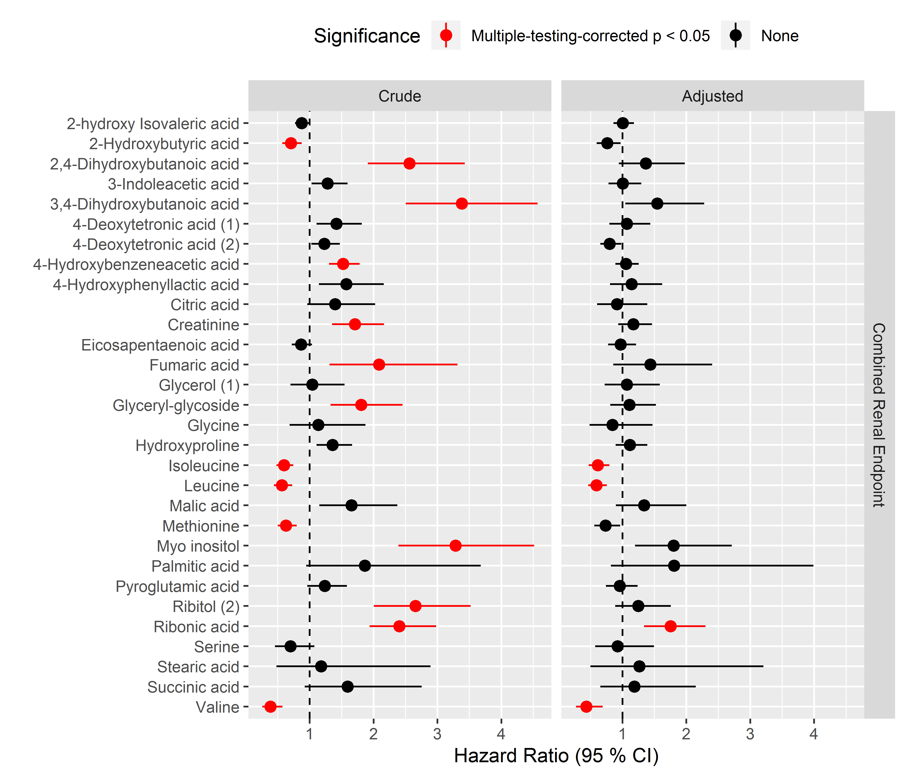<!-- -->

# Step 3: Survival Analysis of Specific Renal Endpoints in Relation to Prioritized Metabolites from Step 2A

## Step 3A: Albuminuria Group Progression

### Crude Model

``` r
names.tested <- 
  rownames( result.kidney.crude[ result.kidney.crude$"p.adj" < 0.05, ] )

names.model <- NULL

data.survival <- 
  data.frame( 
    data, 
    stringsAsFactors = FALSE,
    check.names = TRUE
  )

data.survival <- 
  data.survival[ , 
                 c( 
                   names.model, 
                   colnames( data.follow.up )[ colnames( data.follow.up ) != "id_profil" ], 
                   names.tested
                 )
                 ]

data.survival$"censor_alb_prog.reversed" <- data.survival$"censor_alb_prog_a"

data.survival$"censor_alb_prog.reversed" <-
  factor( 
    x = as.character( data.survival$"censor_alb_prog.reversed" ),
    levels = c( 2, 0 ),
    labels = c( "eos/udvandring i profil" , "event" )
  )

data.survival$"censor_alb_prog.reversed.numeric" <-
  as.numeric( data.survival$"censor_alb_prog.reversed" ) - 1

for ( i in 1:length( names.tested ) ) {

  name.i <- names.tested[ i ]
  
  model.survival <-
    survival::coxph( 
      formula = 
        as.formula( 
          paste( 
            "survival::Surv( time = t_alb_prog_a, event = censor_alb_prog.reversed.numeric ) ~",
            name.i
          )
        ), 
      data = data.survival
    )

  tmp <- summary( model.survival )
  
  if ( i == 1 ) {
    
    result.survival <- 
      array( 
        dim = 
          c(
            length( names.tested ),
            ncol( tmp$"coefficients" )
          )
      )
    
    rownames( result.survival ) <- names.tested
    colnames( result.survival ) <- colnames( tmp$"coefficients" )
    
    result.survival.CI <- array( dim = c( length( names.tested ), 2 ) )
    rownames( result.survival.CI ) <- names.tested
    colnames( result.survival.CI ) <- c( "lower .95", "upper .95" )
    
  }
  
  result.survival[ name.i, ] <- tmp$"coefficients"[ name.i, ]
  
  result.survival.CI[ name.i, ] <- 
    tmp$"conf.int"[ name.i, c( "lower .95", "upper .95" ) ]
  
}

result.survival <- 
  data.frame( 
    result.survival,
    result.survival.CI,
    check.names = FALSE
  )

result.survival$"p.adj" <- p.adjust( p=result.survival$"Pr(>|z|)" )
```

#### Table

``` r
table.result.printed <- result.4.albuminuria.crude <- result.survival

table.result.printed <- 
  table.result.printed[ 
    order( 
      table.result.printed$"Pr(>|z|)", 
      decreasing = FALSE
    ),
    ]

table.result.printed <- signif( x = table.result.printed, digits = 3 )
  
table.result.printed$"Name" <- rownames( table.result.printed )
  
table.result.printed <- 
  table.result.printed[ , 
                        c(
                          "Name",
                          "exp(coef)",
                          "lower .95",
                          "upper .95",
                          "Pr(>|z|)",
                          "p.adj"
                        )
                        ]
  
print(
  knitr::kable( 
    x = table.result.printed,
    row.names = FALSE,
    caption = "Survival model for albuminuria group progression."
  )
)
```

    ## 
    ## 
    ## Table: Survival model for albuminuria group progression.
    ## 
    ## Name                                exp(coef)   lower .95   upper .95   Pr(>|z|)   p.adj
    ## ---------------------------------  ----------  ----------  ----------  ---------  ------
    ## Valine..2TMS..20                        0.571       0.251        1.30      0.183       1
    ## Glyceryl.glycoside..59                  0.815       0.590        1.13      0.214       1
    ## Isoleucine..2TMS..18                    0.761       0.491        1.18      0.222       1
    ## Ribonic.acid..72                        1.190       0.815        1.75      0.364       1
    ## Creatinine..50                          1.220       0.785        1.90      0.373       1
    ## X4.Hydroxybenzeneacetic.acid..42        1.120       0.855        1.48      0.403       1
    ## Leucine..2TMS..19                       0.832       0.491        1.41      0.495       1
    ## X3.4.Dihydroxybutanoic.acid..27         0.854       0.484        1.50      0.584       1
    ## X2.Hydroxybutyric.acid..2TMS..22        0.910       0.578        1.43      0.685       1
    ## Ribitol..71                             1.100       0.665        1.81      0.719       1
    ## Methionine..2TMS..16                    1.090       0.636        1.85      0.764       1
    ## Fumaric.acid..2TMS..9                   0.878       0.370        2.08      0.767       1
    ## Myo.inositol.6TMS..1                    0.919       0.497        1.70      0.787       1
    ## X2.4.Dihydroxybutanoic.acid..28         0.947       0.556        1.61      0.842       1

#### Forest Plot

``` r
result.survival <- 
  data.frame( result.survival, 
              Name = rownames( result.survival ) )

# result.survival <- 
#   data.frame( result.survival, 
#               Name = names.mapping[ rownames( result.survival ), 3 ] )

plot <- 
  ggplot2::ggplot( data = result.survival, 
                   mapping = ggplot2::aes( x = Name, y = exp.coef., 
                                           ymin = lower..95, ymax = upper..95 ) ) +
  ggplot2::geom_pointrange() + 
  ggplot2::geom_hline( yintercept = 1, lty = "dashed" ) +
  ggplot2::coord_flip() +
  ggplot2::ylab( label = "Hazard Ratio (95 % CI)" ) +
  ggplot2::xlab( label = "" )

print( plot )
```

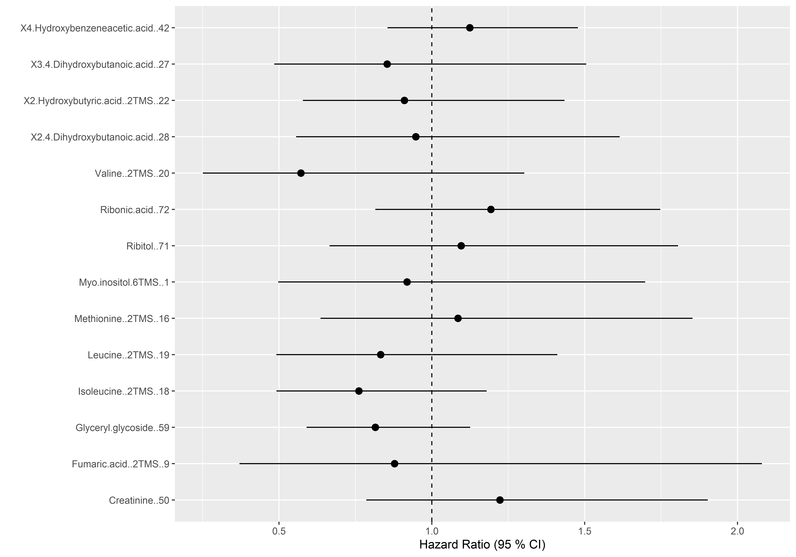<!-- -->

### Adjusted Model

``` r
names.tested <- 
  rownames( result.kidney.crude[ result.kidney.crude$"p.adj" < 0.05, ] )

names.model <- 
  c( 
    "logUAER",
    "egfr",
    "Age",
    "Gender",
    "Hba1c_baseline",
    "CALSBP",
    "bmi",
    "Smoking",
    "Statin", 
    "log_Blood_TGA",
    "Total_cholesterol"
  )

data.survival <- 
  data.frame( 
    data, 
    stringsAsFactors = FALSE, 
    check.names = TRUE
  )

data.survival <- 
  data.survival[ , 
                 c(
                   names.model, 
                   colnames( data.follow.up )[ colnames( data.follow.up ) != "id_profil" ], 
                   names.tested
                 )
                 ]

data.survival$"censor_alb_prog.reversed" <- data.survival$"censor_alb_prog_a"

data.survival$"censor_alb_prog.reversed" <-
  factor( 
    x = as.character( data.survival$"censor_alb_prog.reversed" ),
    levels = c( 2, 0 ),
    labels = c( "eos/udvandring i profil" , "event" )
  )

data.survival$"censor_alb_prog.reversed.numeric" <-
  as.numeric( data.survival$"censor_alb_prog.reversed" ) - 1

for ( i in 1:length( names.tested ) ) {

  name.i <- names.tested[ i ]
  
  model.survival <-
    survival::coxph( 
      formula = 
        as.formula( 
          paste( 
            "survival::Surv( time = t_alb_prog_a, event = censor_alb_prog.reversed.numeric ) ~",
            name.i,
            "+ logUAER",
            "+ egfr",
            "+ Age",
            "+ Gender",
            "+ Hba1c_baseline",
            "+ CALSBP",
            "+ bmi",
            "+ Smoking",
            "+ Statin",
            "+ log_Blood_TGA",
            "+ Total_cholesterol"
          )
        ), 
      data = data.survival
    )

  tmp <- summary( model.survival )
  
  if ( i == 1 ) {
    
    result.survival <- 
      array( 
        dim =
          c( 
            length( names.tested ), 
            ncol( tmp$"coefficients" )
          )
      )
    
    rownames( result.survival ) <- names.tested
    colnames( result.survival ) <- colnames( tmp$"coefficients" )
    
    result.survival.CI <- array( dim=c( length( names.tested ), 2 ) )
    rownames( result.survival.CI ) <- names.tested
    colnames( result.survival.CI ) <- c( "lower .95", "upper .95" )
    
  }
  
  result.survival[ name.i, ] <- tmp$"coefficients"[ name.i, ]
  
  result.survival.CI[ name.i, ] <- 
    tmp$"conf.int"[ name.i, c( "lower .95", "upper .95" ) ]
  
}

result.survival <- 
  data.frame( 
    result.survival, 
    result.survival.CI, 
    check.names = FALSE
  )

result.survival$"p.adj" <- p.adjust( p=result.survival$"Pr(>|z|)" )
```

#### Table

``` r
table.result.printed <- result.4.albuminuria.adjusted <- result.survival

table.result.printed <- 
  table.result.printed[ 
    order( 
      table.result.printed$"Pr(>|z|)", 
      decreasing = FALSE
    ), ]

table.result.printed <- signif( x = table.result.printed, digits = 3 )
  
table.result.printed$"Name" <- rownames( table.result.printed )

table.result.printed <- 
  table.result.printed[ ,
                        c(
                          "Name",
                          "exp(coef)",
                          "lower .95",
                          "upper .95",
                          "Pr(>|z|)",
                          "p.adj"
                        )
                        ]
  
print(
  knitr::kable( 
    x = table.result.printed,
    row.names = FALSE,
    caption = "Survival model for albuminuria group progression."
  )
)
```

    ## 
    ## 
    ## Table: Survival model for albuminuria group progression.
    ## 
    ## Name                                exp(coef)   lower .95   upper .95   Pr(>|z|)   p.adj
    ## ---------------------------------  ----------  ----------  ----------  ---------  ------
    ## X3.4.Dihydroxybutanoic.acid..27         0.397       0.193       0.816     0.0120   0.168
    ## Glyceryl.glycoside..59                  0.708       0.492       1.020     0.0626   0.814
    ## Myo.inositol.6TMS..1                    0.512       0.246       1.060     0.0732   0.878
    ## X2.4.Dihydroxybutanoic.acid..28         0.549       0.264       1.140     0.1080   1.000
    ## Fumaric.acid..2TMS..9                   0.600       0.236       1.530     0.2840   1.000
    ## X4.Hydroxybenzeneacetic.acid..42        0.870       0.657       1.150     0.3300   1.000
    ## Ribitol..71                             0.823       0.482       1.400     0.4750   1.000
    ## Methionine..2TMS..16                    1.260       0.645       2.460     0.4980   1.000
    ## X2.Hydroxybutyric.acid..2TMS..22        0.836       0.479       1.460     0.5280   1.000
    ## Ribonic.acid..72                        0.938       0.571       1.540     0.8000   1.000
    ## Valine..2TMS..20                        0.905       0.333       2.450     0.8440   1.000
    ## Isoleucine..2TMS..18                    1.060       0.550       2.040     0.8650   1.000
    ## Creatinine..50                          1.040       0.623       1.750     0.8740   1.000
    ## Leucine..2TMS..19                       0.994       0.480       2.060     0.9870   1.000

#### Forest Plot

``` r
result.survival <- 
  data.frame( result.survival, 
              Name = rownames( result.survival ) )

# result.survival <- 
#   data.frame( result.survival, 
#               Name = names.mapping[ rownames( result.survival ), 3 ] )

plot <- 
  ggplot2::ggplot( data = result.survival, 
                   mapping = ggplot2::aes( x = Name, y = exp.coef., 
                                           ymin = lower..95, ymax = upper..95 ) ) +
  ggplot2::geom_pointrange() + 
  ggplot2::geom_hline( yintercept = 1, lty = "dashed" ) +
  ggplot2::coord_flip() +
  ggplot2::ylab( label = "Hazard Ratio (95 % CI)" ) +
  ggplot2::xlab( label = "" )

print( plot )
```

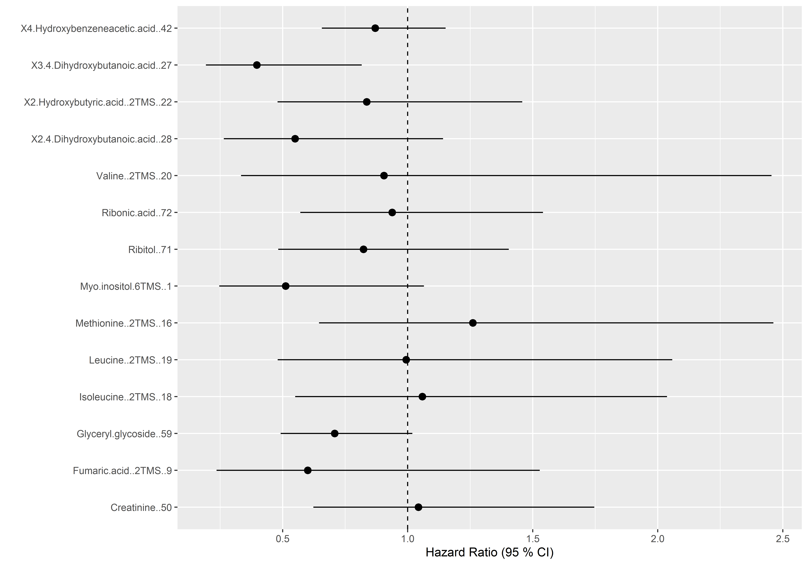<!-- -->

### Combined Forest Plot from Crude and Adjusted Models

``` r
tmp <- result.4.albuminuria.crude

tmp$"Name" <- rownames( tmp )

tmp$"Model" <- rep( x = "Crude", times = nrow( tmp ) )

data.plot <- tmp

tmp <- result.4.albuminuria.adjusted

tmp$"Name" <- rownames( tmp )

tmp$"Model" <- rep( x = "Adjusted", times = nrow( tmp ) )

data.plot <- rbind( data.plot, tmp )

data.plot$"Model" <- 
  factor( 
    x = data.plot$"Model",
    levels = c( "Crude", "Adjusted" )
  )

data.plot$"Name" <-
  factor( 
    x = data.plot$"Name",
    levels = sort( x = unique( data.plot$"Name" ), decreasing = TRUE )
  )

data.plot$"Significance" <- rep( x = "None", times = nrow( data.plot ) )

data.plot[ data.plot$"p.adj" < 0.05, "Significance" ] <- 
  "Multiple-testing-corrected p < 0.05"

data.plot$"Event" <- 
  rep( 
    x = "Albuminuria\nGroup\nProgression",
    times = nrow( data.plot )
  )

colnames( data.plot )[ colnames( data.plot ) == "exp(coef)"] <- "HR"

colnames( data.plot ) <- make.names( colnames( data.plot ) )

forest.step4.compilation <- data.plot
```

``` r
plot <-
  ggplot2::ggplot( data = data.plot,
                   mapping = ggplot2::aes( x = Name, y = HR,
                                           ymin = lower..95, ymax = upper..95,
                                           colour = Significance ) ) +
  ggplot2::geom_pointrange() +
  ggplot2::geom_hline( yintercept = 1, lty = "dashed" ) +
  ggplot2::facet_grid( facets= ~ Model ) +
  ggplot2::scale_colour_manual( values=c( "red", "black" ) ) +
  # ggplot2::scale_colour_manual( values=c( "red", "orange", "black" ) ) +
  ggplot2::coord_flip() +
  ggplot2::theme( legend.position = "top" ) +
  ggplot2::ylab( label = "Hazard Ratio (95 % CI)" ) +
  ggplot2::xlab( label = "" )

print( plot )
```

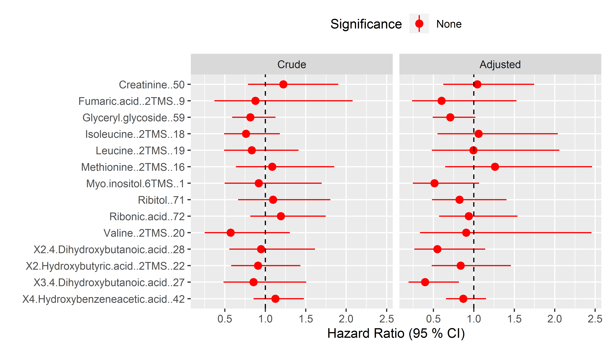<!-- -->

## Step 3B: All-Cause Mortality

### Crude Model

``` r
names.tested <- 
  rownames( result.kidney.crude[ result.kidney.crude$"p.adj" < 0.05, ] )

names.model <- NULL

data.survival <- 
  data.frame( 
    data,
    stringsAsFactors = FALSE,
    check.names = TRUE
  )

data.survival <- 
  data.survival[ , 
                 c(
                   names.model, 
                   colnames( data.follow.up )[ colnames( data.follow.up ) != "id_profil" ], 
                   names.tested
                 )
                 ]

data.survival$"censor_doed_profil.reversed" <- 
  factor( 
    x = as.character( data.survival$"censor_doed_profil" ), 
    levels = c( 1, 0 ), 
    labels = c( "eos/udvandring i profil" , "event" )
  )

data.survival$"censor_doed_profil.reversed.numeric" <-
  as.numeric( data.survival$"censor_doed_profil.reversed" ) - 1

for ( i in 1:length( names.tested ) ) {

  name.i <- names.tested[ i ]
  
  model.survival <-
    survival::coxph(
      formula =
        as.formula(
          paste(
            "survival::Surv( time = t_doed_profil, event = censor_doed_profil.reversed.numeric ) ~",
            name.i
          )
        ), 
      data = data.survival
    )

  tmp <- summary( model.survival )
  
  if ( i == 1 ) {
    
    result.survival <- 
      array( 
        dim = 
          c(
            length( names.tested ),
            ncol( tmp$"coefficients" )
          )
      )
    
    rownames( result.survival ) <- names.tested
    colnames( result.survival ) <- colnames( tmp$"coefficients" )
    
    result.survival.CI <- array( dim = c( length( names.tested ), 2 ) )
    rownames( result.survival.CI ) <- names.tested
    colnames( result.survival.CI ) <- c( "lower .95", "upper .95" )
    
  }
  
  result.survival[ name.i, ] <- tmp$"coefficients"[ name.i, ]
  
  result.survival.CI[ name.i, ] <- 
    tmp$"conf.int"[ name.i, c( "lower .95", "upper .95" ) ]
  
}

result.survival <- 
  data.frame( 
    result.survival,
    result.survival.CI,
    check.names = FALSE
  )

result.survival$"p.adj" <- p.adjust( p=result.survival$"Pr(>|z|)" )
```

#### Table

``` r
table.result.printed <- result.4.mortality.crude <- result.survival

table.result.printed <- 
  table.result.printed[ 
    order(
      table.result.printed$"Pr(>|z|)", 
      decreasing = FALSE
    ), ]

table.result.printed <- signif( x = table.result.printed, digits = 3 )
  
table.result.printed$"Name" <- rownames( table.result.printed )
  
table.result.printed <- 
  table.result.printed[ , 
                        c(
                          "Name",
                          "exp(coef)",
                          "lower .95",
                          "upper .95",
                          "Pr(>|z|)",
                          "p.adj"
                        )
                        ]
  
print(
  knitr::kable( 
    x = table.result.printed,
    row.names = FALSE,
    caption = "Crude survival model for all-cause mortality."
  )
)
```

    ## 
    ## 
    ## Table: Crude survival model for all-cause mortality.
    ## 
    ## Name                                exp(coef)   lower .95   upper .95   Pr(>|z|)      p.adj
    ## ---------------------------------  ----------  ----------  ----------  ---------  ---------
    ## Ribonic.acid..72                        2.030       1.500       2.760   5.40e-06   7.58e-05
    ## Ribitol..71                             2.550       1.700       3.810   5.60e-06   7.58e-05
    ## X3.4.Dihydroxybutanoic.acid..27         2.570       1.660       3.980   2.47e-05   2.97e-04
    ## X2.4.Dihydroxybutanoic.acid..28         2.360       1.550       3.570   5.61e-05   6.18e-04
    ## X4.Hydroxybenzeneacetic.acid..42        1.530       1.220       1.920   2.38e-04   2.38e-03
    ## Myo.inositol.6TMS..1                    2.310       1.460       3.640   3.30e-04   2.97e-03
    ## X2.Hydroxybutyric.acid..2TMS..22        0.601       0.449       0.805   6.36e-04   5.09e-03
    ## Isoleucine..2TMS..18                    0.654       0.490       0.873   3.94e-03   2.76e-02
    ## Creatinine..50                          1.570       1.120       2.210   9.26e-03   5.56e-02
    ## Valine..2TMS..20                        0.458       0.252       0.830   1.00e-02   5.56e-02
    ## Glyceryl.glycoside..59                  1.690       1.080       2.640   2.04e-02   8.18e-02
    ## Fumaric.acid..2TMS..9                   2.080       1.060       4.070   3.33e-02   9.98e-02
    ## Leucine..2TMS..19                       0.699       0.494       0.988   4.23e-02   9.98e-02
    ## Methionine..2TMS..16                    0.996       0.669       1.480   9.85e-01   9.85e-01

#### Forest Plot

``` r
result.survival <- 
  data.frame( 
    result.survival, 
    Name = rownames( result.survival )
  )

# plot <- 
#   ggplot2::ggplot( data = result.survival, 
#                    mapping = ggplot2::aes( x = Name, y = exp.coef., 
#                                            ymin = lower..95, ymax = upper..95 ) ) +
#   ggplot2::geom_pointrange() + 
#   ggplot2::geom_hline( yintercept = 1, lty = "dashed" ) +
#   ggplot2::coord_flip() +
#   ggplot2::ylab( label = "Hazard Ratio (95 % CI)" ) +
#   ggplot2::xlab( label = "" )
# 
# print( plot )
```

### Adjusted Model

``` r
names.tested <- 
  rownames( result.kidney.crude[ result.kidney.crude$"p.adj" < 0.05, ] )

names.model <- 
  c( 
    "logUAER",
    "egfr",
    "Age",
    "Gender",
    "Hba1c_baseline",
    "CALSBP",
    "bmi",
    "Smoking",
    "Statin",
    "log_Blood_TGA",
    "Total_cholesterol"
  )

data.survival <- 
  data.frame( 
    data, 
    stringsAsFactors = FALSE,
    check.names = TRUE
  )

data.survival <- 
  data.survival[ , 
                 c( names.model, 
                    colnames( data.follow.up )[ colnames( data.follow.up ) != "id_profil" ], 
                    names.tested
                 )
                 ]

data.survival$"censor_doed_profil.reversed" <- 
  factor( 
    x = as.character( data.survival$"censor_doed_profil" ), 
    levels = c( 1, 0 ), 
    labels = c( "eos/udvandring i profil" , "event" )
  )

data.survival$"censor_doed_profil.reversed.numeric" <-
  as.numeric( data.survival$"censor_doed_profil.reversed" ) - 1

for ( i in 1:length( names.tested ) ) {

  name.i <- names.tested[ i ]
  
  model.survival <-
    survival::coxph( 
      formula = 
        as.formula(
          paste( "survival::Surv( time = t_doed_profil, event = censor_doed_profil.reversed.numeric ) ~",
                 name.i,
                 "+ logUAER",
                 "+ egfr",
                 "+ Age",
                 "+ Gender",
                 "+ Hba1c_baseline",
                 "+ CALSBP",
                 "+ bmi",
                 "+ Smoking",
                 "+ Statin",
                 "+ log_Blood_TGA",
                 "+ Total_cholesterol"
          )
        ), 
      data = data.survival
    )

  tmp <- summary( model.survival )
  
  if ( i == 1 ) {
    
    result.survival <-
      array(
        dim =
          c(
            length( names.tested ),
            ncol( tmp$"coefficients" )
          )
      )
    
    rownames( result.survival ) <- names.tested
    colnames( result.survival ) <- colnames( tmp$"coefficients" )
    
    result.survival.CI <- array( dim = c( length( names.tested ), 2 ) )
    rownames( result.survival.CI ) <- names.tested
    colnames( result.survival.CI ) <- c( "lower .95", "upper .95" )
    
  }
  
  result.survival[ name.i, ] <- tmp$"coefficients"[ name.i, ]
  
  result.survival.CI[ name.i, ] <- 
    tmp$"conf.int"[ name.i, c( "lower .95", "upper .95" ) ]
  
}

result.survival <- 
  data.frame( 
    result.survival, 
    result.survival.CI, 
    check.names = FALSE
  )

result.survival$"p.adj" <- p.adjust( p=result.survival$"Pr(>|z|)" )
```

#### Table

``` r
table.result.printed <- result.4.mortality.adjusted <- result.survival

table.result.printed <- 
  table.result.printed[ 
    order(
      table.result.printed$"Pr(>|z|)", 
      decreasing = FALSE
    ), ]

table.result.printed <- signif( x = table.result.printed, digits = 3 )
  
table.result.printed$"Name" <- rownames( table.result.printed )

table.result.printed <- 
  table.result.printed[ , 
                        c(
                          "Name",
                          "exp(coef)",
                          "lower .95",
                          "upper .95",
                          "Pr(>|z|)",
                          "p.adj"
                        )
                        ]

print(
  knitr::kable(
    x = table.result.printed,
    row.names = FALSE,
    caption = "Adjusted survival model for all-cause mortality."
  )
)
```

    ## 
    ## 
    ## Table: Adjusted survival model for all-cause mortality.
    ## 
    ## Name                                exp(coef)   lower .95   upper .95   Pr(>|z|)   p.adj
    ## ---------------------------------  ----------  ----------  ----------  ---------  ------
    ## X2.Hydroxybutyric.acid..2TMS..22        0.646       0.460       0.907     0.0117   0.163
    ## Ribonic.acid..72                        1.570       1.060       2.320     0.0233   0.303
    ## Isoleucine..2TMS..18                    0.694       0.477       1.010     0.0568   0.681
    ## Ribitol..71                             1.600       0.930       2.740     0.0901   0.991
    ## Leucine..2TMS..19                       0.750       0.505       1.110     0.1530   1.000
    ## Myo.inositol.6TMS..1                    1.560       0.846       2.880     0.1540   1.000
    ## Fumaric.acid..2TMS..9                   1.640       0.795       3.400     0.1800   1.000
    ## Creatinine..50                          1.320       0.866       2.000     0.1990   1.000
    ## X2.4.Dihydroxybutanoic.acid..28         1.430       0.824       2.490     0.2030   1.000
    ## Glyceryl.glycoside..59                  1.360       0.828       2.240     0.2230   1.000
    ## Valine..2TMS..20                        0.668       0.341       1.310     0.2390   1.000
    ## X3.4.Dihydroxybutanoic.acid..27         1.340       0.769       2.320     0.3040   1.000
    ## X4.Hydroxybenzeneacetic.acid..42        1.100       0.857       1.410     0.4590   1.000
    ## Methionine..2TMS..16                    0.952       0.598       1.520     0.8370   1.000

#### Forest Plot

``` r
result.survival <- 
  data.frame( 
    result.survival, 
    Name = rownames( result.survival )
  )

plot <- 
  ggplot2::ggplot( data = result.survival, 
                   mapping = ggplot2::aes( x = Name, y = exp.coef., 
                                           ymin = lower..95, ymax = upper..95 ) ) +
  ggplot2::geom_pointrange() + 
  ggplot2::geom_hline( yintercept = 1, lty = "dashed" ) +
  ggplot2::coord_flip() +
  ggplot2::ylab( label = "Hazard Ratio (95 % CI)" ) +
  ggplot2::xlab( label = "" )

print( plot )
```

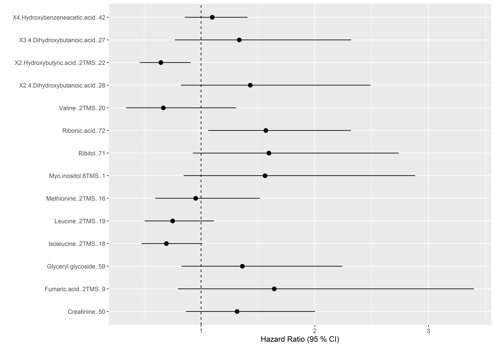<!-- -->

### Combined Forest Plot from Crude and Adjusted Models

``` r
tmp <- result.4.mortality.crude

tmp$"Name" <- rownames( tmp )

tmp$"Model" <- rep( x = "Crude", times = nrow( tmp ) )

data.plot <- tmp

tmp <- result.4.mortality.adjusted

tmp$"Name" <- rownames( tmp )

tmp$"Model" <- rep( x = "Adjusted", times = nrow( tmp ) )

data.plot <- rbind( data.plot, tmp )

data.plot$"Model" <- 
  factor( 
    x = data.plot$"Model",
    levels = c( "Crude", "Adjusted" )
  )

data.plot$"Name" <-
  factor(
    x = data.plot$"Name",
    levels = 
      sort( 
        x = unique( data.plot$"Name" ),
        decreasing = TRUE
      )
  )

data.plot$"Significance" <- rep( x = "None", times = nrow( data.plot ) )

data.plot[ data.plot$"p.adj" < 0.05, "Significance" ] <- 
  "Multiple-testing-corrected p < 0.05"

data.plot$"Event" <- 
  rep( x = "All-Cause Mortality", times = nrow( data.plot ) )

colnames( data.plot )[ colnames( data.plot )=="exp(coef)"] <- "HR"

colnames( data.plot ) <- make.names( colnames( data.plot ) )

forest.step4.compilation <- rbind( forest.step4.compilation, data.plot )
```

``` r
plot <-
  ggplot2::ggplot( 
    data = data.plot,
    mapping = 
      ggplot2::aes(
        x = Name,
        y = HR,
        ymin = lower..95,
        ymax = upper..95,
        colour = Significance
      )
  ) +
  ggplot2::geom_pointrange() +
  ggplot2::geom_hline( yintercept = 1, lty = "dashed" ) +
  ggplot2::facet_grid( facets = ~ Model ) +
  ggplot2::scale_colour_manual( values=c( "red", "black" ) ) +
  # ggplot2::scale_colour_manual( values=c( "red", "orange", "black" ) ) +
  ggplot2::coord_flip() +
  ggplot2::theme( legend.position = "top" ) +
  ggplot2::ylab( label = "Hazard Ratio (95 % CI)" ) +
  ggplot2::xlab( label = "" )

print( plot )
```

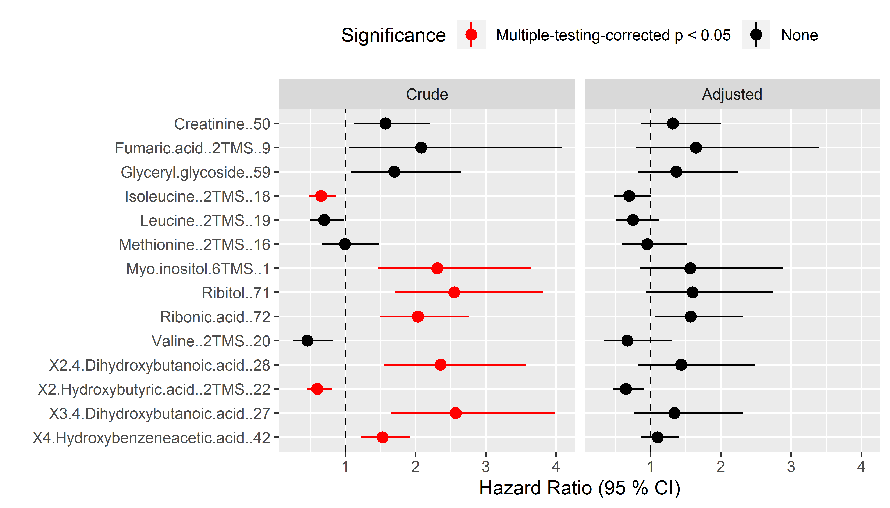<!-- -->

## Step 3C: eGFR Decline \> 30 %

### Crude Model

``` r
names.tested <- 
  rownames( result.kidney.crude[ result.kidney.crude$"p.adj" < 0.05, ] )

names.model <- NULL

data.survival <- 
  data.frame( 
    data, 
    stringsAsFactors = FALSE, 
    check.names = TRUE
  )

data.survival <- 
  data.survival[ , 
                 c(
                   names.model, 
                   colnames( data.follow.up )[ colnames( data.follow.up ) != "id_profil" ], 
                   names.tested
                 ) ]

colnames( data.survival ) <- make.names( names=colnames( data.survival ) )

data.survival$"censor_gfrfald30_p.reversed" <- data.survival$"censor_gfrfald30_p"

data.survival$"censor_gfrfald30_p.reversed" <-
  factor(
    x = as.character( data.survival$"censor_gfrfald30_p.reversed" ),
    levels = c( 2, 0 ),
    labels = c( "eos/udvandring i profil" , "event" )
  )

data.survival$"censor_gfrfald30_p.reversed.numeric" <-
  as.numeric( data.survival$"censor_gfrfald30_p.reversed" ) - 1

for ( i in 1:length( names.tested ) ) {

  name.i <- names.tested[ i ]
  
  model.survival <-
    survival::coxph(
      formula =
        as.formula(
          paste(
            "survival::Surv( time = t_gfrfald30_p, event = censor_gfrfald30_p.reversed.numeric ) ~",
            name.i
          )
        ), 
      data = data.survival
    )

  tmp <- summary( model.survival )
  
  if ( i == 1 ) {
    
    result.survival <- 
      array(
        dim =
          c(
            length( names.tested ),
            ncol( tmp$"coefficients" )
          )
      )
    
    rownames( result.survival ) <- names.tested
    colnames( result.survival ) <- colnames( tmp$"coefficients" )
    
    result.survival.CI <- array( dim = c( length( names.tested ), 2 ) )
    rownames( result.survival.CI ) <- names.tested
    colnames( result.survival.CI ) <- c( "lower .95", "upper .95" )
    
  }
  
  result.survival[ name.i, ] <- tmp$"coefficients"[ name.i, ]
  
  result.survival.CI[ name.i, ] <-
    tmp$"conf.int"[ name.i, c( "lower .95", "upper .95" ) ]
  
}

result.survival <- 
  data.frame(
    result.survival,
    result.survival.CI,
    check.names = FALSE
  )

result.survival$"p.adj" <- p.adjust( p=result.survival$"Pr(>|z|)" )
```

#### Table

``` r
table.result.printed <- result.4.egfr.crude <- result.survival

table.result.printed <- 
  table.result.printed[ 
    order(
      table.result.printed$"Pr(>|z|)", 
      decreasing = FALSE
    ), ]

table.result.printed <- signif( x = table.result.printed, digits = 3 )
  
table.result.printed$"Name" <- rownames( table.result.printed )

table.result.printed <- 
  table.result.printed[ , 
                        c(
                          "Name",
                          "exp(coef)",
                          "lower .95",
                          "upper .95",
                          "Pr(>|z|)",
                          "p.adj"
                        ) ]

print(
  knitr::kable( 
    x = table.result.printed,
    row.names = FALSE,
    caption = "Crude survival model for eGFR decline > 30 %"
  )
)
```

    ## 
    ## 
    ## Table: Crude survival model for eGFR decline > 30 %
    ## 
    ## Name                                exp(coef)   lower .95   upper .95   Pr(>|z|)      p.adj
    ## ---------------------------------  ----------  ----------  ----------  ---------  ---------
    ## Ribonic.acid..72                        2.510       1.950       3.230   0.000000   0.00e+00
    ## Myo.inositol.6TMS..1                    4.060       2.760       5.970   0.000000   0.00e+00
    ## X3.4.Dihydroxybutanoic.acid..27         3.700       2.580       5.300   0.000000   0.00e+00
    ## Ribitol..71                             2.510       1.810       3.480   0.000000   3.00e-07
    ## X2.4.Dihydroxybutanoic.acid..28         2.580       1.840       3.620   0.000000   4.00e-07
    ## X4.Hydroxybenzeneacetic.acid..42        1.410       1.170       1.690   0.000218   1.96e-03
    ## Methionine..2TMS..16                    0.611       0.466       0.800   0.000345   2.76e-03
    ## Glyceryl.glycoside..59                  1.850       1.300       2.640   0.000705   4.94e-03
    ## Creatinine..50                          1.620       1.230       2.150   0.000734   4.94e-03
    ## Isoleucine..2TMS..18                    0.664       0.512       0.861   0.002010   1.01e-02
    ## Valine..2TMS..20                        0.515       0.309       0.857   0.010700   4.28e-02
    ## Leucine..2TMS..19                       0.765       0.557       1.050   0.096100   2.88e-01
    ## Fumaric.acid..2TMS..9                   1.560       0.910       2.670   0.106000   2.88e-01
    ## X2.Hydroxybutyric.acid..2TMS..22        0.874       0.667       1.150   0.332000   3.32e-01

### Forest Plot

``` r
result.survival <- 
  data.frame(
    result.survival, 
    Name = rownames( result.survival )
  )

plot <- 
  ggplot2::ggplot( data = result.survival, 
                   mapping = ggplot2::aes( x = Name, y = exp.coef., 
                                           ymin = lower..95, ymax = upper..95 ) ) +
  ggplot2::geom_pointrange() + 
  ggplot2::geom_hline( yintercept = 1, lty = "dashed" ) +
  ggplot2::coord_flip() +
  ggplot2::ylab( label = "Hazard Ratio (95 % CI)" ) +
  ggplot2::xlab( label = "" )

print( plot )
```

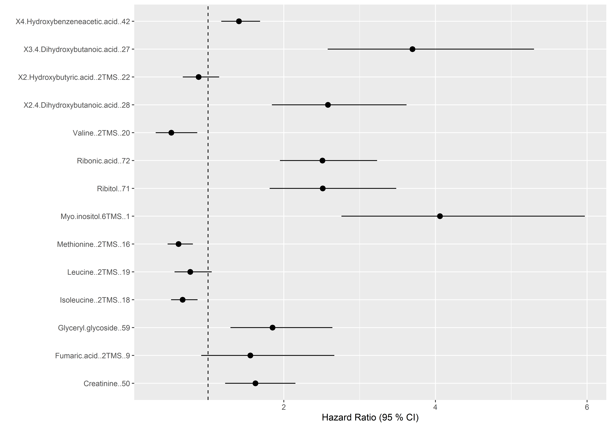<!-- -->

### Adjusted Model

``` r
names.tested <- 
  rownames( result.kidney.crude[ result.kidney.crude$"p.adj" < 0.05, ] )

names.model <- 
  c( 
    "logUAER",
    "egfr",
    "Age",
    "Gender",
    "Hba1c_baseline",
    "CALSBP",
    "bmi",
    "Smoking",
    "Statin",
    "log_Blood_TGA",
    "Total_cholesterol"
  )

data.survival <- 
  data.frame(
    data,
    stringsAsFactors = FALSE,
    check.names = TRUE
  )

data.survival <- 
  data.survival[ , 
                 c(
                   names.model, 
                   colnames( data.follow.up )[ colnames( data.follow.up ) != "id_profil" ], 
                   names.tested
                 )
                 ]

data.survival$"censor_gfrfald30_p.reversed" <- data.survival$"censor_gfrfald30_p"

data.survival$"censor_gfrfald30_p.reversed" <-
  factor( 
    x = as.character( data.survival$"censor_gfrfald30_p.reversed" ),
    levels = c( 2, 0 ),
    labels = c( "eos/udvandring i profil" , "event" )
  )

data.survival$"censor_gfrfald30_p.reversed.numeric" <-
  as.numeric( data.survival$"censor_gfrfald30_p.reversed" ) - 1

for ( i in 1:length( names.tested ) ) {

  name.i <- names.tested[ i ]
  
  model.survival <-
    survival::coxph(
      formula =
        as.formula(
          paste(
            "survival::Surv( time = t_gfrfald30_p, event = censor_gfrfald30_p.reversed.numeric ) ~",
            name.i,
            "+ logUAER",
            "+ egfr",
            "+ Age",
            "+ Gender",
            "+ Hba1c_baseline",
            "+ CALSBP",
            "+ bmi",
            "+ Smoking",
            "+ Statin",
            "+ log_Blood_TGA",
            "+ Total_cholesterol"
          )
        ), 
      data = data.survival
    )

  tmp <- summary( model.survival )
  
  if ( i == 1 ) {
    
    result.survival <- 
      array( 
        dim = c(
          length( names.tested ),
          ncol( tmp$"coefficients" )
        )
      )
    
    rownames( result.survival ) <- names.tested
    colnames( result.survival ) <- colnames( tmp$"coefficients" )
    
    result.survival.CI <- array( dim=c( length( names.tested ), 2 ) )
    rownames( result.survival.CI ) <- names.tested
    colnames( result.survival.CI ) <- c( "lower .95", "upper .95" )
    
  }
  
  result.survival[ name.i, ] <- tmp$"coefficients"[ name.i, ]
  
  result.survival.CI[ name.i, ] <- 
    tmp$"conf.int"[ name.i, c( "lower .95", "upper .95" ) ]
  
}

result.survival <- 
  data.frame(
    result.survival,
    result.survival.CI,
    check.names = FALSE
  )

result.survival$"p.adj" <- p.adjust( p=result.survival$"Pr(>|z|)" )
```

#### Table

``` r
table.result.printed <- result.4.egfr.adjusted <- result.survival

table.result.printed <- 
  table.result.printed[ 
    order( 
      table.result.printed$"Pr(>|z|)", 
      decreasing = FALSE
    ), ]

table.result.printed <- signif( x = table.result.printed, digits = 3 )
  
table.result.printed$"Name" <- rownames( table.result.printed )

table.result.printed <- 
  table.result.printed[ , 
                        c(
                          "Name",
                          "exp(coef)",
                          "lower .95",
                          "upper .95",
                          "Pr(>|z|)",
                          "p.adj"
                        ) ]

print(
  knitr::kable(
    x = table.result.printed,
    row.names = FALSE,
    caption = "Adjusted survival model for eGFR decline > 30 %."
  )
)
```

    ## 
    ## 
    ## Table: Adjusted survival model for eGFR decline > 30 %.
    ## 
    ## Name                                exp(coef)   lower .95   upper .95   Pr(>|z|)      p.adj
    ## ---------------------------------  ----------  ----------  ----------  ---------  ---------
    ## Ribonic.acid..72                        2.220       1.640       2.990   2.00e-07   2.60e-06
    ## Myo.inositol.6TMS..1                    2.660       1.630       4.340   8.69e-05   1.13e-03
    ## X3.4.Dihydroxybutanoic.acid..27         1.890       1.180       3.030   8.34e-03   1.00e-01
    ## X2.4.Dihydroxybutanoic.acid..28         1.680       1.080       2.610   2.05e-02   2.25e-01
    ## Isoleucine..2TMS..18                    0.739       0.556       0.983   3.75e-02   3.75e-01
    ## Valine..2TMS..20                        0.552       0.313       0.975   4.05e-02   3.75e-01
    ## X2.Hydroxybutyric.acid..2TMS..22        0.764       0.548       1.070   1.13e-01   9.01e-01
    ## Methionine..2TMS..16                    0.769       0.544       1.090   1.35e-01   9.48e-01
    ## Ribitol..71                             1.320       0.886       1.950   1.74e-01   1.00e+00
    ## Creatinine..50                          1.180       0.920       1.520   1.90e-01   1.00e+00
    ## X4.Hydroxybenzeneacetic.acid..42        1.120       0.921       1.370   2.49e-01   1.00e+00
    ## Leucine..2TMS..19                       0.880       0.655       1.180   3.98e-01   1.00e+00
    ## Glyceryl.glycoside..59                  1.160       0.778       1.740   4.63e-01   1.00e+00
    ## Fumaric.acid..2TMS..9                   0.804       0.441       1.470   4.76e-01   1.00e+00

#### Forest Plot

``` r
result.survival <- 
  data.frame( 
    result.survival, 
    Name = rownames( result.survival )
  )

plot <- 
  ggplot2::ggplot( data = result.survival, 
                   mapping = ggplot2::aes( x = Name, y = exp.coef., 
                                           ymin = lower..95, ymax = upper..95 ) ) +
  ggplot2::geom_pointrange() + 
  ggplot2::geom_hline( yintercept = 1, lty = "dashed" ) +
  ggplot2::coord_flip() +
  ggplot2::ylab( label = "Hazard Ratio (95 % CI)" ) +
  ggplot2::xlab( label = "" )

print( plot )
```

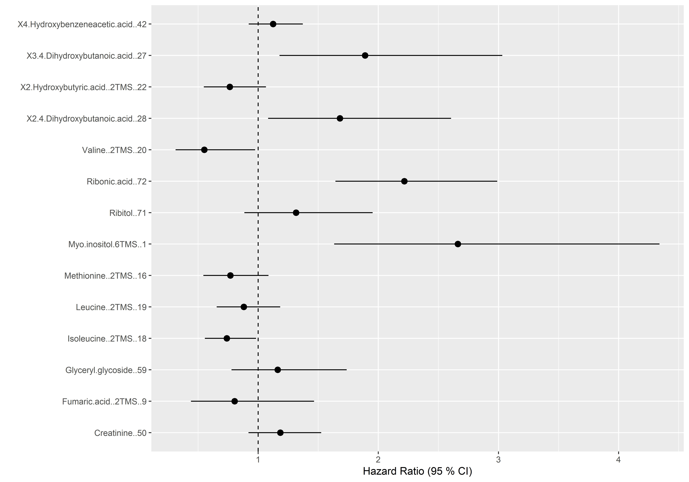<!-- -->

### Combined Forest Plot from Crude and Adjusted Models

``` r
tmp <- result.4.egfr.crude

tmp$"Name" <- rownames( tmp )

tmp$"Model" <- rep( x = "Crude", times = nrow( tmp ) )

data.plot <- tmp

tmp <- result.4.egfr.adjusted

tmp$"Name" <- rownames( tmp )

tmp$"Model" <- rep( x = "Adjusted", times = nrow( tmp ) )

data.plot <- rbind( data.plot, tmp )

data.plot$"Model" <- 
  factor( 
    x = data.plot$"Model",
    levels = c( "Crude", "Adjusted" )
  )

data.plot$"Name" <-
  factor(
    x = data.plot$"Name",
    levels = sort( x = unique( data.plot$"Name" ), decreasing=TRUE )
  )

data.plot$"Significance" <- rep( x = "None", times = nrow( data.plot ) )

data.plot[ data.plot$"p.adj" < 0.05, "Significance" ] <- 
  "Multiple-testing-corrected p < 0.05"

data.plot$"Event" <- 
  rep( x = "eGFR Decline (> 30 %)", times = nrow( data.plot ) )

colnames( data.plot )[ colnames( data.plot ) == "exp(coef)"] <- "HR"

colnames( data.plot ) <- make.names( colnames( data.plot ) )

forest.step4.compilation <- rbind( forest.step4.compilation, data.plot )
```

``` r
plot <-
  ggplot2::ggplot( 
    data = data.plot,
    mapping = 
      ggplot2::aes(
        x = Name,
        y = HR,
        ymin = lower..95,
        ymax = upper..95,
        colour = Significance
      )
  ) +
  ggplot2::geom_pointrange() +
  ggplot2::geom_hline( yintercept = 1, lty = "dashed" ) +
  ggplot2::facet_grid( facets = ~ Model ) +
  ggplot2::scale_colour_manual( values = c( "red", "black" ) ) +
  # ggplot2::scale_colour_manual( values=c( "red", "orange", "black" ) ) +
  ggplot2::coord_flip() +
  ggplot2::theme( legend.position = "top" ) +
  ggplot2::ylab( label = "Hazard Ratio (95 % CI)" ) +
  ggplot2::xlab( label = "" )

print( plot )
```

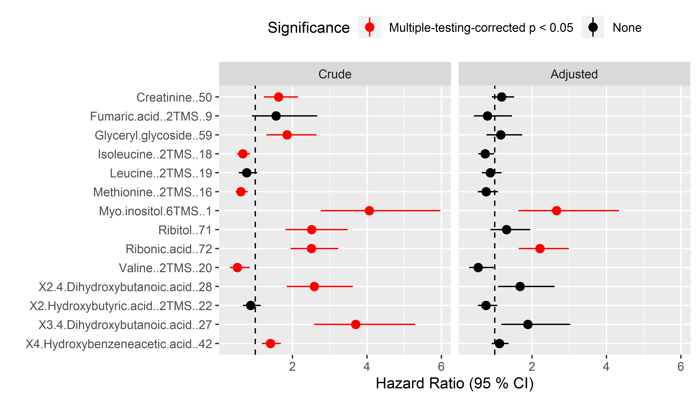<!-- -->

## Step 3D: End-Stage Renal Disease

### Crude Model

``` r
names.tested <- 
  rownames( result.kidney.crude[ result.kidney.crude$"p.adj" < 0.05, ] )

names.model <- NULL

data.survival <- 
  data.frame( 
    data, 
    stringsAsFactors = FALSE, 
    check.names = TRUE
  )

data.survival <- 
  data.survival[ ,
                 c(
                   names.model, 
                   colnames( data.follow.up )[ colnames( data.follow.up ) != "id_profil" ], 
                   names.tested
                 )
                 ]

colnames( data.survival ) <- make.names( names=colnames( data.survival ) )

for ( i in 1:length( names.tested ) ) {

  name.i <- names.tested[ i ]
  
  model.survival <-
    survival::coxph(
      formula =
        as.formula(
          paste(
            "survival::Surv( time = t_ESRD_profil, event = censor_ESRD_profil == 0 ) ~",
            name.i
          )
        ), 
      data = data.survival
    )

  tmp <- summary( model.survival )
  
  if ( i == 1 ) {
    
    result.survival <- 
      array( 
        dim = 
          c(
            length( names.tested ),
            ncol( tmp$"coefficients" )
          )
      )
    
    rownames( result.survival ) <- names.tested
    colnames( result.survival ) <- colnames( tmp$"coefficients" )
    
    result.survival.CI <- array( dim = c( length( names.tested ), 2 ) )
    rownames( result.survival.CI ) <- names.tested
    colnames( result.survival.CI ) <- c( "lower .95", "upper .95" )
    
  }
  
  result.survival[ name.i, ] <- tmp$"coefficients"[ name.i, ]
  
  result.survival.CI[ name.i, ] <- 
    tmp$"conf.int"[ name.i, c( "lower .95", "upper .95" ) ]
  
}

result.survival <- 
  data.frame(
    result.survival,
    result.survival.CI,
    check.names = FALSE
  )

result.survival$"p.adj" <- p.adjust( p=result.survival$"Pr(>|z|)" )
```

#### Table

``` r
table.result.printed <- result.4.esrd.crude <- result.survival

table.result.printed <- 
  table.result.printed[ 
    order( 
      table.result.printed$"Pr(>|z|)", 
      decreasing = FALSE
    ), ]

table.result.printed <- signif( x = table.result.printed, digits = 3 )
  
table.result.printed$"Name" <- rownames( table.result.printed )
  
table.result.printed <- 
  table.result.printed[ , 
                        c(
                          "Name",
                          "exp(coef)",
                          "lower .95",
                          "upper .95",
                          "Pr(>|z|)",
                          "p.adj"
                        ) ]
  
print(
  knitr::kable(
    x = table.result.printed,
    row.names = FALSE,
    caption = "Crude survival model for end-stage renal disease."
  )
)
```

    ## 
    ## 
    ## Table: Crude survival model for end-stage renal disease.
    ## 
    ## Name                                exp(coef)   lower .95   upper .95   Pr(>|z|)      p.adj
    ## ---------------------------------  ----------  ----------  ----------  ---------  ---------
    ## Myo.inositol.6TMS..1                    8.310       3.930      17.500   0.00e+00   4.00e-07
    ## X3.4.Dihydroxybutanoic.acid..27         7.360       3.530      15.400   1.00e-07   1.40e-06
    ## Ribonic.acid..72                        3.870       2.310       6.500   3.00e-07   3.70e-06
    ## X2.4.Dihydroxybutanoic.acid..28         6.300       3.100      12.800   3.00e-07   3.80e-06
    ## Creatinine..50                          3.760       2.140       6.600   4.10e-06   4.08e-05
    ## X4.Hydroxybenzeneacetic.acid..42        2.490       1.680       3.680   4.90e-06   4.42e-05
    ## Ribitol..71                             4.000       2.070       7.710   3.66e-05   2.92e-04
    ## Glyceryl.glycoside..59                  4.000       1.880       8.510   3.28e-04   2.29e-03
    ## X2.Hydroxybutyric.acid..2TMS..22        0.492       0.326       0.740   6.69e-04   4.01e-03
    ## Methionine..2TMS..16                    0.500       0.307       0.813   5.23e-03   2.61e-02
    ## Isoleucine..2TMS..18                    0.576       0.383       0.868   8.34e-03   3.34e-02
    ## Fumaric.acid..2TMS..9                   4.310       1.450      12.800   8.58e-03   3.34e-02
    ## Valine..2TMS..20                        0.340       0.137       0.840   1.94e-02   3.88e-02
    ## Leucine..2TMS..19                       0.557       0.333       0.931   2.56e-02   3.88e-02

#### Forest Plot

``` r
result.survival <- 
  data.frame( 
    result.survival, 
    Name = rownames( result.survival )
  )

plot <- 
  ggplot2::ggplot( data = result.survival, 
                   mapping = ggplot2::aes( x = Name, y = exp.coef., 
                                           ymin = lower..95, ymax = upper..95 ) ) +
  ggplot2::geom_pointrange() + 
  ggplot2::geom_hline( yintercept = 1, lty = "dashed" ) +
  ggplot2::coord_flip() +
  ggplot2::ylab( label = "Hazard Ratio (95 % CI)" ) +
  ggplot2::xlab( label = "" )

print( plot )
```

<!-- -->

### Adjusted Model

``` r
names.tested <-
  rownames( result.kidney.crude[ result.kidney.crude$"p.adj" < 0.05, ] )

names.model <- 
  c( 
    "logUAER",
    "egfr",
    "Age",
    "Gender",
    "Hba1c_baseline",
    "CALSBP",
    "bmi",
    "Smoking",
    "Statin",
    "log_Blood_TGA",
    "Total_cholesterol"
  )

data.survival <- 
  data.frame( 
    data, 
    stringsAsFactors = FALSE, 
    check.names = TRUE
  )

data.survival <- 
  data.survival[ , 
                 c(
                   names.model, 
                   colnames( data.follow.up )[ colnames( data.follow.up ) != "id_profil" ], 
                   names.tested
                 ) ]

for ( i in 1:length( names.tested ) ) {

  name.i <- names.tested[ i ]
  
  model.survival <-
    survival::coxph(
      formula =
        as.formula(
          paste(
            "survival::Surv( time = t_ESRD_profil, event = censor_ESRD_profil == 0 ) ~",
            name.i,
            "+ logUAER",
            "+ egfr",
            "+ Age",
            "+ Gender",
            "+ Hba1c_baseline",
            "+ CALSBP",
            "+ bmi",
            "+ Smoking",
            "+ Statin",
            "+ log_Blood_TGA",
            "+ Total_cholesterol"
          )
        ), 
      data = data.survival
    )

  tmp <- summary( model.survival )
  
  if ( i == 1 ) {
    
    result.survival <- 
      array( 
        dim = c(
          length( names.tested ),
          ncol( tmp$"coefficients" )
        )
      )
    
    rownames( result.survival ) <- names.tested
    colnames( result.survival ) <- colnames( tmp$"coefficients" )
    
    result.survival.CI <- array( dim=c( length( names.tested ), 2 ) )
    rownames( result.survival.CI ) <- names.tested
    colnames( result.survival.CI ) <- c( "lower .95", "upper .95" )
    
  }
  
  result.survival[ name.i, ] <- tmp$"coefficients"[ name.i, ]
  
  result.survival.CI[ name.i, ] <- 
    tmp$"conf.int"[ name.i, c( "lower .95", "upper .95" ) ]
  
}

result.survival <- 
  data.frame(
    result.survival,
    result.survival.CI,
    check.names = FALSE
  )

result.survival$"p.adj" <- p.adjust( p=result.survival$"Pr(>|z|)" )
```

#### Table

``` r
table.result.printed <- result.4.esrd.adjusted <- result.survival

table.result.printed <- 
  table.result.printed[ 
    order( 
      table.result.printed$"Pr(>|z|)", 
      decreasing = FALSE
    ), ]

table.result.printed <- signif( x = table.result.printed, digits = 3 )
  
table.result.printed$"Name" <- rownames( table.result.printed )

table.result.printed <- 
  table.result.printed[ ,
                        c(
                          "Name",
                          "exp(coef)",
                          "lower .95",
                          "upper .95",
                          "Pr(>|z|)",
                          "p.adj"
                        ) ]
  
print(
  knitr::kable(
    x = table.result.printed,
    row.names = FALSE,
    caption = "Adjusted survival model for end-stage renal disease."
  )
)
```

    ## 
    ## 
    ## Table: Adjusted survival model for end-stage renal disease.
    ## 
    ## Name                                exp(coef)   lower .95   upper .95   Pr(>|z|)   p.adj
    ## ---------------------------------  ----------  ----------  ----------  ---------  ------
    ## Ribitol..71                             0.459       0.222       0.946     0.0349   0.489
    ## Methionine..2TMS..16                    0.606       0.320       1.150     0.1250   1.000
    ## Valine..2TMS..20                        0.423       0.126       1.420     0.1640   1.000
    ## X4.Hydroxybenzeneacetic.acid..42        0.664       0.373       1.180     0.1640   1.000
    ## X2.Hydroxybutyric.acid..2TMS..22        0.699       0.360       1.360     0.2900   1.000
    ## Isoleucine..2TMS..18                    0.778       0.467       1.290     0.3330   1.000
    ## Fumaric.acid..2TMS..9                   1.770       0.443       7.090     0.4180   1.000
    ## Leucine..2TMS..19                       0.840       0.546       1.290     0.4280   1.000
    ## Glyceryl.glycoside..59                  0.705       0.284       1.750     0.4500   1.000
    ## Creatinine..50                          0.890       0.561       1.410     0.6210   1.000
    ## X3.4.Dihydroxybutanoic.acid..27         1.260       0.421       3.780     0.6770   1.000
    ## Ribonic.acid..72                        0.878       0.434       1.770     0.7170   1.000
    ## Myo.inositol.6TMS..1                    0.978       0.310       3.080     0.9700   1.000
    ## X2.4.Dihydroxybutanoic.acid..28         0.991       0.331       2.960     0.9870   1.000

#### Forest Plot

``` r
result.survival <- 
  data.frame( 
    result.survival, 
    Name = rownames( result.survival )
  )

plot <- 
  ggplot2::ggplot( data = result.survival, 
                   mapping = ggplot2::aes( x = Name, y = exp.coef., 
                                           ymin = lower..95, ymax = upper..95 ) ) +
  ggplot2::geom_pointrange() + 
  ggplot2::geom_hline( yintercept = 1, lty = "dashed" ) +
  ggplot2::coord_flip() +
  ggplot2::ylab( label = "Hazard Ratio (95 % CI)" ) +
  ggplot2::xlab( label = "" )

print( plot )
```

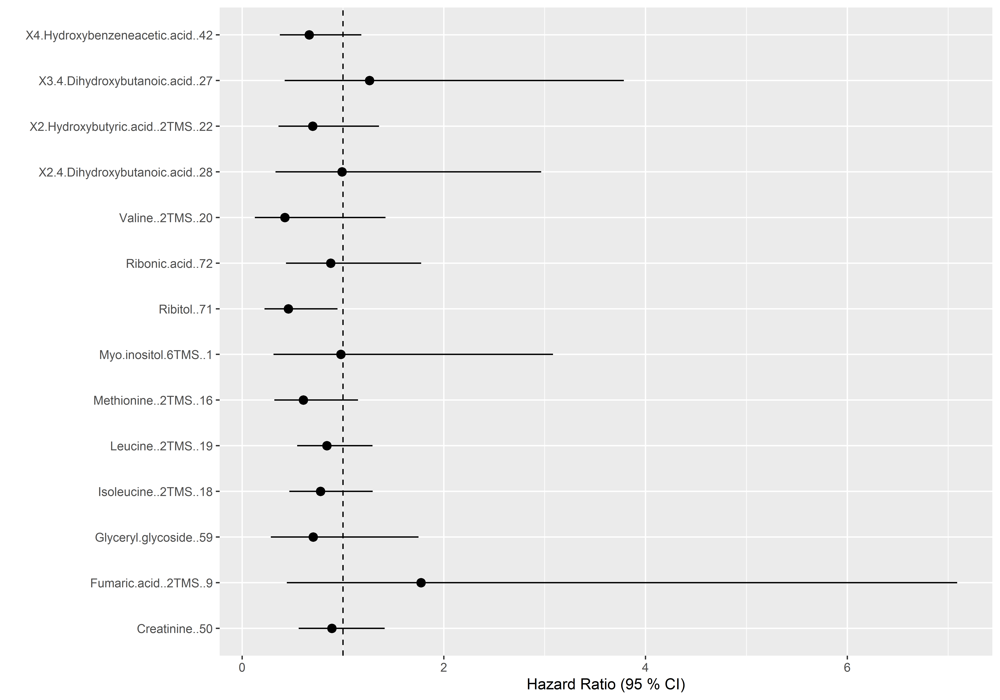<!-- -->

### Combined Forest Plot from Crude and Adjusted Models

``` r
tmp <- result.4.esrd.crude

tmp$"Name" <- rownames( tmp )

tmp$"Model" <- rep( x = "Crude", times = nrow( tmp ) )

data.plot <- tmp

tmp <- result.4.esrd.adjusted

tmp$"Name" <- rownames( tmp )

tmp$"Model" <- rep( x = "Adjusted", times = nrow( tmp ) )

data.plot <- rbind( data.plot, tmp )

data.plot$"Model" <- 
  factor(
    x = data.plot$"Model",
    levels = c( "Crude", "Adjusted" )
  )

data.plot$"Name" <-
  factor( 
    x = data.plot$"Name",
    levels = sort( x = unique( data.plot$"Name" ), decreasing = TRUE )
  )

data.plot$"Significance" <- rep( x = "None", times = nrow( data.plot ) )

data.plot[ data.plot$"p.adj" < 0.05, "Significance" ] <- "Multiple-testing-corrected p < 0.05"

data.plot$"Event" <- 
  rep( x = "End-Stage Renal Disease", times = nrow( data.plot ) )

colnames( data.plot )[ colnames( data.plot ) == "exp(coef)"] <- "HR"

colnames( data.plot ) <- make.names( colnames( data.plot ) )

forest.step4.compilation <- rbind( forest.step4.compilation, data.plot )
```

``` r
plot <-
  ggplot2::ggplot( 
    data = data.plot,
    mapping = 
      ggplot2::aes(
        x = Name,
        y = HR,
        ymin = lower..95,
        ymax = upper..95,
        colour = Significance
      )
  ) +
  ggplot2::geom_pointrange() +
  ggplot2::geom_hline( yintercept = 1, lty = "dashed" ) +
  ggplot2::facet_grid( facets = ~ Model ) +
  ggplot2::scale_colour_manual( values = c( "red", "black" ) ) +
  # ggplot2::scale_colour_manual( values=c( "red", "orange", "black" ) ) +
  ggplot2::coord_flip() +
  ggplot2::theme( legend.position = "top" ) +
  ggplot2::ylab( label = "Hazard Ratio (95 % CI)" ) +
  ggplot2::xlab( label = "" )

print( plot )
```

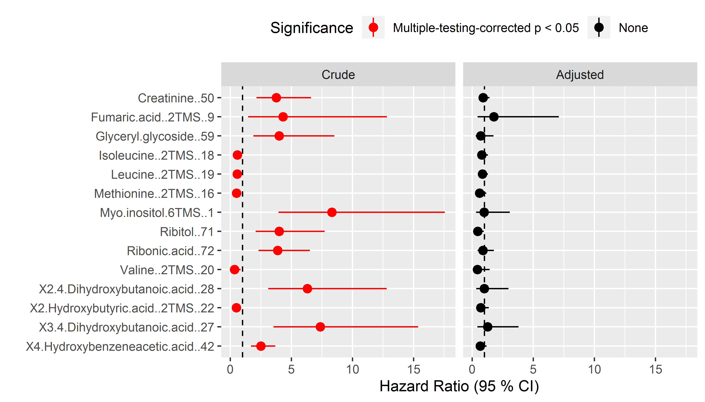<!-- -->

## Compilation Forest Plot from Steps 3A-D

``` r
forest.step4.compilation$"Name.character" <- 
  as.character( forest.step4.compilation$"Name" )

forest.step4.compilation$"Name" <- 
  names.mapping[ forest.step4.compilation$"Name.character", "Cleaned" ]
 
forest.step4.compilation$"Name" <-
  factor( 
    x = forest.step4.compilation$"Name",
    levels = 
      sort( 
        x = unique( x = forest.step4.compilation$"Name" ), 
        decreasing = TRUE
      )
  )

forest.step4.compilation$"Significance" <-
  factor(
    x = forest.step4.compilation$"Significance",
    levels = c( "Multiple-testing-corrected p < 0.05", "None" )
  )

plot <-
  ggplot2::ggplot(
    data = forest.step4.compilation,
    mapping =
      ggplot2::aes(
        x = Name,
        y = HR,
        ymin = lower..95,
        ymax = upper..95,
        colour = Significance
      )
  ) +
  ggplot2::geom_pointrange() +
  ggplot2::geom_hline( yintercept = 1, lty = "dashed" ) +
  ggplot2::facet_grid( facets = Event ~ Model ) +
  ggplot2::scale_colour_manual( values = c( "red", "black" ), drop = FALSE ) +
  # ggplot2::scale_colour_manual( values=c( "red", "orange", "black" ), drop=FALSE ) +
  ggplot2::scale_x_discrete( drop = FALSE ) +
  ggplot2::coord_flip() +
  ggplot2::theme( legend.position = "top" ) +
  ggplot2::ylab( label = "Hazard Ratio (95 % CI)" ) +
  ggplot2::xlab( label = "" )

print( plot )
```

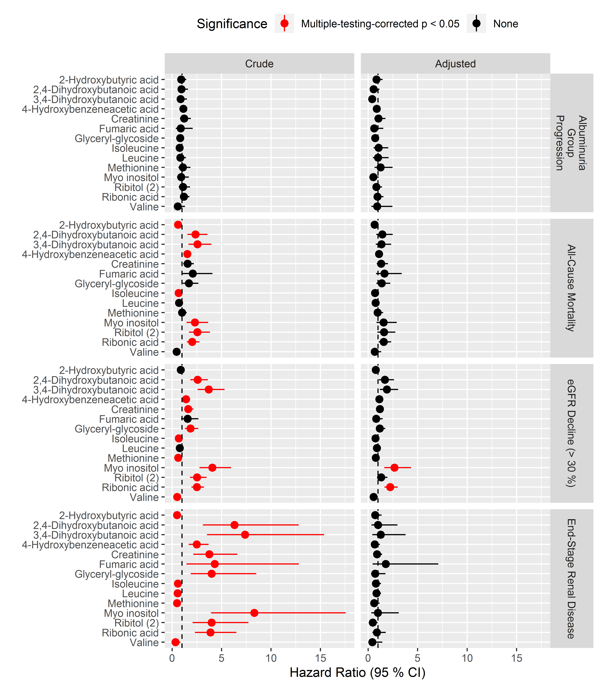<!-- -->

``` r
plot <- plot + ggplot2::scale_y_log10()

print( plot )
```

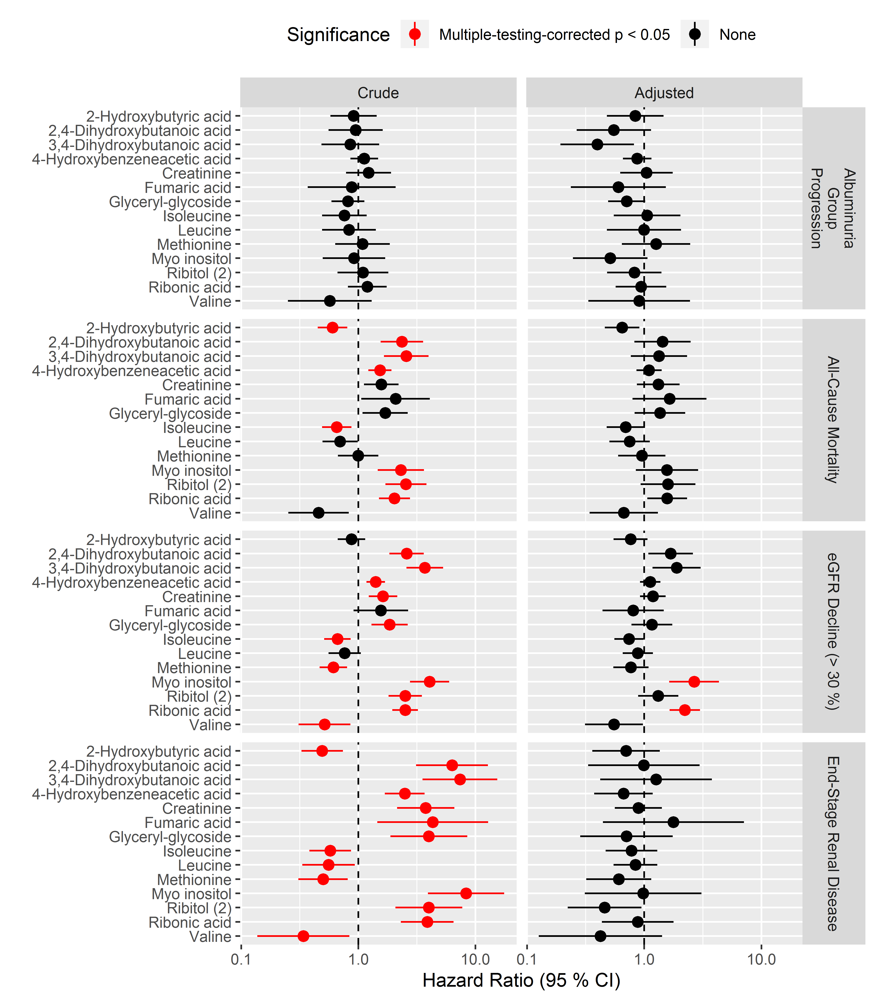<!-- -->

``` r
forest.step4.compilation <- 
  forest.step4.compilation[ 
    forest.step4.compilation$"Event" != "Albuminuria\nGroup\nProgression", ]

plot <-
  ggplot2::ggplot( 
    data = forest.step4.compilation,
    mapping = 
      ggplot2::aes( 
        x = Name,
        y = HR,
        ymin = lower..95,
        ymax = upper..95,
        colour = Significance
      )
  ) +
  ggplot2::geom_pointrange() +
  ggplot2::geom_hline( yintercept = 1, lty = "dashed" ) +
  ggplot2::facet_grid( facets = Event ~ Model ) +
  ggplot2::scale_colour_manual( values = c( "red", "black" ), drop = FALSE ) +
  # ggplot2::scale_colour_manual( values=c( "red", "orange", "black" ), drop=FALSE ) +
  ggplot2::scale_x_discrete( drop = FALSE ) +
  ggplot2::coord_flip() +
  ggplot2::theme( legend.position = "top" ) +
  ggplot2::ylab( label = "Hazard Ratio (95 % CI)" ) +
  ggplot2::xlab( label = "" )

print( plot )
```

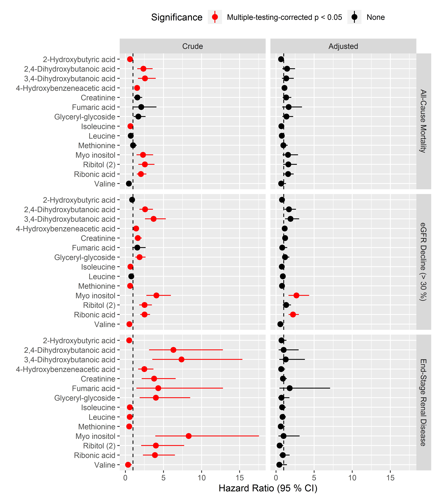<!-- -->

``` r
plot <- plot + ggplot2::scale_y_log10()

print( plot )
```

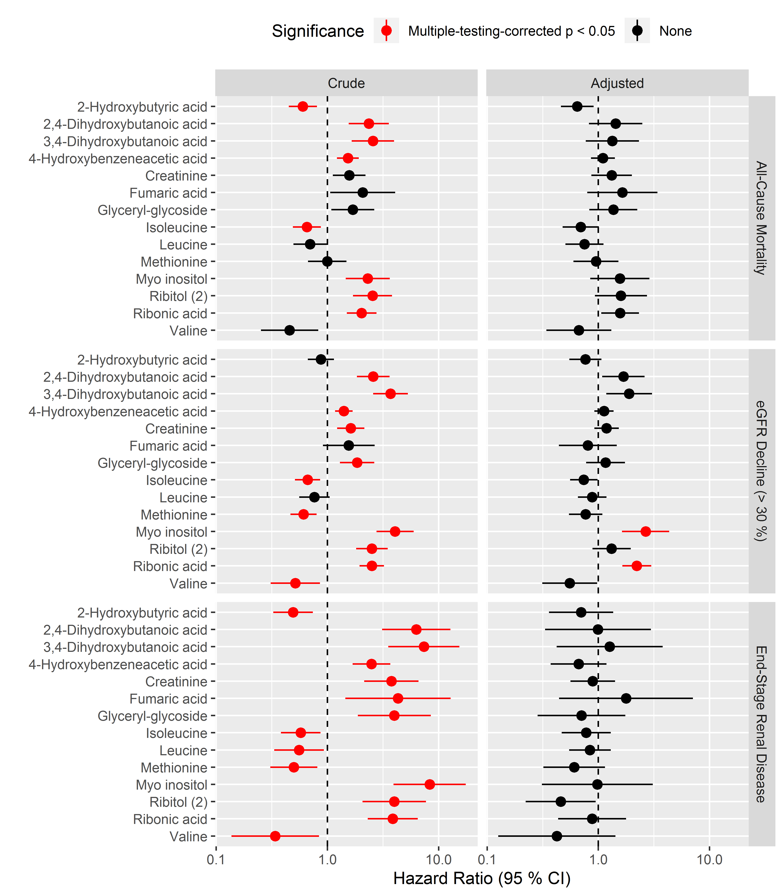<!-- -->

# Step 4: Detailed Assessment of the Top-Metabolites in Relation to Outcomes

## Step 4.1: First Top-Metabolite in Relation to eGFR Decline

### Step 4.1A: Analysis of Full Cohort

#### Survival Model with Details

``` r
names.model <-
  data.frame( 
    original = 
      c( 
        "Age", 
        "bmi", 
        "CALSBP", 
        "Total_cholesterol", 
        "egfr", 
        "Hba1c_baseline",
        "Statin", 
        "Gender", 
        "Smoking", 
        "log_Blood_TGA", 
        "logUAER"
      ),
    cleaned = 
      c( 
        "Age", 
        "BMI", 
        "BP_Systolic", 
        "Cholesterol", 
        "eGFR", 
        "HbA1c",  
        "Medication_Statins", 
        "Sex", 
        "Smoking", 
        "TG_total_log", 
        "UAER_log"
      ),
    stringsAsFactors = FALSE
  )
              
names.model.cleaned <- names.model

data.survival <-
  data.frame(
    data,
    stringsAsFactors = FALSE,
    check.names = TRUE
  )

data.survival <- 
  data.survival[ , 
                 c(
                   names.model$original, 
                   colnames( data.follow.up )[ colnames( data.follow.up ) != "id_profil" ], 
                   "Ribonic.acid..72"
                 ) ]

colnames( data.survival )[ match( x = names.model$"original", table = colnames( data.survival ) ) ] <- 
  names.model$"cleaned"

colnames( data.survival ) <- make.names( names=colnames( data.survival ) )

data.survival$"censor_gfrfald30_p.reversed" <- 
  factor(
    x = as.character( data.survival$"censor_gfrfald30_p" ), 
    levels = c( 2, 0 ), 
    labels = c( "eos/udvandring i profil" , "event" )
  )

data.survival$"censor_gfrfald30_p.reversed.numeric" <-
  as.numeric( data.survival$"censor_gfrfald30_p.reversed" ) - 1

colnames( data.survival )[ colnames( data.survival ) == "Ribonic.acid..72" ] <-
  "Ribonic_acid"

model.survival <-
  survival::coxph(
    formula =
      survival::Surv(
        time = t_gfrfald30_p, 
        event = censor_gfrfald30_p.reversed.numeric
      )
    ~ 
      Ribonic_acid +
      Age +
      BMI + 
      BP_Systolic + 
      Cholesterol + 
      eGFR + 
      HbA1c +
      Medication_Statins +
      Sex +  
      Smoking + 
      TG_total_log +
      UAER_log, 
    data = data.survival
  )

print( summary( model.survival ) )
```

    ## Call:
    ## survival::coxph(formula = survival::Surv(time = t_gfrfald30_p, 
    ##     event = censor_gfrfald30_p.reversed.numeric) ~ Ribonic_acid + 
    ##     Age + BMI + BP_Systolic + Cholesterol + eGFR + HbA1c + Medication_Statins + 
    ##     Sex + Smoking + TG_total_log + UAER_log, data = data.survival)
    ## 
    ##   n= 586, number of events= 87 
    ##    (51 observations deleted due to missingness)
    ## 
    ##                         coef exp(coef)  se(coef)      z Pr(>|z|)    
    ## Ribonic_acid        0.795932  2.216505  0.152741  5.211 1.88e-07 ***
    ## Age                -0.013717  0.986377  0.012771 -1.074 0.282806    
    ## BMI                -0.004863  0.995149  0.029311 -0.166 0.868227    
    ## BP_Systolic         0.025752  1.026086  0.006728  3.828 0.000129 ***
    ## Cholesterol         0.166837  1.181562  0.132443  1.260 0.207782    
    ## eGFR               -0.008983  0.991057  0.004990 -1.800 0.071824 .  
    ## HbA1c               0.421594  1.524389  0.084607  4.983 6.26e-07 ***
    ## Medication_Statins  0.631948  1.881271  0.312823  2.020 0.043368 *  
    ## Sex                 0.160840  1.174496  0.241443  0.666 0.505309    
    ## Smoking             0.520134  1.682253  0.259836  2.002 0.045309 *  
    ## TG_total_log       -0.133156  0.875328  0.156426 -0.851 0.394635    
    ## UAER_log            0.250605  1.284803  0.049331  5.080 3.77e-07 ***
    ## ---
    ## Signif. codes:  0 '***' 0.001 '**' 0.01 '*' 0.05 '.' 0.1 ' ' 1
    ## 
    ##                    exp(coef) exp(-coef) lower .95 upper .95
    ## Ribonic_acid          2.2165     0.4512    1.6431     2.990
    ## Age                   0.9864     1.0138    0.9620     1.011
    ## BMI                   0.9951     1.0049    0.9396     1.054
    ## BP_Systolic           1.0261     0.9746    1.0126     1.040
    ## Cholesterol           1.1816     0.8463    0.9114     1.532
    ## eGFR                  0.9911     1.0090    0.9814     1.001
    ## HbA1c                 1.5244     0.6560    1.2915     1.799
    ## Medication_Statins    1.8813     0.5316    1.0190     3.473
    ## Sex                   1.1745     0.8514    0.7317     1.885
    ## Smoking               1.6823     0.5944    1.0109     2.799
    ## TG_total_log          0.8753     1.1424    0.6442     1.189
    ## UAER_log              1.2848     0.7783    1.1664     1.415
    ## 
    ## Concordance= 0.856  (se = 0.032 )
    ## Rsquare= 0.25   (max possible= 0.828 )
    ## Likelihood ratio test= 168.2  on 12 df,   p=0
    ## Wald test            = 148.9  on 12 df,   p=0
    ## Score (logrank) test = 193  on 12 df,   p=0

##### Forest Plot with Clinical Variables

``` r
forest.RA <- 
  survminer::ggforest( 
    model = model.survival, 
    main="Hazard Ratios for eGFR decline > 30 %"
  )
```

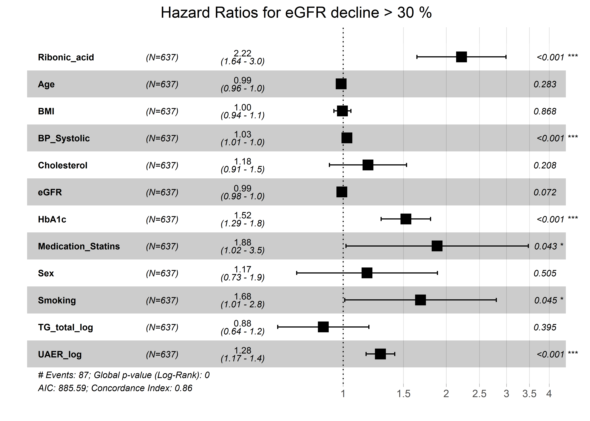<!-- -->

``` r
# print( forest.RA )
```

##### Diagnostics of the Survival Model

``` r
survminer::ggsurvplot( 
  fit = survival::survfit( formula = model.survival ), 
  data = data.survival
)
```

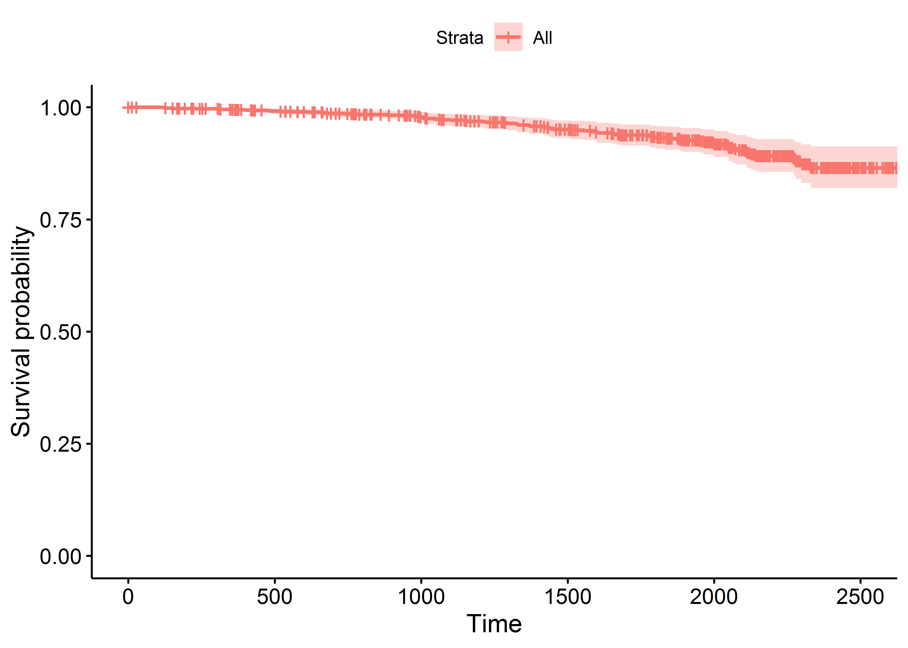<!-- -->

``` r
survminer::ggcoxdiagnostics(
  fit = model.survival, 
  type = "schoenfeld", 
  ox.scale = "time"
)
```

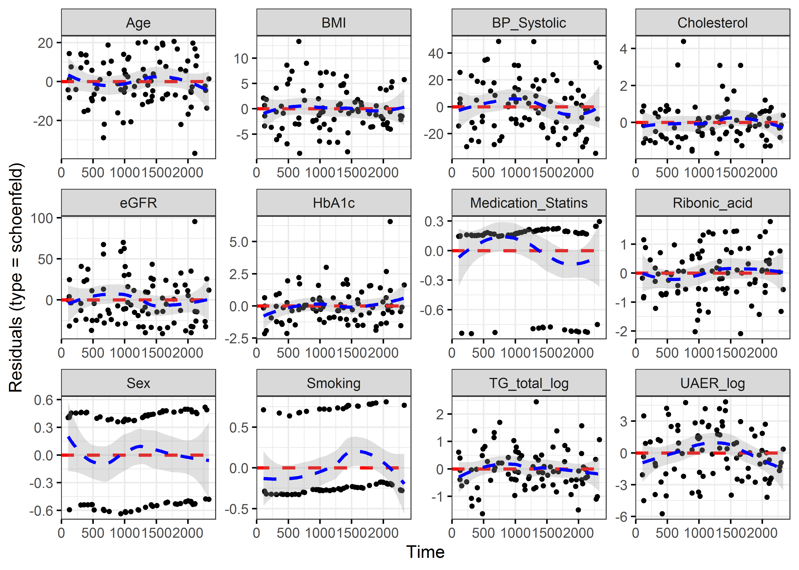<!-- -->

##### Kaplan-Maier Curve with Median Cutpoint

``` r
data.km <- data.survival

data.km$"Ribonic_acid" <-
  cut( 
    x = data.km$"Ribonic_acid",
    breaks = c( -Inf, median( data.km$"Ribonic_acid", na.rm=TRUE ), Inf ),
    labels = c( " <50%", " >50%" )
  )

data.km$"Ribonic_acid" <- relevel( x = data.km$"Ribonic_acid", ref = " >50%" )

model.km <- 
  survival::survfit(
    survival::Surv(
      time = t_gfrfald30_p, 
      event = censor_gfrfald30_p.reversed.numeric
    )
    ~ 
      Ribonic_acid, 
    data = data.km
  )

plot <-
  survminer::ggsurvplot( 
    fit = model.km, 
    data = data.km, 
    ggtheme = ggplot2::theme_minimal(),
    palette = "Set1",
    risk.table = TRUE, 
    cumevents = TRUE,
    pval = FALSE,
    risk.table.height = 0.15, 
    cumevents.height = 0.15,
    conf.int = TRUE
  )

plot$"table" <- plot$"table" + survminer::theme_cleantable()
plot$"cumevents" <- plot$"cumevents" + survminer::theme_cleantable()

print( plot )
```

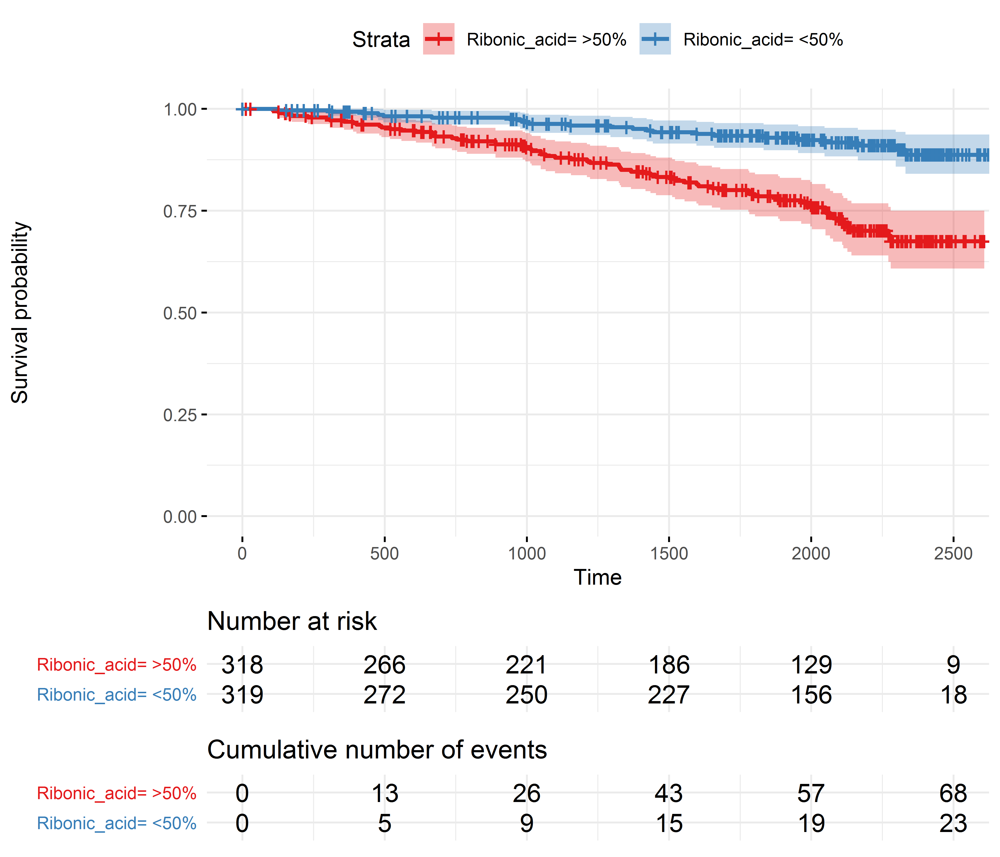<!-- -->

``` r
plot.km.Ribonic.acid <- plot
```

### Step 4.1B: Analysis of a Blood Pressure, HbA1c and logUAER-Matched Subcohort

``` r
idx.case <- 
  which( 
    data.survival$"censor_gfrfald30_p.reversed" == "event" &
      apply( 
        X = !is.na( 
          data.survival[ , 
                         c(
                           "Ribonic_acid", 
                           "censor_gfrfald30_p.reversed", 
                           names.model$"cleaned"
                         )
                         ]
        ), 
        MAR = 1,
        FUN = all
      )
  )

idx.matched.control <- NULL

idx.pool <- 
  which(
    data.survival$"censor_gfrfald30_p.reversed" == "eos/udvandring i profil" &
      apply(
        X = !is.na(
          data.survival[ ,
                         c(
                           "Ribonic_acid", 
                           "censor_gfrfald30_p.reversed", 
                           names.model$"cleaned"
                         )
                         ]
        ), 
        MAR = 1,
        FUN = all
      )
  )

names.matching.variables <- c( "BP_Systolic", "HbA1c", "UAER_log" )

S <- 
  cov(
    x = data.survival[ idx.pool, names.matching.variables ],
    use = "pairwise.complete.obs"
  )

tmp <- idx.pool
  
for ( i in 1:length( idx.case ) ) {
  
  tmp2 <- 
    stats::mahalanobis( 
      x = data.survival[ tmp, names.matching.variables ], 
      center = unlist( data.survival[ idx.case[ i ], names.matching.variables ] ),
      cov = S,
      inverted = FALSE
    )
  
  tmp2 <- which.min( tmp2 )
  
  idx.matched.control <- c( idx.matched.control, tmp[ tmp2 ] )
  
  tmp <- tmp[ -tmp2 ]
  
}

ggplot2::qplot( 
  x = data.survival[ idx.case, "BP_Systolic"], 
  y = data.survival[ idx.matched.control, "BP_Systolic" ], 
  color = data.survival[ idx.case, "Sex" ]
)
```

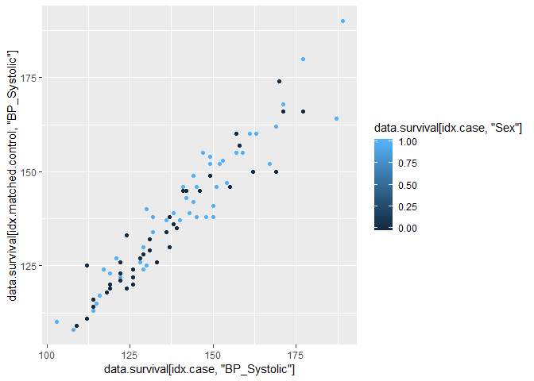<!-- -->

``` r
ggplot2::qplot(
  x = data.survival[ idx.case, "HbA1c"], 
  y = data.survival[ idx.matched.control, "HbA1c" ], 
  color = data.survival[ idx.case, "Sex" ]
)
```

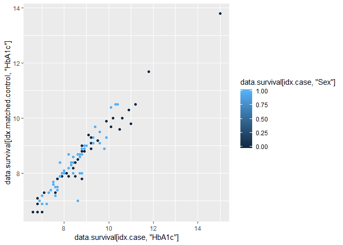<!-- -->

``` r
ggplot2::qplot(
  x = data.survival[ idx.case, "UAER_log"], 
  y = data.survival[ idx.matched.control, "UAER_log" ], 
  color = data.survival[ idx.case, "Sex" ]
)
```

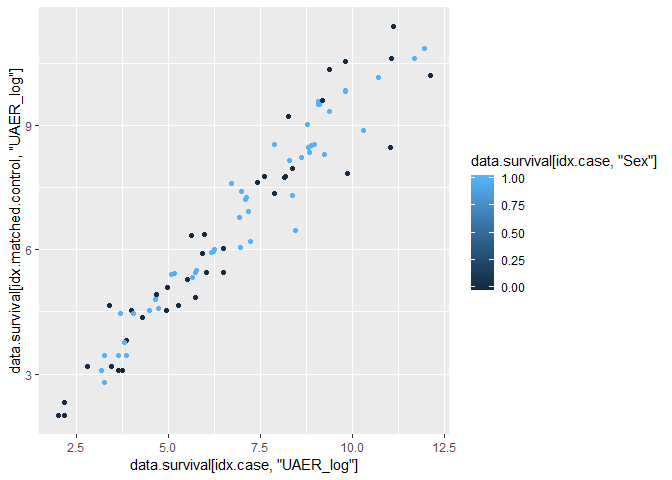<!-- -->

``` r
t.test( 
  x = data.survival[ idx.case, "BP_Systolic" ],
  y = data.survival[ idx.matched.control, "BP_Systolic" ],
  paired = TRUE
)
```

    ## 
    ##  Paired t-test
    ## 
    ## data:  data.survival[idx.case, "BP_Systolic"] and data.survival[idx.matched.control, "BP_Systolic"]
    ## t = 1.9697, df = 86, p-value = 0.05209
    ## alternative hypothesis: true difference in means is not equal to 0
    ## 95 percent confidence interval:
    ##  -0.01150946  2.49426809
    ## sample estimates:
    ## mean of the differences 
    ##                1.241379

``` r
t.test(
  x = data.survival[ idx.case, "HbA1c" ],
  y = data.survival[ idx.matched.control, "HbA1c" ],
  paired = TRUE
)
```

    ## 
    ##  Paired t-test
    ## 
    ## data:  data.survival[idx.case, "HbA1c"] and data.survival[idx.matched.control, "HbA1c"]
    ## t = 3.5465, df = 86, p-value = 0.0006347
    ## alternative hypothesis: true difference in means is not equal to 0
    ## 95 percent confidence interval:
    ##  0.06465628 0.22959659
    ## sample estimates:
    ## mean of the differences 
    ##               0.1471264

``` r
t.test( 
  x = data.survival[ idx.case, "UAER_log" ],
  y = data.survival[ idx.matched.control, "UAER_log" ],
  paired = TRUE
)
```

    ## 
    ##  Paired t-test
    ## 
    ## data:  data.survival[idx.case, "UAER_log"] and data.survival[idx.matched.control, "UAER_log"]
    ## t = 2.6454, df = 86, p-value = 0.0097
    ## alternative hypothesis: true difference in means is not equal to 0
    ## 95 percent confidence interval:
    ##  0.04758177 0.33532528
    ## sample estimates:
    ## mean of the differences 
    ##               0.1914535

``` r
data.survival.stratified <- data.survival[ c( idx.case, idx.matched.control ), ]

summary(
  glm(
    formula =
      censor_gfrfald30_p.reversed.numeric ~ 
      Ribonic_acid + 
      Age +
      BMI + 
      BP_Systolic + 
      Cholesterol + 
      eGFR + 
      HbA1c +
      Medication_Statins +
      Sex +  
      Smoking + 
      TG_total_log +
      UAER_log, 
    data = data.survival.stratified
  )
)
```

    ## 
    ## Call:
    ## glm(formula = censor_gfrfald30_p.reversed.numeric ~ Ribonic_acid + 
    ##     Age + BMI + BP_Systolic + Cholesterol + eGFR + HbA1c + Medication_Statins + 
    ##     Sex + Smoking + TG_total_log + UAER_log, data = data.survival.stratified)
    ## 
    ## Deviance Residuals: 
    ##     Min       1Q   Median       3Q      Max  
    ## -0.8455  -0.4372   0.1147   0.4262   0.8077  
    ## 
    ## Coefficients:
    ##                      Estimate Std. Error t value Pr(>|t|)    
    ## (Intercept)        -4.0993491  1.1131140  -3.683 0.000315 ***
    ## Ribonic_acid        0.1837293  0.0452519   4.060 7.64e-05 ***
    ## Age                -0.0030646  0.0037464  -0.818 0.414560    
    ## BMI                 0.0072583  0.0098849   0.734 0.463844    
    ## BP_Systolic         0.0017581  0.0022430   0.784 0.434311    
    ## Cholesterol         0.0735053  0.0449518   1.635 0.103961    
    ## eGFR                0.0003542  0.0015430   0.230 0.818732    
    ## HbA1c               0.0228773  0.0322882   0.709 0.479639    
    ## Medication_Statins  0.1708596  0.0954080   1.791 0.075199 .  
    ## Sex                -0.0138969  0.0793396  -0.175 0.861176    
    ## Smoking            -0.0090528  0.0889141  -0.102 0.919030    
    ## TG_total_log       -0.0582056  0.0653695  -0.890 0.374575    
    ## UAER_log           -0.0092884  0.0175963  -0.528 0.598322    
    ## ---
    ## Signif. codes:  0 '***' 0.001 '**' 0.01 '*' 0.05 '.' 0.1 ' ' 1
    ## 
    ## (Dispersion parameter for gaussian family taken to be 0.2334169)
    ## 
    ##     Null deviance: 43.50  on 173  degrees of freedom
    ## Residual deviance: 37.58  on 161  degrees of freedom
    ## AIC: 255.12
    ## 
    ## Number of Fisher Scoring iterations: 2

``` r
summary(
  lm(
    formula =
      Ribonic_acid ~ 
      censor_gfrfald30_p.reversed.numeric + 
      Age +
      BMI + 
      BP_Systolic + 
      Cholesterol + 
      eGFR + 
      HbA1c +
      Medication_Statins +
      Sex +  
      Smoking + 
      TG_total_log +
      UAER_log, 
    data = data.survival.stratified
  )
)
```

    ## 
    ## Call:
    ## lm(formula = Ribonic_acid ~ censor_gfrfald30_p.reversed.numeric + 
    ##     Age + BMI + BP_Systolic + Cholesterol + eGFR + HbA1c + Medication_Statins + 
    ##     Sex + Smoking + TG_total_log + UAER_log, data = data.survival.stratified)
    ## 
    ## Residuals:
    ##      Min       1Q   Median       3Q      Max 
    ## -3.12668 -0.50130  0.06296  0.56076  1.76793 
    ## 
    ## Coefficients:
    ##                                      Estimate Std. Error t value Pr(>|t|)
    ## (Intercept)                         21.594329   0.894405  24.144  < 2e-16
    ## censor_gfrfald30_p.reversed.numeric  0.505526   0.124509   4.060 7.64e-05
    ## Age                                  0.013026   0.006142   2.121   0.0355
    ## BMI                                 -0.007618   0.016413  -0.464   0.6432
    ## BP_Systolic                         -0.004314   0.003712  -1.162   0.2469
    ## Cholesterol                         -0.131182   0.074467  -1.762   0.0800
    ## eGFR                                -0.014280   0.002299  -6.211 4.32e-09
    ## HbA1c                                0.027012   0.053599   0.504   0.6150
    ## Medication_Statins                  -0.332646   0.157662  -2.110   0.0364
    ## Sex                                  0.038533   0.131583   0.293   0.7700
    ## Smoking                              0.024815   0.147479   0.168   0.8666
    ## TG_total_log                         0.166543   0.107903   1.543   0.1247
    ## UAER_log                             0.012077   0.029198   0.414   0.6797
    ##                                        
    ## (Intercept)                         ***
    ## censor_gfrfald30_p.reversed.numeric ***
    ## Age                                 *  
    ## BMI                                    
    ## BP_Systolic                            
    ## Cholesterol                         .  
    ## eGFR                                ***
    ## HbA1c                                  
    ## Medication_Statins                  *  
    ## Sex                                    
    ## Smoking                                
    ## TG_total_log                           
    ## UAER_log                               
    ## ---
    ## Signif. codes:  0 '***' 0.001 '**' 0.01 '*' 0.05 '.' 0.1 ' ' 1
    ## 
    ## Residual standard error: 0.8014 on 161 degrees of freedom
    ## Multiple R-squared:  0.3672, Adjusted R-squared:  0.3201 
    ## F-statistic: 7.787 on 12 and 161 DF,  p-value: 2.516e-11

#### Survival Model with Details

``` r
model.survival <-
  survival::coxph(
    formula =
      survival::Surv(
        time = t_gfrfald30_p, 
        event = censor_gfrfald30_p.reversed.numeric
      ) 
    ~             
      Ribonic_acid +
      Age +
      BMI + 
      BP_Systolic + 
      Cholesterol + 
      eGFR + 
      HbA1c +
      Medication_Statins +
      Sex +  
      Smoking + 
      TG_total_log +
      UAER_log, 
    data = data.survival.stratified
  )

print( summary( model.survival ) )
```

    ## Call:
    ## survival::coxph(formula = survival::Surv(time = t_gfrfald30_p, 
    ##     event = censor_gfrfald30_p.reversed.numeric) ~ Ribonic_acid + 
    ##     Age + BMI + BP_Systolic + Cholesterol + eGFR + HbA1c + Medication_Statins + 
    ##     Sex + Smoking + TG_total_log + UAER_log, data = data.survival.stratified)
    ## 
    ##   n= 174, number of events= 87 
    ## 
    ##                         coef exp(coef)  se(coef)      z Pr(>|z|)    
    ## Ribonic_acid        0.647424  1.910612  0.139489  4.641 3.46e-06 ***
    ## Age                -0.022737  0.977520  0.012590 -1.806   0.0709 .  
    ## BMI                 0.017895  1.018056  0.030824  0.581   0.5615    
    ## BP_Systolic         0.012267  1.012342  0.006593  1.861   0.0628 .  
    ## Cholesterol         0.302785  1.353623  0.141856  2.134   0.0328 *  
    ## eGFR               -0.005625  0.994390  0.004827 -1.165   0.2439    
    ## HbA1c               0.092383  1.096785  0.090216  1.024   0.3058    
    ## Medication_Statins  0.739185  2.094229  0.306796  2.409   0.0160 *  
    ## Sex                 0.074701  1.077561  0.237519  0.315   0.7531    
    ## Smoking             0.340014  1.404967  0.267334  1.272   0.2034    
    ## TG_total_log       -0.245832  0.782054  0.166331 -1.478   0.1394    
    ## UAER_log            0.071898  1.074546  0.049898  1.441   0.1496    
    ## ---
    ## Signif. codes:  0 '***' 0.001 '**' 0.01 '*' 0.05 '.' 0.1 ' ' 1
    ## 
    ##                    exp(coef) exp(-coef) lower .95 upper .95
    ## Ribonic_acid          1.9106     0.5234    1.4536     2.511
    ## Age                   0.9775     1.0230    0.9537     1.002
    ## BMI                   1.0181     0.9823    0.9584     1.081
    ## BP_Systolic           1.0123     0.9878    0.9993     1.026
    ## Cholesterol           1.3536     0.7388    1.0251     1.787
    ## eGFR                  0.9944     1.0056    0.9850     1.004
    ## HbA1c                 1.0968     0.9118    0.9190     1.309
    ## Medication_Statins    2.0942     0.4775    1.1478     3.821
    ## Sex                   1.0776     0.9280    0.6765     1.716
    ## Smoking               1.4050     0.7118    0.8320     2.373
    ## TG_total_log          0.7821     1.2787    0.5645     1.083
    ## UAER_log              1.0745     0.9306    0.9744     1.185
    ## 
    ## Concordance= 0.692  (se = 0.034 )
    ## Rsquare= 0.229   (max possible= 0.988 )
    ## Likelihood ratio test= 45.2  on 12 df,   p=9.511e-06
    ## Wald test            = 40.35  on 12 df,   p=6.3e-05
    ## Score (logrank) test = 41.67  on 12 df,   p=3.786e-05

##### Forest Plot with Clinical Variables

``` r
forest.RA <-
  survminer::ggforest( 
    model = model.survival,
    main = "Hazard Ratios for eGFR decline > 30 %"
  )
```

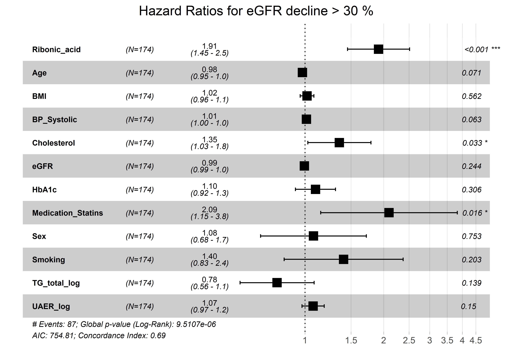<!-- -->

``` r
# print( forest.RA )
```

##### Diagnostics of the Survival Model

``` r
survminer::ggsurvplot(
  fit = survival::survfit( formula = model.survival ), 
  data = data.survival.stratified
)
```

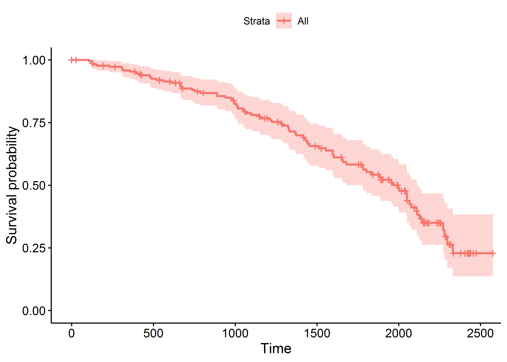<!-- -->

``` r
survminer::ggcoxdiagnostics(
  fit = model.survival, 
  type = "schoenfeld", 
  ox.scale = "time"
)
```

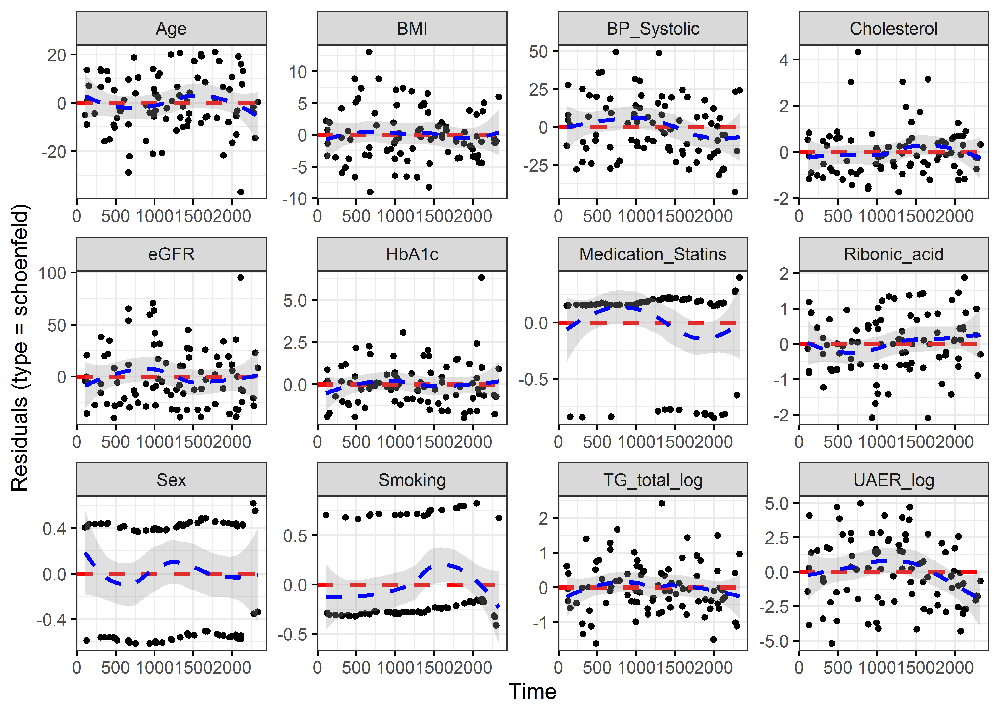<!-- -->

##### Kaplan-Maier Curve with Median Cutpoint

``` r
data.km <- data.survival.stratified

data.km$"Ribonic_acid" <-
  cut(
    x = data.km$"Ribonic_acid",
    breaks = c( -Inf, median( x = data.km$"Ribonic_acid", na.rm = TRUE ), Inf ),
    labels = c( " <50%", " >50%" )
  )

data.km$"Ribonic_acid" <- relevel( x = data.km$"Ribonic_acid", ref = " >50%" )

model.km <-
  survival::survfit(
    survival::Surv(
      time = t_gfrfald30_p,
      event = censor_gfrfald30_p.reversed.numeric
      ) 
    ~
      Ribonic_acid,
    data = data.km
  )

plot <-
  survminer::ggsurvplot( 
    fit = model.km, 
    data = data.km, 
    ggtheme = ggplot2::theme_minimal(),
    palette = "Set1",
    risk.table = TRUE, 
    cumevents = TRUE,
    pval = FALSE,
    risk.table.height = 0.15, 
    cumevents.height = 0.15,
    conf.int = TRUE
  )

plot$"table" <- plot$"table" + survminer::theme_cleantable()
plot$"cumevents" <- plot$"cumevents" + survminer::theme_cleantable()

km.RA <- plot

print( plot )
```

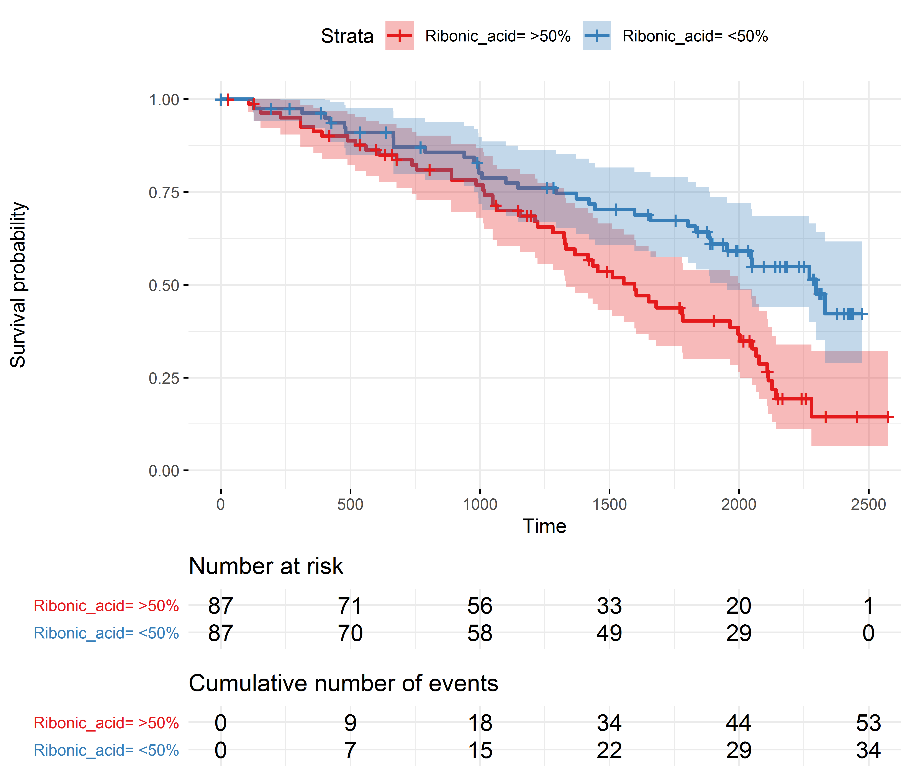<!-- -->

##### Boxplots

``` r
data.plot <- data.survival.stratified

data.plot$"Outcome" <- 
  factor( 
    x = data.plot$"censor_gfrfald30_p", 
    levels = c( "2", "0" ), 
    labels = c( "Censored", "eGFR Decline (> 30 %)" )
  )

ggplot2::ggplot(
  data = data.plot, 
  mapping =
    ggplot2::aes(
      x = Outcome, 
      y = Ribonic_acid
    )
) +
  ggplot2::geom_violin( draw_quantiles = c( 0.25, 0.50, 0.75 ) ) + 
  ggplot2::geom_jitter(
    width = 0.1,
    fill = "black",
    stroke = 0,
    shape = 16,
    size = 2,
    alpha = 0.25
  ) +
  ggplot2::ylab( label = "Ribonic Acid" ) +
  ggplot2::xlab( label = "Outcome" )
```

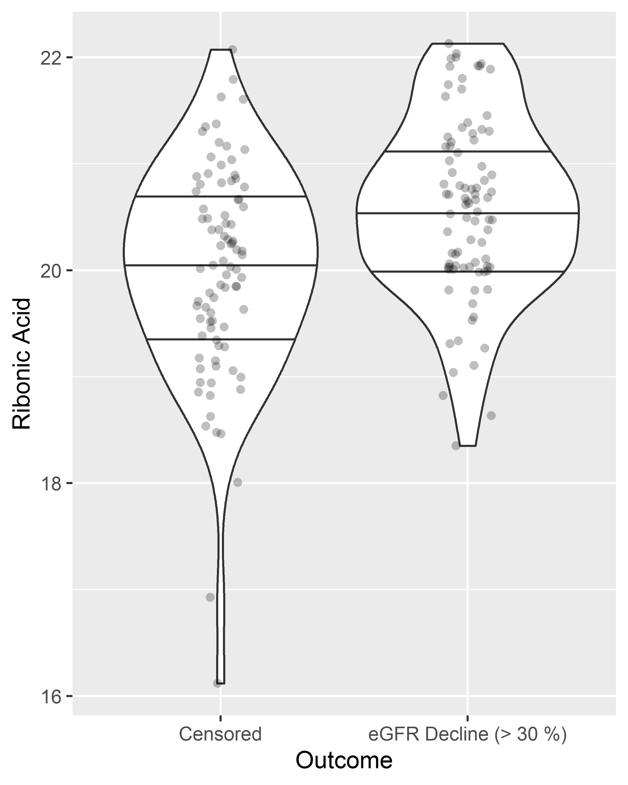<!-- -->

``` r
data.plot$"Gender" <- 
  factor(
    x = data.plot$"Sex", 
    levels = c( 0, 1 ), 
    labels = c( "Female", "Male" )
  )

data.plot$"Outcome.and.Gender" <- 
  base::interaction( data.plot$"Outcome", data.plot$"Gender" )

levels( data.plot$"Outcome.and.Gender" ) <- 
  stringr::str_replace(
    string = levels( data.plot$"Outcome.and.Gender" ), 
    pattern = "\\.",
    replacement = "\n"
  )

ggplot2::ggplot(
  data = data.plot,
  mapping =
    ggplot2::aes(
      x = Outcome.and.Gender, 
      y = Ribonic_acid,
      size = Age, 
      color = Gender
    )
) +
  ggplot2::geom_violin( draw_quantiles = c( 0.25, 0.50, 0.75 ) ) + 
  ggplot2::geom_jitter(
    width = 0.1,
    stroke = 0,
    shape = 16,
    alpha = 0.25
  ) +
  ggplot2::scale_color_brewer( palette = "Dark2", direction = -1 ) +
  ggplot2::ylab( label = "Ribonic Acid" ) +
  ggplot2::xlab( label = "Outcome by Gender" ) +
  ggplot2::theme( legend.position = "top" )
```

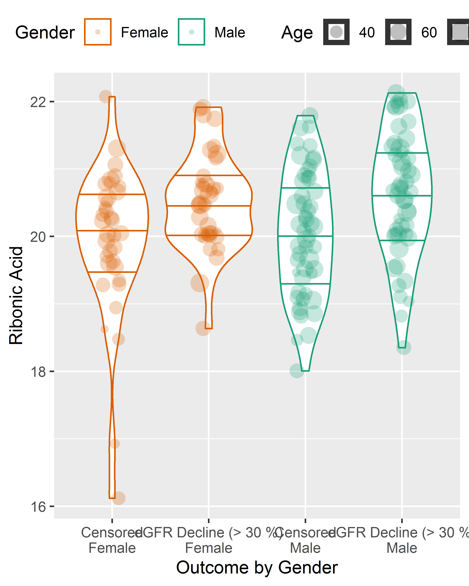<!-- -->

## Step 4.2: Second Top-Metabolite in Relation to eGFR Decline (\> 30 %)

### Step 4.2A: Analysis of Full Cohort

#### Survival Model with Details

``` r
names.model <-
  data.frame( 
    original =
      c(
        "Age", 
        "bmi", 
        "CALSBP", 
        "Total_cholesterol", 
        "egfr", 
        "Hba1c_baseline",
        "Statin", 
        "Gender", 
        "Smoking", 
        "log_Blood_TGA", 
        "logUAER"
      ),
    cleaned =
      c(
        "Age", 
        "BMI", 
        "BP_Systolic", 
        "Cholesterol", 
        "eGFR", 
        "HbA1c", 
        "Medication_Statins", 
        "Sex", 
        "Smoking", 
        "TG_total_log", 
        "UAER_log"
      ),
    stringsAsFactors = FALSE
  )
              
names.model.cleaned <- names.model

data.survival <-
  data.frame(
    data,
    stringsAsFactors = FALSE,
    check.names = TRUE
  )

data.survival <- 
  data.survival[ , 
                 c(
                   names.model$original, 
                   colnames( data.follow.up )[ colnames( data.follow.up ) != "id_profil" ], 
                   "Myo.inositol.6TMS..1"
                 ) ]

colnames( data.survival )[ match( x = names.model$"original", table = colnames( data.survival ) ) ] <-
  names.model$"cleaned"

colnames( data.survival ) <- make.names( names = colnames( data.survival ) )

data.survival$"censor_gfrfald30_p.reversed" <- 
  factor(
    x = as.character( data.survival$"censor_gfrfald30_p" ), 
    levels = c( 2, 0 ), 
    labels = c( "eos/udvandring i profil" , "event" )
  )

data.survival$"censor_gfrfald30_p.reversed.numeric" <-
  as.numeric( data.survival$"censor_gfrfald30_p.reversed" ) - 1

colnames( data.survival )[ colnames( data.survival ) == "Myo.inositol.6TMS..1" ] <-
  "Myo_Inositol"

model.survival <-
  survival::coxph(
    formula =
      survival::Surv(
        time = t_gfrfald30_p, 
        event = censor_gfrfald30_p.reversed.numeric
      )
    ~                  
      Myo_Inositol +
      Age +
      BMI + 
      BP_Systolic + 
      Cholesterol + 
      eGFR + 
      HbA1c +
      Medication_Statins +
      Sex +  
      Smoking + 
      TG_total_log +
      UAER_log, 
    data = data.survival
  )

print( summary( model.survival ) )
```

    ## Call:
    ## survival::coxph(formula = survival::Surv(time = t_gfrfald30_p, 
    ##     event = censor_gfrfald30_p.reversed.numeric) ~ Myo_Inositol + 
    ##     Age + BMI + BP_Systolic + Cholesterol + eGFR + HbA1c + Medication_Statins + 
    ##     Sex + Smoking + TG_total_log + UAER_log, data = data.survival)
    ## 
    ##   n= 586, number of events= 87 
    ##    (51 observations deleted due to missingness)
    ## 
    ##                         coef exp(coef)  se(coef)      z Pr(>|z|)    
    ## Myo_Inositol        0.979015  2.661832  0.249455  3.925 8.69e-05 ***
    ## Age                -0.010428  0.989626  0.012502 -0.834 0.404198    
    ## BMI                -0.002433  0.997570  0.028700 -0.085 0.932436    
    ## BP_Systolic         0.022613  1.022870  0.006742  3.354 0.000796 ***
    ## Cholesterol         0.088395  1.092420  0.125917  0.702 0.482674    
    ## eGFR               -0.010354  0.989699  0.005316 -1.948 0.051459 .  
    ## HbA1c               0.358775  1.431575  0.087124  4.118 3.82e-05 ***
    ## Medication_Statins  0.523254  1.687511  0.310927  1.683 0.092398 .  
    ## Sex                 0.182704  1.200459  0.235690  0.775 0.438229    
    ## Smoking             0.417360  1.517950  0.258445  1.615 0.106335    
    ## TG_total_log       -0.088135  0.915637  0.163414 -0.539 0.589652    
    ## UAER_log            0.237250  1.267759  0.049452  4.798 1.61e-06 ***
    ## ---
    ## Signif. codes:  0 '***' 0.001 '**' 0.01 '*' 0.05 '.' 0.1 ' ' 1
    ## 
    ##                    exp(coef) exp(-coef) lower .95 upper .95
    ## Myo_Inositol          2.6618     0.3757    1.6325     4.340
    ## Age                   0.9896     1.0105    0.9657     1.014
    ## BMI                   0.9976     1.0024    0.9430     1.055
    ## BP_Systolic           1.0229     0.9776    1.0094     1.036
    ## Cholesterol           1.0924     0.9154    0.8535     1.398
    ## eGFR                  0.9897     1.0104    0.9794     1.000
    ## HbA1c                 1.4316     0.6985    1.2069     1.698
    ## Medication_Statins    1.6875     0.5926    0.9175     3.104
    ## Sex                   1.2005     0.8330    0.7564     1.905
    ## Smoking               1.5179     0.6588    0.9147     2.519
    ## TG_total_log          0.9156     1.0921    0.6647     1.261
    ## UAER_log              1.2678     0.7888    1.1506     1.397
    ## 
    ## Concordance= 0.847  (se = 0.032 )
    ## Rsquare= 0.232   (max possible= 0.828 )
    ## Likelihood ratio test= 154.8  on 12 df,   p=0
    ## Wald test            = 152.3  on 12 df,   p=0
    ## Score (logrank) test = 189.5  on 12 df,   p=0

##### Forest Plot with Clinical Variables

``` r
forest.MyoI <- 
  survminer::ggforest(
    model = model.survival, 
    main = "Hazard Ratios for eFRR decline (> 30 %)"
  )
```

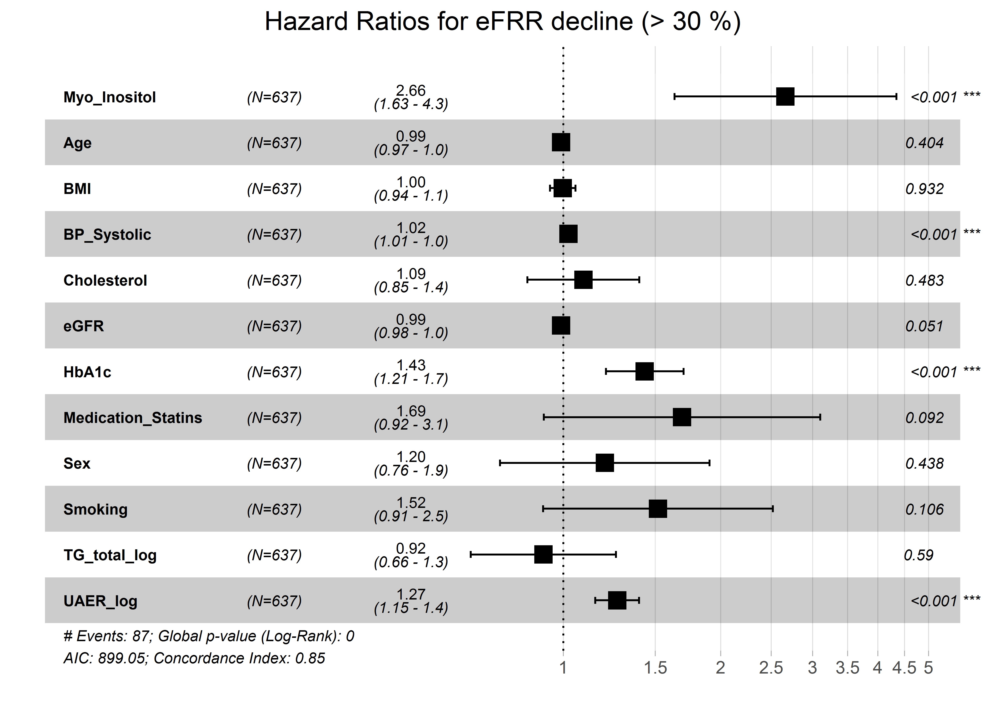<!-- -->

``` r
# print( forest.MyoI )
```

##### Diagnostics of the Survival Model

``` r
survminer::ggsurvplot(
  fit = survival::survfit( formula = model.survival ), 
  data = data.survival
)
```

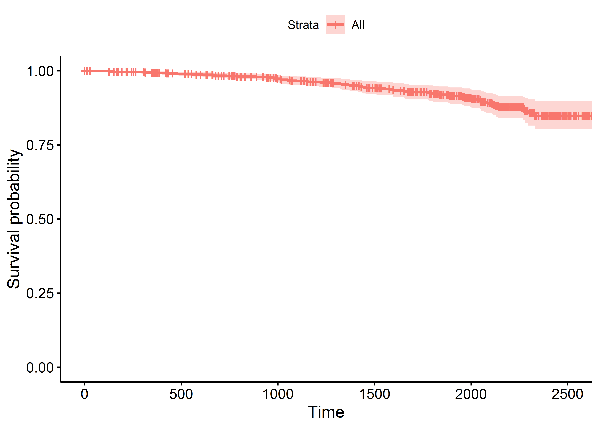<!-- -->

``` r
survminer::ggcoxdiagnostics(
  fit = model.survival, 
  type = "schoenfeld", 
  ox.scale = "time"
)
```

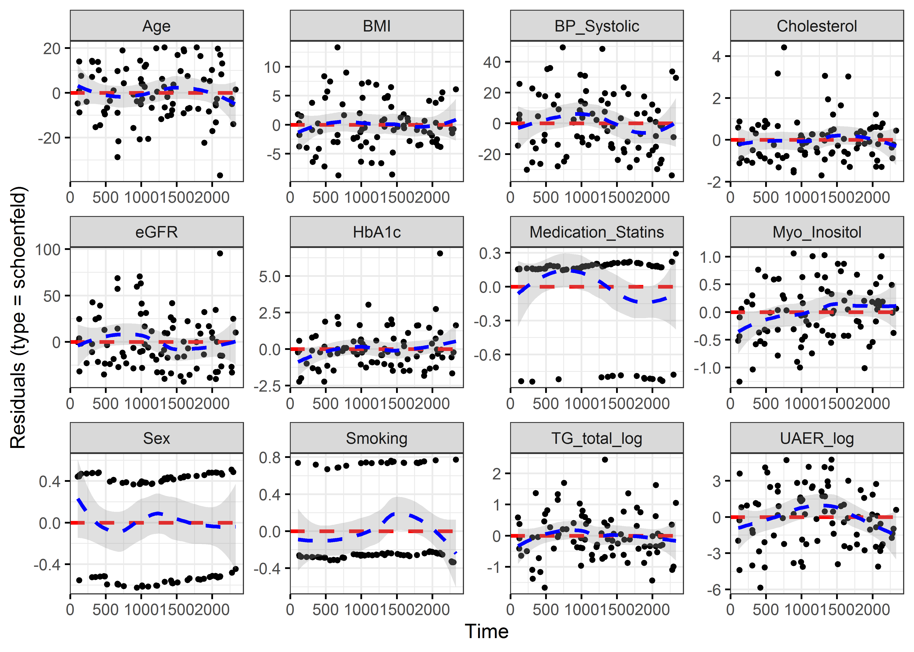<!-- -->

##### Kaplan-Maier Curve with Median Cutpoint

``` r
data.km <- data.survival

data.km$"Myo_Inositol" <-
  cut(
    x = data.km$"Myo_Inositol",
    breaks = c( -Inf, median( x = data.km$"Myo_Inositol", na.rm = TRUE ), Inf ),
    labels = c( " <50%", " >50%" )
  )

data.km$"Myo_Inositol" <- relevel( x = data.km$"Myo_Inositol", ref = " >50%" )

model.km <- 
  survival::survfit(
    survival::Surv(
      time = t_gfrfald30_p, 
      event = censor_gfrfald30_p.reversed.numeric
    ) 
    ~ 
      Myo_Inositol, 
    data = data.km
  )

plot <-
  survminer::ggsurvplot(
    fit = model.km, 
    data = data.km, 
    ggtheme = ggplot2::theme_minimal(),
    palette = "Set1",
    risk.table = TRUE, 
    cumevents = TRUE,
    pval = FALSE,
    risk.table.height = 0.15, 
    cumevents.height = 0.15,
    conf.int = TRUE
  )

plot$"table" <- plot$"table" + survminer::theme_cleantable()
plot$"cumevents" <- plot$"cumevents" + survminer::theme_cleantable()

print( plot )
```

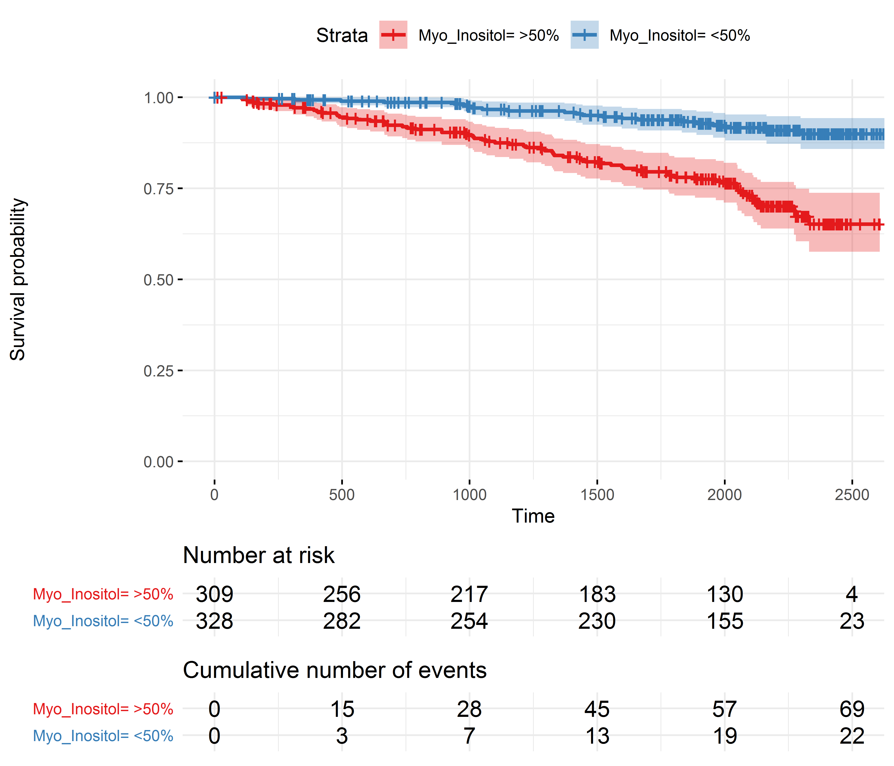<!-- -->

``` r
plot.km.Myo.Inositsol <- plot
```

#### Other Model Fits

``` r
model.km <- 
  survival::coxph(
    survival::Surv(
      time = t_gfrfald30_p, 
      event = censor_gfrfald30_p.reversed.numeric
    ) 
    ~ 
      Myo_Inositol, 
    data = data.km
  )

print( summary( model.km ) )
```

    ## Call:
    ## survival::coxph(formula = survival::Surv(time = t_gfrfald30_p, 
    ##     event = censor_gfrfald30_p.reversed.numeric) ~ Myo_Inositol, 
    ##     data = data.km)
    ## 
    ##   n= 637, number of events= 91 
    ## 
    ##                      coef exp(coef) se(coef)      z Pr(>|z|)    
    ## Myo_Inositol <50% -1.3443    0.2607   0.2454 -5.477 4.32e-08 ***
    ## ---
    ## Signif. codes:  0 '***' 0.001 '**' 0.01 '*' 0.05 '.' 0.1 ' ' 1
    ## 
    ##                   exp(coef) exp(-coef) lower .95 upper .95
    ## Myo_Inositol <50%    0.2607      3.836    0.1612    0.4218
    ## 
    ## Concordance= 0.653  (se = 0.027 )
    ## Rsquare= 0.054   (max possible= 0.82 )
    ## Likelihood ratio test= 35.66  on 1 df,   p=2.352e-09
    ## Wald test            = 30  on 1 df,   p=4.324e-08
    ## Score (logrank) test = 34.72  on 1 df,   p=3.811e-09

``` r
summary( 
  glm(
    formula =
      censor_gfrfald30_p.reversed.numeric ~ 
      Myo_Inositol + 
      Age +
      BMI + 
      BP_Systolic + 
      Cholesterol + 
      eGFR + 
      HbA1c +
      Medication_Statins +
      Sex +  
      Smoking + 
      TG_total_log +
      UAER_log, 
    data = data.survival
  )
)
```

    ## 
    ## Call:
    ## glm(formula = censor_gfrfald30_p.reversed.numeric ~ Myo_Inositol + 
    ##     Age + BMI + BP_Systolic + Cholesterol + eGFR + HbA1c + Medication_Statins + 
    ##     Sex + Smoking + TG_total_log + UAER_log, data = data.survival)
    ## 
    ## Deviance Residuals: 
    ##      Min        1Q    Median        3Q       Max  
    ## -0.64186  -0.17645  -0.07273   0.03479   1.01620  
    ## 
    ## Coefficients:
    ##                      Estimate Std. Error t value Pr(>|t|)    
    ## (Intercept)        -2.4903314  0.5778984  -4.309 1.93e-05 ***
    ## Myo_Inositol        0.1006377  0.0277956   3.621 0.000320 ***
    ## Age                -0.0015975  0.0012690  -1.259 0.208611    
    ## BMI                -0.0003500  0.0035255  -0.099 0.920953    
    ## BP_Systolic         0.0021111  0.0008320   2.538 0.011426 *  
    ## Cholesterol         0.0111586  0.0165547   0.674 0.500557    
    ## eGFR               -0.0009119  0.0006131  -1.487 0.137493    
    ## HbA1c               0.0459983  0.0126206   3.645 0.000292 ***
    ## Medication_Statins  0.0289055  0.0312215   0.926 0.354929    
    ## Sex                 0.0051173  0.0282786   0.181 0.856464    
    ## Smoking             0.0091989  0.0336190   0.274 0.784474    
    ## TG_total_log        0.0076032  0.0223770   0.340 0.734150    
    ## UAER_log            0.0356352  0.0069800   5.105 4.50e-07 ***
    ## ---
    ## Signif. codes:  0 '***' 0.001 '**' 0.01 '*' 0.05 '.' 0.1 ' ' 1
    ## 
    ## (Dispersion parameter for gaussian family taken to be 0.1027996)
    ## 
    ##     Null deviance: 74.084  on 585  degrees of freedom
    ## Residual deviance: 58.904  on 573  degrees of freedom
    ##   (51 observations deleted due to missingness)
    ## AIC: 344.71
    ## 
    ## Number of Fisher Scoring iterations: 2

``` r
summary(
  lm(
    formula =
      Myo_Inositol ~ 
      censor_gfrfald30_p.reversed.numeric + 
      Age +
      BMI + 
      BP_Systolic + 
      Cholesterol + 
      eGFR + 
      HbA1c +
      Medication_Statins +
      Sex +  
      Smoking + 
      TG_total_log +
      UAER_log, 
    data = data.survival
  )
)
```

    ## 
    ## Call:
    ## lm(formula = Myo_Inositol ~ censor_gfrfald30_p.reversed.numeric + 
    ##     Age + BMI + BP_Systolic + Cholesterol + eGFR + HbA1c + Medication_Statins + 
    ##     Sex + Smoking + TG_total_log + UAER_log, data = data.survival)
    ## 
    ## Residuals:
    ##      Min       1Q   Median       3Q      Max 
    ## -2.01490 -0.28018 -0.00498  0.25886  1.88430 
    ## 
    ## Coefficients:
    ##                                       Estimate Std. Error t value Pr(>|t|)
    ## (Intercept)                         19.7966675  0.2783172  71.130  < 2e-16
    ## censor_gfrfald30_p.reversed.numeric  0.2222437  0.0613826   3.621  0.00032
    ## Age                                  0.0041051  0.0018806   2.183  0.02945
    ## BMI                                 -0.0048505  0.0052352  -0.927  0.35457
    ## BP_Systolic                         -0.0001693  0.0012432  -0.136  0.89175
    ## Cholesterol                         -0.0343832  0.0245690  -1.399  0.16222
    ## eGFR                                -0.0087509  0.0008365 -10.462  < 2e-16
    ## HbA1c                                0.0102942  0.0189661   0.543  0.58750
    ## Medication_Statins                  -0.0215989  0.0464228  -0.465  0.64192
    ## Sex                                 -0.0621546  0.0419444  -1.482  0.13893
    ## Smoking                             -0.0636181  0.0498921  -1.275  0.20279
    ## TG_total_log                         0.0478027  0.0331968   1.440  0.15042
    ## UAER_log                             0.0036953  0.0106048   0.348  0.72763
    ##                                        
    ## (Intercept)                         ***
    ## censor_gfrfald30_p.reversed.numeric ***
    ## Age                                 *  
    ## BMI                                    
    ## BP_Systolic                            
    ## Cholesterol                            
    ## eGFR                                ***
    ## HbA1c                                  
    ## Medication_Statins                     
    ## Sex                                    
    ## Smoking                                
    ## TG_total_log                           
    ## UAER_log                               
    ## ---
    ## Signif. codes:  0 '***' 0.001 '**' 0.01 '*' 0.05 '.' 0.1 ' ' 1
    ## 
    ## Residual standard error: 0.4765 on 573 degrees of freedom
    ##   (51 observations deleted due to missingness)
    ## Multiple R-squared:  0.2976, Adjusted R-squared:  0.2829 
    ## F-statistic: 20.24 on 12 and 573 DF,  p-value: < 2.2e-16

### Step 4.1B: Analysis of a Blood Pressure, HbA1c and logUAER-Matched Subcohort

``` r
idx.case <- 
  which(
    data.survival$"censor_gfrfald30_p.reversed" == "event" &
      apply(
        X = 
          !is.na(
            data.survival[ ,
                           c(
                             "Myo_Inositol", 
                             "censor_gfrfald30_p.reversed", 
                             names.model$"cleaned"
                           )
                           ]
          ), 
        MAR = 1,
        FUN = all
      )
  )

idx.matched.control <- NULL

idx.pool <- 
  which(
    data.survival$"censor_gfrfald30_p.reversed" == "eos/udvandring i profil" &
      apply(
        X = 
          !is.na(
            data.survival[ , 
                           c(
                             "Myo_Inositol", 
                             "censor_gfrfald30_p.reversed", 
                             names.model$"cleaned"
                           )
                           ]
          ), 
        MAR = 1,
        FUN = all
      )
  )

names.matching.variables <- c( "BP_Systolic", "HbA1c", "UAER_log" )

S <-
  cov(
    x = data.survival[ idx.pool, names.matching.variables ],
    use = "pairwise.complete.obs"
  )

tmp <- idx.pool
  
for ( i in 1:length( idx.case ) ) {

  tmp2 <- 
    stats::mahalanobis(
      x = data.survival[ tmp, names.matching.variables ], 
      center = unlist( data.survival[ idx.case[ i ], names.matching.variables ] ),
      cov = S,
      inverted = FALSE
    )
  
  tmp2 <- which.min( tmp2 )
  
  idx.matched.control <- c( idx.matched.control, tmp[ tmp2 ] )
  
  tmp <- tmp[ -tmp2 ]
  
}

ggplot2::qplot(
  x = data.survival[ idx.case, "BP_Systolic"], 
  y = data.survival[ idx.matched.control, "BP_Systolic" ], 
  color = data.survival[ idx.case, "Sex" ]
)
```

<!-- -->

``` r
ggplot2::qplot(
  x = data.survival[ idx.case, "HbA1c"], 
  y = data.survival[ idx.matched.control, "HbA1c" ], 
  color = data.survival[ idx.case, "Sex" ]
)
```

<!-- -->

``` r
ggplot2::qplot(
  x = data.survival[ idx.case, "UAER_log"], 
  y = data.survival[ idx.matched.control, "UAER_log" ], 
  color = data.survival[ idx.case, "Sex" ]
)
```

<!-- -->

``` r
t.test( 
  x = data.survival[ idx.case, "BP_Systolic" ],
  y = data.survival[ idx.matched.control, "BP_Systolic" ],
  paired = TRUE
)
```

    ## 
    ##  Paired t-test
    ## 
    ## data:  data.survival[idx.case, "BP_Systolic"] and data.survival[idx.matched.control, "BP_Systolic"]
    ## t = 1.9697, df = 86, p-value = 0.05209
    ## alternative hypothesis: true difference in means is not equal to 0
    ## 95 percent confidence interval:
    ##  -0.01150946  2.49426809
    ## sample estimates:
    ## mean of the differences 
    ##                1.241379

``` r
t.test(
  x = data.survival[ idx.case, "HbA1c" ],
  y = data.survival[ idx.matched.control, "HbA1c" ],
  paired = TRUE
)
```

    ## 
    ##  Paired t-test
    ## 
    ## data:  data.survival[idx.case, "HbA1c"] and data.survival[idx.matched.control, "HbA1c"]
    ## t = 3.5465, df = 86, p-value = 0.0006347
    ## alternative hypothesis: true difference in means is not equal to 0
    ## 95 percent confidence interval:
    ##  0.06465628 0.22959659
    ## sample estimates:
    ## mean of the differences 
    ##               0.1471264

``` r
t.test(
  x = data.survival[ idx.case, "UAER_log" ],
  y = data.survival[ idx.matched.control, "UAER_log" ],
  paired = TRUE
)
```

    ## 
    ##  Paired t-test
    ## 
    ## data:  data.survival[idx.case, "UAER_log"] and data.survival[idx.matched.control, "UAER_log"]
    ## t = 2.6454, df = 86, p-value = 0.0097
    ## alternative hypothesis: true difference in means is not equal to 0
    ## 95 percent confidence interval:
    ##  0.04758177 0.33532528
    ## sample estimates:
    ## mean of the differences 
    ##               0.1914535

``` r
data.survival.stratified <-
  data.survival[ c( idx.case, idx.matched.control ), ]

summary(
  glm(
    formula =
      censor_gfrfald30_p.reversed.numeric ~ 
      Myo_Inositol + 
      Age +
      BMI + 
      BP_Systolic + 
      Cholesterol + 
      eGFR + 
      HbA1c +
      Medication_Statins +
      Sex +  
      Smoking + 
      TG_total_log +
      UAER_log, 
    data = data.survival.stratified
  )
)
```

    ## 
    ## Call:
    ## glm(formula = censor_gfrfald30_p.reversed.numeric ~ Myo_Inositol + 
    ##     Age + BMI + BP_Systolic + Cholesterol + eGFR + HbA1c + Medication_Statins + 
    ##     Sex + Smoking + TG_total_log + UAER_log, data = data.survival.stratified)
    ## 
    ## Deviance Residuals: 
    ##     Min       1Q   Median       3Q      Max  
    ## -0.8055  -0.4603   0.0940   0.4648   0.7881  
    ## 
    ## Coefficients:
    ##                      Estimate Std. Error t value Pr(>|t|)    
    ## (Intercept)        -5.7226697  1.6058638  -3.564 0.000482 ***
    ## Myo_Inositol        0.2886231  0.0781982   3.691 0.000305 ***
    ## Age                -0.0022160  0.0037539  -0.590 0.555813    
    ## BMI                 0.0055595  0.0099665   0.558 0.577746    
    ## BP_Systolic         0.0012697  0.0022555   0.563 0.574266    
    ## Cholesterol         0.0558232  0.0450728   1.239 0.217329    
    ## eGFR                0.0007326  0.0016386   0.447 0.655412    
    ## HbA1c               0.0132720  0.0328348   0.404 0.686598    
    ## Medication_Statins  0.1293175  0.0954127   1.355 0.177205    
    ## Sex                -0.0012794  0.0799892  -0.016 0.987258    
    ## Smoking             0.0061972  0.0896848   0.069 0.944996    
    ## TG_total_log       -0.0387143  0.0655796  -0.590 0.555790    
    ## UAER_log           -0.0065286  0.0177393  -0.368 0.713337    
    ## ---
    ## Signif. codes:  0 '***' 0.001 '**' 0.01 '*' 0.05 '.' 0.1 ' ' 1
    ## 
    ## (Dispersion parameter for gaussian family taken to be 0.2372424)
    ## 
    ##     Null deviance: 43.500  on 173  degrees of freedom
    ## Residual deviance: 38.196  on 161  degrees of freedom
    ## AIC: 257.95
    ## 
    ## Number of Fisher Scoring iterations: 2

``` r
summary( 
  lm( 
    formula = 
      Myo_Inositol ~ 
      censor_gfrfald30_p.reversed.numeric + 
      Age +
      BMI + 
      BP_Systolic + 
      Cholesterol + 
      eGFR + 
      HbA1c +
      Medication_Statins +
      Sex +  
      Smoking + 
      TG_total_log +
      UAER_log, 
    data = data.survival.stratified
  )
)
```

    ## 
    ## Call:
    ## lm(formula = Myo_Inositol ~ censor_gfrfald30_p.reversed.numeric + 
    ##     Age + BMI + BP_Systolic + Cholesterol + eGFR + HbA1c + Medication_Statins + 
    ##     Sex + Smoking + TG_total_log + UAER_log, data = data.survival.stratified)
    ## 
    ## Residuals:
    ##     Min      1Q  Median      3Q     Max 
    ## -1.8629 -0.2757 -0.0401  0.2915  1.3326 
    ## 
    ## Coefficients:
    ##                                      Estimate Std. Error t value Pr(>|t|)
    ## (Intercept)                         19.363219   0.526059  36.808  < 2e-16
    ## censor_gfrfald30_p.reversed.numeric  0.270294   0.073232   3.691 0.000305
    ## Age                                  0.005314   0.003612   1.471 0.143248
    ## BMI                                  0.001369   0.009654   0.142 0.887393
    ## BP_Systolic                         -0.000999   0.002183  -0.458 0.647883
    ## Cholesterol                         -0.019438   0.043799  -0.444 0.657776
    ## eGFR                                -0.010530   0.001352  -7.787 7.92e-13
    ## HbA1c                                0.052056   0.031525   1.651 0.100640
    ## Medication_Statins                  -0.061589   0.092732  -0.664 0.507533
    ## Sex                                 -0.019574   0.077392  -0.253 0.800651
    ## Smoking                             -0.037295   0.086742  -0.430 0.667801
    ## TG_total_log                         0.036917   0.063465   0.582 0.561594
    ## UAER_log                            -0.002276   0.017173  -0.133 0.894743
    ##                                        
    ## (Intercept)                         ***
    ## censor_gfrfald30_p.reversed.numeric ***
    ## Age                                    
    ## BMI                                    
    ## BP_Systolic                            
    ## Cholesterol                            
    ## eGFR                                ***
    ## HbA1c                                  
    ## Medication_Statins                     
    ## Sex                                    
    ## Smoking                                
    ## TG_total_log                           
    ## UAER_log                               
    ## ---
    ## Signif. codes:  0 '***' 0.001 '**' 0.01 '*' 0.05 '.' 0.1 ' ' 1
    ## 
    ## Residual standard error: 0.4714 on 161 degrees of freedom
    ## Multiple R-squared:  0.4139, Adjusted R-squared:  0.3702 
    ## F-statistic: 9.476 on 12 and 161 DF,  p-value: 9.388e-14

#### Survival Model with Details

``` r
model.survival <-
  survival::coxph( 
    formula =
      survival::Surv(
        time = t_gfrfald30_p, 
        event = censor_gfrfald30_p.reversed.numeric
      ) 
    ~ 
      Myo_Inositol +
      Age +
      BMI + 
      BP_Systolic + 
      Cholesterol + 
      eGFR + 
      HbA1c +
      Medication_Statins +
      Sex +  
      Smoking + 
      TG_total_log +
      UAER_log, 
    data = data.survival.stratified
  )

print( summary( model.survival ) )
```

    ## Call:
    ## survival::coxph(formula = survival::Surv(time = t_gfrfald30_p, 
    ##     event = censor_gfrfald30_p.reversed.numeric) ~ Myo_Inositol + 
    ##     Age + BMI + BP_Systolic + Cholesterol + eGFR + HbA1c + Medication_Statins + 
    ##     Sex + Smoking + TG_total_log + UAER_log, data = data.survival.stratified)
    ## 
    ##   n= 174, number of events= 87 
    ## 
    ##                         coef exp(coef)  se(coef)      z Pr(>|z|)    
    ## Myo_Inositol        0.974990  2.651140  0.248029  3.931 8.46e-05 ***
    ## Age                -0.015145  0.984969  0.012083 -1.253    0.210    
    ## BMI                 0.023558  1.023837  0.031015  0.760    0.448    
    ## BP_Systolic         0.008866  1.008905  0.006846  1.295    0.195    
    ## Cholesterol         0.192384  1.212136  0.135369  1.421    0.155    
    ## eGFR               -0.004974  0.995038  0.005090 -0.977    0.328    
    ## HbA1c               0.064293  1.066405  0.090056  0.714    0.475    
    ## Medication_Statins  0.442379  1.556406  0.298951  1.480    0.139    
    ## Sex                 0.051528  1.052879  0.236473  0.218    0.828    
    ## Smoking             0.329798  1.390687  0.264734  1.246    0.213    
    ## TG_total_log       -0.217046  0.804893  0.173527 -1.251    0.211    
    ## UAER_log            0.073467  1.076233  0.050074  1.467    0.142    
    ## ---
    ## Signif. codes:  0 '***' 0.001 '**' 0.01 '*' 0.05 '.' 0.1 ' ' 1
    ## 
    ##                    exp(coef) exp(-coef) lower .95 upper .95
    ## Myo_Inositol          2.6511     0.3772    1.6305     4.311
    ## Age                   0.9850     1.0153    0.9619     1.009
    ## BMI                   1.0238     0.9767    0.9635     1.088
    ## BP_Systolic           1.0089     0.9912    0.9955     1.023
    ## Cholesterol           1.2121     0.8250    0.9297     1.580
    ## eGFR                  0.9950     1.0050    0.9852     1.005
    ## HbA1c                 1.0664     0.9377    0.8939     1.272
    ## Medication_Statins    1.5564     0.6425    0.8663     2.796
    ## Sex                   1.0529     0.9498    0.6624     1.674
    ## Smoking               1.3907     0.7191    0.8277     2.337
    ## TG_total_log          0.8049     1.2424    0.5728     1.131
    ## UAER_log              1.0762     0.9292    0.9756     1.187
    ## 
    ## Concordance= 0.67  (se = 0.034 )
    ## Rsquare= 0.197   (max possible= 0.988 )
    ## Likelihood ratio test= 38.1  on 12 df,   p=0.0001481
    ## Wald test            = 35.21  on 12 df,   p=0.0004341
    ## Score (logrank) test = 36.58  on 12 df,   p=0.0002617

##### Forest Plot with Clinical Variables

``` r
forest.RA <-
  survminer::ggforest(
    model = model.survival,
    main = "Hazard Ratios for eGFR decline (> 30 %)"
  )
```

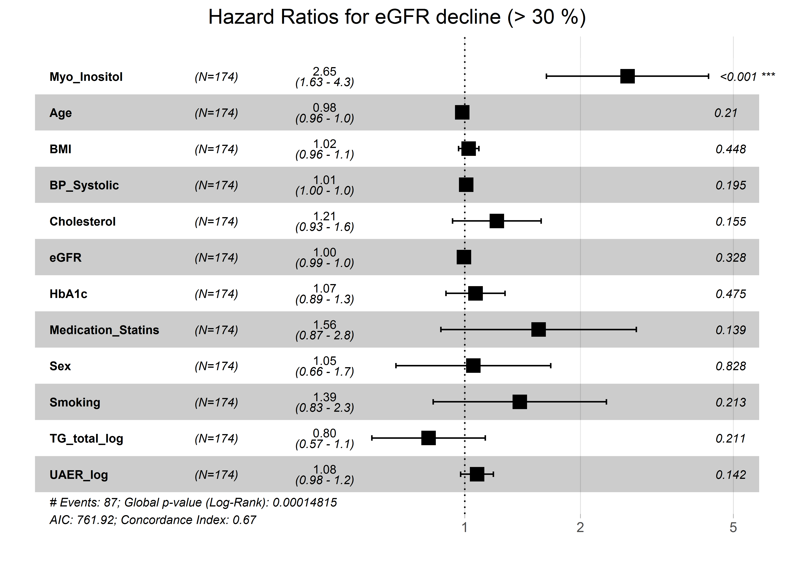<!-- -->

``` r
# print( forest.RA )
```

##### Diagnostics of the Survival Model

``` r
survminer::ggsurvplot(
  fit = survival::survfit( formula = model.survival ), 
  data = data.survival.stratified
)
```

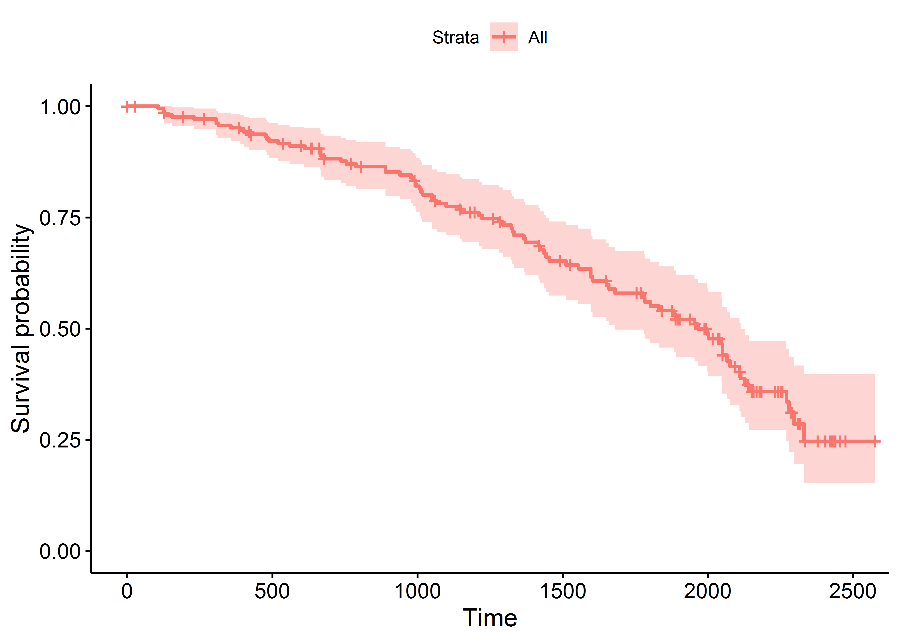<!-- -->

``` r
survminer::ggcoxdiagnostics(
  fit = model.survival, 
  type = "schoenfeld", 
  ox.scale = "time"
)
```

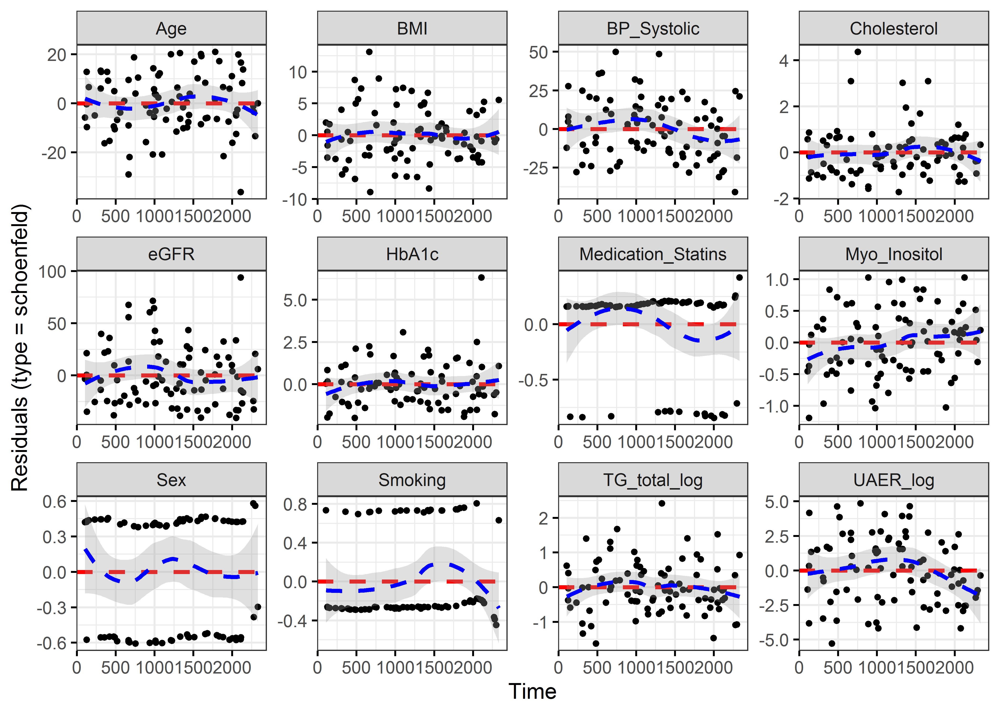<!-- -->

##### Kaplan-Maier Curve with Median Cutpoint

``` r
data.km <- data.survival.stratified

data.km$"Myo_Inositol" <-
  cut(
    x = data.km$"Myo_Inositol",
    breaks = c( -Inf, median( x = data.km$"Myo_Inositol", na.rm = TRUE ), Inf ),
    labels = c( " <50%", " >50%" )
  )

data.km$"Myo_Inositol" <- relevel( x = data.km$"Myo_Inositol", ref = " >50%" )

model.km <-
  survival::survfit(
    survival::Surv(
      time = t_gfrfald30_p, 
      event = censor_gfrfald30_p.reversed.numeric
    ) 
    ~
      Myo_Inositol,
    data = data.km
  )

plot <-
  survminer::ggsurvplot(
    fit = model.km, 
    data = data.km, 
    ggtheme = ggplot2::theme_minimal(),
    palette = "Set1",
    risk.table = TRUE, 
    cumevents = TRUE,
    pval = FALSE,
    risk.table.height = 0.15, 
    cumevents.height = 0.15,
    conf.int = TRUE
  )

plot$"table" <- plot$"table" + survminer::theme_cleantable()
plot$"cumevents" <- plot$"cumevents" + survminer::theme_cleantable()

km.RA <- plot

print( plot )
```

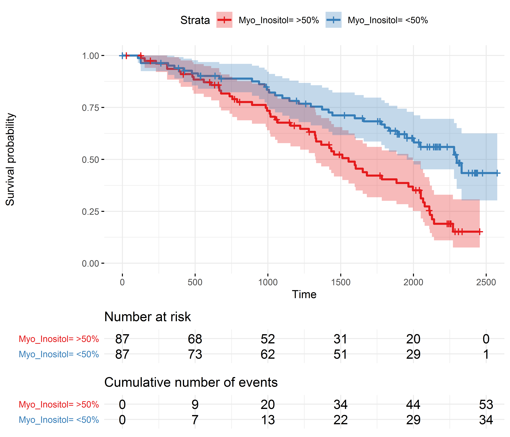<!-- -->

##### Boxplots

``` r
data.plot <- data.survival.stratified

data.plot$"Outcome" <- 
  factor(
    x = data.plot$"censor_gfrfald30_p", 
    levels = c( "2", "0" ), 
    labels = c( "Censored", "eGFR Decline (> 30 %)" )
  )

ggplot2::ggplot( 
  data = data.plot, 
  mapping = ggplot2::aes(
    x = Outcome, 
    y = Myo_Inositol
    )
  ) +
  ggplot2::geom_violin( draw_quantiles = c( 0.25, 0.50, 0.75 ) ) + 
  ggplot2::geom_jitter(
    width = 0.1,
    fill = "black",
    stroke = 0,
    shape = 16,
    size = 2,
    alpha = 0.25
  ) +
  ggplot2::ylab( label="Myo-Inositol" ) +
  ggplot2::xlab( label="Outcome" )
```

<!-- -->

``` r
data.plot$"Gender" <- 
  factor(
    x = data.plot$"Sex", 
    levels = c( 0, 1 ), 
    labels = c( "Female", "Male" )
  )

data.plot$"Outcome.and.Gender" <- 
  base::interaction( data.plot$"Outcome", data.plot$"Gender" )

levels( data.plot$"Outcome.and.Gender" ) <- 
  stringr::str_replace(
    string = levels( data.plot$"Outcome.and.Gender" ), 
    pattern = "\\.",
    replacement = "\n"
  )

ggplot2::ggplot(
  data = data.plot,
  mapping = ggplot2::aes(
    x = Outcome.and.Gender, 
    y = Myo_Inositol,
    size = Age, 
    color = Gender
  )
) +
  ggplot2::geom_violin( draw_quantiles = c( 0.25, 0.50, 0.75 ) ) + 
  ggplot2::geom_jitter( 
    width = 0.1,
    stroke = 0,
    shape = 16,
    alpha = 0.25
  ) +
  ggplot2::scale_color_brewer( palette = "Dark2", direction = -1 ) +
  ggplot2::ylab( label = "Myo-Inositol" ) +
  ggplot2::xlab( label = "Outcome by Gender" ) +
  ggplot2::theme( legend.position = "top" )
```

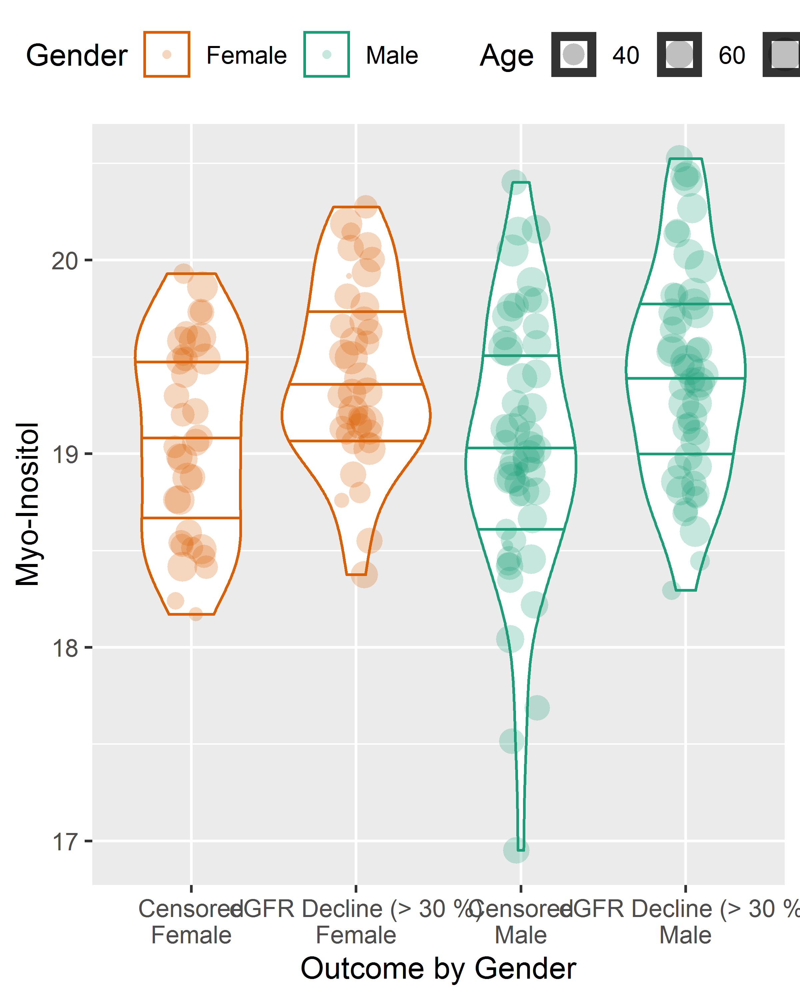<!-- -->
