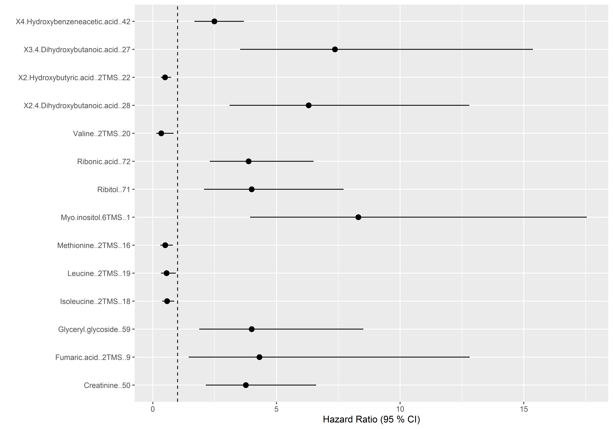
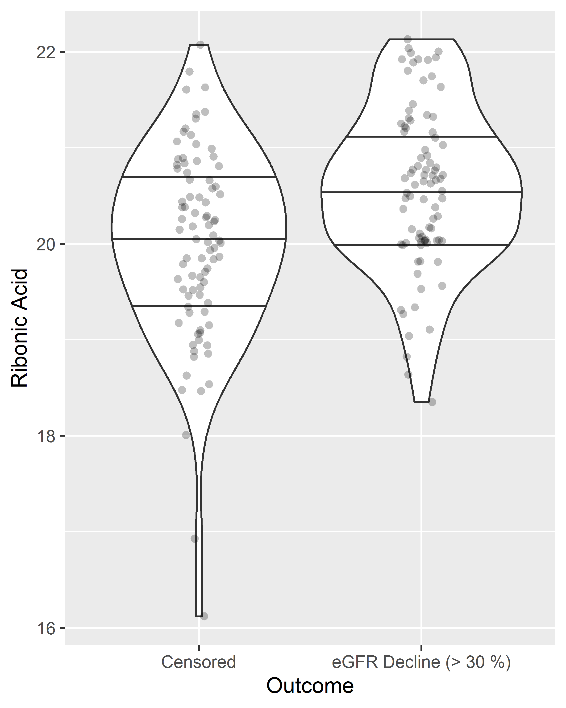
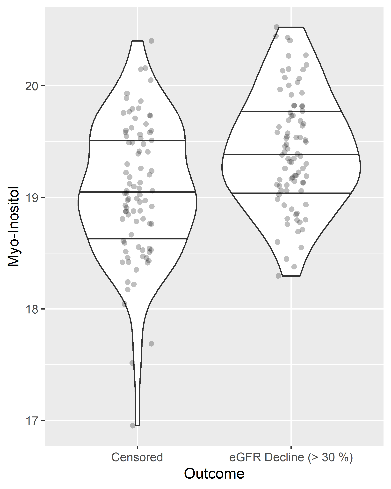
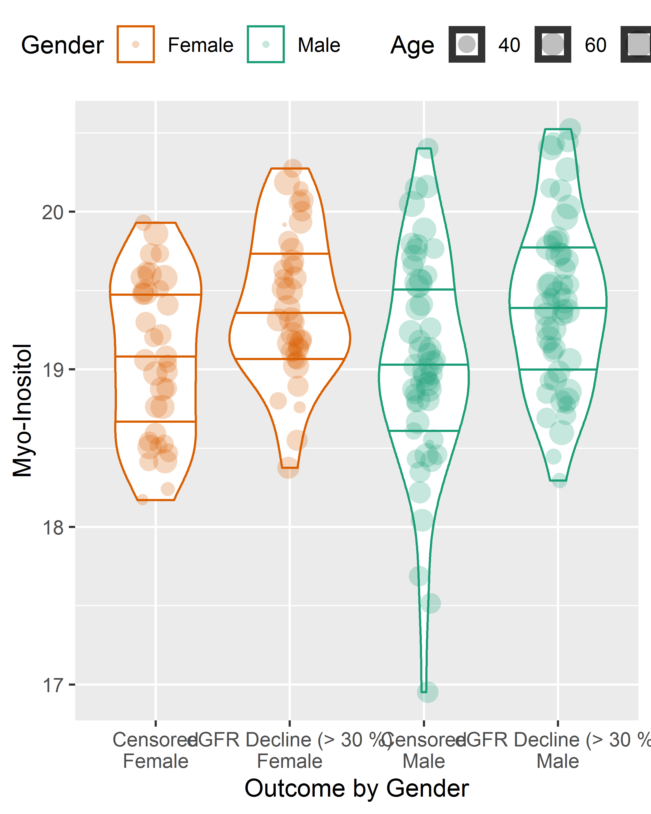

0033\_PROFIL: Statistical Analysis of the Metabolome in Relation to
Renal Complications
================
Tommi Suvitaival, <tommi.raimo.leo.suvitaival@regionh.dk>, Steno
Diabetes Center Copenhagen
2019-09-23

See 0033\_PROFIL–Metabolomics.Rmd for the script that produces the
output shown below.

This document is Supplementary Material to the paper \\emph{Sugar
Derivatives and Branched-Chain Amino Acids Are Associated with Present
and Future Renal Impairment in Type 1 Diabetes} by Nete Tofte, Tommi
Suvitaival, Kajetan Trost, Ismo Mattila, Simone Theilade, Signe A.
Winther, Tarun S. Ahluwalia, Marie Frimodt-M\\{o}ller, Cristina
Legido-Quigley and Peter Rossing.

``` r
data.loaded <-
  read.table( 
    file = "L:/LovbeskyttetMapper/PROFILmetab/Data/metabolomics/0033_PROFIL_2017_metabolomics_data--kNN-obs-sel--181212-h.tsv",
    header = TRUE,
    sep = "\t",
    stringsAsFactors = FALSE,
    comment.char = "",
    check.names = FALSE
  )

data.design <- 
  haven::read_sas( data_file="L:/LovbeskyttetMapper/PROFILmetab/Data/profil_nb.sas7bdat" )

### Follow-up data from SAS file

data.follow.up <-
  haven::read_sas( data_file="L:/LovbeskyttetMapper/PROFILmetab/Data/follow-up-180311/profil_kidney.sas7bdat" )

data.follow.up.new.albu <-
  haven::read_sas( data_file="L:/LovbeskyttetMapper/PROFILmetab/Data/follow-up-180311/profil__new_albu__180608.sas7bdat" )

# Log-transform data

rownames( data.loaded ) <- data.loaded$"Name"

names.metabolites <- 
  colnames( data.loaded )[ grepl( x = colnames( data.loaded ), pattern = "; " ) ]

data.metabolites.only <- data.loaded[ , names.metabolites ]

data.metabolites.only[ data.metabolites.only <= 0 ] <- NA

data.metabolites.only <- log2( data.metabolites.only )

data.metabolites.only <- 
  data.frame( data.metabolites.only,
              check.names = FALSE,
              stringsAsFactors = FALSE )

data.scaled <- data.loaded

data.scaled[ , names.metabolites ] <- 
  data.metabolites.only[ rownames( data.scaled ), names.metabolites ]


## Cleanup clinical data


data.design <- 
  data.frame( 
    lapply( 
      X = data.design, 
      FUN = function( x ) { x[ is.nan( x ) ] <- NA; return( x ) }
    ), 
    check.names = FALSE,
    stringsAsFactors = FALSE
  )

data.design[ which( data.design$"bmi"==133.11 ), "bmi" ] <- NA

### Create additional clinical variables

data.design$"Group" <- data.design$"Albuminuri_3_groups"
data.design[ which( data.design$"Control_vs_patients"==5 ), "Group" ] <- 5

data.design$"Group" <- 
  factor( 
    x = data.design$"Group", 
    levels = c( "1", "3", "4", "5" ), 
    labels = c( "T1D Control", "T1D Micro", "T1D Macro", "Healthy Control" )
  )

data.design$"Group.continuous" <- data.design$"Group"

data.design[ which( data.design$"Group.continuous" == "Healthy Control" ), 
             "Group.continuous" ] <- NA

data.design$"Group.continuous" <- as.numeric( data.design$"Group.continuous" ) - 1

data.design$"sex" <- as.factor( data.design$"sex" ) # NB: Not complete; Use "Gender" instead.

data.design$"Gender"[ data.design$"Gender"=="" ] <- NA
data.design$"Gender" <- as.numeric( as.character( data.design$"Gender" ) )

# NB: "uacr" not complete; use "logUAER" instead.
data.design$"uacr" <- as.numeric( as.character( data.design$"uacr" ) )

data.design$"Albuminuria.in.T1D" <- 
  factor( 
    x = ( data.design$"Group"=="T1D Micro" | data.design$"Group"=="T1D Macro" ), 
    levels = c( FALSE, TRUE ), 
    labels = c( "No Albuminuria", "Albuminuria" ) )

data.design$"Albuminuria.in.T1D"[ data.design$"Group"=="Healthy Control" ] <- NA

data.design$"Insulin_use" <- ( data.design$"Insulin_day_dose" > 0 )*1

data.design$"Log1plus.Beat_to_beat" <- log10( 1 + data.design$"Beat_to_beat" )

data.design$"Log.MeanPWV" <- log10( data.design$"MeanPWV" )

###
### Part 3: Merge data sets
###

data.follow.up <- 
  merge( 
    x = data.follow.up, 
    y = data.follow.up.new.albu,
    by = "id_profil",
    incomparables = NA
  )

data <- 
  merge( 
    x = data.design,
    y = data.follow.up,
    by.x = "corenr",
    by.y = "id_profil",
    incomparables = NA
  )

# Other

data$"Date_num" <- as.numeric( data$"DATE" )

data.scaled$"Batch" <- as.factor( data.scaled$"Batch" )

data$"log_Blood_TGA" <- log2( data$"Blood_TGA" )

data$"logUAER" <- data$"logUAER" * log2( 10 ) # log10 => log2

data$"slope_albuminuria_profil" <- data$"slope_albuminuria_profil" * log2( exp( 1 ) )
data$"slope_gfr_profil" <- data$"slope_gfr_profil" * log2( exp( 1 ) )

data$"loglogUAER" <- log2( data$"logUAER" )

data$"RAAS.original" <- data$"RAAS"

data$"RAAS" <- data$"RAAS" - 1

data <- 
  merge( 
    x = data,
    y = data.scaled,
    by.x = "corenr",
    by.y = "Label",
    incomparables = NA
  )

data.w.healthy.control <- data

data <- data[ which( data$"Group" != "Healthy Control" ), ]
```

``` r
names.mapping <- 
  data.frame( 
    Original = names.metabolites, 
    Made = make.names( names.metabolites ),
    stringsAsFactors = FALSE
  )

rownames( names.mapping ) <- names.mapping$"Made"

names.mapping$"Cleaned" <-
  stringr::str_split_fixed( 
    string = names.mapping$"Original", 
    pattern = "; [0-9]", 
    n = 2
  )[ , 1 ]

names.mapping$"Cleaned" <- 
  stringr::str_replace( 
    string = names.mapping$"Cleaned",
    pattern = ", [0-9]*TMS",
    replacement = ""
  )

names.mapping$"Cleaned" <- 
  stringr::str_replace( 
    string = names.mapping$"Cleaned",
    pattern = " [0-9]*TMS",
    replacement = ""
  )

names.mapping$"Cleaned" <- 
  stringr::str_replace( 
    string = names.mapping$"Cleaned",
    pattern = " MeOX",
    replacement = ""
  )

tmp <- table( names.mapping$"Cleaned" )

tmp <- names( which( tmp > 1 ) )

if ( length( tmp ) > 0 ) {
  
  for ( i in 1:length( tmp ) ) {
    
    tmp.i <- which( names.mapping$"Cleaned" == tmp[ i ] )
    
    names.mapping[ tmp.i, "Cleaned" ] <- 
      paste(
        names.mapping[ tmp.i, "Cleaned" ], 
        " (", 
        1:length( tmp.i ), 
        ")", 
        sep = ""
      )
    
  }
  
}
```

# Step 1: Cross-Sectional Analysis of All Metabolites

## Albuminuria Groups

### Crude Model

``` r
design.test <- 
  data.frame( 
    data.w.healthy.control[ , 
                            c( 
                              "Group", 
                              "Age", 
                              "Gender", 
                              "Hba1c_baseline", 
                              "egfr", 
                              "CALSBP", 
                              "bmi", 
                              "Smoking",
                              "Statin",
                              "log_Blood_TGA", 
                              "Total_cholesterol"
                            )
                            ]
  )

tmp <- 
  apply( 
    X = !is.na( design.test ),
    MAR = 1,
    FUN = all
  )

design.test <- design.test[ tmp, ]
design.test <- droplevels( design.test )

data.test <- t( data.w.healthy.control[ tmp, names.metabolites ] )

dm <- 
  stats::model.matrix( 
    object = ~ Group,
    data = design.test
  )

mFit <- 
  limma::lmFit( 
    object = data.test,
    design = dm
  )

mEbFit <- limma::eBayes( mFit )

dim( dm )
```

    ## [1] 665   4

``` r
apply( X=dm, MAR=2, FUN=range )
```

    ##      (Intercept) GroupT1D Micro GroupT1D Macro GroupHealthy Control
    ## [1,]           1              0              0                    0
    ## [2,]           1              1              1                    1

``` r
tableone::CreateTableOne( data = design.test )
```

    ##                                
    ##                                 Overall       
    ##   n                                665        
    ##   Group (%)                                   
    ##      T1D Control                   290 (43.6) 
    ##      T1D Micro                     152 (22.9) 
    ##      T1D Macro                     178 (26.8) 
    ##      Healthy Control                45 ( 6.8) 
    ##   Age (mean (sd))                54.07 (12.74)
    ##   Gender (mean (sd))              0.54 (0.50) 
    ##   Hba1c_baseline (mean (sd))      7.88 (1.31) 
    ##   egfr (mean (sd))               83.67 (27.64)
    ##   CALSBP (mean (sd))            131.45 (17.41)
    ##   bmi (mean (sd))                25.24 (4.00) 
    ##   Smoking (mean (sd))             0.20 (0.40) 
    ##   Statin (mean (sd))              0.56 (0.50) 
    ##   log_Blood_TGA (mean (sd))       0.00 (0.69) 
    ##   Total_cholesterol (mean (sd))   4.71 (0.87)

#### Table of Model Coefficients

``` r
results.group <- mEbFit

for ( i in 2:ncol( mEbFit ) ) {

  name.effect <- colnames( mEbFit$"coefficients" )[ i ]
  
  table.result.group <- 
    limma::topTable( 
      fit = mEbFit,
      coef = name.effect,
      confint = TRUE, 
      number = Inf,
      adjust.method = "BH"
    )
  
  table.result.printed <- table.result.group
  
  colnames( table.result.printed )[ colnames( table.result.printed )=="logFC" ] <- 
    "Effect"
  
  table.result.printed <- 
    signif( 
      x = table.result.printed,
      digits = 3
    )
  
  table.result.printed$"Name" <- rownames( table.result.printed )

  table.result.printed$"Name" <- 
    stringr::str_sub( 
      string = table.result.printed$"Name",
      start = 1,
      end = 25
    )
  
  table.result.printed <- 
    table.result.printed[ , 
                          c( 
                            "Name",
                            "Effect",
                            "CI.L",
                            "CI.R",
                            "AveExpr", 
                            "P.Value",
                            "adj.P.Val"
                            )
                          ]
  
  print( 
    knitr::kable( 
      x = table.result.printed,
      row.names = FALSE,
      caption = name.effect
    )
  )
  
}
```

    ## 
    ## 
    ## Table: GroupT1D Micro
    ## 
    ## Name                           Effect       CI.L      CI.R   AveExpr    P.Value   adj.P.Val
    ## --------------------------  ---------  ---------  --------  --------  ---------  ----------
    ## 3,4-Dihydroxybutanoic aci     0.26500    0.15700    0.3720      15.9   1.70e-06    0.000126
    ## 2,4-Dihydroxybutanoic aci     0.24200    0.12200    0.3630      16.5   9.08e-05    0.003410
    ## Ribitol; 70                   0.24100    0.11400    0.3690      20.2   2.17e-04    0.005430
    ## Ribitol; 71                   0.24100    0.11000    0.3710      23.3   3.04e-04    0.005710
    ## 4-Hydroxybenzeneacetic ac     0.40800    0.16600    0.6510      19.4   1.00e-03    0.012400
    ## 4-Deoxytetronic acid; 32      0.23800    0.09510    0.3810      21.6   1.13e-03    0.012400
    ## Myo inositol 6TMS; 1          0.17400    0.06930    0.2780      19.0   1.15e-03    0.012400
    ## Creatinine; 50                0.24500    0.09040    0.4000      21.6   1.96e-03    0.018400
    ## Ribonic acid; 72              0.25700    0.07560    0.4380      20.0   5.53e-03    0.046100
    ## Heptadecanoic acid; 60       -0.13500   -0.23500   -0.0350      21.8   8.22e-03    0.061600
    ## Glutamic acid, 3TMS; 8        0.13800    0.02960    0.2460      23.0   1.27e-02    0.086300
    ## 4-Hydroxyphenyllactic aci     0.14200    0.01710    0.2670      20.8   2.59e-02    0.162000
    ## Pyroglutamic acid; 69         0.17900    0.01510    0.3430      22.9   3.23e-02    0.186000
    ## Threonine, 3TMS; 12          -0.10800   -0.20800   -0.0071      28.6   3.59e-02    0.192000
    ## Malic acid, 3TMS; 11          0.09650   -0.00439    0.1970      20.0   6.08e-02    0.293000
    ## Alanine, 2TMS; 25             0.07220   -0.00381    0.1480      22.8   6.26e-02    0.293000
    ## 2-hydroxy Isovaleric acid    -0.22500   -0.47100    0.0211      22.2   7.31e-02    0.323000
    ## Fumaric acid, 2TMS; 9         0.06750   -0.01040    0.1450      24.1   8.92e-02    0.366000
    ## Nonanoic acid; 67            -0.06840   -0.14900    0.0122      24.4   9.60e-02    0.366000
    ## alpha-ketoglutaric acid,      0.15400   -0.02830    0.3370      20.3   9.76e-02    0.366000
    ## 11-Eicosenoic acid; 35        0.12900   -0.02980    0.2870      21.9   1.11e-01    0.394000
    ## Arachidic acid; 46           -0.04890   -0.11100    0.0132      21.8   1.22e-01    0.394000
    ## Glycine, 3TMS; 17             0.05470   -0.01480    0.1240      21.4   1.23e-01    0.394000
    ## Linoleic acid, TMS; 4        -0.05130   -0.11800    0.0153      25.8   1.31e-01    0.394000
    ## Glyceryl-glycoside; 59        0.10900   -0.03390    0.2520      20.8   1.34e-01    0.394000
    ## Isoleucine, 2TMS; 18         -0.08810   -0.20500    0.0291      26.0   1.41e-01    0.394000
    ## 3-Indoleacetic acid; 40       0.11900   -0.04090    0.2790      20.5   1.44e-01    0.394000
    ## Dodecanoic acid; 54           0.09310   -0.03280    0.2190      22.7   1.47e-01    0.394000
    ## Succinic acid, 2TMS; 7        0.04800   -0.01790    0.1140      22.7   1.53e-01    0.396000
    ## Valine, 2TMS; 20             -0.05300   -0.12800    0.0224      25.1   1.68e-01    0.419000
    ## Hydroxyproline; 64            0.12000   -0.05510    0.2950      20.6   1.79e-01    0.433000
    ## Serine, 3TMS; 14             -0.04980   -0.12600    0.0265      26.0   2.01e-01    0.466000
    ## Heptadecanoic acid; 61       -0.04470   -0.11500    0.0253      23.4   2.10e-01    0.466000
    ## Cholesterol, TMS; 23         -0.04200   -0.10800    0.0239      21.7   2.11e-01    0.466000
    ## Stearic acid, TMS; 2         -0.02400   -0.06310    0.0151      17.4   2.29e-01    0.487000
    ## Pyruvic acid; 31              0.11900   -0.07680    0.3140      19.5   2.34e-01    0.487000
    ## Leucine, 2TMS; 19            -0.06130   -0.16700    0.0439      21.1   2.53e-01    0.493000
    ## Methionine, 2TMS; 16         -0.07110   -0.19400    0.0516      20.3   2.56e-01    0.493000
    ## Palmitic acid, TMS; 5        -0.02930   -0.08000    0.0214      21.4   2.57e-01    0.493000
    ## Bisphenol A; 48              -0.06170   -0.17000    0.0465      21.2   2.63e-01    0.493000
    ## Benzeneacetic acid; 47        0.11100   -0.08920    0.3100      20.3   2.77e-01    0.508000
    ## Lactic acid; 29               0.03800   -0.03180    0.1080      25.4   2.85e-01    0.509000
    ## Campesterol; 49               0.07570   -0.07330    0.2250      21.8   3.19e-01    0.535000
    ## Phenylalanine, 2TMS; 13       0.03280   -0.03200    0.0977      24.3   3.20e-01    0.535000
    ## Tyrosine; 75                 -0.12000   -0.36000    0.1200      23.3   3.26e-01    0.535000
    ## Docosahexaenoic acid; 53     -0.07220   -0.21700    0.0726      24.2   3.28e-01    0.535000
    ## Glycerol; 57                 -0.04080   -0.13200    0.0501      28.7   3.79e-01    0.599000
    ## 1-Monopalmitin; 37            0.03760   -0.04700    0.1220      29.2   3.83e-01    0.599000
    ## 2-Hydroxybutyric acid, 2T    -0.06300   -0.21200    0.0861      20.7   4.07e-01    0.623000
    ## Arachidonic acid, TMS; 24    -0.03060   -0.11200    0.0508      22.7   4.61e-01    0.691000
    ## Citric acid, 4TMS; 6          0.02850   -0.06960    0.1270      20.8   5.68e-01    0.835000
    ## Glycerol; 58                 -0.07040   -0.31900    0.1790      24.9   5.79e-01    0.835000
    ## Ethanolamine; 56              0.02260   -0.06200    0.1070      22.7   6.00e-01    0.849000
    ## Tridecanoic acid; 74          0.02640   -0.08560    0.1380      20.0   6.44e-01    0.871000
    ## Aminomalonic acid; 45         0.02830   -0.09190    0.1480      24.3   6.44e-01    0.871000
    ## Arabinopyranose; 51           0.03630   -0.12100    0.1940      20.1   6.51e-01    0.871000
    ## Eicosapentaenoic acid; 55     0.03440   -0.14400    0.2120      23.0   7.04e-01    0.914000
    ## Myristoleic acid; 65          0.03920   -0.17100    0.2500      19.9   7.15e-01    0.914000
    ## 3-Indolepropionic acid; 4    -0.04440   -0.28700    0.1980      19.5   7.19e-01    0.914000
    ## 3-Hydroxybutyric acid, 2T    -0.02760   -0.19100    0.1360      21.6   7.40e-01    0.919000
    ## Oleic acid, TMS; 3           -0.01340   -0.09670    0.0698      17.1   7.51e-01    0.919000
    ## Decanoic acid; 52             0.01850   -0.10000    0.1370      22.4   7.60e-01    0.919000
    ## 4-Deoxytetronic acid; 33      0.02620   -0.17700    0.2290      22.2   8.01e-01    0.935000
    ## Octanoic acid; 68            -0.00912   -0.08060    0.0623      24.2   8.02e-01    0.935000
    ## Hydroxylamine; 62             0.01220   -0.08730    0.1120      27.7   8.10e-01    0.935000
    ## 2-Palmitoylglycerol; 39       0.00866   -0.07010    0.0874      25.9   8.29e-01    0.940000
    ## 1,3-Propanediol; 34           0.01040   -0.09090    0.1120      24.2   8.40e-01    0.940000
    ## 1-Dodecanol; 36              -0.00680   -0.09530    0.0817      20.2   8.80e-01    0.971000
    ## alpha-Tocopherol; 26         -0.00875   -0.15000    0.1320      18.8   9.03e-01    0.980000
    ## 4-Hydroxybutanoic acid; 4     0.00226   -0.03960    0.0441      27.3   9.15e-01    0.980000
    ## Proline, 2TMS; 21             0.00486   -0.10100    0.1110      20.8   9.28e-01    0.980000
    ## Nonadecanoic acid; 66         0.00332   -0.09800    0.1050      20.0   9.49e-01    0.982000
    ## Glyceric acid; 30             0.00317   -0.10900    0.1160      20.4   9.56e-01    0.982000
    ## L-5-Oxoproline; 63           -0.00119   -0.07200    0.0696      27.5   9.74e-01    0.985000
    ## Tartronic acid; 73            0.00169   -0.17900    0.1820      21.3   9.85e-01    0.985000
    ## 
    ## 
    ## Table: GroupT1D Macro
    ## 
    ## Name                           Effect       CI.L       CI.R   AveExpr    P.Value   adj.P.Val
    ## --------------------------  ---------  ---------  ---------  --------  ---------  ----------
    ## 3,4-Dihydroxybutanoic aci     0.51600    0.41400    0.61900      15.9   0.00e+00    0.00e+00
    ## Ribonic acid; 72              0.77000    0.59800    0.94200      20.0   0.00e+00    0.00e+00
    ## Myo inositol 6TMS; 1          0.43700    0.33800    0.53700      19.0   0.00e+00    0.00e+00
    ## 2,4-Dihydroxybutanoic aci     0.49500    0.38000    0.60900      16.5   0.00e+00    0.00e+00
    ## Ribitol; 71                   0.45800    0.33400    0.58100      23.3   0.00e+00    0.00e+00
    ## 4-Hydroxybenzeneacetic ac     0.83000    0.59900    1.06000      19.4   0.00e+00    0.00e+00
    ## 4-Deoxytetronic acid; 32      0.34900    0.21300    0.48400      21.6   6.00e-07    5.80e-06
    ## 4-Deoxytetronic acid; 33      0.49600    0.30200    0.68900      22.2   6.00e-07    5.80e-06
    ## Creatinine; 50                0.35000    0.20300    0.49800      21.6   3.80e-06    3.13e-05
    ## Glyceryl-glycoside; 59        0.31300    0.17700    0.44900      20.8   7.50e-06    5.66e-05
    ## Hydroxyproline; 64            0.36500    0.19900    0.53200      20.6   1.88e-05    1.28e-04
    ## Valine, 2TMS; 20             -0.14900   -0.22100   -0.07750      25.1   4.93e-05    3.08e-04
    ## 3-Indolepropionic acid; 4    -0.46800   -0.69800   -0.23700      19.5   7.45e-05    4.30e-04
    ## Methionine, 2TMS; 16         -0.22000   -0.33600   -0.10300      20.3   2.38e-04    1.27e-03
    ## Docosahexaenoic acid; 53     -0.24300   -0.38100   -0.10500      24.2   5.60e-04    2.80e-03
    ## Ribitol; 70                   0.20500    0.08410    0.32700      20.2   9.30e-04    4.36e-03
    ## Cholesterol, TMS; 23         -0.10400   -0.16600   -0.04110      21.7   1.20e-03    5.03e-03
    ## Octanoic acid; 68            -0.11300   -0.18000   -0.04460      24.2   1.21e-03    5.03e-03
    ## 2-hydroxy Isovaleric acid    -0.38100   -0.61500   -0.14700      22.2   1.43e-03    5.65e-03
    ## Threonine, 3TMS; 12          -0.15100   -0.24700   -0.05560      28.6   1.98e-03    7.43e-03
    ## Eicosapentaenoic acid; 55    -0.26300   -0.43200   -0.09340      23.0   2.40e-03    8.56e-03
    ## Serine, 3TMS; 14             -0.10600   -0.17900   -0.03390      26.0   4.11e-03    1.40e-02
    ## 4-Hydroxyphenyllactic aci     0.17000    0.05160    0.28900      20.8   4.99e-03    1.58e-02
    ## 3-Indoleacetic acid; 40       0.21800    0.06580    0.37000      20.5   5.06e-03    1.58e-02
    ## Proline, 2TMS; 21             0.13900    0.03820    0.23900      20.8   6.90e-03    2.05e-02
    ## Tyrosine; 75                 -0.31300   -0.54100   -0.08550      23.3   7.11e-03    2.05e-02
    ## Isoleucine, 2TMS; 18         -0.14900   -0.26100   -0.03780      26.0   8.78e-03    2.44e-02
    ## Citric acid, 4TMS; 6          0.12000    0.02680    0.21300      20.8   1.17e-02    3.14e-02
    ## L-5-Oxoproline; 63           -0.08240   -0.15000   -0.01510      27.5   1.65e-02    4.27e-02
    ## Glyceric acid; 30            -0.13000   -0.23700   -0.02300      20.4   1.73e-02    4.33e-02
    ## Fumaric acid, 2TMS; 9         0.08940    0.01540    0.16300      24.1   1.79e-02    4.33e-02
    ## Aminomalonic acid; 45        -0.13400   -0.24800   -0.01980      24.3   2.16e-02    5.05e-02
    ## Pyroglutamic acid; 69         0.17500    0.01980    0.33100      22.9   2.72e-02    6.18e-02
    ## Malic acid, 3TMS; 11          0.10500    0.00943    0.20100      20.0   3.14e-02    6.93e-02
    ## 1-Dodecanol; 36              -0.08730   -0.17100   -0.00316      20.2   4.20e-02    9.00e-02
    ## Glutamic acid, 3TMS; 8        0.10500    0.00243    0.20800      23.0   4.48e-02    9.34e-02
    ## Linoleic acid, TMS; 4        -0.05980   -0.12300    0.00352      25.8   6.41e-02    1.30e-01
    ## alpha-Tocopherol; 26         -0.11500   -0.24900    0.01930      18.8   9.33e-02    1.84e-01
    ## Nonadecanoic acid; 66        -0.08010   -0.17600    0.01630      20.0   1.03e-01    1.98e-01
    ## Tridecanoic acid; 74         -0.08750   -0.19400    0.01890      20.0   1.07e-01    2.00e-01
    ## 4-Hydroxybutanoic acid; 4     0.03230   -0.00745    0.07210      27.3   1.11e-01    2.03e-01
    ## Leucine, 2TMS; 19            -0.07820   -0.17800    0.02190      21.1   1.26e-01    2.21e-01
    ## Benzeneacetic acid; 47        0.14800   -0.04200    0.33800      20.3   1.27e-01    2.21e-01
    ## 2-Hydroxybutyric acid, 2T    -0.10800   -0.24900    0.03430      20.7   1.37e-01    2.34e-01
    ## Heptadecanoic acid; 60       -0.06930   -0.16400    0.02570      21.8   1.52e-01    2.54e-01
    ## Glycerol; 58                  0.16400   -0.07260    0.40100      24.9   1.74e-01    2.83e-01
    ## Succinic acid, 2TMS; 7        0.04310   -0.01960    0.10600      22.7   1.77e-01    2.83e-01
    ## Arachidic acid; 46           -0.03730   -0.09630    0.02170      21.8   2.15e-01    3.36e-01
    ## 3-Hydroxybutyric acid, 2T     0.08840   -0.06690    0.24400      21.6   2.64e-01    4.00e-01
    ## Heptadecanoic acid; 61       -0.03770   -0.10400    0.02890      23.4   2.67e-01    4.00e-01
    ## alpha-ketoglutaric acid,      0.08550   -0.08830    0.25900      20.3   3.34e-01    4.92e-01
    ## Hydroxylamine; 62             0.04460   -0.05000    0.13900      27.7   3.55e-01    5.12e-01
    ## Ethanolamine; 56             -0.03650   -0.11700    0.04390      22.7   3.73e-01    5.18e-01
    ## Arabinopyranose; 51           0.06620   -0.08350    0.21600      20.1   3.86e-01    5.18e-01
    ## Alanine, 2TMS; 25             0.03170   -0.04060    0.10400      22.8   3.90e-01    5.18e-01
    ## Bisphenol A; 48              -0.04500   -0.14800    0.05790      21.2   3.91e-01    5.18e-01
    ## Glycine, 3TMS; 17             0.02870   -0.03740    0.09490      21.4   3.94e-01    5.18e-01
    ## Lactic acid; 29               0.02500   -0.04140    0.09130      25.4   4.60e-01    5.89e-01
    ## Arachidonic acid, TMS; 24     0.02860   -0.04880    0.10600      22.7   4.69e-01    5.89e-01
    ## 11-Eicosenoic acid; 35        0.05540   -0.09550    0.20600      21.9   4.71e-01    5.89e-01
    ## Glycerol; 57                 -0.02850   -0.11500    0.05790      28.7   5.17e-01    6.35e-01
    ## 1-Monopalmitin; 37           -0.02610   -0.10700    0.05440      29.2   5.25e-01    6.35e-01
    ## Pyruvic acid; 31              0.05130   -0.13500    0.23700      19.5   5.88e-01    6.84e-01
    ## Tartronic acid; 73           -0.04730   -0.21900    0.12400      21.3   5.89e-01    6.84e-01
    ## Decanoic acid; 52            -0.03080   -0.14400    0.08230      22.4   5.93e-01    6.84e-01
    ## Palmitic acid, TMS; 5        -0.01230   -0.06050    0.03590      21.4   6.16e-01    7.00e-01
    ## Myristoleic acid; 65          0.04800   -0.15200    0.24800      19.9   6.38e-01    7.14e-01
    ## Nonanoic acid; 67            -0.01260   -0.08920    0.06410      24.4   7.48e-01    8.15e-01
    ## Stearic acid, TMS; 2         -0.00605   -0.04320    0.03110      17.4   7.50e-01    8.15e-01
    ## Campesterol; 49               0.01400   -0.12800    0.15600      21.8   8.46e-01    9.04e-01
    ## Oleic acid, TMS; 3            0.00731   -0.07180    0.08640      17.1   8.56e-01    9.04e-01
    ## 1,3-Propanediol; 34           0.00581   -0.09060    0.10200      24.2   9.06e-01    9.24e-01
    ## Dodecanoic acid; 54           0.00698   -0.11300    0.12700      22.7   9.09e-01    9.24e-01
    ## Phenylalanine, 2TMS; 13      -0.00348   -0.06510    0.05820      24.3   9.12e-01    9.24e-01
    ## 2-Palmitoylglycerol; 39       0.00251   -0.07240    0.07740      25.9   9.48e-01    9.48e-01
    ## 
    ## 
    ## Table: GroupHealthy Control
    ## 
    ## Name                            Effect       CI.L       CI.R   AveExpr    P.Value   adj.P.Val
    ## --------------------------  ----------  ---------  ---------  --------  ---------  ----------
    ## 2,4-Dihydroxybutanoic aci    -0.447000   -0.64000   -0.25300      16.5   6.90e-06    0.000516
    ## Arabinopyranose; 51          -0.528000   -0.78000   -0.27600      20.1   4.28e-05    0.001600
    ## Campesterol; 49              -0.447000   -0.68500   -0.20900      21.8   2.49e-04    0.006220
    ## 3-Hydroxybutyric acid, 2T    -0.450000   -0.71100   -0.18800      21.6   7.71e-04    0.014000
    ## Glycine, 3TMS; 17            -0.188000   -0.30000   -0.07720      21.4   9.30e-04    0.014000
    ## 1-Dodecanol; 36               0.220000    0.07880    0.36200      20.2   2.33e-03    0.029100
    ## 4-Hydroxybenzeneacetic ac    -0.581000   -0.97000   -0.19300      19.4   3.39e-03    0.036400
    ## Malic acid, 3TMS; 11         -0.229000   -0.39000   -0.06740      20.0   5.54e-03    0.052000
    ## Ribitol; 71                  -0.288000   -0.49600   -0.07940      23.3   6.86e-03    0.057200
    ## 3,4-Dihydroxybutanoic aci    -0.224000   -0.39700   -0.05240      15.9   1.06e-02    0.079800
    ## Decanoic acid; 52            -0.220000   -0.41000   -0.02930      22.4   2.38e-02    0.151000
    ## 2-Palmitoylglycerol; 39       0.145000    0.01910    0.27100      25.9   2.41e-02    0.151000
    ## Ethanolamine; 56             -0.149000   -0.28400   -0.01320      22.7   3.15e-02    0.182000
    ## Lactic acid; 29              -0.121000   -0.23200   -0.00892      25.4   3.43e-02    0.184000
    ## Myo inositol 6TMS; 1         -0.169000   -0.33600   -0.00132      19.0   4.82e-02    0.241000
    ## Tridecanoic acid; 74         -0.176000   -0.35600    0.00273      20.0   5.36e-02    0.251000
    ## Arachidonic acid, TMS; 24     0.123000   -0.00719    0.25300      22.7   6.40e-02    0.282000
    ## Citric acid, 4TMS; 6         -0.145000   -0.30200    0.01170      20.8   6.97e-02    0.286000
    ## Creatinine; 50                0.227000   -0.02130    0.47500      21.6   7.31e-02    0.286000
    ## Valine, 2TMS; 20              0.108000   -0.01250    0.22900      25.1   7.89e-02    0.286000
    ## Aminomalonic acid; 45        -0.170000   -0.36200    0.02230      24.3   8.31e-02    0.286000
    ## Arachidic acid; 46           -0.087500   -0.18700    0.01180      21.8   8.39e-02    0.286000
    ## Glyceric acid; 30             0.156000   -0.02350    0.33600      20.4   8.83e-02    0.288000
    ## 1,3-Propanediol; 34           0.136000   -0.02660    0.29800      24.2   1.01e-01    0.316000
    ## Fumaric acid, 2TMS; 9        -0.102000   -0.22600    0.02300      24.1   1.10e-01    0.329000
    ## 1-Monopalmitin; 37            0.107000   -0.02850    0.24200      29.2   1.21e-01    0.340000
    ## Serine, 3TMS; 14             -0.096300   -0.21800    0.02590      26.0   1.22e-01    0.340000
    ## Glutamic acid, 3TMS; 8        0.134000   -0.03870    0.30700      23.0   1.28e-01    0.343000
    ## 4-Hydroxyphenyllactic aci     0.146000   -0.05390    0.34600      20.8   1.52e-01    0.393000
    ## Myristoleic acid; 65          0.239000   -0.09820    0.57600      19.9   1.65e-01    0.407000
    ## Leucine, 2TMS; 19             0.118000   -0.05000    0.28700      21.1   1.68e-01    0.407000
    ## Octanoic acid; 68            -0.076100   -0.19000    0.03830      24.2   1.92e-01    0.449000
    ## Isoleucine, 2TMS; 18          0.122000   -0.06580    0.31000      26.0   2.03e-01    0.461000
    ## Oleic acid, TMS; 3           -0.085100   -0.21800    0.04800      17.1   2.10e-01    0.463000
    ## Stearic acid, TMS; 2          0.038100   -0.02450    0.10100      17.4   2.33e-01    0.499000
    ## Benzeneacetic acid; 47       -0.189000   -0.50900    0.13100      20.3   2.47e-01    0.514000
    ## Cholesterol, TMS; 23          0.056600   -0.04880    0.16200      21.7   2.92e-01    0.592000
    ## Proline, 2TMS; 21            -0.087900   -0.25700    0.08130      20.8   3.08e-01    0.608000
    ## Nonadecanoic acid; 66         0.081700   -0.08040    0.24400      20.0   3.23e-01    0.614000
    ## 4-Deoxytetronic acid; 32      0.114000   -0.11500    0.34300      21.6   3.27e-01    0.614000
    ## Glycerol; 58                 -0.194000   -0.59300    0.20500      24.9   3.39e-01    0.620000
    ## 11-Eicosenoic acid; 35       -0.122000   -0.37500    0.13200      21.9   3.47e-01    0.620000
    ## 3-Indoleacetic acid; 40      -0.119000   -0.37500    0.13700      20.5   3.61e-01    0.630000
    ## Eicosapentaenoic acid; 55     0.127000   -0.15800    0.41200      23.0   3.81e-01    0.640000
    ## Pyruvic acid; 31             -0.136000   -0.44900    0.17600      19.5   3.92e-01    0.640000
    ## 3-Indolepropionic acid; 4     0.165000   -0.22300    0.55300      19.5   4.03e-01    0.640000
    ## Succinic acid, 2TMS; 7       -0.044800   -0.15000    0.06060      22.7   4.04e-01    0.640000
    ## 4-Deoxytetronic acid; 33     -0.136000   -0.46100    0.19000      22.2   4.13e-01    0.640000
    ## Bisphenol A; 48               0.071400   -0.10200    0.24500      21.2   4.18e-01    0.640000
    ## alpha-Tocopherol; 26         -0.087000   -0.31300    0.13900      18.8   4.49e-01    0.662000
    ## Hydroxylamine; 62             0.061200   -0.09800    0.22000      27.7   4.50e-01    0.662000
    ## 2-Hydroxybutyric acid, 2T    -0.075900   -0.31500    0.16300      20.7   5.32e-01    0.768000
    ## Hydroxyproline; 64            0.085500   -0.19500    0.36600      20.6   5.49e-01    0.771000
    ## Tartronic acid; 73            0.086200   -0.20300    0.37500      21.3   5.58e-01    0.771000
    ## L-5-Oxoproline; 63            0.033200   -0.08020    0.14600      27.5   5.66e-01    0.771000
    ## 2-hydroxy Isovaleric acid     0.112000   -0.28200    0.50500      22.2   5.77e-01    0.773000
    ## 4-Hydroxybutanoic acid; 4    -0.017300   -0.08420    0.04970      27.3   6.13e-01    0.806000
    ## Pyroglutamic acid; 69         0.049900   -0.21200    0.31200      22.9   7.08e-01    0.866000
    ## Docosahexaenoic acid; 53     -0.043400   -0.27500    0.18800      24.2   7.13e-01    0.866000
    ## Glyceryl-glycoside; 59       -0.041800   -0.27100    0.18700      20.8   7.20e-01    0.866000
    ## Tyrosine; 75                  0.069100   -0.31400    0.45300      23.3   7.24e-01    0.866000
    ## Glycerol; 57                  0.024900   -0.12100    0.17000      28.7   7.36e-01    0.866000
    ## Dodecanoic acid; 54           0.034300   -0.16700    0.23600      22.7   7.38e-01    0.866000
    ## Linoleic acid, TMS; 4        -0.018100   -0.12500    0.08840      25.8   7.39e-01    0.866000
    ## Ribitol; 70                  -0.023200   -0.22700    0.18100      20.2   8.23e-01    0.950000
    ## Alanine, 2TMS; 25             0.010900   -0.11100    0.13300      22.8   8.61e-01    0.961000
    ## Palmitic acid, TMS; 5        -0.006080   -0.08720    0.07500      21.4   8.83e-01    0.961000
    ## Heptadecanoic acid; 61        0.007980   -0.10400    0.12000      23.4   8.89e-01    0.961000
    ## Threonine, 3TMS; 12           0.010600   -0.15000    0.17200      28.6   8.97e-01    0.961000
    ## Methionine, 2TMS; 16         -0.010900   -0.20700    0.18500      20.3   9.13e-01    0.961000
    ## Phenylalanine, 2TMS; 13      -0.005680   -0.10900    0.09810      24.3   9.14e-01    0.961000
    ## Ribonic acid; 72             -0.012700   -0.30200    0.27700      20.0   9.31e-01    0.961000
    ## Heptadecanoic acid; 60       -0.006570   -0.16600    0.15300      21.8   9.36e-01    0.961000
    ## alpha-ketoglutaric acid,      0.003530   -0.28900    0.29600      20.3   9.81e-01    0.994000
    ## Nonanoic acid; 67            -0.000414   -0.12900    0.12900      24.4   9.95e-01    0.995000

### Adjusted Model

``` r
design.test <- 
  data.frame( 
    data.w.healthy.control[ , 
                            c( 
                              "Group",
                              "Age",
                              "Gender", 
                              "Hba1c_baseline",
                              "egfr",
                              "CALSBP",
                              "bmi",
                              "Smoking",
                              "Statin",
                              "log_Blood_TGA",
                              "Total_cholesterol"
                              )
                            ]
    )

tmp <- 
  apply(
    X = !is.na( design.test ),
    MAR = 1,
    FUN = all
  )

design.test <- design.test[ tmp, ]
design.test <- droplevels( design.test )

data.test <- t( data.w.healthy.control[ tmp, names.metabolites ] )

dm <- 
  stats::model.matrix( 
    object= 
      ~ Group + 
      Age + 
      Gender +
      Hba1c_baseline + 
      egfr + 
      CALSBP + 
      bmi + 
      Smoking +
      Statin +
      log_Blood_TGA + 
      Total_cholesterol,
    data = design.test )

mFit <- 
  limma::lmFit(
    object = data.test,
    design = dm
  )

mEbFit <- limma::eBayes( mFit )

dim( dm )
```

    ## [1] 665  14

``` r
apply( X = dm, MAR = 2, FUN = range )
```

    ##      (Intercept) GroupT1D Micro GroupT1D Macro GroupHealthy Control   Age
    ## [1,]           1              0              0                    0 19.39
    ## [2,]           1              1              1                    1 85.23
    ##      Gender Hba1c_baseline      egfr CALSBP   bmi Smoking Statin
    ## [1,]      0            4.7  11.03376     91 16.98       0      0
    ## [2,]      1           15.0 167.62905    191 43.29       1      1
    ##      log_Blood_TGA Total_cholesterol
    ## [1,]     -2.643856               2.3
    ## [2,]      2.720278               9.2

``` r
tableone::CreateTableOne( data = design.test )
```

    ##                                
    ##                                 Overall       
    ##   n                                665        
    ##   Group (%)                                   
    ##      T1D Control                   290 (43.6) 
    ##      T1D Micro                     152 (22.9) 
    ##      T1D Macro                     178 (26.8) 
    ##      Healthy Control                45 ( 6.8) 
    ##   Age (mean (sd))                54.07 (12.74)
    ##   Gender (mean (sd))              0.54 (0.50) 
    ##   Hba1c_baseline (mean (sd))      7.88 (1.31) 
    ##   egfr (mean (sd))               83.67 (27.64)
    ##   CALSBP (mean (sd))            131.45 (17.41)
    ##   bmi (mean (sd))                25.24 (4.00) 
    ##   Smoking (mean (sd))             0.20 (0.40) 
    ##   Statin (mean (sd))              0.56 (0.50) 
    ##   log_Blood_TGA (mean (sd))       0.00 (0.69) 
    ##   Total_cholesterol (mean (sd))   4.71 (0.87)

#### Table

``` r
results.group <- mEbFit

# for ( i in 2:ncol( mEbFit ) ) {
for ( i in 2:4 ) {

  name.effect <- colnames( mEbFit$"coefficients" )[ i ]

  # print( name.effect )
    
  table.result.group <- 
    limma::topTable( 
      fit = mEbFit, 
      coef = name.effect,
      confint = TRUE, 
      number = Inf,
      adjust.method = "BH"
    )
  
  table.result.printed <- table.result.group
  
  colnames( table.result.printed )[ colnames( table.result.printed )=="logFC" ] <- 
    "Effect"
  
  table.result.printed <- 
    signif( 
      x = table.result.printed, 
      digits = 3
    )
  
  table.result.printed$"Name" <- rownames( table.result.printed )
  
  table.result.printed$"Name" <- 
    stringr::str_sub( 
      string = table.result.printed$"Name",
      start = 1,
      end = 25
    )
  
  table.result.printed <- 
    table.result.printed[ , 
                          c( 
                            "Name",
                            "Effect",
                            "CI.L",
                            "CI.R",
                            "AveExpr", 
                            "P.Value",
                            "adj.P.Val"
                            )
                          ]
  
  print( 
    knitr::kable( 
      x = table.result.printed,
      row.names = FALSE,
      caption = name.effect
    )
  )
  
}
```

    ## 
    ## 
    ## Table: GroupT1D Micro
    ## 
    ## Name                           Effect       CI.L      CI.R   AveExpr    P.Value   adj.P.Val
    ## --------------------------  ---------  ---------  --------  --------  ---------  ----------
    ## 3,4-Dihydroxybutanoic aci     0.19200    0.08400    0.3000      15.9   0.000509      0.0382
    ## 4-Deoxytetronic acid; 32      0.22700    0.08050    0.3740      21.6   0.002450      0.0918
    ## Ribitol; 70                   0.19400    0.06270    0.3260      20.2   0.003880      0.0969
    ## Heptadecanoic acid; 60       -0.14400   -0.24700   -0.0402      21.8   0.006560      0.1230
    ## 2,4-Dihydroxybutanoic aci     0.14300    0.02540    0.2600      16.5   0.017200      0.2580
    ## Creatinine; 50                0.16000    0.00835    0.3110      21.6   0.038700      0.4830
    ## Dodecanoic acid; 54           0.11700   -0.01090    0.2440      22.7   0.072900      0.5770
    ## Threonine, 3TMS; 12          -0.09280   -0.19800    0.0120      28.6   0.082700      0.5770
    ## 4-Hydroxybenzeneacetic ac     0.21100   -0.02910    0.4520      19.4   0.084800      0.5770
    ## Myo inositol 6TMS; 1          0.08760   -0.01290    0.1880      19.0   0.087300      0.5770
    ## Ribitol; 71                   0.10800   -0.01690    0.2320      23.3   0.090200      0.5770
    ## 11-Eicosenoic acid; 35        0.14100   -0.02330    0.3060      21.9   0.092300      0.5770
    ## Glycine, 3TMS; 17             0.05610   -0.01370    0.1260      21.4   0.115000      0.6230
    ## Ribonic acid; 72              0.13800   -0.03800    0.3140      20.0   0.124000      0.6230
    ## Pyroglutamic acid; 69         0.13100   -0.03640    0.2990      22.9   0.125000      0.6230
    ## 4-Hydroxyphenyllactic aci     0.09400   -0.03400    0.2220      20.8   0.150000      0.6410
    ## Isoleucine, 2TMS; 18         -0.08190   -0.19700    0.0328      26.0   0.161000      0.6410
    ## Malic acid, 3TMS; 11          0.07440   -0.02980    0.1790      20.0   0.161000      0.6410
    ## Glutamic acid, 3TMS; 8        0.07470   -0.03120    0.1810      23.0   0.166000      0.6410
    ## 2-hydroxy Isovaleric acid    -0.17700   -0.43100    0.0767      22.2   0.171000      0.6410
    ## Valine, 2TMS; 20             -0.04850   -0.12200    0.0250      25.1   0.196000      0.6810
    ## Methionine, 2TMS; 16         -0.08170   -0.20700    0.0433      20.3   0.200000      0.6810
    ## alpha-ketoglutaric acid,      0.12000   -0.06910    0.3090      20.3   0.213000      0.6850
    ## Succinic acid, 2TMS; 7        0.04280   -0.02580    0.1110      22.7   0.221000      0.6850
    ## Fumaric acid, 2TMS; 9         0.04890   -0.03170    0.1290      24.1   0.234000      0.6850
    ## Tyrosine; 75                 -0.14800   -0.39600    0.1000      23.3   0.243000      0.6850
    ## Tridecanoic acid; 74          0.06700   -0.04910    0.1830      20.0   0.258000      0.6850
    ## Arachidic acid; 46           -0.03690   -0.10100    0.0274      21.8   0.260000      0.6850
    ## Lactic acid; 29               0.03970   -0.03190    0.1110      25.4   0.276000      0.6850
    ## Glycerol; 57                 -0.05130   -0.14600    0.0435      28.7   0.288000      0.6850
    ## Leucine, 2TMS; 19            -0.05580   -0.16100    0.0495      21.1   0.298000      0.6850
    ## Docosahexaenoic acid; 53     -0.07640   -0.22100    0.0683      24.2   0.300000      0.6850
    ## Nonanoic acid; 67            -0.04390   -0.12800    0.0406      24.4   0.308000      0.6850
    ## Arachidonic acid, TMS; 24    -0.04310   -0.12800    0.0415      22.7   0.317000      0.6850
    ## Alanine, 2TMS; 25             0.03950   -0.03850    0.1180      22.8   0.320000      0.6850
    ## Palmitic acid, TMS; 5        -0.02460   -0.07600    0.0268      21.4   0.348000      0.6930
    ## 2-Hydroxybutyric acid, 2T    -0.06960   -0.21600    0.0772      20.7   0.352000      0.6930
    ## 1-Monopalmitin; 37            0.04140   -0.04720    0.1300      29.2   0.359000      0.6930
    ## Decanoic acid; 52             0.05430   -0.06600    0.1750      22.4   0.376000      0.6930
    ## Heptadecanoic acid; 61       -0.03270   -0.10500    0.0399      23.4   0.377000      0.6930
    ## 4-Deoxytetronic acid; 33     -0.08650   -0.29000    0.1170      22.2   0.403000      0.6930
    ## Benzeneacetic acid; 47        0.08710   -0.11700    0.2920      20.3   0.403000      0.6930
    ## Glyceric acid; 30             0.04680   -0.06510    0.1590      20.4   0.412000      0.6930
    ## Proline, 2TMS; 21            -0.04320   -0.15000    0.0639      20.8   0.429000      0.6930
    ## Glycerol; 58                 -0.10200   -0.36400    0.1600      24.9   0.446000      0.6930
    ## Aminomalonic acid; 45         0.04660   -0.07510    0.1680      24.3   0.452000      0.6930
    ## Bisphenol A; 48              -0.04340   -0.15700    0.0705      21.2   0.455000      0.6930
    ## Linoleic acid, TMS; 4        -0.02590   -0.09440    0.0426      25.8   0.458000      0.6930
    ## Pyruvic acid; 31              0.07590   -0.12500    0.2770      19.5   0.459000      0.6930
    ## Stearic acid, TMS; 2         -0.01500   -0.05520    0.0251      17.4   0.462000      0.6930
    ## Hydroxyproline; 64            0.06500   -0.11700    0.2470      20.6   0.484000      0.7110
    ## Glyceryl-glycoside; 59        0.04690   -0.10100    0.1940      20.8   0.533000      0.7560
    ## 3-Hydroxybutyric acid, 2T    -0.05420   -0.22600    0.1170      21.6   0.535000      0.7560
    ## Tartronic acid; 73            0.05510   -0.12600    0.2360      21.3   0.551000      0.7580
    ## 4-Hydroxybutanoic acid; 4     0.01310   -0.03040    0.0566      27.3   0.556000      0.7580
    ## Campesterol; 49               0.04180   -0.10500    0.1890      21.8   0.576000      0.7710
    ## 1-Dodecanol; 36               0.02530   -0.06710    0.1180      20.2   0.591000      0.7710
    ## 3-Indolepropionic acid; 4     0.06740   -0.18200    0.3170      19.5   0.596000      0.7710
    ## Serine, 3TMS; 14             -0.02020   -0.09900    0.0586      26.0   0.614000      0.7770
    ## 1,3-Propanediol; 34           0.02620   -0.07990    0.1320      24.2   0.628000      0.7770
    ## L-5-Oxoproline; 63            0.01790   -0.05550    0.0913      27.5   0.632000      0.7770
    ## 3-Indoleacetic acid; 40       0.02960   -0.13300    0.1920      20.5   0.720000      0.8560
    ## 2-Palmitoylglycerol; 39       0.01450   -0.06740    0.0964      25.9   0.729000      0.8560
    ## Arabinopyranose; 51          -0.02840   -0.19000    0.1330      20.1   0.731000      0.8560
    ## Citric acid, 4TMS; 6          0.01510   -0.08270    0.1130      20.8   0.762000      0.8790
    ## Oleic acid, TMS; 3           -0.00980   -0.09480    0.0752      17.1   0.821000      0.8900
    ## Myristoleic acid; 65          0.02360   -0.19000    0.2370      19.9   0.828000      0.8900
    ## Ethanolamine; 56              0.00882   -0.07910    0.0967      22.7   0.844000      0.8900
    ## Octanoic acid; 68             0.00715   -0.06680    0.0811      24.2   0.850000      0.8900
    ## alpha-Tocopherol; 26         -0.01350   -0.15300    0.1260      18.8   0.850000      0.8900
    ## Phenylalanine, 2TMS; 13       0.00647   -0.06100    0.0739      24.3   0.851000      0.8900
    ## Cholesterol, TMS; 23         -0.00525   -0.06710    0.0566      21.7   0.868000      0.8900
    ## Hydroxylamine; 62            -0.00862   -0.11200    0.0949      27.7   0.870000      0.8900
    ## Eicosapentaenoic acid; 55    -0.01370   -0.18900    0.1620      23.0   0.878000      0.8900
    ## Nonadecanoic acid; 66         0.00189   -0.10300    0.1070      20.0   0.972000      0.9720
    ## 
    ## 
    ## Table: GroupT1D Macro
    ## 
    ## Name                            Effect        CI.L       CI.R   AveExpr    P.Value   adj.P.Val
    ## --------------------------  ----------  ----------  ---------  --------  ---------  ----------
    ## 3,4-Dihydroxybutanoic aci     0.311000    0.192000    0.43000      15.9   4.00e-07    2.91e-05
    ## Ribonic acid; 72              0.419000    0.225000    0.61400      20.0   2.61e-05    9.78e-04
    ## 2,4-Dihydroxybutanoic aci     0.243000    0.114000    0.37200      16.5   2.46e-04    6.14e-03
    ## Myo inositol 6TMS; 1          0.194000    0.082900    0.30500      19.0   6.38e-04    1.20e-02
    ## 4-Hydroxybenzeneacetic ac     0.413000    0.148000    0.67900      19.4   2.33e-03    3.49e-02
    ## 4-Deoxytetronic acid; 32      0.219000    0.056900    0.38100      21.6   8.16e-03    1.02e-01
    ## Valine, 2TMS; 20             -0.106000   -0.187000   -0.02450      25.1   1.08e-02    1.16e-01
    ## Threonine, 3TMS; 12          -0.137000   -0.253000   -0.02180      28.6   1.99e-02    1.86e-01
    ## Methionine, 2TMS; 16         -0.156000   -0.294000   -0.01790      20.3   2.68e-02    2.24e-01
    ## Docosahexaenoic acid; 53     -0.169000   -0.328000   -0.00891      24.2   3.85e-02    2.89e-01
    ## 3-Indolepropionic acid; 4    -0.282000   -0.558000   -0.00632      19.5   4.50e-02    3.07e-01
    ## Ribitol; 70                   0.146000    0.000343    0.29100      20.2   4.95e-02    3.09e-01
    ## Tyrosine; 75                 -0.268000   -0.542000    0.00597      23.3   5.52e-02    3.18e-01
    ## 4-Hydroxybutanoic acid; 4     0.045000   -0.002970    0.09310      27.3   6.59e-02    3.53e-01
    ## Hydroxyproline; 64            0.183000   -0.018200    0.38400      20.6   7.45e-02    3.73e-01
    ## 2-hydroxy Isovaleric acid    -0.241000   -0.521000    0.03930      22.2   9.18e-02    4.18e-01
    ## Proline, 2TMS; 21             0.101000   -0.017500    0.21900      20.8   9.50e-02    4.18e-01
    ## Aminomalonic acid; 45        -0.112000   -0.247000    0.02190      24.3   1.01e-01    4.18e-01
    ## Nonadecanoic acid; 66        -0.095900   -0.212000    0.02040      20.0   1.06e-01    4.18e-01
    ## Heptadecanoic acid; 60       -0.091400   -0.206000    0.02270      21.8   1.16e-01    4.36e-01
    ## 4-Deoxytetronic acid; 33      0.176000   -0.048600    0.40000      22.2   1.25e-01    4.45e-01
    ## Eicosapentaenoic acid; 55    -0.148000   -0.342000    0.04510      23.0   1.33e-01    4.52e-01
    ## Octanoic acid; 68            -0.060800   -0.143000    0.02080      24.2   1.44e-01    4.69e-01
    ## 1-Dodecanol; 36              -0.073300   -0.175000    0.02870      20.2   1.59e-01    4.82e-01
    ## Phenylalanine, 2TMS; 13      -0.052700   -0.127000    0.02170      24.3   1.65e-01    4.82e-01
    ## Ribitol; 71                   0.096100   -0.041400    0.23300      23.3   1.70e-01    4.82e-01
    ## Glyceryl-glycoside; 59        0.113000   -0.049800    0.27600      20.8   1.73e-01    4.82e-01
    ## 11-Eicosenoic acid; 35        0.109000   -0.072900    0.29000      21.9   2.40e-01    6.44e-01
    ## Malic acid, 3TMS; 11          0.061600   -0.053400    0.17700      20.0   2.93e-01    7.10e-01
    ## Stearic acid, TMS; 2          0.023300   -0.021000    0.06770      17.4   3.02e-01    7.10e-01
    ## Cholesterol, TMS; 23         -0.034600   -0.103000    0.03360      21.7   3.20e-01    7.10e-01
    ## 4-Hydroxyphenyllactic aci     0.071400   -0.069900    0.21300      20.8   3.22e-01    7.10e-01
    ## 2-Palmitoylglycerol; 39       0.045100   -0.045300    0.13600      25.9   3.27e-01    7.10e-01
    ## Ethanolamine; 56             -0.048400   -0.145000    0.04870      22.7   3.28e-01    7.10e-01
    ## L-5-Oxoproline; 63           -0.040100   -0.121000    0.04090      27.5   3.31e-01    7.10e-01
    ## Arabinopyranose; 51          -0.083000   -0.262000    0.09570      20.1   3.62e-01    7.16e-01
    ## Fumaric acid, 2TMS; 9         0.040800   -0.048100    0.13000      24.1   3.68e-01    7.16e-01
    ## alpha-ketoglutaric acid,      0.095600   -0.113000    0.30400      20.3   3.69e-01    7.16e-01
    ## Tridecanoic acid; 74         -0.057100   -0.185000    0.07100      20.0   3.82e-01    7.16e-01
    ## Glutamic acid, 3TMS; 8        0.052100   -0.064800    0.16900      23.0   3.82e-01    7.16e-01
    ## Succinic acid, 2TMS; 7        0.032600   -0.043100    0.10800      22.7   3.98e-01    7.28e-01
    ## Lactic acid; 29               0.033200   -0.045800    0.11200      25.4   4.10e-01    7.32e-01
    ## Isoleucine, 2TMS; 18         -0.051800   -0.178000    0.07470      26.0   4.22e-01    7.33e-01
    ## Campesterol; 49              -0.063700   -0.226000    0.09850      21.8   4.41e-01    7.33e-01
    ## Alanine, 2TMS; 25            -0.033000   -0.119000    0.05310      22.8   4.52e-01    7.33e-01
    ## Citric acid, 4TMS; 6          0.040700   -0.067200    0.14900      20.8   4.59e-01    7.33e-01
    ## Arachidic acid; 46           -0.026800   -0.097800    0.04420      21.8   4.59e-01    7.33e-01
    ## Decanoic acid; 52             0.046800   -0.086100    0.18000      22.4   4.90e-01    7.44e-01
    ## Linoleic acid, TMS; 4        -0.026200   -0.102000    0.04940      25.8   4.96e-01    7.44e-01
    ## Glycerol; 58                  0.100000   -0.189000    0.39000      24.9   4.96e-01    7.44e-01
    ## alpha-Tocopherol; 26         -0.051800   -0.206000    0.10200      18.8   5.10e-01    7.44e-01
    ## 3-Hydroxybutyric acid, 2T     0.062600   -0.127000    0.25200      21.6   5.16e-01    7.44e-01
    ## Benzeneacetic acid; 47        0.068300   -0.157000    0.29400      20.3   5.53e-01    7.82e-01
    ## Serine, 3TMS; 14             -0.024300   -0.111000    0.06260      26.0   5.83e-01    7.94e-01
    ## Tartronic acid; 73            0.054900   -0.145000    0.25500      21.3   5.90e-01    7.94e-01
    ## Pyruvic acid; 31              0.060400   -0.161000    0.28200      19.5   5.93e-01    7.94e-01
    ## Dodecanoic acid; 54           0.035800   -0.105000    0.17700      22.7   6.17e-01    8.12e-01
    ## Oleic acid, TMS; 3            0.021600   -0.072200    0.11500      17.1   6.52e-01    8.30e-01
    ## 3-Indoleacetic acid; 40       0.041100   -0.138000    0.22000      20.5   6.53e-01    8.30e-01
    ## 1,3-Propanediol; 34           0.020800   -0.096200    0.13800      24.2   7.27e-01    8.88e-01
    ## Palmitic acid, TMS; 5         0.009820   -0.046900    0.06650      21.4   7.34e-01    8.88e-01
    ## Heptadecanoic acid; 61       -0.013400   -0.093600    0.06680      23.4   7.43e-01    8.88e-01
    ## Leucine, 2TMS; 19            -0.018100   -0.134000    0.09810      21.1   7.60e-01    8.88e-01
    ## Myristoleic acid; 65          0.036500   -0.199000    0.27200      19.9   7.61e-01    8.88e-01
    ## Nonanoic acid; 67             0.013900   -0.079300    0.10700      24.4   7.69e-01    8.88e-01
    ## 1-Monopalmitin; 37           -0.013500   -0.111000    0.08430      29.2   7.86e-01    8.94e-01
    ## 2-Hydroxybutyric acid, 2T    -0.021000   -0.183000    0.14100      20.7   7.99e-01    8.94e-01
    ## Creatinine; 50                0.019100   -0.148000    0.18600      21.6   8.22e-01    9.07e-01
    ## Pyroglutamic acid; 69         0.017400   -0.168000    0.20200      22.9   8.53e-01    9.16e-01
    ## Hydroxylamine; 62            -0.010600   -0.125000    0.10400      27.7   8.55e-01    9.16e-01
    ## Bisphenol A; 48              -0.009890   -0.136000    0.11600      21.2   8.77e-01    9.20e-01
    ## Glycerol; 57                 -0.007810   -0.112000    0.09680      28.7   8.84e-01    9.20e-01
    ## Arachidonic acid, TMS; 24    -0.001560   -0.094900    0.09180      22.7   9.74e-01    9.98e-01
    ## Glycine, 3TMS; 17            -0.000363   -0.077400    0.07670      21.4   9.93e-01    9.98e-01
    ## Glyceric acid; 30             0.000147   -0.123000    0.12400      20.4   9.98e-01    9.98e-01
    ## 
    ## 
    ## Table: GroupHealthy Control
    ## 
    ## Name                           Effect       CI.L        CI.R   AveExpr    P.Value   adj.P.Val
    ## --------------------------  ---------  ---------  ----------  --------  ---------  ----------
    ## Tridecanoic acid; 74         -0.36700   -0.57800   -0.156000      20.0   0.000674      0.0268
    ## 2,4-Dihydroxybutanoic aci    -0.36800   -0.58100   -0.156000      16.5   0.000715      0.0268
    ## Decanoic acid; 52            -0.36200   -0.58000   -0.143000      22.4   0.001200      0.0301
    ## 3-Hydroxybutyric acid, 2T    -0.41300   -0.72400   -0.102000      21.6   0.009330      0.1370
    ## Campesterol; 49              -0.35200   -0.61900   -0.085100      21.8   0.009800      0.1370
    ## Valine, 2TMS; 20              0.17400    0.04000    0.307000      25.1   0.011000      0.1370
    ## 2-Palmitoylglycerol; 39       0.16800    0.01900    0.316000      25.9   0.027100      0.2900
    ## Arachidic acid; 46           -0.12500   -0.24200   -0.008630      21.8   0.035300      0.3210
    ## Octanoic acid; 68            -0.14000   -0.27400   -0.005670      24.2   0.041100      0.3210
    ## 1-Dodecanol; 36               0.17200    0.00461    0.340000      20.2   0.044100      0.3210
    ## 11-Eicosenoic acid; 35       -0.30200   -0.60100   -0.003160      21.9   0.047600      0.3210
    ## Glycine, 3TMS; 17            -0.12600   -0.25300    0.000744      21.4   0.051400      0.3210
    ## Isoleucine, 2TMS; 18          0.20200   -0.00661    0.410000      26.0   0.057700      0.3330
    ## Malic acid, 3TMS; 11         -0.17700   -0.36600    0.012300      20.0   0.066800      0.3540
    ## 4-Deoxytetronic acid; 33     -0.33700   -0.70500    0.031900      22.2   0.073300      0.3540
    ## 4-Hydroxybenzeneacetic ac    -0.38100   -0.81800    0.055300      19.4   0.086800      0.3540
    ## Alanine, 2TMS; 25             0.12200   -0.01980    0.263000      22.8   0.091800      0.3540
    ## Arachidonic acid, TMS; 24     0.13000   -0.02330    0.284000      22.7   0.096300      0.3540
    ## Leucine, 2TMS; 19             0.16200   -0.02920    0.353000      21.1   0.096700      0.3540
    ## Oleic acid, TMS; 3           -0.13100   -0.28500    0.023700      17.1   0.097100      0.3540
    ## 4-Hydroxybutanoic acid; 4    -0.06640   -0.14500    0.012500      27.3   0.099100      0.3540
    ## 3,4-Dihydroxybutanoic aci    -0.16000   -0.35600    0.035600      15.9   0.109000      0.3700
    ## Arabinopyranose; 51          -0.23700   -0.53100    0.057100      20.1   0.114000      0.3720
    ## Ribitol; 71                  -0.17700   -0.40300    0.048800      23.3   0.124000      0.3880
    ## Tyrosine; 75                  0.34600   -0.10500    0.796000      23.3   0.132000      0.3970
    ## Docosahexaenoic acid; 53     -0.19400   -0.45700    0.068300      24.2   0.147000      0.4050
    ## Fumaric acid, 2TMS; 9        -0.10700   -0.25400    0.039000      24.1   0.150000      0.4050
    ## Creatinine; 50                0.20100   -0.07370    0.476000      21.6   0.151000      0.4050
    ## Glutamic acid, 3TMS; 8        0.12700   -0.06500    0.319000      23.0   0.194000      0.4960
    ## alpha-Tocopherol; 26         -0.16600   -0.42000    0.088000      18.8   0.200000      0.4960
    ## Aminomalonic acid; 45        -0.14100   -0.36200    0.080200      24.3   0.211000      0.4960
    ## Linoleic acid, TMS; 4        -0.07750   -0.20200    0.046900      25.8   0.222000      0.4960
    ## Glycerol; 57                  0.10600   -0.06570    0.278000      28.7   0.225000      0.4960
    ## Nonadecanoic acid; 66         0.11700   -0.07420    0.308000      20.0   0.230000      0.4960
    ## Myo inositol 6TMS; 1         -0.11000   -0.29300    0.072000      19.0   0.235000      0.4960
    ## Lactic acid; 29              -0.07810   -0.20800    0.051800      25.4   0.238000      0.4960
    ## Hydroxylamine; 62             0.10700   -0.08080    0.295000      27.7   0.264000      0.5340
    ## Succinic acid, 2TMS; 7       -0.05720   -0.18200    0.067300      22.7   0.368000      0.7250
    ## Pyruvic acid; 31             -0.15700   -0.52200    0.208000      19.5   0.399000      0.7680
    ## Serine, 3TMS; 14             -0.05630   -0.19900    0.086800      26.0   0.440000      0.8250
    ## Citric acid, 4TMS; 6         -0.06540   -0.24300    0.112000      20.8   0.470000      0.8460
    ## Ethanolamine; 56             -0.05450   -0.21400    0.105000      22.7   0.503000      0.8460
    ## Ribitol; 70                  -0.08080   -0.32000    0.158000      20.2   0.507000      0.8460
    ## 1-Monopalmitin; 37            0.05420   -0.10700    0.215000      29.2   0.509000      0.8460
    ## Myristoleic acid; 65          0.12200   -0.26500    0.509000      19.9   0.536000      0.8460
    ## Heptadecanoic acid; 61       -0.04080   -0.17300    0.091100      23.4   0.544000      0.8460
    ## Phenylalanine, 2TMS; 13       0.03780   -0.08460    0.160000      24.3   0.544000      0.8460
    ## 1,3-Propanediol; 34           0.05940   -0.13300    0.252000      24.2   0.544000      0.8460
    ## Bisphenol A; 48               0.06250   -0.14400    0.269000      21.2   0.553000      0.8460
    ## Stearic acid, TMS; 2          0.02090   -0.05200    0.093800      17.4   0.574000      0.8520
    ## 3-Indoleacetic acid; 40      -0.08340   -0.37800    0.212000      20.5   0.579000      0.8520
    ## Glyceryl-glycoside; 59        0.06900   -0.19900    0.337000      20.8   0.613000      0.8840
    ## Benzeneacetic acid; 47       -0.09170   -0.46300    0.280000      20.3   0.628000      0.8890
    ## Nonanoic acid; 67            -0.03490   -0.18800    0.118000      24.4   0.655000      0.8920
    ## Pyroglutamic acid; 69         0.06730   -0.23700    0.372000      22.9   0.664000      0.8920
    ## 4-Hydroxyphenyllactic aci     0.05090   -0.18200    0.283000      20.8   0.668000      0.8920
    ## 4-Deoxytetronic acid; 32     -0.05540   -0.32200    0.211000      21.6   0.683000      0.8920
    ## Cholesterol, TMS; 23         -0.02290   -0.13500    0.089400      21.7   0.689000      0.8920
    ## alpha-ketoglutaric acid,     -0.06400   -0.40800    0.280000      20.3   0.715000      0.9080
    ## Tartronic acid; 73           -0.04910   -0.37800    0.280000      21.3   0.770000      0.9420
    ## Glyceric acid; 30             0.02960   -0.17400    0.233000      20.4   0.775000      0.9420
    ## Palmitic acid, TMS; 5        -0.01290   -0.10600    0.080400      21.4   0.787000      0.9420
    ## Heptadecanoic acid; 60        0.02410   -0.16400    0.212000      21.8   0.801000      0.9420
    ## Glycerol; 58                 -0.05620   -0.53200    0.420000      24.9   0.817000      0.9420
    ## Hydroxyproline; 64            0.03740   -0.29300    0.368000      20.6   0.824000      0.9420
    ## Proline, 2TMS; 21             0.02140   -0.17300    0.216000      20.8   0.829000      0.9420
    ## L-5-Oxoproline; 63            0.01070   -0.12300    0.144000      27.5   0.874000      0.9500
    ## Threonine, 3TMS; 12          -0.01500   -0.20500    0.175000      28.6   0.877000      0.9500
    ## Methionine, 2TMS; 16          0.01740   -0.21000    0.244000      20.3   0.880000      0.9500
    ## Ribonic acid; 72             -0.01980   -0.34000    0.300000      20.0   0.903000      0.9500
    ## Dodecanoic acid; 54           0.01370   -0.21800    0.245000      22.7   0.907000      0.9500
    ## 2-Hydroxybutyric acid, 2T     0.01460   -0.25200    0.281000      20.7   0.915000      0.9500
    ## Eicosapentaenoic acid; 55    -0.01540   -0.33400    0.303000      23.0   0.924000      0.9500
    ## 2-hydroxy Isovaleric acid    -0.00527   -0.46600    0.456000      22.2   0.982000      0.9910
    ## 3-Indolepropionic acid; 4     0.00270   -0.45100    0.456000      19.5   0.991000      0.9910

## eGFR

### Crude Model

``` r
design.test <- 
  data.frame( 
    data[ , 
          c( 
            "egfr",
            "Age",
            "Gender", 
            "Hba1c_baseline",
            "logUAER",
            "CALSBP",
            "bmi",
            "Smoking",
            "Statin",
            "log_Blood_TGA",
            "Total_cholesterol"
          )
          ]
  )

tmp <- 
  apply( 
    X = !is.na( design.test ), 
    MAR = 1, 
    FUN = all
  )

design.test <- design.test[ tmp, ]
design.test <- droplevels( design.test )

data.test <- t( data[ tmp, names.metabolites ] )

dm <- 
  stats::model.matrix(
    object = ~ egfr,
    data = design.test
  )

mFit <- 
  limma::lmFit(
    object = data.test,
    design = dm
  )

mEbFit <- limma::eBayes( mFit )

dim( dm )
```

    ## [1] 586   2

``` r
apply( X = dm, MAR = 2, FUN = range )
```

    ##      (Intercept)      egfr
    ## [1,]           1  11.03376
    ## [2,]           1 167.62905

``` r
tableone::CreateTableOne( data = design.test )
```

    ##                                
    ##                                 Overall       
    ##   n                                586        
    ##   egfr (mean (sd))               82.04 (28.24)
    ##   Age (mean (sd))                55.37 (12.11)
    ##   Gender (mean (sd))              0.54 (0.50) 
    ##   Hba1c_baseline (mean (sd))      8.03 (1.16) 
    ##   logUAER (mean (sd))             4.73 (2.31) 
    ##   CALSBP (mean (sd))            131.91 (17.48)
    ##   bmi (mean (sd))                25.20 (4.06) 
    ##   Smoking (mean (sd))             0.21 (0.41) 
    ##   Statin (mean (sd))              0.61 (0.49) 
    ##   log_Blood_TGA (mean (sd))       0.01 (0.69) 
    ##   Total_cholesterol (mean (sd))   4.69 (0.88)

#### Table

``` r
results.egfr <- mEbFit

for ( i in 2:ncol( mEbFit ) ) {

  name.effect <- colnames( mEbFit$"coefficients" )[ i ]
  
  # print( name.effect )
  
  table.result.egfr <- 
    limma::topTable( 
      fit = mEbFit,
      coef = name.effect,
      confint = TRUE, 
      number = Inf,
      adjust.method = "BH"
    )
  
  table.result.printed <- table.result.egfr
  
  colnames( table.result.printed )[ colnames( table.result.printed )=="logFC" ] <- 
    "Effect"
  
  table.result.printed <- 
    signif( 
      x = table.result.printed, 
      digits = 3
    )
  
  table.result.printed$"Name" <- rownames( table.result.printed )
  
  table.result.printed$"Name" <- 
    stringr::str_sub( 
      string = table.result.printed$"Name",
      start = 1,
      end = 25
    )
  
  table.result.printed <- 
    table.result.printed[ , 
                          c( 
                            "Name",
                            "Effect",
                            "CI.L",
                            "CI.R",
                            "AveExpr", 
                            "P.Value",
                            "adj.P.Val"
                          )
                          ]
  
  print( 
    knitr::kable( 
      x = table.result.printed,
      row.names = FALSE,
      caption = name.effect
    )
  )
  
}
```

    ## 
    ## 
    ## Table: egfr
    ## 
    ## Name                            Effect        CI.L        CI.R   AveExpr    P.Value   adj.P.Val
    ## --------------------------  ----------  ----------  ----------  --------  ---------  ----------
    ## Myo inositol 6TMS; 1         -1.03e-02   -1.17e-02   -0.008900      19.1   0.00e+00    0.00e+00
    ## Ribitol; 71                  -1.22e-02   -1.39e-02   -0.010400      23.3   0.00e+00    0.00e+00
    ## 2,4-Dihydroxybutanoic aci    -1.03e-02   -1.19e-02   -0.008710      16.6   0.00e+00    0.00e+00
    ## Ribonic acid; 72             -1.63e-02   -1.89e-02   -0.013800      20.0   0.00e+00    0.00e+00
    ## Creatinine; 50               -1.21e-02   -1.42e-02   -0.009940      21.6   0.00e+00    0.00e+00
    ## 3,4-Dihydroxybutanoic aci    -8.51e-03   -1.01e-02   -0.006940      15.9   0.00e+00    0.00e+00
    ## 4-Hydroxybenzeneacetic ac    -1.70e-02   -2.04e-02   -0.013500      19.5   0.00e+00    0.00e+00
    ## 4-Deoxytetronic acid; 33     -1.14e-02   -1.44e-02   -0.008460      22.2   0.00e+00    0.00e+00
    ## 4-Deoxytetronic acid; 32     -7.41e-03   -9.39e-03   -0.005430      21.6   0.00e+00    0.00e+00
    ## Isoleucine, 2TMS; 18          5.61e-03    3.91e-03    0.007310      26.0   0.00e+00    0.00e+00
    ## Valine, 2TMS; 20              3.55e-03    2.47e-03    0.004640      25.1   0.00e+00    0.00e+00
    ## Citric acid, 4TMS; 6         -4.37e-03   -5.75e-03   -0.003000      20.8   0.00e+00    0.00e+00
    ## 3-Indoleacetic acid; 40      -7.15e-03   -9.41e-03   -0.004880      20.5   0.00e+00    0.00e+00
    ## 4-Hydroxyphenyllactic aci    -5.43e-03   -7.20e-03   -0.003660      20.8   0.00e+00    0.00e+00
    ## Pyroglutamic acid; 69        -6.73e-03   -9.08e-03   -0.004390      22.9   0.00e+00    1.00e-07
    ## Glyceryl-glycoside; 59       -5.30e-03   -7.32e-03   -0.003280      20.8   4.00e-07    1.70e-06
    ## 2-Hydroxybutyric acid, 2T     5.19e-03    3.03e-03    0.007350      20.7   2.90e-06    1.29e-05
    ## Serine, 3TMS; 14              2.61e-03    1.50e-03    0.003730      26.0   5.20e-06    2.18e-05
    ## Fumaric acid, 2TMS; 9        -2.62e-03   -3.75e-03   -0.001480      24.1   6.80e-06    2.70e-05
    ## Leucine, 2TMS; 19             3.50e-03    1.96e-03    0.005040      21.1   9.90e-06    3.72e-05
    ## Hydroxyproline; 64           -5.59e-03   -8.14e-03   -0.003040      20.6   2.01e-05    7.17e-05
    ## Methionine, 2TMS; 16          3.73e-03    1.92e-03    0.005540      20.3   5.80e-05    1.98e-04
    ## 2-hydroxy Isovaleric acid     7.02e-03    3.44e-03    0.010600      22.2   1.32e-04    4.30e-04
    ## Malic acid, 3TMS; 11         -2.83e-03   -4.29e-03   -0.001380      20.0   1.45e-04    4.53e-04
    ## Glycine, 3TMS; 17            -1.81e-03   -2.81e-03   -0.000802      21.4   4.48e-04    1.34e-03
    ## Benzeneacetic acid; 47       -4.90e-03   -7.88e-03   -0.001930      20.4   1.27e-03    3.68e-03
    ## Octanoic acid; 68             1.60e-03    5.49e-04    0.002660      24.2   2.95e-03    8.20e-03
    ## Succinic acid, 2TMS; 7       -1.40e-03   -2.36e-03   -0.000436      22.7   4.47e-03    1.20e-02
    ## Ribitol; 70                  -2.72e-03   -4.63e-03   -0.000810      20.2   5.30e-03    1.37e-02
    ## Phenylalanine, 2TMS; 13      -1.19e-03   -2.15e-03   -0.000238      24.3   1.44e-02    3.60e-02
    ## Alanine, 2TMS; 25            -1.33e-03   -2.42e-03   -0.000248      22.8   1.62e-02    3.91e-02
    ## Cholesterol, TMS; 23          1.19e-03    2.16e-04    0.002160      21.6   1.67e-02    3.92e-02
    ## Tyrosine; 75                  4.01e-03    4.53e-04    0.007570      23.3   2.72e-02    6.04e-02
    ## Glycerol; 58                 -4.02e-03   -7.59e-03   -0.000450      24.9   2.74e-02    6.04e-02
    ## 2-Palmitoylglycerol; 39       1.27e-03    9.20e-05    0.002440      25.9   3.46e-02    7.41e-02
    ## Threonine, 3TMS; 12           1.60e-03    9.68e-05    0.003100      28.6   3.70e-02    7.70e-02
    ## 3-Indolepropionic acid; 4     3.60e-03   -1.22e-04    0.007310      19.5   5.80e-02    1.18e-01
    ## Stearic acid, TMS; 2          5.45e-04   -4.16e-05    0.001130      17.4   6.85e-02    1.35e-01
    ## 11-Eicosenoic acid; 35       -2.05e-03   -4.29e-03    0.000179      21.9   7.13e-02    1.37e-01
    ## Myristoleic acid; 65         -2.30e-03   -5.44e-03    0.000829      19.9   1.49e-01    2.80e-01
    ## alpha-ketoglutaric acid,     -1.85e-03   -4.56e-03    0.000863      20.3   1.81e-01    3.30e-01
    ## Glycerol; 57                  9.24e-04   -4.44e-04    0.002290      28.7   1.85e-01    3.30e-01
    ## Aminomalonic acid; 45        -1.16e-03   -2.96e-03    0.000634      24.3   2.04e-01    3.57e-01
    ## Bisphenol A; 48               9.94e-04   -5.82e-04    0.002570      21.2   2.16e-01    3.63e-01
    ## Tartronic acid; 73           -1.63e-03   -4.22e-03    0.000962      21.3   2.18e-01    3.63e-01
    ## Heptadecanoic acid; 60       -8.89e-04   -2.33e-03    0.000555      21.8   2.27e-01    3.70e-01
    ## Ethanolamine; 56              7.27e-04   -5.15e-04    0.001970      22.7   2.51e-01    4.00e-01
    ## L-5-Oxoproline; 63            6.10e-04   -4.56e-04    0.001680      27.5   2.62e-01    4.09e-01
    ## Palmitic acid, TMS; 5         4.09e-04   -3.44e-04    0.001160      21.4   2.86e-01    4.38e-01
    ## Nonadecanoic acid; 66        -7.27e-04   -2.21e-03    0.000761      20.0   3.38e-01    5.03e-01
    ## 1-Dodecanol; 36               6.43e-04   -6.85e-04    0.001970      20.2   3.42e-01    5.03e-01
    ## Heptadecanoic acid; 61       -4.82e-04   -1.51e-03    0.000546      23.4   3.58e-01    5.07e-01
    ## Campesterol; 49              -1.02e-03   -3.21e-03    0.001180      21.8   3.63e-01    5.07e-01
    ## Oleic acid, TMS; 3           -5.66e-04   -1.79e-03    0.000661      17.1   3.65e-01    5.07e-01
    ## Dodecanoic acid; 54          -8.26e-04   -2.67e-03    0.001020      22.7   3.79e-01    5.16e-01
    ## Eicosapentaenoic acid; 55     1.13e-03   -1.44e-03    0.003710      23.0   3.88e-01    5.19e-01
    ## 4-Hydroxybutanoic acid; 4    -2.55e-04   -8.51e-04    0.000341      27.3   4.01e-01    5.27e-01
    ## Linoleic acid, TMS; 4         4.24e-04   -5.81e-04    0.001430      25.7   4.07e-01    5.27e-01
    ## Glyceric acid; 30             6.08e-04   -1.05e-03    0.002270      20.4   4.73e-01    6.01e-01
    ## Decanoic acid; 52            -4.86e-04   -2.23e-03    0.001260      22.4   5.85e-01    7.25e-01
    ## Lactic acid; 29               2.86e-04   -7.55e-04    0.001330      25.4   5.89e-01    7.25e-01
    ## 1-Monopalmitin; 37            3.44e-04   -9.46e-04    0.001630      29.2   6.01e-01    7.27e-01
    ## Pyruvic acid; 31             -6.51e-04   -3.42e-03    0.002120      19.6   6.44e-01    7.61e-01
    ## Hydroxylamine; 62            -3.44e-04   -1.83e-03    0.001140      27.7   6.50e-01    7.61e-01
    ## Proline, 2TMS; 21            -3.16e-04   -1.88e-03    0.001250      20.8   6.91e-01    7.97e-01
    ## 3-Hydroxybutyric acid, 2T    -4.63e-04   -2.91e-03    0.001980      21.7   7.10e-01    8.07e-01
    ## Arabinopyranose; 51          -3.86e-04   -2.74e-03    0.001960      20.2   7.47e-01    8.31e-01
    ## Nonanoic acid; 67            -1.90e-04   -1.38e-03    0.000999      24.4   7.54e-01    8.31e-01
    ## Arachidonic acid, TMS; 24    -1.70e-04   -1.39e-03    0.001050      22.7   7.84e-01    8.52e-01
    ## Glutamic acid, 3TMS; 8       -1.98e-04   -1.80e-03    0.001400      23.0   8.08e-01    8.66e-01
    ## Tridecanoic acid; 74         -1.36e-04   -1.74e-03    0.001470      20.0   8.68e-01    9.05e-01
    ## 1,3-Propanediol; 34          -1.26e-04   -1.66e-03    0.001400      24.2   8.72e-01    9.05e-01
    ## Arachidic acid; 46            6.99e-05   -8.46e-04    0.000986      21.8   8.81e-01    9.05e-01
    ## Docosahexaenoic acid; 53      9.60e-05   -2.06e-03    0.002260      24.2   9.30e-01    9.43e-01
    ## alpha-Tocopherol; 26         -2.41e-05   -2.12e-03    0.002070      18.8   9.82e-01    9.82e-01

### Adjusted Model

``` r
design.test <- 
  data.frame(
    data[ , 
          c(
            "egfr",
            "Age",
            "Gender", 
            "Hba1c_baseline",
            "logUAER",
            "CALSBP",
            "bmi",
            "Smoking",
            "Statin",
            "log_Blood_TGA",
            "Total_cholesterol"
          )
          ]
  )

tmp <- 
  apply( 
    X = !is.na( design.test ),
    MAR = 1,
    FUN = all
  )

design.test <- design.test[ tmp, ]
design.test <- droplevels( design.test )

data.test <- t( data[ tmp, names.metabolites ] )

dm <- 
  stats::model.matrix( 
    object = 
      ~ egfr + 
      Age + 
      Gender +
      Hba1c_baseline + 
      logUAER + 
      CALSBP + 
      bmi + 
      Smoking +
      Statin + 
      log_Blood_TGA + 
      Total_cholesterol,
    data = design.test
  )

mFit <- 
  limma::lmFit( 
    object = data.test,
    design = dm
  )

mEbFit <- limma::eBayes( mFit )

dim( dm )
```

    ## [1] 586  12

``` r
apply( X = dm, MAR = 2, FUN = range )
```

    ##      (Intercept)      egfr   Age Gender Hba1c_baseline    logUAER CALSBP
    ## [1,]           1  11.03376 19.39      0            5.2  0.5849625     92
    ## [2,]           1 167.62905 85.23      1           15.0 13.0138461    191
    ##        bmi Smoking Statin log_Blood_TGA Total_cholesterol
    ## [1,] 16.98       0      0     -2.643856               2.3
    ## [2,] 43.29       1      1      2.720278               9.2

``` r
tableone::CreateTableOne( data = design.test )
```

    ##                                
    ##                                 Overall       
    ##   n                                586        
    ##   egfr (mean (sd))               82.04 (28.24)
    ##   Age (mean (sd))                55.37 (12.11)
    ##   Gender (mean (sd))              0.54 (0.50) 
    ##   Hba1c_baseline (mean (sd))      8.03 (1.16) 
    ##   logUAER (mean (sd))             4.73 (2.31) 
    ##   CALSBP (mean (sd))            131.91 (17.48)
    ##   bmi (mean (sd))                25.20 (4.06) 
    ##   Smoking (mean (sd))             0.21 (0.41) 
    ##   Statin (mean (sd))              0.61 (0.49) 
    ##   log_Blood_TGA (mean (sd))       0.01 (0.69) 
    ##   Total_cholesterol (mean (sd))   4.69 (0.88)

#### Table

``` r
results.egfr <- mEbFit

for ( i in 2:ncol( mEbFit ) ) {
# for ( i in 2:2 ) {

  name.effect <- colnames( mEbFit$"coefficients" )[ i ]
  
  # print( name.effect )
  
  table.result.egfr <- 
    limma::topTable( 
      fit = mEbFit,
      coef = name.effect,
      confint = TRUE, 
      number = Inf,
      adjust.method = "BH"
    )
  
  table.result.printed <- table.result.egfr
  
  colnames( table.result.printed )[ colnames( table.result.printed )=="logFC" ] <- 
    "Effect"
  
  table.result.printed <- 
    signif( 
      x = table.result.printed,
      digits = 3
    )
  
  table.result.printed$"Name" <- rownames( table.result.printed )
  
  table.result.printed$"Name" <- 
    stringr::str_sub( 
      string = table.result.printed$"Name",
      start = 1,
      end = 25
    )
  
  table.result.printed <- 
    table.result.printed[ , 
                          c( 
                            "Name",
                            "Effect",
                            "CI.L",
                            "CI.R",
                            "AveExpr", 
                            "P.Value",
                            "adj.P.Val"
                          )
                          ]
  
  print( 
    knitr::kable( 
      x = table.result.printed,
      row.names = FALSE,
      caption = name.effect
    )
  )
  
  print( sum( table.result.printed$"adj.P.Val" < 0.01 ) )
  print( sum( table.result.printed$"adj.P.Val" < 0.05 ) )
  print( sum( table.result.printed$"adj.P.Val" < 0.10 ) )
  
}
```

    ## 
    ## 
    ## Table: egfr
    ## 
    ## Name                            Effect        CI.L        CI.R   AveExpr    P.Value   adj.P.Val
    ## --------------------------  ----------  ----------  ----------  --------  ---------  ----------
    ## Myo inositol 6TMS; 1         -9.16e-03   -0.010800   -7.51e-03      19.1   0.00e+00    0.00e+00
    ## Ribitol; 71                  -1.07e-02   -0.012800   -8.65e-03      23.3   0.00e+00    0.00e+00
    ## 2,4-Dihydroxybutanoic aci    -9.14e-03   -0.011000   -7.30e-03      16.6   0.00e+00    0.00e+00
    ## Creatinine; 50               -1.24e-02   -0.015000   -9.86e-03      21.6   0.00e+00    0.00e+00
    ## Ribonic acid; 72             -1.36e-02   -0.016600   -1.06e-02      20.0   0.00e+00    0.00e+00
    ## 3,4-Dihydroxybutanoic aci    -6.77e-03   -0.008590   -4.96e-03      15.9   0.00e+00    0.00e+00
    ## 4-Hydroxybenzeneacetic ac    -1.44e-02   -0.018400   -1.04e-02      19.5   0.00e+00    0.00e+00
    ## 4-Deoxytetronic acid; 33     -1.21e-02   -0.015500   -8.67e-03      22.2   0.00e+00    0.00e+00
    ## Isoleucine, 2TMS; 18          5.96e-03    0.004020    7.90e-03      26.0   0.00e+00    0.00e+00
    ## 4-Deoxytetronic acid; 32     -6.49e-03   -0.008830   -4.15e-03      21.6   1.00e-07    6.00e-07
    ## Citric acid, 4TMS; 6         -4.34e-03   -0.005940   -2.75e-03      20.8   1.00e-07    9.00e-07
    ## Pyroglutamic acid; 69        -7.47e-03   -0.010200   -4.71e-03      22.9   2.00e-07    1.00e-06
    ## 2-Hydroxybutyric acid, 2T     6.06e-03    0.003640    8.49e-03      20.7   1.20e-06    6.90e-06
    ## Valine, 2TMS; 20              2.96e-03    0.001740    4.19e-03      25.1   2.70e-06    1.44e-05
    ## 4-Hydroxyphenyllactic aci    -4.94e-03   -0.007030   -2.85e-03      20.8   4.20e-06    2.11e-05
    ## 3-Indoleacetic acid; 40      -6.09e-03   -0.008750   -3.43e-03      20.5   8.50e-06    3.99e-05
    ## Glyceryl-glycoside; 59       -4.64e-03   -0.007010   -2.27e-03      20.8   1.35e-04    5.94e-04
    ## Hydroxyproline; 64           -5.86e-03   -0.008860   -2.85e-03      20.6   1.46e-04    6.07e-04
    ## Leucine, 2TMS; 19             3.40e-03    0.001630    5.17e-03      21.1   1.80e-04    7.11e-04
    ## Serine, 3TMS; 14              2.45e-03    0.001130    3.77e-03      26.0   2.83e-04    1.06e-03
    ## Glycine, 3TMS; 17            -2.08e-03   -0.003230   -9.21e-04      21.4   4.52e-04    1.61e-03
    ## Fumaric acid, 2TMS; 9        -2.33e-03   -0.003670   -9.91e-04      24.1   6.74e-04    2.30e-03
    ## Eicosapentaenoic acid; 55     4.61e-03    0.001770    7.45e-03      23.0   1.51e-03    4.91e-03
    ## Methionine, 2TMS; 16          3.16e-03    0.001060    5.25e-03      20.3   3.20e-03    9.99e-03
    ## Stearic acid, TMS; 2          1.00e-03    0.000322    1.69e-03      17.4   4.01e-03    1.20e-02
    ## Malic acid, 3TMS; 11         -2.19e-03   -0.003900   -4.87e-04      20.0   1.18e-02    3.42e-02
    ## Benzeneacetic acid; 47       -4.18e-03   -0.007650   -7.05e-04      20.4   1.85e-02    5.13e-02
    ## Octanoic acid; 68             1.42e-03    0.000186    2.65e-03      24.2   2.41e-02    6.31e-02
    ## Palmitic acid, TMS; 5         9.94e-04    0.000129    1.86e-03      21.4   2.44e-02    6.31e-02
    ## Tyrosine; 75                  4.63e-03    0.000472    8.79e-03      23.3   2.92e-02    7.29e-02
    ## Aminomalonic acid; 45        -2.23e-03   -0.004280   -1.87e-04      24.3   3.25e-02    7.86e-02
    ## Glycerol; 57                  1.76e-03    0.000136    3.38e-03      28.7   3.37e-02    7.90e-02
    ## Cholesterol, TMS; 23          1.10e-03    0.000077    2.13e-03      21.6   3.51e-02    7.99e-02
    ## Alanine, 2TMS; 25            -1.33e-03   -0.002590   -6.44e-05      22.8   3.94e-02    8.70e-02
    ## 2-hydroxy Isovaleric acid     3.94e-03   -0.000288    8.16e-03      22.2   6.77e-02    1.45e-01
    ## Glycerol; 58                 -3.85e-03   -0.008110    4.09e-04      24.9   7.63e-02    1.59e-01
    ## 2-Palmitoylglycerol; 39       1.24e-03   -0.000148    2.63e-03      25.9   7.98e-02    1.62e-01
    ## Campesterol; 49              -2.09e-03   -0.004520    3.44e-04      21.8   9.23e-02    1.81e-01
    ## Glutamic acid, 3TMS; 8        1.52e-03   -0.000259    3.29e-03      23.0   9.39e-02    1.81e-01
    ## Succinic acid, 2TMS; 7       -9.45e-04   -0.002080    1.88e-04      22.7   1.02e-01    1.91e-01
    ## Docosahexaenoic acid; 53      1.69e-03   -0.000718    4.11e-03      24.2   1.68e-01    3.02e-01
    ## Phenylalanine, 2TMS; 13      -7.92e-04   -0.001920    3.38e-04      24.3   1.69e-01    3.02e-01
    ## Glyceric acid; 30             1.08e-03   -0.000773    2.93e-03      20.4   2.53e-01    4.42e-01
    ## alpha-Tocopherol; 26          1.09e-03   -0.001240    3.42e-03      18.8   3.58e-01    6.10e-01
    ## Decanoic acid; 52             8.78e-04   -0.001130    2.89e-03      22.4   3.90e-01    6.51e-01
    ## Threonine, 3TMS; 12           7.48e-04   -0.001020    2.52e-03      28.6   4.07e-01    6.63e-01
    ## Oleic acid, TMS; 3            5.73e-04   -0.000850    2.00e-03      17.1   4.29e-01    6.85e-01
    ## Ribitol; 70                  -8.25e-04   -0.003060    1.40e-03      20.2   4.68e-01    7.31e-01
    ## Bisphenol A; 48               5.85e-04   -0.001290    2.46e-03      21.2   5.41e-01    7.98e-01
    ## 1,3-Propanediol; 34           5.48e-04   -0.001260    2.35e-03      24.2   5.51e-01    7.98e-01
    ## Pyruvic acid; 31              9.43e-04   -0.002290    4.18e-03      19.6   5.67e-01    7.98e-01
    ## Myristoleic acid; 65          1.03e-03   -0.002560    4.63e-03      19.9   5.72e-01    7.98e-01
    ## Heptadecanoic acid; 60       -4.85e-04   -0.002180    1.21e-03      21.8   5.75e-01    7.98e-01
    ## 3-Indolepropionic acid; 4     1.23e-03   -0.003080    5.54e-03      19.5   5.77e-01    7.98e-01
    ## Nonanoic acid; 67            -3.88e-04   -0.001800    1.02e-03      24.4   5.89e-01    7.98e-01
    ## 11-Eicosenoic acid; 35       -7.13e-04   -0.003350    1.93e-03      21.9   5.96e-01    7.98e-01
    ## 1-Monopalmitin; 37            4.00e-04   -0.001130    1.93e-03      29.2   6.08e-01    8.00e-01
    ## Tridecanoic acid; 74         -4.71e-04   -0.002350    1.41e-03      20.0   6.24e-01    8.07e-01
    ## Hydroxylamine; 62            -4.02e-04   -0.002160    1.35e-03      27.7   6.53e-01    8.30e-01
    ## Ethanolamine; 56              3.20e-04   -0.001140    1.78e-03      22.7   6.67e-01    8.34e-01
    ## Linoleic acid, TMS; 4         2.18e-04   -0.000948    1.38e-03      25.7   7.13e-01    8.77e-01
    ## alpha-ketoglutaric acid,      5.43e-04   -0.002640    3.73e-03      20.3   7.38e-01    8.93e-01
    ## Heptadecanoic acid; 61       -1.77e-04   -0.001380    1.03e-03      23.4   7.73e-01    9.12e-01
    ## L-5-Oxoproline; 63            1.79e-04   -0.001070    1.43e-03      27.5   7.78e-01    9.12e-01
    ## Arabinopyranose; 51           2.95e-04   -0.002430    3.02e-03      20.2   8.32e-01    9.35e-01
    ## Lactic acid; 29               1.29e-04   -0.001080    1.34e-03      25.4   8.34e-01    9.35e-01
    ## Tartronic acid; 73            2.75e-04   -0.002660    3.21e-03      21.3   8.54e-01    9.35e-01
    ## Arachidic acid; 46            9.70e-05   -0.000974    1.17e-03      21.8   8.59e-01    9.35e-01
    ## Proline, 2TMS; 21             1.56e-04   -0.001620    1.93e-03      20.8   8.64e-01    9.35e-01
    ## Arachidonic acid, TMS; 24     1.16e-04   -0.001310    1.54e-03      22.7   8.73e-01    9.35e-01
    ## 4-Hydroxybutanoic acid; 4     4.58e-05   -0.000655    7.47e-04      27.3   8.98e-01    9.48e-01
    ## Dodecanoic acid; 54           1.02e-04   -0.002020    2.23e-03      22.7   9.25e-01    9.53e-01
    ## Nonadecanoic acid; 66         7.85e-05   -0.001670    1.82e-03      20.0   9.30e-01    9.53e-01
    ## 1-Dodecanol; 36              -5.98e-05   -0.001630    1.51e-03      20.2   9.41e-01    9.53e-01
    ## 3-Hydroxybutyric acid, 2T     3.13e-05   -0.002880    2.94e-03      21.7   9.83e-01    9.83e-01
    ## [1] 24
    ## [1] 26
    ## [1] 34
    ## 
    ## 
    ## Table: Age
    ## 
    ## Name                            Effect        CI.L       CI.R   AveExpr    P.Value   adj.P.Val
    ## --------------------------  ----------  ----------  ---------  --------  ---------  ----------
    ## Eicosapentaenoic acid; 55     0.022900    1.64e-02   0.029300      23.0   0.000000      0.0000
    ## Docosahexaenoic acid; 53      0.010400    4.97e-03   0.015900      24.2   0.000195      0.0073
    ## alpha-ketoglutaric acid,      0.011900    4.72e-03   0.019200      20.3   0.001220      0.0306
    ## Pyruvic acid; 31              0.011500    4.21e-03   0.018900      19.6   0.002080      0.0387
    ## alpha-Tocopherol; 26          0.008130    2.85e-03   0.013400      18.8   0.002580      0.0387
    ## Malic acid, 3TMS; 11          0.005580    1.71e-03   0.009450      20.0   0.004820      0.0483
    ## Palmitic acid, TMS; 5         0.002810    8.51e-04   0.004770      21.4   0.005030      0.0483
    ## Decanoic acid; 52             0.006510    1.96e-03   0.011100      22.4   0.005160      0.0483
    ## 4-Hydroxybenzeneacetic ac     0.012500    3.38e-03   0.021700      19.5   0.007340      0.0612
    ## 3-Indoleacetic acid; 40       0.008140    2.10e-03   0.014200      20.5   0.008320      0.0624
    ## Nonadecanoic acid; 66         0.005200    1.25e-03   0.009160      20.0   0.009990      0.0681
    ## Glyceric acid; 30             0.005420    1.23e-03   0.009620      20.4   0.011400      0.0713
    ## Ribitol; 70                   0.006200    1.15e-03   0.011300      20.2   0.016300      0.0901
    ## Oleic acid, TMS; 3            0.003920    6.94e-04   0.007140      17.1   0.017300      0.0901
    ## Myristoleic acid; 65          0.009840    1.69e-03   0.018000      19.9   0.018000      0.0901
    ## 2,4-Dihydroxybutanoic aci     0.004850    6.67e-04   0.009030      16.6   0.023100      0.1080
    ## Glutamic acid, 3TMS; 8        0.004560    5.31e-04   0.008580      23.0   0.026600      0.1160
    ## Succinic acid, 2TMS; 7        0.002880    3.15e-04   0.005450      22.7   0.027800      0.1160
    ## 11-Eicosenoic acid; 35        0.006290    3.08e-04   0.012300      21.9   0.039400      0.1490
    ## Stearic acid, TMS; 2          0.001620    7.42e-05   0.003170      17.4   0.040000      0.1490
    ## Myo inositol 6TMS; 1          0.003840    1.06e-04   0.007570      19.1   0.043800      0.1490
    ## Fumaric acid, 2TMS; 9         0.003120    8.27e-05   0.006150      24.1   0.044100      0.1490
    ## Tartronic acid; 73            0.006760    1.00e-04   0.013400      21.3   0.046700      0.1490
    ## Heptadecanoic acid; 61        0.002760    2.97e-05   0.005490      23.4   0.047600      0.1490
    ## Alanine, 2TMS; 25             0.002860   -5.00e-06   0.005730      22.8   0.050400      0.1510
    ## Tyrosine; 75                  0.009330   -9.99e-05   0.018800      23.3   0.052500      0.1510
    ## Dodecanoic acid; 54           0.004640   -1.84e-04   0.009460      22.7   0.059400      0.1640
    ## Glycerol; 57                  0.003510   -1.68e-04   0.007180      28.7   0.061400      0.1640
    ## Ribitol; 71                   0.004400   -3.41e-04   0.009150      23.3   0.068800      0.1780
    ## Hydroxylamine; 62            -0.003550   -7.53e-03   0.000427      27.7   0.080100      0.2000
    ## Ribonic acid; 72              0.005740   -1.07e-03   0.012500      20.0   0.098400      0.2380
    ## 1-Dodecanol; 36              -0.002960   -6.53e-03   0.000604      20.2   0.103000      0.2420
    ## 3,4-Dihydroxybutanoic aci     0.003310   -8.07e-04   0.007430      15.9   0.115000      0.2600
    ## 4-Hydroxyphenyllactic aci     0.003780   -9.60e-04   0.008510      20.8   0.118000      0.2600
    ## Methionine, 2TMS; 16          0.003740   -1.00e-03   0.008490      20.3   0.122000      0.2610
    ## Phenylalanine, 2TMS; 13       0.001970   -5.88e-04   0.004530      24.3   0.131000      0.2720
    ## L-5-Oxoproline; 63            0.002090   -7.38e-04   0.004920      27.5   0.147000      0.2930
    ## Campesterol; 49              -0.004020   -9.53e-03   0.001490      21.8   0.153000      0.2930
    ## Aminomalonic acid; 45         0.003380   -1.26e-03   0.008020      24.3   0.154000      0.2930
    ## Arabinopyranose; 51          -0.004470   -1.06e-02   0.001710      20.2   0.156000      0.2930
    ## 2-Palmitoylglycerol; 39       0.002250   -8.93e-04   0.005400      25.9   0.160000      0.2930
    ## Heptadecanoic acid; 60        0.002710   -1.13e-03   0.006560      21.8   0.166000      0.2970
    ## Hydroxyproline; 64           -0.004610   -1.14e-02   0.002210      20.6   0.185000      0.3220
    ## Tridecanoic acid; 74         -0.002680   -6.95e-03   0.001600      20.0   0.219000      0.3730
    ## 2-hydroxy Isovaleric acid    -0.005580   -1.52e-02   0.004000      22.2   0.253000      0.4210
    ## Threonine, 3TMS; 12          -0.002310   -6.32e-03   0.001700      28.6   0.258000      0.4210
    ## Citric acid, 4TMS; 6          0.002040   -1.58e-03   0.005650      20.8   0.269000      0.4290
    ## Octanoic acid; 68             0.001550   -1.24e-03   0.004340      24.2   0.276000      0.4310
    ## 3-Indolepropionic acid; 4    -0.005210   -1.50e-02   0.004560      19.5   0.295000      0.4520
    ## Glycine, 3TMS; 17             0.001380   -1.24e-03   0.004000      21.4   0.302000      0.4540
    ## Pyroglutamic acid; 69         0.003210   -3.05e-03   0.009470      22.9   0.314000      0.4620
    ## Benzeneacetic acid; 47        0.003850   -4.03e-03   0.011700      20.4   0.338000      0.4870
    ## Valine, 2TMS; 20             -0.001340   -4.12e-03   0.001450      25.1   0.346000      0.4900
    ## 4-Deoxytetronic acid; 33     -0.003660   -1.14e-02   0.004100      22.2   0.354000      0.4920
    ## 1-Monopalmitin; 37            0.001540   -1.94e-03   0.005010      29.2   0.385000      0.5250
    ## Arachidic acid; 46            0.001010   -1.42e-03   0.003440      21.8   0.414000      0.5540
    ## Lactic acid; 29               0.001090   -1.65e-03   0.003840      25.4   0.434000      0.5710
    ## Proline, 2TMS; 21             0.001480   -2.55e-03   0.005510      20.8   0.471000      0.5960
    ## Nonanoic acid; 67            -0.001150   -4.35e-03   0.002040      24.4   0.479000      0.5960
    ## Arachidonic acid, TMS; 24    -0.001150   -4.39e-03   0.002080      22.7   0.484000      0.5960
    ## Leucine, 2TMS; 19            -0.001430   -5.45e-03   0.002590      21.1   0.484000      0.5960
    ## Bisphenol A; 48              -0.001200   -5.46e-03   0.003060      21.2   0.579000      0.6930
    ## 1,3-Propanediol; 34           0.001150   -2.95e-03   0.005240      24.2   0.582000      0.6930
    ## Cholesterol, TMS; 23          0.000497   -1.83e-03   0.002820      21.6   0.675000      0.7910
    ## 2-Hydroxybutyric acid, 2T     0.001130   -4.37e-03   0.006630      20.7   0.686000      0.7920
    ## Glyceryl-glycoside; 59       -0.000916   -6.29e-03   0.004460      20.8   0.738000      0.8390
    ## Creatinine; 50               -0.000823   -6.63e-03   0.004980      21.6   0.781000      0.8640
    ## Linoleic acid, TMS; 4        -0.000370   -3.01e-03   0.002270      25.7   0.783000      0.8640
    ## Ethanolamine; 56              0.000347   -2.96e-03   0.003660      22.7   0.837000      0.9070
    ## 3-Hydroxybutyric acid, 2T    -0.000604   -7.20e-03   0.005990      21.7   0.857000      0.9070
    ## Isoleucine, 2TMS; 18          0.000399   -4.01e-03   0.004800      26.0   0.859000      0.9070
    ## 4-Hydroxybutanoic acid; 4    -0.000122   -1.71e-03   0.001470      27.3   0.880000      0.9170
    ## Glycerol; 58                 -0.000592   -1.03e-02   0.009070      24.9   0.904000      0.9290
    ## 4-Deoxytetronic acid; 32     -0.000222   -5.53e-03   0.005090      21.6   0.934000      0.9380
    ## Serine, 3TMS; 14              0.000118   -2.87e-03   0.003110      26.0   0.938000      0.9380
    ## [1] 2
    ## [1] 8
    ## [1] 15
    ## 
    ## 
    ## Table: Gender
    ## 
    ## Name                           Effect       CI.L       CI.R   AveExpr    P.Value   adj.P.Val
    ## --------------------------  ---------  ---------  ---------  --------  ---------  ----------
    ## 4-Deoxytetronic acid; 33      0.43600    0.26200    0.60900      22.2   1.00e-06    0.000078
    ## Tartronic acid; 73           -0.34800   -0.49700   -0.19900      21.3   5.20e-06    0.000197
    ## Glyceric acid; 30            -0.21100   -0.30400   -0.11700      20.4   1.18e-05    0.000294
    ## Proline, 2TMS; 21             0.19600    0.10600    0.28600      20.8   2.19e-05    0.000355
    ## Methionine, 2TMS; 16          0.23000    0.12400    0.33600      20.3   2.37e-05    0.000355
    ## Myristoleic acid; 65         -0.38900   -0.57000   -0.20700      19.9   3.16e-05    0.000392
    ## Valine, 2TMS; 20              0.13200    0.06950    0.19400      25.1   3.66e-05    0.000392
    ## Cholesterol, TMS; 23         -0.10300   -0.15500   -0.05080      21.6   1.13e-04    0.001060
    ## Leucine, 2TMS; 19             0.17000    0.08080    0.26000      21.1   2.08e-04    0.001730
    ## Oleic acid, TMS; 3           -0.12800   -0.20000   -0.05610      17.1   5.12e-04    0.003840
    ## Citric acid, 4TMS; 6         -0.14200   -0.22300   -0.06180      20.8   5.64e-04    0.003850
    ## Dodecanoic acid; 54          -0.18800   -0.29600   -0.08030      22.7   6.49e-04    0.004060
    ## Glycine, 3TMS; 17            -0.09850   -0.15700   -0.04000      21.4   9.98e-04    0.005760
    ## Isoleucine, 2TMS; 18          0.16300    0.06460    0.26100      26.0   1.20e-03    0.006430
    ## Hydroxyproline; 64            0.24000    0.08760    0.39200      20.6   2.07e-03    0.010300
    ## Docosahexaenoic acid; 53     -0.18500   -0.30700   -0.06280      24.2   3.05e-03    0.013500
    ## Aminomalonic acid; 45        -0.15700   -0.26100   -0.05330      24.3   3.07e-03    0.013500
    ## 2-hydroxy Isovaleric acid     0.32000    0.10700    0.53400      22.2   3.38e-03    0.013600
    ## Decanoic acid; 52            -0.15200   -0.25400   -0.05040      22.4   3.44e-03    0.013600
    ## Stearic acid, TMS; 2         -0.04970   -0.08420   -0.01510      17.4   4.95e-03    0.018600
    ## Glutamic acid, 3TMS; 8        0.12500    0.03520    0.21500      23.0   6.46e-03    0.023100
    ## Succinic acid, 2TMS; 7       -0.07610   -0.13300   -0.01880      22.7   9.36e-03    0.031100
    ## Palmitic acid, TMS; 5        -0.05790   -0.10200   -0.01420      21.4   9.55e-03    0.031100
    ## Tridecanoic acid; 74         -0.12300   -0.21900   -0.02820      20.0   1.12e-02    0.035000
    ## Nonadecanoic acid; 66        -0.10700   -0.19500   -0.01860      20.0   1.77e-02    0.053200
    ## Heptadecanoic acid; 61       -0.07220   -0.13300   -0.01120      23.4   2.04e-02    0.058800
    ## Heptadecanoic acid; 60       -0.09470   -0.18100   -0.00898      21.8   3.04e-02    0.084600
    ## Tyrosine; 75                 -0.22600   -0.43700   -0.01590      23.3   3.51e-02    0.094000
    ## Benzeneacetic acid; 47       -0.17200   -0.34800    0.00354      20.4   5.48e-02    0.142000
    ## Glycerol; 57                 -0.07930   -0.16100    0.00271      28.7   5.80e-02    0.145000
    ## 1-Monopalmitin; 37            0.07360   -0.00389    0.15100      29.2   6.26e-02    0.152000
    ## Arachidonic acid, TMS; 24    -0.06140   -0.13400    0.01080      22.7   9.54e-02    0.224000
    ## 11-Eicosenoic acid; 35       -0.11200   -0.24500    0.02190      21.9   1.01e-01    0.230000
    ## Nonanoic acid; 67            -0.05890   -0.13000    0.01250      24.4   1.06e-01    0.233000
    ## Myo inositol 6TMS; 1         -0.06240   -0.14600    0.02080      19.1   1.41e-01    0.303000
    ## Linoleic acid, TMS; 4        -0.04320   -0.10200    0.01580      25.7   1.51e-01    0.315000
    ## Pyruvic acid; 31              0.11700   -0.04650    0.28100      19.6   1.60e-01    0.325000
    ## alpha-Tocopherol; 26         -0.08030   -0.19800    0.03750      18.8   1.81e-01    0.358000
    ## Threonine, 3TMS; 12           0.05980   -0.02970    0.14900      28.6   1.90e-01    0.365000
    ## Ethanolamine; 56              0.04790   -0.02600    0.12200      22.7   2.03e-01    0.381000
    ## 2-Palmitoylglycerol; 39       0.04020   -0.03000    0.11000      25.9   2.61e-01    0.454000
    ## 2,4-Dihydroxybutanoic aci     0.05290   -0.04040    0.14600      16.6   2.66e-01    0.454000
    ## 2-Hydroxybutyric acid, 2T    -0.06880   -0.19200    0.05400      20.7   2.72e-01    0.454000
    ## 3-Indolepropionic acid; 4    -0.12200   -0.34000    0.09610      19.5   2.72e-01    0.454000
    ## Alanine, 2TMS; 25             0.03580   -0.02820    0.09980      22.8   2.73e-01    0.454000
    ## 4-Hydroxybutanoic acid; 4    -0.01780   -0.05330    0.01770      27.3   3.25e-01    0.530000
    ## Ribonic acid; 72             -0.07180   -0.22400    0.08020      20.0   3.54e-01    0.562000
    ## 4-Hydroxyphenyllactic aci     0.04920   -0.05650    0.15500      20.8   3.61e-01    0.562000
    ## 1-Dodecanol; 36              -0.03660   -0.11600    0.04300      20.2   3.67e-01    0.562000
    ## Creatinine; 50                0.05820   -0.07140    0.18800      21.6   3.78e-01    0.567000
    ## 4-Hydroxybenzeneacetic ac     0.08420   -0.12000    0.28800      19.5   4.18e-01    0.607000
    ## 4-Deoxytetronic acid; 32     -0.04830   -0.16700    0.07020      21.6   4.24e-01    0.607000
    ## 3-Indoleacetic acid; 40       0.05430   -0.08040    0.18900      20.5   4.29e-01    0.607000
    ## Eicosapentaenoic acid; 55    -0.05510   -0.19900    0.08850      23.0   4.51e-01    0.627000
    ## Serine, 3TMS; 14             -0.02470   -0.09140    0.04210      26.0   4.68e-01    0.629000
    ## Octanoic acid; 68             0.02290   -0.03930    0.08520      24.2   4.70e-01    0.629000
    ## Campesterol; 49               0.04180   -0.08120    0.16500      21.8   5.05e-01    0.665000
    ## Ribitol; 71                   0.03520   -0.07070    0.14100      23.3   5.14e-01    0.665000
    ## Lactic acid; 29              -0.01910   -0.08030    0.04210      25.4   5.41e-01    0.686000
    ## Pyroglutamic acid; 69         0.04260   -0.09710    0.18200      22.9   5.50e-01    0.686000
    ## Arachidic acid; 46           -0.01620   -0.07040    0.03800      21.8   5.58e-01    0.686000
    ## Bisphenol A; 48              -0.02660   -0.12200    0.06850      21.2   5.83e-01    0.705000
    ## 3-Hydroxybutyric acid, 2T     0.03720   -0.11000    0.18400      21.7   6.20e-01    0.738000
    ## Glycerol; 58                 -0.05140   -0.26700    0.16400      24.9   6.40e-01    0.750000
    ## 1,3-Propanediol; 34          -0.01790   -0.10900    0.07350      24.2   7.00e-01    0.808000
    ## Fumaric acid, 2TMS; 9        -0.01240   -0.08010    0.05530      24.1   7.20e-01    0.818000
    ## Ribitol; 70                   0.01860   -0.09430    0.13100      20.2   7.47e-01    0.836000
    ## Malic acid, 3TMS; 11         -0.01250   -0.09890    0.07390      20.0   7.76e-01    0.856000
    ## Glyceryl-glycoside; 59        0.01450   -0.10500    0.13400      20.8   8.13e-01    0.883000
    ## alpha-ketoglutaric acid,      0.01030   -0.15100    0.17100      20.3   9.00e-01    0.956000
    ## Arabinopyranose; 51          -0.00731   -0.14500    0.13100      20.2   9.17e-01    0.956000
    ## 3,4-Dihydroxybutanoic aci     0.00445   -0.08750    0.09640      15.9   9.24e-01    0.956000
    ## Hydroxylamine; 62            -0.00395   -0.09270    0.08480      27.7   9.30e-01    0.956000
    ## L-5-Oxoproline; 63           -0.00147   -0.06460    0.06170      27.5   9.63e-01    0.968000
    ## Phenylalanine, 2TMS; 13      -0.00116   -0.05830    0.05600      24.3   9.68e-01    0.968000
    ## [1] 14
    ## [1] 24
    ## [1] 28
    ## 
    ## 
    ## Table: Hba1c_baseline
    ## 
    ## Name                            Effect        CI.L       CI.R   AveExpr    P.Value   adj.P.Val
    ## --------------------------  ----------  ----------  ---------  --------  ---------  ----------
    ## Valine, 2TMS; 20              0.051900    0.024100    0.07960      25.1   0.000265      0.0135
    ## Ethanolamine; 56              0.058300    0.025200    0.09130      22.7   0.000566      0.0135
    ## Eicosapentaenoic acid; 55    -0.113000   -0.177000   -0.04860      23.0   0.000600      0.0135
    ## Alanine, 2TMS; 25             0.048800    0.020200    0.07740      22.8   0.000852      0.0135
    ## Arabinopyranose; 51           0.105000    0.043100    0.16600      20.2   0.000900      0.0135
    ## Docosahexaenoic acid; 53     -0.083200   -0.138000   -0.02860      24.2   0.002860      0.0357
    ## Citric acid, 4TMS; 6          0.053400    0.017400    0.08940      20.8   0.003740      0.0401
    ## Glyceric acid; 30            -0.054600   -0.096400   -0.01270      20.4   0.010700      0.1000
    ## Decanoic acid; 52            -0.057700   -0.103000   -0.01230      22.4   0.012800      0.1070
    ## 4-Hydroxybutanoic acid; 4    -0.019500   -0.035400   -0.00370      27.3   0.015700      0.1070
    ## Tridecanoic acid; 74         -0.052500   -0.095100   -0.00993      20.0   0.015700      0.1070
    ## Campesterol; 49               0.064800    0.009880    0.12000      21.8   0.020800      0.1300
    ## Glyceryl-glycoside; 59        0.060200    0.006570    0.11400      20.8   0.027900      0.1590
    ## Lactic acid; 29               0.030100    0.002800    0.05750      25.4   0.030800      0.1590
    ## Leucine, 2TMS; 19             0.043800    0.003690    0.08380      21.1   0.032400      0.1590
    ## 4-Deoxytetronic acid; 33     -0.083800   -0.161000   -0.00635      22.2   0.034000      0.1590
    ## Myristoleic acid; 65         -0.083900   -0.165000   -0.00261      19.9   0.043100      0.1860
    ## Ribitol; 70                  -0.051600   -0.102000   -0.00124      20.2   0.044600      0.1860
    ## Isoleucine, 2TMS; 18          0.044200    0.000313    0.08820      26.0   0.048400      0.1910
    ## Tartronic acid; 73           -0.065100   -0.132000    0.00134      21.3   0.054800      0.2050
    ## 1,3-Propanediol; 34          -0.038100   -0.079000    0.00270      24.2   0.067100      0.2400
    ## alpha-ketoglutaric acid,     -0.065200   -0.137000    0.00681      20.3   0.075900      0.2580
    ## Proline, 2TMS; 21             0.036000   -0.004210    0.07620      20.8   0.079200      0.2580
    ## Glycine, 3TMS; 17             0.022800   -0.003280    0.04900      21.4   0.086500      0.2700
    ## 4-Deoxytetronic acid; 32     -0.045400   -0.098300    0.00757      21.6   0.092900      0.2730
    ## Glutamic acid, 3TMS; 8       -0.034100   -0.074300    0.00599      23.0   0.095300      0.2730
    ## Malic acid, 3TMS; 11          0.032500   -0.006100    0.07110      20.0   0.098800      0.2730
    ## Tyrosine; 75                  0.078500   -0.015600    0.17200      23.3   0.102000      0.2730
    ## 2-Hydroxybutyric acid, 2T     0.043000   -0.011900    0.09780      20.7   0.124000      0.3220
    ## 11-Eicosenoic acid; 35       -0.045900   -0.106000    0.01380      21.9   0.132000      0.3290
    ## 1-Monopalmitin; 37           -0.024100   -0.058700    0.01050      29.2   0.173000      0.4180
    ## Oleic acid, TMS; 3           -0.021700   -0.053900    0.01040      17.1   0.185000      0.4340
    ## Octanoic acid; 68            -0.018300   -0.046100    0.00949      24.2   0.196000      0.4460
    ## 3,4-Dihydroxybutanoic aci     0.024300   -0.016700    0.06540      15.9   0.245000      0.5400
    ## 4-Hydroxybenzeneacetic ac     0.051800   -0.039300    0.14300      19.5   0.264000      0.5400
    ## Myo inositol 6TMS; 1          0.021000   -0.016200    0.05820      19.1   0.268000      0.5400
    ## Serine, 3TMS; 14              0.016600   -0.013200    0.04650      26.0   0.273000      0.5400
    ## alpha-Tocopherol; 26         -0.029300   -0.081900    0.02320      18.8   0.274000      0.5400
    ## Pyruvic acid; 31             -0.040100   -0.113000    0.03300      19.6   0.282000      0.5420
    ## 2-Palmitoylglycerol; 39       0.016800   -0.014600    0.04810      25.9   0.294000      0.5520
    ## 4-Hydroxyphenyllactic aci    -0.023300   -0.070500    0.02390      20.8   0.332000      0.6070
    ## Benzeneacetic acid; 47        0.035400   -0.043100    0.11400      20.4   0.376000      0.6710
    ## Ribitol; 71                   0.019200   -0.028100    0.06650      23.3   0.426000      0.7290
    ## Heptadecanoic acid; 61       -0.010800   -0.038100    0.01640      23.4   0.435000      0.7290
    ## 2,4-Dihydroxybutanoic aci     0.016500   -0.025200    0.05820      16.6   0.438000      0.7290
    ## Cholesterol, TMS; 23         -0.008740   -0.031900    0.01440      21.6   0.459000      0.7450
    ## Nonanoic acid; 67            -0.011800   -0.043700    0.02010      24.4   0.467000      0.7450
    ## Glycerol; 57                  0.012900   -0.023700    0.04960      28.7   0.489000      0.7630
    ## Threonine, 3TMS; 12          -0.013000   -0.053000    0.02700      28.6   0.524000      0.8020
    ## Phenylalanine, 2TMS; 13       0.007990   -0.017500    0.03350      24.3   0.539000      0.8090
    ## Glycerol; 58                  0.027700   -0.068700    0.12400      24.9   0.573000      0.8260
    ## 3-Hydroxybutyric acid, 2T     0.018600   -0.047100    0.08440      21.7   0.578000      0.8260
    ## Fumaric acid, 2TMS; 9         0.008240   -0.022000    0.03850      24.1   0.593000      0.8260
    ## Dodecanoic acid; 54           0.013000   -0.035100    0.06110      22.7   0.595000      0.8260
    ## 1-Dodecanol; 36              -0.008930   -0.044500    0.02660      20.2   0.622000      0.8310
    ## Nonadecanoic acid; 66         0.009760   -0.029700    0.04920      20.0   0.627000      0.8310
    ## Stearic acid, TMS; 2         -0.003780   -0.019200    0.01170      17.4   0.631000      0.8310
    ## Hydroxylamine; 62             0.007800   -0.031800    0.04740      27.7   0.699000      0.8910
    ## Succinic acid, 2TMS; 7       -0.004890   -0.030500    0.02070      22.7   0.708000      0.8910
    ## Arachidonic acid, TMS; 24    -0.005640   -0.037900    0.02660      22.7   0.732000      0.8910
    ## Arachidic acid; 46           -0.004130   -0.028300    0.02010      21.8   0.738000      0.8910
    ## 3-Indolepropionic acid; 4    -0.016500   -0.114000    0.08090      19.5   0.740000      0.8910
    ## Heptadecanoic acid; 60        0.006250   -0.032100    0.04460      21.8   0.749000      0.8910
    ## Palmitic acid, TMS; 5         0.002820   -0.016700    0.02240      21.4   0.777000      0.9100
    ## Linoleic acid, TMS; 4        -0.003370   -0.029700    0.02300      25.7   0.802000      0.9250
    ## 3-Indoleacetic acid; 40       0.006210   -0.054000    0.06640      20.5   0.840000      0.9310
    ## Bisphenol A; 48               0.004200   -0.038300    0.04670      21.2   0.846000      0.9310
    ## 2-hydroxy Isovaleric acid     0.009280   -0.086200    0.10500      22.2   0.849000      0.9310
    ## Methionine, 2TMS; 16         -0.004370   -0.051700    0.04300      20.3   0.856000      0.9310
    ## Ribonic acid; 72             -0.005250   -0.073100    0.06260      20.0   0.879000      0.9420
    ## Hydroxyproline; 64           -0.003960   -0.071900    0.06400      20.6   0.909000      0.9430
    ## Creatinine; 50               -0.003190   -0.061100    0.05470      21.6   0.914000      0.9430
    ## L-5-Oxoproline; 63           -0.001480   -0.029700    0.02670      27.5   0.918000      0.9430
    ## Pyroglutamic acid; 69        -0.001070   -0.063500    0.06130      22.9   0.973000      0.9790
    ## Aminomalonic acid; 45         0.000616   -0.045700    0.04690      24.3   0.979000      0.9790
    ## [1] 0
    ## [1] 7
    ## [1] 7
    ## 
    ## 
    ## Table: logUAER
    ## 
    ## Name                            Effect       CI.L        CI.R   AveExpr    P.Value   adj.P.Val
    ## --------------------------  ----------  ---------  ----------  --------  ---------  ----------
    ## 3,4-Dihydroxybutanoic aci     0.043800    0.02110    0.066500      15.9   0.000166      0.0125
    ## 4-Deoxytetronic acid; 32      0.046000    0.01670    0.075300      21.6   0.002120      0.0794
    ## Campesterol; 49              -0.042400   -0.07280   -0.012000      21.8   0.006310      0.1580
    ## Ribonic acid; 72              0.047700    0.01020    0.085200      20.0   0.012800      0.2250
    ## Octanoic acid; 68            -0.019000   -0.03440   -0.003650      24.2   0.015400      0.2250
    ## Glyceric acid; 30            -0.027400   -0.05050   -0.004230      20.4   0.020500      0.2250
    ## Docosahexaenoic acid; 53     -0.034600   -0.06470   -0.004420      24.2   0.024700      0.2250
    ## 2-Hydroxybutyric acid, 2T    -0.033600   -0.06400   -0.003280      20.7   0.029900      0.2250
    ## Aminomalonic acid; 45        -0.027900   -0.05350   -0.002350      24.3   0.032400      0.2250
    ## 2-hydroxy Isovaleric acid    -0.057600   -0.11000   -0.004780      22.2   0.032600      0.2250
    ## 2,4-Dihydroxybutanoic aci     0.024900    0.00187    0.048000      16.6   0.034100      0.2250
    ## Tyrosine; 75                 -0.055600   -0.10800   -0.003640      23.3   0.036000      0.2250
    ## Glutamic acid, 3TMS; 8        0.023300    0.00107    0.045500      23.0   0.040000      0.2310
    ## Arachidonic acid, TMS; 24    -0.016900   -0.03470    0.000927      22.7   0.063100      0.3380
    ## 3-Indolepropionic acid; 4    -0.050100   -0.10400    0.003730      19.5   0.068100      0.3400
    ## Ribitol; 71                   0.023900   -0.00225    0.050100      23.3   0.073100      0.3430
    ## Tridecanoic acid; 74         -0.021100   -0.04460    0.002480      20.0   0.079500      0.3510
    ## Valine, 2TMS; 20             -0.013300   -0.02860    0.002100      25.1   0.090600      0.3770
    ## Ethanolamine; 56             -0.014800   -0.03310    0.003420      22.7   0.111000      0.4350
    ## Lactic acid; 29              -0.012100   -0.02720    0.003050      25.4   0.117000      0.4350
    ## L-5-Oxoproline; 63           -0.012300   -0.02790    0.003290      27.5   0.122000      0.4350
    ## Ribitol; 70                   0.020000   -0.00788    0.047900      20.2   0.159000      0.5260
    ## 1,3-Propanediol; 34           0.016100   -0.00645    0.038700      24.2   0.161000      0.5260
    ## Hydroxyproline; 64            0.025200   -0.01240    0.062800      20.6   0.188000      0.5660
    ## Methionine, 2TMS; 16         -0.017300   -0.04350    0.008860      20.3   0.194000      0.5660
    ## 4-Hydroxybutanoic acid; 4     0.005770   -0.00299    0.014500      27.3   0.196000      0.5660
    ## 1-Dodecanol; 36              -0.012500   -0.03210    0.007190      20.2   0.213000      0.5770
    ## Proline, 2TMS; 21             0.013700   -0.00851    0.036000      20.8   0.226000      0.5770
    ## Heptadecanoic acid; 61       -0.009140   -0.02420    0.005920      23.4   0.234000      0.5770
    ## Pyroglutamic acid; 69        -0.020900   -0.05540    0.013600      22.9   0.235000      0.5770
    ## alpha-Tocopherol; 26         -0.017100   -0.04610    0.012000      18.8   0.250000      0.5770
    ## Myo inositol 6TMS; 1          0.011900   -0.00868    0.032400      19.1   0.257000      0.5770
    ## Creatinine; 50                0.018100   -0.01390    0.050100      21.6   0.267000      0.5770
    ## Glyceryl-glycoside; 59        0.016100   -0.01350    0.045700      20.8   0.286000      0.5770
    ## Arachidic acid; 46           -0.007270   -0.02070    0.006120      21.8   0.287000      0.5770
    ## Glycerol; 58                  0.028900   -0.02440    0.082200      24.9   0.287000      0.5770
    ## Heptadecanoic acid; 60       -0.011300   -0.03250    0.009870      21.8   0.295000      0.5770
    ## 4-Hydroxyphenyllactic aci    -0.013900   -0.04010    0.012200      20.8   0.295000      0.5770
    ## Cholesterol, TMS; 23         -0.006760   -0.01960    0.006050      21.6   0.300000      0.5770
    ## Succinic acid, 2TMS; 7       -0.006760   -0.02090    0.007410      22.7   0.349000      0.6550
    ## Threonine, 3TMS; 12          -0.009900   -0.03200    0.012200      28.6   0.380000      0.6650
    ## Linoleic acid, TMS; 4        -0.006490   -0.02110    0.008090      25.7   0.382000      0.6650
    ## Glycine, 3TMS; 17            -0.006380   -0.02080    0.008070      21.4   0.386000      0.6650
    ## 1-Monopalmitin; 37            0.008300   -0.01080    0.027400      29.2   0.394000      0.6650
    ## Citric acid, 4TMS; 6         -0.008560   -0.02850    0.011400      20.8   0.399000      0.6650
    ## 4-Deoxytetronic acid; 33      0.016600   -0.02630    0.059400      22.2   0.448000      0.7160
    ## alpha-ketoglutaric acid,      0.015400   -0.02440    0.055200      20.3   0.449000      0.7160
    ## 4-Hydroxybenzeneacetic ac     0.017700   -0.03270    0.068100      19.5   0.491000      0.7680
    ## Decanoic acid; 52             0.007340   -0.01780    0.032400      22.4   0.566000      0.8630
    ## 3-Indoleacetic acid; 40       0.009500   -0.02380    0.042800      20.5   0.575000      0.8630
    ## Palmitic acid, TMS; 5        -0.002710   -0.01350    0.008100      21.4   0.622000      0.9080
    ## Arabinopyranose; 51           0.007880   -0.02620    0.041900      20.2   0.650000      0.9080
    ## 2-Palmitoylglycerol; 39       0.003750   -0.01360    0.021100      25.9   0.671000      0.9080
    ## Isoleucine, 2TMS; 18          0.004830   -0.01950    0.029100      26.0   0.696000      0.9080
    ## Malic acid, 3TMS; 11          0.004200   -0.01710    0.025500      20.0   0.699000      0.9080
    ## Alanine, 2TMS; 25            -0.003040   -0.01880    0.012800      22.8   0.706000      0.9080
    ## Nonadecanoic acid; 66         0.004190   -0.01760    0.026000      20.0   0.706000      0.9080
    ## Dodecanoic acid; 54          -0.005030   -0.03160    0.021600      22.7   0.710000      0.9080
    ## Benzeneacetic acid; 47       -0.008090   -0.05150    0.035300      20.4   0.714000      0.9080
    ## Fumaric acid, 2TMS; 9        -0.002930   -0.01970    0.013800      24.1   0.731000      0.9140
    ## Stearic acid, TMS; 2         -0.001380   -0.00992    0.007160      17.4   0.751000      0.9210
    ## Hydroxylamine; 62            -0.003130   -0.02510    0.018800      27.7   0.779000      0.9210
    ## Tartronic acid; 73            0.005000   -0.03170    0.041700      21.3   0.789000      0.9210
    ## Serine, 3TMS; 14              0.002030   -0.01450    0.018500      26.0   0.809000      0.9210
    ## Oleic acid, TMS; 3            0.002190   -0.01560    0.020000      17.1   0.809000      0.9210
    ## Myristoleic acid; 65         -0.004910   -0.04990    0.040000      19.9   0.830000      0.9210
    ## Nonanoic acid; 67             0.001890   -0.01570    0.019500      24.4   0.833000      0.9210
    ## Pyruvic acid; 31             -0.004170   -0.04460    0.036300      19.6   0.840000      0.9210
    ## 3-Hydroxybutyric acid, 2T    -0.003570   -0.03990    0.032800      21.7   0.847000      0.9210
    ## 11-Eicosenoic acid; 35        0.002600   -0.03040    0.035600      21.9   0.877000      0.9400
    ## Leucine, 2TMS; 19             0.001260   -0.02090    0.023400      21.1   0.911000      0.9620
    ## Phenylalanine, 2TMS; 13      -0.000668   -0.01480    0.013500      24.3   0.926000      0.9650
    ## Bisphenol A; 48               0.000787   -0.02270    0.024300      21.2   0.948000      0.9650
    ## Eicosapentaenoic acid; 55     0.001090   -0.03440    0.036600      23.0   0.952000      0.9650
    ## Glycerol; 57                  0.000456   -0.01980    0.020700      28.7   0.965000      0.9650
    ## [1] 0
    ## [1] 1
    ## [1] 2
    ## 
    ## 
    ## Table: CALSBP
    ## 
    ## Name                            Effect        CI.L        CI.R   AveExpr   P.Value   adj.P.Val
    ## --------------------------  ----------  ----------  ----------  --------  --------  ----------
    ## Myristoleic acid; 65          8.49e-03    3.13e-03    1.39e-02      19.9   0.00195       0.147
    ## 3-Indoleacetic acid; 40      -4.92e-03   -8.90e-03   -9.52e-04      20.5   0.01520       0.498
    ## Dodecanoic acid; 54           3.47e-03    3.00e-04    6.64e-03      22.7   0.03200       0.498
    ## Creatinine; 50               -4.05e-03   -7.87e-03   -2.29e-04      21.6   0.03780       0.498
    ## Tridecanoic acid; 74          2.97e-03    1.57e-04    5.78e-03      20.0   0.03860       0.498
    ## Alanine, 2TMS; 25            -1.92e-03   -3.81e-03   -3.69e-05      22.8   0.04570       0.498
    ## Hydroxylamine; 62             2.66e-03    4.11e-05    5.27e-03      27.7   0.04650       0.498
    ## Arachidic acid; 46            1.56e-03   -4.15e-05    3.15e-03      21.8   0.05620       0.522
    ## 2-Hydroxybutyric acid, 2T     3.38e-03   -2.35e-04    7.00e-03      20.7   0.06680       0.522
    ## Glyceric acid; 30            -2.54e-03   -5.30e-03    2.25e-04      20.4   0.07170       0.522
    ## Oleic acid, TMS; 3            1.87e-03   -2.52e-04    3.99e-03      17.1   0.08400       0.522
    ## Palmitic acid, TMS; 5         1.10e-03   -1.93e-04    2.39e-03      21.4   0.09550       0.522
    ## Proline, 2TMS; 21            -2.24e-03   -4.89e-03    4.14e-04      20.8   0.09800       0.522
    ## 3-Hydroxybutyric acid, 2T     3.62e-03   -7.15e-04    7.96e-03      21.7   0.10200       0.522
    ## Linoleic acid, TMS; 4         1.44e-03   -2.99e-04    3.18e-03      25.7   0.10400       0.522
    ## 4-Deoxytetronic acid; 32     -2.82e-03   -6.31e-03    6.70e-04      21.6   0.11300       0.530
    ## Nonadecanoic acid; 66        -2.04e-03   -4.64e-03    5.61e-04      20.0   0.12400       0.547
    ## Cholesterol, TMS; 23          1.12e-03   -4.07e-04    2.65e-03      21.6   0.15000       0.553
    ## 2-Palmitoylglycerol; 39      -1.52e-03   -3.59e-03    5.54e-04      25.9   0.15100       0.553
    ## Campesterol; 49               2.64e-03   -9.85e-04    6.26e-03      21.8   0.15300       0.553
    ## 1-Monopalmitin; 37           -1.65e-03   -3.94e-03    6.30e-04      29.2   0.15500       0.553
    ## Methionine, 2TMS; 16         -2.22e-03   -5.35e-03    8.98e-04      20.3   0.16200       0.553
    ## Tyrosine; 75                 -4.08e-03   -1.03e-02    2.12e-03      23.3   0.19700       0.642
    ## Decanoic acid; 52             1.87e-03   -1.13e-03    4.86e-03      22.4   0.22100       0.679
    ## Tartronic acid; 73           -2.70e-03   -7.09e-03    1.68e-03      21.3   0.22600       0.679
    ## Glycerol; 57                  1.44e-03   -9.81e-04    3.85e-03      28.7   0.24400       0.703
    ## Serine, 3TMS; 14             -1.07e-03   -3.04e-03    8.95e-04      26.0   0.28500       0.751
    ## Phenylalanine, 2TMS; 13      -8.56e-04   -2.54e-03    8.29e-04      24.3   0.31900       0.751
    ## Docosahexaenoic acid; 53      1.77e-03   -1.83e-03    5.37e-03      24.2   0.33500       0.751
    ## Malic acid, 3TMS; 11         -1.21e-03   -3.76e-03    1.34e-03      20.0   0.35100       0.751
    ## 4-Hydroxybutanoic acid; 4     4.91e-04   -5.55e-04    1.54e-03      27.3   0.35700       0.751
    ## Ribitol; 70                  -1.55e-03   -4.88e-03    1.77e-03      20.2   0.35900       0.751
    ## Heptadecanoic acid; 61        8.19e-04   -9.79e-04    2.62e-03      23.4   0.37100       0.751
    ## Stearic acid, TMS; 2          4.58e-04   -5.60e-04    1.48e-03      17.4   0.37700       0.751
    ## 4-Deoxytetronic acid; 33     -2.30e-03   -7.40e-03    2.81e-03      22.2   0.37800       0.751
    ## L-5-Oxoproline; 63            8.23e-04   -1.04e-03    2.68e-03      27.5   0.38600       0.751
    ## Glycerol; 58                 -2.79e-03   -9.14e-03    3.57e-03      24.9   0.39000       0.751
    ## Octanoic acid; 68             7.81e-04   -1.05e-03    2.62e-03      24.2   0.40400       0.751
    ## Valine, 2TMS; 20             -7.60e-04   -2.59e-03    1.07e-03      25.1   0.41600       0.751
    ## alpha-Tocopherol; 26          1.43e-03   -2.04e-03    4.90e-03      18.8   0.41700       0.751
    ## Succinic acid, 2TMS; 7       -6.92e-04   -2.38e-03    9.98e-04      22.7   0.42200       0.751
    ## Ribitol; 71                  -1.28e-03   -4.40e-03    1.84e-03      23.3   0.42200       0.751
    ## Glutamic acid, 3TMS; 8       -1.06e-03   -3.71e-03    1.59e-03      23.0   0.43100       0.751
    ## Bisphenol A; 48               1.06e-03   -1.75e-03    3.86e-03      21.2   0.45900       0.756
    ## Ethanolamine; 56              7.98e-04   -1.38e-03    2.98e-03      22.7   0.47200       0.756
    ## Ribonic acid; 72              1.64e-03   -2.84e-03    6.12e-03      20.0   0.47200       0.756
    ## 4-Hydroxybenzeneacetic ac     2.20e-03   -3.82e-03    8.21e-03      19.5   0.47400       0.756
    ## Aminomalonic acid; 45        -1.07e-03   -4.13e-03    1.98e-03      24.3   0.49100       0.757
    ## Fumaric acid, 2TMS; 9         6.76e-04   -1.32e-03    2.67e-03      24.1   0.50600       0.757
    ## 3,4-Dihydroxybutanoic aci     9.12e-04   -1.80e-03    3.62e-03      15.9   0.50900       0.757
    ## Eicosapentaenoic acid; 55     1.33e-03   -2.91e-03    5.56e-03      23.0   0.53800       0.757
    ## Isoleucine, 2TMS; 18         -8.98e-04   -3.80e-03    2.00e-03      26.0   0.54300       0.757
    ## 11-Eicosenoic acid; 35        1.20e-03   -2.74e-03    5.13e-03      21.9   0.55000       0.757
    ## 4-Hydroxyphenyllactic aci     9.32e-04   -2.18e-03    4.05e-03      20.8   0.55700       0.757
    ## Lactic acid; 29              -5.35e-04   -2.34e-03    1.27e-03      25.4   0.56100       0.757
    ## Nonanoic acid; 67            -6.16e-04   -2.72e-03    1.49e-03      24.4   0.56500       0.757
    ## 1,3-Propanediol; 34          -7.68e-04   -3.46e-03    1.93e-03      24.2   0.57600       0.758
    ## Heptadecanoic acid; 60        6.15e-04   -1.91e-03    3.14e-03      21.8   0.63300       0.819
    ## Glycine, 3TMS; 17             3.85e-04   -1.34e-03    2.11e-03      21.4   0.66100       0.840
    ## 3-Indolepropionic acid; 4    -1.38e-03   -7.81e-03    5.05e-03      19.5   0.67400       0.842
    ## Hydroxyproline; 64           -9.22e-04   -5.41e-03    3.56e-03      20.6   0.68700       0.844
    ## 1-Dodecanol; 36               4.31e-04   -1.92e-03    2.78e-03      20.2   0.71800       0.869
    ## Citric acid, 4TMS; 6          3.70e-04   -2.01e-03    2.75e-03      20.8   0.76000       0.893
    ## Arabinopyranose; 51           6.12e-04   -3.45e-03    4.68e-03      20.2   0.76800       0.893
    ## alpha-ketoglutaric acid,     -6.93e-04   -5.44e-03    4.06e-03      20.3   0.77400       0.893
    ## Myo inositol 6TMS; 1          3.07e-04   -2.15e-03    2.76e-03      19.1   0.80600       0.916
    ## Pyruvic acid; 31              3.76e-04   -4.45e-03    5.20e-03      19.6   0.87800       0.943
    ## Pyroglutamic acid; 69        -3.19e-04   -4.44e-03    3.80e-03      22.9   0.87900       0.943
    ## Glyceryl-glycoside; 59        2.48e-04   -3.29e-03    3.78e-03      20.8   0.89100       0.943
    ## 2,4-Dihydroxybutanoic aci    -1.89e-04   -2.94e-03    2.56e-03      16.6   0.89300       0.943
    ## Leucine, 2TMS; 19             1.55e-04   -2.49e-03    2.80e-03      21.1   0.90900       0.943
    ## Threonine, 3TMS; 12          -1.51e-04   -2.79e-03    2.49e-03      28.6   0.91000       0.943
    ## Benzeneacetic acid; 47       -2.73e-04   -5.45e-03    4.91e-03      20.4   0.91800       0.943
    ## Arachidonic acid, TMS; 24    -2.47e-05   -2.15e-03    2.10e-03      22.7   0.98200       0.988
    ## 2-hydroxy Isovaleric acid     4.67e-05   -6.25e-03    6.35e-03      22.2   0.98800       0.988
    ## [1] 0
    ## [1] 0
    ## [1] 0
    ## 
    ## 
    ## Table: bmi
    ## 
    ## Name                            Effect        CI.L        CI.R   AveExpr    P.Value   adj.P.Val
    ## --------------------------  ----------  ----------  ----------  --------  ---------  ----------
    ## Glutamic acid, 3TMS; 8        0.025000    0.013800    0.036300      23.0   1.38e-05     0.00103
    ## 2-Hydroxybutyric acid, 2T     0.032100    0.016800    0.047400      20.7   4.44e-05     0.00167
    ## Campesterol; 49              -0.030400   -0.045700   -0.015000      21.8   1.13e-04     0.00282
    ## Decanoic acid; 52            -0.021600   -0.034300   -0.008910      22.4   8.78e-04     0.01650
    ## 2,4-Dihydroxybutanoic aci    -0.017300   -0.029000   -0.005670      16.6   3.64e-03     0.05460
    ## Lactic acid; 29               0.010700    0.003090    0.018400      25.4   5.97e-03     0.06750
    ## Pyruvic acid; 31             -0.027900   -0.048300   -0.007430      19.6   7.59e-03     0.06750
    ## 1,3-Propanediol; 34          -0.015500   -0.026900   -0.004090      24.2   7.86e-03     0.06750
    ## alpha-Tocopherol; 26         -0.019900   -0.034600   -0.005190      18.8   8.10e-03     0.06750
    ## Arachidic acid; 46           -0.008770   -0.015500   -0.002000      21.8   1.12e-02     0.08370
    ## Pyroglutamic acid; 69        -0.021500   -0.038900   -0.004020      22.9   1.60e-02     0.10600
    ## Citric acid, 4TMS; 6         -0.012100   -0.022200   -0.002080      20.8   1.81e-02     0.10600
    ## Nonadecanoic acid; 66        -0.013300   -0.024300   -0.002250      20.0   1.84e-02     0.10600
    ## Dodecanoic acid; 54          -0.015400   -0.028800   -0.001950      22.7   2.49e-02     0.13300
    ## Isoleucine, 2TMS; 18          0.013800    0.001490    0.026000      26.0   2.80e-02     0.14000
    ## 11-Eicosenoic acid; 35        0.018300    0.001680    0.035000      21.9   3.11e-02     0.14600
    ## Tartronic acid; 73           -0.020100   -0.038700   -0.001550      21.3   3.37e-02     0.14600
    ## alpha-ketoglutaric acid,     -0.021600   -0.041700   -0.001510      20.3   3.51e-02     0.14600
    ## Glycine, 3TMS; 17            -0.007690   -0.015000   -0.000388      21.4   3.90e-02     0.15400
    ## Ribitol; 70                   0.014700    0.000605    0.028800      20.2   4.10e-02     0.15400
    ## Octanoic acid; 68            -0.007600   -0.015400    0.000176      24.2   5.54e-02     0.19800
    ## Ribonic acid; 72             -0.017900   -0.036800    0.001080      20.0   6.45e-02     0.22000
    ## Phenylalanine, 2TMS; 13       0.006540   -0.000594    0.013700      24.3   7.23e-02     0.22900
    ## Alanine, 2TMS; 25             0.007300   -0.000688    0.015300      22.8   7.32e-02     0.22900
    ## Aminomalonic acid; 45        -0.011600   -0.024600    0.001300      24.3   7.79e-02     0.23000
    ## Proline, 2TMS; 21             0.010000   -0.001210    0.021300      20.8   8.03e-02     0.23000
    ## 3,4-Dihydroxybutanoic aci    -0.010200   -0.021600    0.001320      15.9   8.27e-02     0.23000
    ## Valine, 2TMS; 20              0.006630   -0.001120    0.014400      25.1   9.36e-02     0.24700
    ## Glyceryl-glycoside; 59       -0.012700   -0.027700    0.002250      20.8   9.56e-02     0.24700
    ## Leucine, 2TMS; 19             0.009350   -0.001840    0.020500      21.1   1.01e-01     0.25300
    ## Stearic acid, TMS; 2         -0.003300   -0.007620    0.001010      17.4   1.33e-01     0.31700
    ## Heptadecanoic acid; 60       -0.008150   -0.018900    0.002550      21.8   1.35e-01     0.31700
    ## Glycerol; 57                 -0.007300   -0.017500    0.002940      28.7   1.62e-01     0.36300
    ## Ribitol; 71                  -0.009260   -0.022500    0.003950      23.3   1.69e-01     0.36300
    ## 1-Monopalmitin; 37           -0.006780   -0.016400    0.002890      29.2   1.69e-01     0.36300
    ## 1-Dodecanol; 36              -0.006480   -0.016400    0.003460      20.2   2.01e-01     0.41900
    ## Myristoleic acid; 65         -0.014200   -0.036900    0.008520      19.9   2.20e-01     0.44700
    ## Nonanoic acid; 67            -0.005470   -0.014400    0.003430      24.4   2.28e-01     0.45000
    ## Benzeneacetic acid; 47       -0.013200   -0.035100    0.008730      20.4   2.37e-01     0.45700
    ## Linoleic acid, TMS; 4        -0.004300   -0.011700    0.003060      25.7   2.52e-01     0.47200
    ## 3-Indolepropionic acid; 4    -0.015500   -0.042700    0.011700      19.5   2.63e-01     0.48100
    ## Arachidonic acid, TMS; 24     0.004630   -0.004380    0.013600      22.7   3.13e-01     0.55500
    ## Malic acid, 3TMS; 11         -0.005490   -0.016300    0.005300      20.0   3.18e-01     0.55500
    ## Myo inositol 6TMS; 1         -0.005040   -0.015400    0.005350      19.1   3.41e-01     0.58100
    ## Heptadecanoic acid; 61       -0.003360   -0.011000    0.004250      23.4   3.86e-01     0.64400
    ## Arabinopyranose; 51          -0.007300   -0.024500    0.009910      20.2   4.05e-01     0.66100
    ## Tyrosine; 75                  0.010100   -0.016200    0.036400      23.3   4.50e-01     0.71300
    ## Glycerol; 58                  0.010100   -0.016800    0.037000      24.9   4.62e-01     0.71300
    ## Succinic acid, 2TMS; 7        0.002640   -0.004520    0.009800      22.7   4.69e-01     0.71300
    ## Ethanolamine; 56              0.003300   -0.005930    0.012500      22.7   4.83e-01     0.71300
    ## Creatinine; 50               -0.005630   -0.021800    0.010500      21.6   4.94e-01     0.71300
    ## 4-Hydroxyphenyllactic aci     0.004570   -0.008620    0.017800      20.8   4.96e-01     0.71300
    ## L-5-Oxoproline; 63           -0.002680   -0.010600    0.005200      27.5   5.04e-01     0.71300
    ## Hydroxyproline; 64            0.005930   -0.013100    0.024900      20.6   5.40e-01     0.72600
    ## Fumaric acid, 2TMS; 9        -0.002630   -0.011100    0.005820      24.1   5.41e-01     0.72600
    ## 3-Indoleacetic acid; 40       0.005220   -0.011600    0.022000      20.5   5.42e-01     0.72600
    ## Glyceric acid; 30            -0.002990   -0.014700    0.008700      20.4   6.16e-01     0.80200
    ## 3-Hydroxybutyric acid, 2T    -0.004640   -0.023000    0.013700      21.7   6.20e-01     0.80200
    ## Tridecanoic acid; 74         -0.002850   -0.014700    0.009050      20.0   6.39e-01     0.80900
    ## 2-Palmitoylglycerol; 39      -0.002040   -0.010800    0.006720      25.9   6.47e-01     0.80900
    ## Hydroxylamine; 62             0.002490   -0.008590    0.013600      27.7   6.59e-01     0.81100
    ## Docosahexaenoic acid; 53     -0.002860   -0.018100    0.012400      24.2   7.12e-01     0.84700
    ## Cholesterol, TMS; 23          0.001190   -0.005280    0.007660      21.6   7.18e-01     0.84700
    ## Bisphenol A; 48              -0.002130   -0.014000    0.009730      21.2   7.24e-01     0.84700
    ## Threonine, 3TMS; 12           0.001940   -0.009240    0.013100      28.6   7.34e-01     0.84700
    ## Serine, 3TMS; 14             -0.001370   -0.009700    0.006960      26.0   7.47e-01     0.84800
    ## 4-Hydroxybutanoic acid; 4    -0.000697   -0.005130    0.003730      27.3   7.57e-01     0.84800
    ## Palmitic acid, TMS; 5        -0.000757   -0.006220    0.004710      21.4   7.86e-01     0.86700
    ## Oleic acid, TMS; 3           -0.000747   -0.009730    0.008240      17.1   8.70e-01     0.93500
    ## 4-Deoxytetronic acid; 32      0.001210   -0.013600    0.016000      21.6   8.73e-01     0.93500
    ## 4-Hydroxybenzeneacetic ac     0.001790   -0.023700    0.027300      19.5   8.90e-01     0.94000
    ## Methionine, 2TMS; 16         -0.000787   -0.014000    0.012400      20.3   9.07e-01     0.94500
    ## 4-Deoxytetronic acid; 33     -0.000997   -0.022600    0.020600      22.2   9.28e-01     0.95300
    ## 2-hydroxy Isovaleric acid    -0.000251   -0.026900    0.026400      22.2   9.85e-01     0.99000
    ## Eicosapentaenoic acid; 55    -0.000112   -0.018000    0.017800      23.0   9.90e-01     0.99000
    ## [1] 3
    ## [1] 4
    ## [1] 10
    ## 
    ## 
    ## Table: Smoking
    ## 
    ## Name                            Effect       CI.L        CI.R   AveExpr    P.Value   adj.P.Val
    ## --------------------------  ----------  ---------  ----------  --------  ---------  ----------
    ## 3-Indolepropionic acid; 4    -0.457000   -0.71700   -0.198000      19.5   0.000573      0.0141
    ## Docosahexaenoic acid; 53     -0.254000   -0.39900   -0.109000      24.2   0.000633      0.0141
    ## Glutamic acid, 3TMS; 8        0.186000    0.07880    0.293000      23.0   0.000692      0.0141
    ## Tartronic acid; 73           -0.305000   -0.48200   -0.128000      21.3   0.000750      0.0141
    ## Valine, 2TMS; 20             -0.120000   -0.19400   -0.045700      25.1   0.001560      0.0235
    ## alpha-Tocopherol; 26         -0.215000   -0.35500   -0.074800      18.8   0.002700      0.0292
    ## Glyceric acid; 30            -0.171000   -0.28200   -0.059400      20.4   0.002720      0.0292
    ## Ribonic acid; 72             -0.243000   -0.42400   -0.062300      20.0   0.008490      0.0736
    ## Citric acid, 4TMS; 6         -0.128000   -0.22300   -0.031600      20.8   0.009280      0.0736
    ## Benzeneacetic acid; 47       -0.275000   -0.48500   -0.066300      20.4   0.009920      0.0736
    ## Leucine, 2TMS; 19            -0.138000   -0.24500   -0.031600      21.1   0.011100      0.0736
    ## Malic acid, 3TMS; 11         -0.132000   -0.23500   -0.029500      20.0   0.011800      0.0736
    ## Campesterol; 49              -0.174000   -0.32100   -0.028100      21.8   0.019600      0.1130
    ## 3-Indoleacetic acid; 40      -0.167000   -0.32800   -0.007110      20.5   0.040700      0.2180
    ## 4-Hydroxyphenyllactic aci    -0.128000   -0.25300   -0.002060      20.8   0.046400      0.2320
    ## Isoleucine, 2TMS; 18         -0.116000   -0.23300    0.000661      26.0   0.051300      0.2400
    ## Lactic acid; 29               0.070300   -0.00249    0.143000      25.4   0.058300      0.2570
    ## Heptadecanoic acid; 61       -0.068600   -0.14100    0.003950      23.4   0.063800      0.2640
    ## Heptadecanoic acid; 60       -0.094200   -0.19600    0.007830      21.8   0.070300      0.2640
    ## Eicosapentaenoic acid; 55    -0.156000   -0.32700    0.014900      23.0   0.073500      0.2640
    ## Ribitol; 70                   0.122000   -0.01240    0.256000      20.2   0.075200      0.2640
    ## Nonadecanoic acid; 66        -0.094500   -0.20000    0.010500      20.0   0.077500      0.2640
    ## Arabinopyranose; 51          -0.144000   -0.30800    0.020500      20.2   0.086200      0.2810
    ## Linoleic acid, TMS; 4        -0.052100   -0.12200    0.018100      25.7   0.145000      0.4540
    ## 3,4-Dihydroxybutanoic aci     0.080000   -0.02940    0.189000      15.9   0.151000      0.4540
    ## Ethanolamine; 56             -0.058100   -0.14600    0.029800      22.7   0.195000      0.5620
    ## 1,3-Propanediol; 34          -0.070500   -0.17900    0.038300      24.2   0.204000      0.5660
    ## Myo inositol 6TMS; 1         -0.063000   -0.16200    0.036000      19.1   0.212000      0.5680
    ## alpha-ketoglutaric acid,     -0.115000   -0.30600    0.076800      20.3   0.240000      0.6140
    ## 2-hydroxy Isovaleric acid    -0.150000   -0.40400    0.104000      22.2   0.247000      0.6140
    ## 2-Palmitoylglycerol; 39       0.048300   -0.03520    0.132000      25.9   0.256000      0.6140
    ## 4-Deoxytetronic acid; 32     -0.078800   -0.22000    0.062100      21.6   0.273000      0.6140
    ## Octanoic acid; 68            -0.041000   -0.11500    0.033100      24.2   0.278000      0.6140
    ## Arachidic acid; 46           -0.035400   -0.09980    0.029100      21.8   0.282000      0.6140
    ## Glycine, 3TMS; 17             0.037600   -0.03200    0.107000      21.4   0.289000      0.6140
    ## 4-Deoxytetronic acid; 33     -0.110000   -0.31600    0.096100      22.2   0.295000      0.6140
    ## Myristoleic acid; 65          0.114000   -0.10300    0.330000      19.9   0.303000      0.6140
    ## Aminomalonic acid; 45         0.062400   -0.06090    0.186000      24.3   0.321000      0.6330
    ## Stearic acid, TMS; 2         -0.019300   -0.06040    0.021800      17.4   0.357000      0.6700
    ## Dodecanoic acid; 54           0.059800   -0.06830    0.188000      22.7   0.360000      0.6700
    ## 3-Hydroxybutyric acid, 2T    -0.080000   -0.25500    0.095000      21.7   0.370000      0.6700
    ## Glyceryl-glycoside; 59       -0.064500   -0.20700    0.078200      20.8   0.375000      0.6700
    ## 11-Eicosenoic acid; 35       -0.058600   -0.21700    0.100000      21.9   0.469000      0.8190
    ## Methionine, 2TMS; 16         -0.045100   -0.17100    0.080900      20.3   0.482000      0.8220
    ## Proline, 2TMS; 21            -0.032000   -0.13900    0.075100      20.8   0.557000      0.9150
    ## 4-Hydroxybutanoic acid; 4    -0.011900   -0.05410    0.030300      27.3   0.580000      0.9150
    ## Succinic acid, 2TMS; 7       -0.018300   -0.08650    0.049900      22.7   0.599000      0.9150
    ## L-5-Oxoproline; 63            0.019700   -0.05540    0.094800      27.5   0.606000      0.9150
    ## Ribitol; 71                  -0.032900   -0.15900    0.093100      23.3   0.608000      0.9150
    ## Phenylalanine, 2TMS; 13      -0.015700   -0.08370    0.052300      24.3   0.651000      0.9150
    ## 1-Monopalmitin; 37           -0.020200   -0.11200    0.072000      29.2   0.667000      0.9150
    ## Oleic acid, TMS; 3            0.018600   -0.06700    0.104000      17.1   0.670000      0.9150
    ## Pyroglutamic acid; 69         0.035700   -0.13100    0.202000      22.9   0.673000      0.9150
    ## Tridecanoic acid; 74         -0.023200   -0.13700    0.090200      20.0   0.688000      0.9150
    ## Alanine, 2TMS; 25             0.014700   -0.06140    0.090800      22.8   0.704000      0.9150
    ## 1-Dodecanol; 36              -0.017200   -0.11200    0.077500      20.2   0.722000      0.9150
    ## 2,4-Dihydroxybutanoic aci     0.019800   -0.09120    0.131000      16.6   0.726000      0.9150
    ## Glycerol; 58                  0.044000   -0.21200    0.301000      24.9   0.736000      0.9150
    ## 4-Hydroxybenzeneacetic ac    -0.040900   -0.28400    0.202000      19.5   0.741000      0.9150
    ## Hydroxyproline; 64           -0.029900   -0.21100    0.151000      20.6   0.746000      0.9150
    ## Creatinine; 50               -0.024400   -0.17900    0.130000      21.6   0.756000      0.9150
    ## Arachidonic acid, TMS; 24    -0.013600   -0.09950    0.072300      22.7   0.756000      0.9150
    ## 2-Hydroxybutyric acid, 2T     0.017300   -0.12900    0.163000      20.7   0.816000      0.9670
    ## Bisphenol A; 48               0.012100   -0.10100    0.125000      21.2   0.834000      0.9670
    ## Palmitic acid, TMS; 5        -0.005430   -0.05750    0.046600      21.4   0.838000      0.9670
    ## Pyruvic acid; 31             -0.017500   -0.21200    0.177000      19.6   0.860000      0.9700
    ## Decanoic acid; 52             0.010200   -0.11100    0.131000      22.4   0.869000      0.9700
    ## Threonine, 3TMS; 12           0.008210   -0.09830    0.115000      28.6   0.880000      0.9700
    ## Glycerol; 57                  0.006220   -0.09130    0.104000      28.7   0.900000      0.9730
    ## Serine, 3TMS; 14             -0.004410   -0.08380    0.075000      26.0   0.913000      0.9730
    ## Cholesterol, TMS; 23         -0.003060   -0.06480    0.058600      21.6   0.922000      0.9730
    ## Nonanoic acid; 67            -0.003570   -0.08840    0.081300      24.4   0.934000      0.9730
    ## Tyrosine; 75                  0.007370   -0.24300    0.258000      23.3   0.954000      0.9800
    ## Hydroxylamine; 62             0.001390   -0.10400    0.107000      27.7   0.979000      0.9860
    ## Fumaric acid, 2TMS; 9         0.000743   -0.07980    0.081300      24.1   0.986000      0.9860
    ## [1] 0
    ## [1] 7
    ## [1] 12
    ## 
    ## 
    ## Table: Statin
    ## 
    ## Name                            Effect       CI.L       CI.R   AveExpr   P.Value   adj.P.Val
    ## --------------------------  ----------  ---------  ---------  --------  --------  ----------
    ## Campesterol; 49               0.220000    0.08410    0.35600      21.8   0.00156       0.106
    ## L-5-Oxoproline; 63           -0.104000   -0.17400   -0.03390      27.5   0.00365       0.106
    ## Arachidonic acid, TMS; 24     0.117000    0.03680    0.19700      22.7   0.00426       0.106
    ## Glutamic acid, 3TMS; 8        0.130000    0.03100    0.23000      23.0   0.01020       0.192
    ## Malic acid, 3TMS; 11         -0.112000   -0.20800   -0.01650      20.0   0.02160       0.324
    ## Glycine, 3TMS; 17            -0.071400   -0.13600   -0.00668      21.4   0.03060       0.344
    ## Citric acid, 4TMS; 6         -0.097600   -0.18700   -0.00836      20.8   0.03210       0.344
    ## Aminomalonic acid; 45        -0.121000   -0.23600   -0.00657      24.3   0.03830       0.359
    ## Cholesterol, TMS; 23         -0.055200   -0.11300    0.00220      21.6   0.05940       0.480
    ## Ribitol; 70                   0.115000   -0.00958    0.24000      20.2   0.07030       0.480
    ## Arachidic acid; 46           -0.055300   -0.11500    0.00467      21.8   0.07070       0.480
    ## Linoleic acid, TMS; 4        -0.058900   -0.12400    0.00635      25.7   0.07670       0.480
    ## Heptadecanoic acid; 61       -0.059100   -0.12700    0.00839      23.4   0.08600       0.484
    ## Dodecanoic acid; 54          -0.103000   -0.22200    0.01630      22.7   0.09040       0.484
    ## Bisphenol A; 48              -0.079800   -0.18500    0.02530      21.2   0.13600       0.673
    ## Fumaric acid, 2TMS; 9        -0.053600   -0.12900    0.02120      24.1   0.16000       0.673
    ## 2-Hydroxybutyric acid, 2T     0.097300   -0.03850    0.23300      20.7   0.16000       0.673
    ## 4-Deoxytetronic acid; 32     -0.093300   -0.22400    0.03780      21.6   0.16300       0.673
    ## Decanoic acid; 52            -0.076000   -0.18800    0.03630      22.4   0.18400       0.673
    ## Hydroxylamine; 62             0.065700   -0.03250    0.16400      27.7   0.18900       0.673
    ## Docosahexaenoic acid; 53      0.089900   -0.04510    0.22500      24.2   0.19200       0.673
    ## Nonanoic acid; 67            -0.051900   -0.13100    0.02710      24.4   0.19700       0.673
    ## Alanine, 2TMS; 25            -0.044900   -0.11600    0.02580      22.8   0.21300       0.694
    ## Arabinopyranose; 51           0.092100   -0.06040    0.24500      20.2   0.23600       0.708
    ## Lactic acid; 29              -0.040900   -0.10900    0.02680      25.4   0.23600       0.708
    ## Ethanolamine; 56             -0.046000   -0.12800    0.03580      22.7   0.27000       0.750
    ## 11-Eicosenoic acid; 35       -0.081800   -0.23000    0.06590      21.9   0.27700       0.750
    ## Nonadecanoic acid; 66        -0.051900   -0.15000    0.04570      20.0   0.29700       0.750
    ## Tartronic acid; 73            0.087300   -0.07720    0.25200      21.3   0.29800       0.750
    ## Palmitic acid, TMS; 5        -0.025600   -0.07400    0.02280      21.4   0.30000       0.750
    ## alpha-Tocopherol; 26          0.066800   -0.06340    0.19700      18.8   0.31400       0.760
    ## Glyceric acid; 30             0.049900   -0.05370    0.15300      20.4   0.34500       0.808
    ## Myristoleic acid; 65          0.090100   -0.11100    0.29100      19.9   0.37900       0.829
    ## 1-Dodecanol; 36              -0.039100   -0.12700    0.04900      20.2   0.38400       0.829
    ## 2-hydroxy Isovaleric acid    -0.104000   -0.34000    0.13300      22.2   0.38900       0.829
    ## 3-Indoleacetic acid; 40      -0.062900   -0.21200    0.08610      20.5   0.40700       0.829
    ## Eicosapentaenoic acid; 55     0.063900   -0.09500    0.22300      23.0   0.43000       0.829
    ## Ribonic acid; 72             -0.067500   -0.23500    0.10100      20.0   0.43100       0.829
    ## Heptadecanoic acid; 60       -0.037300   -0.13200    0.05760      21.8   0.44000       0.829
    ## Valine, 2TMS; 20             -0.026700   -0.09550    0.04200      25.1   0.44500       0.829
    ## Serine, 3TMS; 14             -0.027000   -0.10100    0.04680      26.0   0.47300       0.829
    ## 4-Hydroxybenzeneacetic ac    -0.079700   -0.30500    0.14600      19.5   0.48800       0.829
    ## Octanoic acid; 68            -0.023800   -0.09270    0.04510      24.2   0.49800       0.829
    ## 3-Indolepropionic acid; 4    -0.081900   -0.32300    0.15900      19.5   0.50500       0.829
    ## Benzeneacetic acid; 47       -0.064300   -0.25900    0.13000      20.4   0.51600       0.829
    ## Threonine, 3TMS; 12          -0.029500   -0.12900    0.06950      28.6   0.55900       0.829
    ## Glycerol; 58                 -0.069800   -0.30800    0.16900      24.9   0.56500       0.829
    ## 2-Palmitoylglycerol; 39      -0.022100   -0.09970    0.05560      25.9   0.57700       0.829
    ## Proline, 2TMS; 21             0.027700   -0.07180    0.12700      20.8   0.58500       0.829
    ## Tyrosine; 75                  0.062400   -0.17000    0.29500      23.3   0.59900       0.829
    ## 4-Hydroxybutanoic acid; 4    -0.010400   -0.04970    0.02880      27.3   0.60200       0.829
    ## 4-Hydroxyphenyllactic aci     0.031000   -0.08590    0.14800      20.8   0.60300       0.829
    ## Leucine, 2TMS; 19            -0.025900   -0.12500    0.07330      21.1   0.60900       0.829
    ## 3-Hydroxybutyric acid, 2T     0.042300   -0.12100    0.20500      21.7   0.61000       0.829
    ## 1-Monopalmitin; 37           -0.021800   -0.10800    0.06380      29.2   0.61700       0.829
    ## Pyruvic acid; 31              0.045600   -0.13500    0.22700      19.6   0.62100       0.829
    ## Oleic acid, TMS; 3           -0.019500   -0.09910    0.06010      17.1   0.63000       0.829
    ## Tridecanoic acid; 74         -0.024000   -0.12900    0.08150      20.0   0.65600       0.837
    ## Creatinine; 50               -0.032100   -0.17500    0.11100      21.6   0.66000       0.837
    ## Ribitol; 71                   0.025400   -0.09170    0.14300      23.3   0.67000       0.837
    ## Isoleucine, 2TMS; 18         -0.020400   -0.12900    0.08840      26.0   0.71300       0.877
    ## Phenylalanine, 2TMS; 13       0.011200   -0.05200    0.07450      24.3   0.72700       0.879
    ## Myo inositol 6TMS; 1         -0.015500   -0.10800    0.07660      19.1   0.74100       0.882
    ## 1,3-Propanediol; 34          -0.013000   -0.11400    0.08810      24.2   0.80000       0.913
    ## Succinic acid, 2TMS; 7       -0.007870   -0.07130    0.05560      22.7   0.80700       0.913
    ## 3,4-Dihydroxybutanoic aci    -0.012500   -0.11400    0.08910      15.9   0.80900       0.913
    ## alpha-ketoglutaric acid,      0.021200   -0.15700    0.19900      20.3   0.81500       0.913
    ## Glycerol; 57                  0.008380   -0.08230    0.09910      28.7   0.85600       0.944
    ## 4-Deoxytetronic acid; 33      0.015400   -0.17600    0.20700      22.2   0.87500       0.951
    ## Glyceryl-glycoside; 59       -0.008220   -0.14100    0.12400      20.8   0.90300       0.968
    ## Hydroxyproline; 64            0.007160   -0.16100    0.17600      20.6   0.93300       0.986
    ## Stearic acid, TMS; 2          0.001070   -0.03720    0.03930      17.4   0.95600       0.989
    ## Methionine, 2TMS; 16         -0.002780   -0.12000    0.11400      20.3   0.96300       0.989
    ## 2,4-Dihydroxybutanoic aci    -0.001350   -0.10500    0.10200      16.6   0.98000       0.993
    ## Pyroglutamic acid; 69        -0.000294   -0.15500    0.15400      22.9   0.99700       0.997
    ## [1] 0
    ## [1] 0
    ## [1] 0
    ## 
    ## 
    ## Table: log_Blood_TGA
    ## 
    ## Name                           Effect        CI.L        CI.R   AveExpr    P.Value   adj.P.Val
    ## --------------------------  ---------  ----------  ----------  --------  ---------  ----------
    ## Palmitic acid, TMS; 5         0.07330    0.038700    0.108000      21.4   3.67e-05     0.00275
    ## Octanoic acid; 68             0.09840    0.049100    0.148000      24.2   9.84e-05     0.00281
    ## Dodecanoic acid; 54           0.16800    0.083000    0.253000      22.7   1.18e-04     0.00281
    ## Arachidic acid; 46            0.08330    0.040400    0.126000      21.8   1.50e-04     0.00281
    ## Stearic acid, TMS; 2          0.05230    0.025000    0.079700      17.4   1.90e-04     0.00285
    ## 2-Hydroxybutyric acid, 2T     0.18200    0.085200    0.280000      20.7   2.49e-04     0.00311
    ## Decanoic acid; 52             0.14600    0.065300    0.226000      22.4   4.03e-04     0.00432
    ## Oleic acid, TMS; 3            0.09070    0.033800    0.148000      17.1   1.85e-03     0.01730
    ## Isoleucine, 2TMS; 18          0.11500    0.036700    0.192000      26.0   3.99e-03     0.02800
    ## Valine, 2TMS; 20              0.07220    0.023000    0.121000      25.1   4.07e-03     0.02800
    ## Lactic acid; 29               0.07100    0.022600    0.119000      25.4   4.11e-03     0.02800
    ## Glyceryl-glycoside; 59        0.13700    0.041700    0.232000      20.8   4.87e-03     0.03040
    ## 4-Hydroxybenzeneacetic ac     0.21600    0.054400    0.377000      19.5   8.87e-03     0.04780
    ## Heptadecanoic acid; 60        0.09070    0.022800    0.159000      21.8   8.92e-03     0.04780
    ## Ribonic acid; 72              0.15700    0.037300    0.278000      20.0   1.03e-02     0.05170
    ## Arabinopyranose; 51           0.14100    0.031800    0.250000      20.2   1.15e-02     0.05380
    ## 3,4-Dihydroxybutanoic aci     0.09150    0.018800    0.164000      15.9   1.37e-02     0.06040
    ## Myristoleic acid; 65          0.17900    0.035400    0.323000      19.9   1.47e-02     0.06040
    ## Aminomalonic acid; 45        -0.10200   -0.184000   -0.019600      24.3   1.53e-02     0.06040
    ## Glutamic acid, 3TMS; 8        0.08650    0.015400    0.158000      23.0   1.72e-02     0.06440
    ## Pyruvic acid; 31              0.15400    0.025000    0.284000      19.6   1.95e-02     0.06510
    ## alpha-ketoglutaric acid,      0.15200    0.024400    0.279000      20.3   1.96e-02     0.06510
    ## Leucine, 2TMS; 19             0.08430    0.013300    0.155000      21.1   2.00e-02     0.06510
    ## Fumaric acid, 2TMS; 9         0.06150    0.007940    0.115000      24.1   2.45e-02     0.07430
    ## Heptadecanoic acid; 61        0.05530    0.007050    0.104000      23.4   2.48e-02     0.07430
    ## Arachidonic acid, TMS; 24     0.06300    0.005900    0.120000      22.7   3.07e-02     0.08840
    ## Malic acid, 3TMS; 11          0.07170    0.003380    0.140000      20.0   3.97e-02     0.11000
    ## Ribitol; 71                   0.08550    0.001740    0.169000      23.3   4.54e-02     0.12000
    ## Nonadecanoic acid; 66         0.07100    0.001170    0.141000      20.0   4.63e-02     0.12000
    ## Glyceric acid; 30            -0.07450   -0.149000   -0.000355      20.4   4.89e-02     0.12200
    ## Succinic acid, 2TMS; 7        0.04480   -0.000611    0.090100      22.7   5.32e-02     0.12900
    ## 4-Hydroxybutanoic acid; 4     0.02730   -0.000782    0.055400      27.3   5.67e-02     0.13300
    ## Proline, 2TMS; 21             0.06840   -0.002820    0.140000      20.8   5.98e-02     0.13300
    ## 1,3-Propanediol; 34           0.06930   -0.003010    0.142000      24.2   6.03e-02     0.13300
    ## 3-Indolepropionic acid; 4    -0.15800   -0.331000    0.014400      19.5   7.24e-02     0.15500
    ## Tartronic acid; 73           -0.10300   -0.221000    0.014800      21.3   8.64e-02     0.17400
    ## 4-Deoxytetronic acid; 33      0.11900   -0.017800    0.256000      22.2   8.80e-02     0.17400
    ## Glycine, 3TMS; 17            -0.04020   -0.086500    0.006040      21.4   8.82e-02     0.17400
    ## Linoleic acid, TMS; 4         0.03680   -0.009900    0.083500      25.7   1.22e-01     0.23500
    ## Myo inositol 6TMS; 1          0.05060   -0.015200    0.116000      19.1   1.32e-01     0.24700
    ## Eicosapentaenoic acid; 55    -0.08660   -0.200000    0.027100      23.0   1.35e-01     0.24700
    ## 3-Hydroxybutyric acid, 2T     0.08500   -0.031400    0.201000      21.7   1.52e-01     0.27100
    ## Serine, 3TMS; 14             -0.03690   -0.089700    0.015900      26.0   1.71e-01     0.29800
    ## Tridecanoic acid; 74          0.05050   -0.024900    0.126000      20.0   1.89e-01     0.32200
    ## 1-Dodecanol; 36               0.04090   -0.022100    0.104000      20.2   2.03e-01     0.33800
    ## Pyroglutamic acid; 69        -0.07030   -0.181000    0.040200      22.9   2.12e-01     0.33800
    ## Ribitol; 70                   0.05680   -0.032500    0.146000      20.2   2.12e-01     0.33800
    ## Hydroxylamine; 62            -0.04250   -0.113000    0.027800      27.7   2.35e-01     0.35400
    ## Cholesterol, TMS; 23          0.02480   -0.016300    0.065800      21.6   2.36e-01     0.35400
    ## Glycerol; 57                  0.03900   -0.025900    0.104000      28.7   2.39e-01     0.35400
    ## 3-Indoleacetic acid; 40       0.06380   -0.042800    0.170000      20.5   2.41e-01     0.35400
    ## 2,4-Dihydroxybutanoic aci     0.04240   -0.031500    0.116000      16.6   2.60e-01     0.37500
    ## Nonanoic acid; 67             0.03020   -0.026300    0.086600      24.4   2.94e-01     0.41600
    ## 2-hydroxy Isovaleric acid     0.08620   -0.082900    0.255000      22.2   3.17e-01     0.43300
    ## Tyrosine; 75                  0.08490   -0.081700    0.251000      23.3   3.17e-01     0.43300
    ## Ethanolamine; 56              0.02780   -0.030700    0.086300      22.7   3.51e-01     0.46900
    ## Alanine, 2TMS; 25             0.02380   -0.026800    0.074400      22.8   3.56e-01     0.46900
    ## 1-Monopalmitin; 37            0.02650   -0.034800    0.087700      29.2   3.97e-01     0.50900
    ## Phenylalanine, 2TMS; 13       0.01940   -0.025900    0.064600      24.3   4.01e-01     0.50900
    ## Glycerol; 58                 -0.06480   -0.235000    0.106000      24.9   4.56e-01     0.57000
    ## Campesterol; 49              -0.03590   -0.133000    0.061400      21.8   4.68e-01     0.57600
    ## 11-Eicosenoic acid; 35        0.03510   -0.070500    0.141000      21.9   5.14e-01     0.62200
    ## Threonine, 3TMS; 12          -0.02220   -0.093000    0.048700      28.6   5.39e-01     0.64200
    ## Hydroxyproline; 64            0.03310   -0.087300    0.154000      20.6   5.89e-01     0.69100
    ## L-5-Oxoproline; 63            0.01340   -0.036600    0.063300      27.5   5.99e-01     0.69200
    ## Bisphenol A; 48              -0.01760   -0.092900    0.057600      21.2   6.45e-01     0.73300
    ## 2-Palmitoylglycerol; 39       0.01250   -0.043100    0.068000      25.9   6.59e-01     0.73800
    ## Citric acid, 4TMS; 6          0.01200   -0.051800    0.075900      20.8   7.11e-01     0.78000
    ## 4-Hydroxyphenyllactic aci     0.01540   -0.068200    0.099000      20.8   7.18e-01     0.78000
    ## Docosahexaenoic acid; 53     -0.01680   -0.113000    0.079800      24.2   7.33e-01     0.78500
    ## 4-Deoxytetronic acid; 32      0.01350   -0.080300    0.107000      21.6   7.78e-01     0.81500
    ## alpha-Tocopherol; 26          0.01310   -0.080000    0.106000      18.8   7.82e-01     0.81500
    ## Benzeneacetic acid; 47       -0.01270   -0.152000    0.126000      20.4   8.58e-01     0.88200
    ## Creatinine; 50               -0.00802   -0.111000    0.094600      21.6   8.78e-01     0.89000
    ## Methionine, 2TMS; 16          0.00301   -0.080800    0.086800      20.3   9.44e-01     0.94400
    ## [1] 7
    ## [1] 14
    ## [1] 26
    ## 
    ## 
    ## Table: Total_cholesterol
    ## 
    ## Name                            Effect       CI.L        CI.R   AveExpr    P.Value   adj.P.Val
    ## --------------------------  ----------  ---------  ----------  --------  ---------  ----------
    ## Cholesterol, TMS; 23          0.152000    0.12200    0.183000      21.6   0.000000     0.00000
    ## Campesterol; 49               0.287000    0.21500    0.359000      21.8   0.000000     0.00000
    ## alpha-Tocopherol; 26          0.236000    0.16700    0.305000      18.8   0.000000     0.00000
    ## Benzeneacetic acid; 47       -0.197000   -0.30000   -0.093700      20.4   0.000193     0.00362
    ## Linoleic acid, TMS; 4         0.062900    0.02840    0.097500      25.7   0.000377     0.00566
    ## Isoleucine, 2TMS; 18         -0.101000   -0.15800   -0.043300      26.0   0.000623     0.00779
    ## 4-Hydroxybutanoic acid; 4    -0.035400   -0.05620   -0.014600      27.3   0.000877     0.00929
    ## L-5-Oxoproline; 63           -0.062300   -0.09930   -0.025300      27.5   0.000991     0.00929
    ## Eicosapentaenoic acid; 55     0.139000    0.05480    0.223000      23.0   0.001250     0.00978
    ## Proline, 2TMS; 21            -0.086700   -0.13900   -0.034000      20.8   0.001300     0.00978
    ## Tyrosine; 75                 -0.194000   -0.31700   -0.070500      23.3   0.002110     0.01320
    ## Methionine, 2TMS; 16         -0.097500   -0.16000   -0.035500      20.3   0.002120     0.01320
    ## Docosahexaenoic acid; 53      0.111000    0.03930    0.182000      24.2   0.002450     0.01410
    ## Glycine, 3TMS; 17            -0.052700   -0.08690   -0.018400      21.4   0.002650     0.01420
    ## Threonine, 3TMS; 12          -0.075100   -0.12800   -0.022700      28.6   0.005080     0.02540
    ## 4-Hydroxybenzeneacetic ac    -0.168000   -0.28800   -0.048800      19.5   0.005850     0.02590
    ## Alanine, 2TMS; 25            -0.052800   -0.09020   -0.015300      22.8   0.005860     0.02590
    ## 2,4-Dihydroxybutanoic aci    -0.075800   -0.13000   -0.021100      16.6   0.006650     0.02770
    ## Glyceryl-glycoside; 59       -0.094500   -0.16500   -0.024200      20.8   0.008470     0.03200
    ## Arabinopyranose; 51          -0.109000   -0.18900   -0.027700      20.2   0.008550     0.03200
    ## Malic acid, 3TMS; 11         -0.067500   -0.11800   -0.016900      20.0   0.009050     0.03230
    ## 2-Palmitoylglycerol; 39       0.051600    0.01040    0.092700      25.9   0.014100     0.04800
    ## Hydroxylamine; 62            -0.064600   -0.11700   -0.012600      27.7   0.014900     0.04870
    ## Serine, 3TMS; 14             -0.047300   -0.08640   -0.008220      26.0   0.017800     0.05550
    ## 3-Indoleacetic acid; 40      -0.093400   -0.17200   -0.014500      20.5   0.020500     0.06140
    ## Ribitol; 71                  -0.072300   -0.13400   -0.010300      23.3   0.022300     0.06430
    ## Ribonic acid; 72             -0.102000   -0.19100   -0.013000      20.0   0.024800     0.06900
    ## 3,4-Dihydroxybutanoic aci    -0.055700   -0.11000   -0.001890      15.9   0.042500     0.11400
    ## Phenylalanine, 2TMS; 13      -0.033200   -0.06670    0.000232      24.3   0.051600     0.13300
    ## Pyruvic acid; 31             -0.092700   -0.18900    0.003160      19.6   0.058000     0.14500
    ## Palmitic acid, TMS; 5         0.024600   -0.00108    0.050200      21.4   0.060400     0.14600
    ## Ethanolamine; 56             -0.040600   -0.08390    0.002620      22.7   0.065600     0.15400
    ## Leucine, 2TMS; 19            -0.048200   -0.10100    0.004290      21.1   0.071800     0.16300
    ## 3-Indolepropionic acid; 4     0.112000   -0.01550    0.240000      19.5   0.084900     0.18700
    ## Creatinine; 50                0.063100   -0.01280    0.139000      21.6   0.103000     0.22000
    ## Valine, 2TMS; 20             -0.030000   -0.06640    0.006370      25.1   0.106000     0.22000
    ## 2-Hydroxybutyric acid, 2T     0.058100   -0.01380    0.130000      20.7   0.113000     0.22900
    ## 1-Dodecanol; 36              -0.035600   -0.08220    0.011000      20.2   0.134000     0.26500
    ## Oleic acid, TMS; 3            0.031400   -0.01070    0.073600      17.1   0.143000     0.27600
    ## 1,3-Propanediol; 34          -0.039100   -0.09260    0.014500      24.2   0.152000     0.28600
    ## 4-Deoxytetronic acid; 32     -0.050100   -0.12000    0.019300      21.6   0.157000     0.28600
    ## Nonanoic acid; 67            -0.028700   -0.07050    0.013100      24.4   0.178000     0.31800
    ## Aminomalonic acid; 45        -0.041100   -0.10200    0.019600      24.3   0.184000     0.32100
    ## Myo inositol 6TMS; 1         -0.032600   -0.08140    0.016100      19.1   0.189000     0.32200
    ## 11-Eicosenoic acid; 35       -0.051200   -0.12900    0.027000      21.9   0.199000     0.33200
    ## Citric acid, 4TMS; 6         -0.030500   -0.07780    0.016700      20.8   0.205000     0.33400
    ## Bisphenol A; 48              -0.031700   -0.08730    0.024000      21.2   0.264000     0.41700
    ## Pyroglutamic acid; 69        -0.046300   -0.12800    0.035500      22.9   0.267000     0.41700
    ## Myristoleic acid; 65          0.058500   -0.04810    0.165000      19.9   0.282000     0.43100
    ## Tridecanoic acid; 74         -0.030000   -0.08580    0.025800      20.0   0.291000     0.43300
    ## Glutamic acid, 3TMS; 8        0.027800   -0.02480    0.080400      23.0   0.300000     0.43300
    ## Fumaric acid, 2TMS; 9         0.020900   -0.01870    0.060600      24.1   0.300000     0.43300
    ## Heptadecanoic acid; 60        0.025200   -0.02500    0.075400      21.8   0.325000     0.46000
    ## Heptadecanoic acid; 61       -0.017400   -0.05310    0.018300      23.4   0.340000     0.47200
    ## Hydroxyproline; 64           -0.042400   -0.13200    0.046800      20.6   0.351000     0.47800
    ## Tartronic acid; 73            0.038900   -0.04820    0.126000      21.3   0.380000     0.50900
    ## Stearic acid, TMS; 2          0.008730   -0.01150    0.029000      17.4   0.397000     0.52300
    ## Lactic acid; 29              -0.014100   -0.04990    0.021700      25.4   0.440000     0.55700
    ## 2-hydroxy Isovaleric acid    -0.048900   -0.17400    0.076300      22.2   0.443000     0.55700
    ## Decanoic acid; 52             0.023100   -0.03640    0.082600      22.4   0.446000     0.55700
    ## alpha-ketoglutaric acid,     -0.031000   -0.12500    0.063300      20.3   0.519000     0.63800
    ## 3-Hydroxybutyric acid, 2T     0.027600   -0.05860    0.114000      21.7   0.529000     0.64000
    ## Octanoic acid; 68             0.008090   -0.02840    0.044600      24.2   0.663000     0.79000
    ## Nonadecanoic acid; 66         0.009250   -0.04250    0.060900      20.0   0.725000     0.85000
    ## Glyceric acid; 30            -0.007450   -0.06230    0.047400      20.4   0.790000     0.91100
    ## 4-Deoxytetronic acid; 33      0.010400   -0.09110    0.112000      22.2   0.841000     0.95500
    ## Dodecanoic acid; 54           0.005870   -0.05720    0.068900      22.7   0.855000     0.95700
    ## Ribitol; 70                   0.004020   -0.06210    0.070100      20.2   0.905000     0.97100
    ## 4-Hydroxyphenyllactic aci     0.003710   -0.05820    0.065600      20.8   0.906000     0.97100
    ## 1-Monopalmitin; 37           -0.002650   -0.04800    0.042700      29.2   0.909000     0.97100
    ## Succinic acid, 2TMS; 7        0.001660   -0.03190    0.035200      22.7   0.923000     0.97100
    ## Glycerol; 57                 -0.001720   -0.04970    0.046300      28.7   0.944000     0.97100
    ## Arachidonic acid, TMS; 24     0.000967   -0.04130    0.043300      22.7   0.964000     0.97100
    ## Glycerol; 58                  0.002500   -0.12400    0.129000      24.9   0.969000     0.97100
    ## Arachidic acid; 46           -0.000593   -0.03230    0.031100      21.8   0.971000     0.97100
    ## [1] 10
    ## [1] 23
    ## [1] 27

``` r
names.egfr.metabolites <- 
  rownames( 
    limma::topTable( 
      fit = mEbFit,
      coef = "egfr", 
      confint = TRUE,
      number = Inf,
      adjust.method = "BH", 
      p.value = 0.01
    )
  )

names.egfr.clinical <- colnames( design.test )
```

### Technical-Adjusted Model

``` r
design.test <- 
  data.frame( 
    data[ , 
          c( 
            "egfr",
            "Age",
            "Gender", 
            "Hba1c_baseline",
            "logUAER",
            "CALSBP",
            "bmi",
            "Smoking",
            "Statin",
            "log_Blood_TGA",
            "Total_cholesterol",
            "Batch.Manual",
            "Run.Number"
          )
          ]
  )

tmp <- apply( X = !is.na( design.test ), MAR = 1, FUN = all )

design.test <- design.test[ tmp, ]
design.test <- droplevels( design.test )

data.test <- t( data[ tmp, names.metabolites ] )

tmp <- names( which( table( design.test$"Batch.Manual" ) > 2 ) )

tmp <- ( design.test$"Batch.Manual" %in% tmp )

design.test <- design.test[ tmp, ]
design.test <- droplevels( design.test )

data.test <- data.test[ , tmp ]

dm <- 
  stats::model.matrix( 
    object = 
      ~ egfr + 
      Age + 
      Gender +
      Hba1c_baseline + 
      logUAER + 
      CALSBP + 
      bmi + 
      Smoking +
      Statin +
      log_Blood_TGA + 
      Total_cholesterol +
      Batch.Manual * Run.Number,
    data = design.test
  )

mFit <- limma::lmFit( object = data.test, design = dm )

mEbFit <- limma::eBayes( mFit )

dim( dm )
```

    ## [1] 585  81

``` r
apply( X = dm, MAR = 2, FUN = range )
```

    ##      (Intercept)      egfr   Age Gender Hba1c_baseline    logUAER CALSBP
    ## [1,]           1  11.03376 19.39      0            5.2  0.5849625     92
    ## [2,]           1 167.62905 85.23      1           15.0 13.0138461    191
    ##        bmi Smoking Statin log_Blood_TGA Total_cholesterol
    ## [1,] 16.98       0      0     -2.643856               2.3
    ## [2,] 43.29       1      1      2.720278               9.2
    ##      Batch.Manual[121,151) Batch.Manual[151,176) Batch.Manual[176,191)
    ## [1,]                     0                     0                     0
    ## [2,]                     1                     1                     1
    ##      Batch.Manual[191,206) Batch.Manual[206,225) Batch.Manual[225,248)
    ## [1,]                     0                     0                     0
    ## [2,]                     1                     1                     1
    ##      Batch.Manual[248,279) Batch.Manual[279,322) Batch.Manual[322,348)
    ## [1,]                     0                     0                     0
    ## [2,]                     1                     1                     1
    ##      Batch.Manual[348,369) Batch.Manual[369,381) Batch.Manual[381,390)
    ## [1,]                     0                     0                     0
    ## [2,]                     1                     1                     1
    ##      Batch.Manual[390,420) Batch.Manual[420,464) Batch.Manual[464,474)
    ## [1,]                     0                     0                     0
    ## [2,]                     1                     1                     1
    ##      Batch.Manual[474,479) Batch.Manual[479,485) Batch.Manual[485,501)
    ## [1,]                     0                     0                     0
    ## [2,]                     1                     1                     1
    ##      Batch.Manual[501,535) Batch.Manual[535,546) Batch.Manual[546,591)
    ## [1,]                     0                     0                     0
    ## [2,]                     1                     1                     1
    ##      Batch.Manual[591,594) Batch.Manual[594,635) Batch.Manual[635,649)
    ## [1,]                     0                     0                     0
    ## [2,]                     1                     1                     1
    ##      Batch.Manual[680,694) Batch.Manual[694,751) Batch.Manual[751,766)
    ## [1,]                     0                     0                     0
    ## [2,]                     1                     1                     1
    ##      Batch.Manual[766,807) Batch.Manual[807,891) Batch.Manual[83,121)
    ## [1,]                     0                     0                    0
    ## [2,]                     1                     1                    1
    ##      Batch.Manual[891,907) Batch.Manual[907,917) Batch.Manual[917,941)
    ## [1,]                     0                     0                     0
    ## [2,]                     1                     1                     1
    ##      Batch.Manual[941, Inf) Run.Number Batch.Manual[121,151):Run.Number
    ## [1,]                      0         75                                0
    ## [2,]                      1        949                              150
    ##      Batch.Manual[151,176):Run.Number Batch.Manual[176,191):Run.Number
    ## [1,]                                0                                0
    ## [2,]                              175                              190
    ##      Batch.Manual[191,206):Run.Number Batch.Manual[206,225):Run.Number
    ## [1,]                                0                                0
    ## [2,]                              205                              223
    ##      Batch.Manual[225,248):Run.Number Batch.Manual[248,279):Run.Number
    ## [1,]                                0                                0
    ## [2,]                              245                              278
    ##      Batch.Manual[279,322):Run.Number Batch.Manual[322,348):Run.Number
    ## [1,]                                0                                0
    ## [2,]                              321                              347
    ##      Batch.Manual[348,369):Run.Number Batch.Manual[369,381):Run.Number
    ## [1,]                                0                                0
    ## [2,]                              368                              380
    ##      Batch.Manual[381,390):Run.Number Batch.Manual[390,420):Run.Number
    ## [1,]                                0                                0
    ## [2,]                              389                              419
    ##      Batch.Manual[420,464):Run.Number Batch.Manual[464,474):Run.Number
    ## [1,]                                0                                0
    ## [2,]                              460                              473
    ##      Batch.Manual[474,479):Run.Number Batch.Manual[479,485):Run.Number
    ## [1,]                                0                                0
    ## [2,]                              478                              484
    ##      Batch.Manual[485,501):Run.Number Batch.Manual[501,535):Run.Number
    ## [1,]                                0                                0
    ## [2,]                              500                              533
    ##      Batch.Manual[535,546):Run.Number Batch.Manual[546,591):Run.Number
    ## [1,]                                0                                0
    ## [2,]                              545                              590
    ##      Batch.Manual[591,594):Run.Number Batch.Manual[594,635):Run.Number
    ## [1,]                                0                                0
    ## [2,]                              593                              634
    ##      Batch.Manual[635,649):Run.Number Batch.Manual[680,694):Run.Number
    ## [1,]                                0                                0
    ## [2,]                              647                              693
    ##      Batch.Manual[694,751):Run.Number Batch.Manual[751,766):Run.Number
    ## [1,]                                0                                0
    ## [2,]                              750                              765
    ##      Batch.Manual[766,807):Run.Number Batch.Manual[807,891):Run.Number
    ## [1,]                                0                                0
    ## [2,]                              804                              888
    ##      Batch.Manual[83,121):Run.Number Batch.Manual[891,907):Run.Number
    ## [1,]                               0                                0
    ## [2,]                             119                              906
    ##      Batch.Manual[907,917):Run.Number Batch.Manual[917,941):Run.Number
    ## [1,]                                0                                0
    ## [2,]                              916                              940
    ##      Batch.Manual[941, Inf):Run.Number
    ## [1,]                                 0
    ## [2,]                               949

``` r
tableone::CreateTableOne( data = design.test )
```

    ##                                
    ##                                 Overall        
    ##   n                                585         
    ##   egfr (mean (sd))               82.04 (28.26) 
    ##   Age (mean (sd))                55.38 (12.12) 
    ##   Gender (mean (sd))              0.54 (0.50)  
    ##   Hba1c_baseline (mean (sd))      8.03 (1.16)  
    ##   logUAER (mean (sd))             4.73 (2.31)  
    ##   CALSBP (mean (sd))            131.91 (17.50) 
    ##   bmi (mean (sd))                25.19 (4.05)  
    ##   Smoking (mean (sd))             0.21 (0.41)  
    ##   Statin (mean (sd))              0.61 (0.49)  
    ##   log_Blood_TGA (mean (sd))       0.01 (0.69)  
    ##   Total_cholesterol (mean (sd))   4.69 (0.88)  
    ##   Batch.Manual (%)                             
    ##      [-Inf,83)                       7 (1.2)   
    ##      [121,151)                      18 (3.1)   
    ##      [151,176)                      18 (3.1)   
    ##      [176,191)                      13 (2.2)   
    ##      [191,206)                      10 (1.7)   
    ##      [206,225)                      16 (2.7)   
    ##      [225,248)                      16 (2.7)   
    ##      [248,279)                      22 (3.8)   
    ##      [279,322)                      30 (5.1)   
    ##      [322,348)                      16 (2.7)   
    ##      [348,369)                      14 (2.4)   
    ##      [369,381)                      10 (1.7)   
    ##      [381,390)                       8 (1.4)   
    ##      [390,420)                      20 (3.4)   
    ##      [420,464)                      23 (3.9)   
    ##      [464,474)                       7 (1.2)   
    ##      [474,479)                       3 (0.5)   
    ##      [479,485)                       4 (0.7)   
    ##      [485,501)                      10 (1.7)   
    ##      [501,535)                      17 (2.9)   
    ##      [535,546)                       8 (1.4)   
    ##      [546,591)                      22 (3.8)   
    ##      [591,594)                       3 (0.5)   
    ##      [594,635)                      24 (4.1)   
    ##      [635,649)                       9 (1.5)   
    ##      [680,694)                      12 (2.1)   
    ##      [694,751)                      40 (6.8)   
    ##      [751,766)                      13 (2.2)   
    ##      [766,807)                      24 (4.1)   
    ##      [807,891)                      53 (9.1)   
    ##      [83,121)                       26 (4.4)   
    ##      [891,907)                      23 (3.9)   
    ##      [907,917)                      16 (2.7)   
    ##      [917,941)                      23 (3.9)   
    ##      [941, Inf)                      7 (1.2)   
    ##   Run.Number (mean (sd))        519.35 (269.10)

#### Table

``` r
results.egfr <- mEbFit

# for ( i in 2:ncol( mEbFit ) ) {
for ( i in 2:2 ) {

  name.effect <- colnames( mEbFit$"coefficients" )[ i ]
  
  # print( name.effect )
  
  table.result.egfr <- 
    limma::topTable( 
      fit = mEbFit,
      coef = name.effect,
      confint = TRUE, 
      number = Inf,
      adjust.method = "BH"
    )
  
  table.result.printed <- table.result.egfr
  
  colnames( table.result.printed )[ colnames( table.result.printed )=="logFC" ] <- 
    "Effect"
  
  table.result.printed <- signif( x = table.result.printed, digits = 3 )
  
  table.result.printed$"Name" <- rownames( table.result.printed )
  
  table.result.printed$"Name" <- 
    stringr::str_sub( 
      string = table.result.printed$"Name",
      start = 1,
      end = 25
    )
  
  table.result.printed <- 
    table.result.printed[ , 
                          c(
                            "Name",
                            "Effect",
                            "CI.L",
                            "CI.R",
                            "AveExpr", 
                            "P.Value",
                            "adj.P.Val"
                          )
                          ]
  
  print( 
    knitr::kable( 
      x = table.result.printed,
      row.names = FALSE,
      caption = name.effect
    )
  )
  
  print( sum( table.result.printed$"adj.P.Val" < 0.01 ) )
  print( sum( table.result.printed$"adj.P.Val" < 0.05 ) )
  print( sum( table.result.printed$"adj.P.Val" < 0.10 ) )
  
}
```

    ## 
    ## 
    ## Table: egfr
    ## 
    ## Name                            Effect        CI.L        CI.R   AveExpr    P.Value   adj.P.Val
    ## --------------------------  ----------  ----------  ----------  --------  ---------  ----------
    ## Myo inositol 6TMS; 1         -9.48e-03   -1.12e-02   -0.007780      19.1   0.00e+00    0.00e+00
    ## Creatinine; 50               -1.33e-02   -1.59e-02   -0.010800      21.6   0.00e+00    0.00e+00
    ## Ribitol; 71                  -1.10e-02   -1.31e-02   -0.008790      23.3   0.00e+00    0.00e+00
    ## 2,4-Dihydroxybutanoic aci    -9.36e-03   -1.12e-02   -0.007480      16.6   0.00e+00    0.00e+00
    ## Ribonic acid; 72             -1.46e-02   -1.77e-02   -0.011500      20.0   0.00e+00    0.00e+00
    ## 3,4-Dihydroxybutanoic aci    -7.09e-03   -8.95e-03   -0.005220      15.9   0.00e+00    0.00e+00
    ## 4-Hydroxybenzeneacetic ac    -1.55e-02   -1.97e-02   -0.011300      19.5   0.00e+00    0.00e+00
    ## 4-Deoxytetronic acid; 33     -1.29e-02   -1.64e-02   -0.009330      22.2   0.00e+00    0.00e+00
    ## 4-Deoxytetronic acid; 32     -7.50e-03   -9.92e-03   -0.005080      21.6   0.00e+00    0.00e+00
    ## Pyroglutamic acid; 69        -7.61e-03   -1.03e-02   -0.004880      22.9   1.00e-07    5.00e-07
    ## Citric acid, 4TMS; 6         -4.47e-03   -6.09e-03   -0.002840      20.8   1.00e-07    7.00e-07
    ## Isoleucine, 2TMS; 18          5.48e-03    3.45e-03    0.007510      26.0   2.00e-07    1.10e-06
    ## 2-Hydroxybutyric acid, 2T     5.98e-03    3.42e-03    0.008540      20.7   5.60e-06    3.26e-05
    ## Valine, 2TMS; 20              3.01e-03    1.71e-03    0.004310      25.1   7.10e-06    3.81e-05
    ## 4-Hydroxyphenyllactic aci    -4.73e-03   -6.89e-03   -0.002570      20.8   1.98e-05    9.89e-05
    ## 3-Indoleacetic acid; 40      -6.03e-03   -8.81e-03   -0.003250      20.5   2.39e-05    1.12e-04
    ## Serine, 3TMS; 14              2.92e-03    1.54e-03    0.004310      26.0   4.01e-05    1.77e-04
    ## Glyceryl-glycoside; 59       -4.74e-03   -7.05e-03   -0.002420      20.8   6.88e-05    2.87e-04
    ## Leucine, 2TMS; 19             3.58e-03    1.74e-03    0.005430      21.1   1.51e-04    5.94e-04
    ## Methionine, 2TMS; 16          3.88e-03    1.73e-03    0.006030      20.3   4.21e-04    1.58e-03
    ## Hydroxyproline; 64           -5.52e-03   -8.70e-03   -0.002350      20.6   6.83e-04    2.44e-03
    ## Eicosapentaenoic acid; 55     4.83e-03    1.87e-03    0.007780      23.0   1.41e-03    4.82e-03
    ## Fumaric acid, 2TMS; 9        -2.22e-03   -3.60e-03   -0.000840      24.1   1.67e-03    5.43e-03
    ## Glycine, 3TMS; 17            -1.81e-03   -3.01e-03   -0.000623      21.4   2.91e-03    9.08e-03
    ## Stearic acid, TMS; 2          1.02e-03    3.13e-04    0.001730      17.4   4.83e-03    1.45e-02
    ## Malic acid, 3TMS; 11         -2.33e-03   -4.13e-03   -0.000535      20.0   1.11e-02    3.21e-02
    ## 2-hydroxy Isovaleric acid     5.66e-03    1.21e-03    0.010100      22.2   1.29e-02    3.57e-02
    ## Palmitic acid, TMS; 5         1.12e-03    2.20e-04    0.002030      21.4   1.49e-02    4.00e-02
    ## Glycerol; 57                  2.08e-03    3.83e-04    0.003780      28.7   1.64e-02    4.23e-02
    ## Succinic acid, 2TMS; 7       -1.35e-03   -2.49e-03   -0.000215      22.7   1.99e-02    4.97e-02
    ## Tyrosine; 75                  5.06e-03    7.38e-04    0.009380      23.3   2.18e-02    5.28e-02
    ## Benzeneacetic acid; 47       -4.05e-03   -7.67e-03   -0.000419      20.4   2.89e-02    6.77e-02
    ## Aminomalonic acid; 45        -2.43e-03   -4.63e-03   -0.000227      24.3   3.07e-02    6.97e-02
    ## Octanoic acid; 68             1.40e-03    8.75e-05    0.002710      24.2   3.66e-02    8.07e-02
    ## 2-Palmitoylglycerol; 39       1.39e-03    5.60e-06    0.002770      25.9   4.91e-02    1.05e-01
    ## Cholesterol, TMS; 23          1.01e-03   -8.50e-06    0.002030      21.6   5.19e-02    1.08e-01
    ## Threonine, 3TMS; 12           1.65e-03   -1.19e-04    0.003410      28.6   6.75e-02    1.37e-01
    ## Alanine, 2TMS; 25            -1.20e-03   -2.54e-03    0.000135      22.8   7.79e-02    1.54e-01
    ## Glycerol; 58                 -4.02e-03   -8.59e-03    0.000555      24.9   8.49e-02    1.63e-01
    ## Decanoic acid; 52             1.76e-03   -2.84e-04    0.003810      22.4   9.13e-02    1.71e-01
    ## Glutamic acid, 3TMS; 8        1.41e-03   -3.90e-04    0.003220      23.0   1.24e-01    2.27e-01
    ## Myristoleic acid; 65          2.79e-03   -9.80e-04    0.006560      19.9   1.47e-01    2.62e-01
    ## Campesterol; 49              -1.88e-03   -4.46e-03    0.000708      21.8   1.54e-01    2.69e-01
    ## Hydroxylamine; 62            -1.30e-03   -3.12e-03    0.000516      27.7   1.60e-01    2.73e-01
    ## Docosahexaenoic acid; 53      1.62e-03   -7.59e-04    0.003990      24.2   1.82e-01    3.03e-01
    ## Oleic acid, TMS; 3            8.26e-04   -6.74e-04    0.002330      17.1   2.80e-01    4.56e-01
    ## Glyceric acid; 30             9.72e-04   -9.53e-04    0.002900      20.4   3.22e-01    5.13e-01
    ## Phenylalanine, 2TMS; 13      -5.56e-04   -1.72e-03    0.000607      24.3   3.48e-01    5.44e-01
    ## alpha-Tocopherol; 26          1.12e-03   -1.33e-03    0.003560      18.8   3.70e-01    5.66e-01
    ## Nonanoic acid; 67            -4.88e-04   -1.97e-03    0.000994      24.4   5.18e-01    7.77e-01
    ## 1-Monopalmitin; 37            4.68e-04   -1.15e-03    0.002090      29.2   5.71e-01    8.39e-01
    ## Ribitol; 70                  -6.54e-04   -3.01e-03    0.001700      20.2   5.86e-01    8.45e-01
    ## Bisphenol A; 48               4.79e-04   -1.39e-03    0.002350      21.2   6.15e-01    8.69e-01
    ## Heptadecanoic acid; 60       -4.26e-04   -2.18e-03    0.001320      21.8   6.32e-01    8.69e-01
    ## Dodecanoic acid; 54           5.26e-04   -1.75e-03    0.002800      22.7   6.49e-01    8.69e-01
    ## 3-Indolepropionic acid; 4     1.05e-03   -3.50e-03    0.005610      19.5   6.50e-01    8.69e-01
    ## Proline, 2TMS; 21             4.22e-04   -1.47e-03    0.002310      20.8   6.61e-01    8.69e-01
    ## 3-Hydroxybutyric acid, 2T     6.32e-04   -2.46e-03    0.003720      21.7   6.88e-01    8.82e-01
    ## Ethanolamine; 56              3.07e-04   -1.23e-03    0.001840      22.7   6.94e-01    8.82e-01
    ## Nonadecanoic acid; 66         3.43e-04   -1.49e-03    0.002180      20.0   7.13e-01    8.85e-01
    ## 1-Dodecanol; 36               2.83e-04   -1.32e-03    0.001890      20.2   7.30e-01    8.85e-01
    ## Linoleic acid, TMS; 4         2.16e-04   -1.02e-03    0.001450      25.7   7.32e-01    8.85e-01
    ## 11-Eicosenoic acid; 35       -3.78e-04   -3.12e-03    0.002360      21.9   7.87e-01    9.24e-01
    ## Arachidonic acid, TMS; 24     1.98e-04   -1.26e-03    0.001650      22.7   7.89e-01    9.24e-01
    ## Lactic acid; 29               1.55e-04   -1.12e-03    0.001430      25.4   8.11e-01    9.36e-01
    ## Arabinopyranose; 51          -3.05e-04   -3.17e-03    0.002560      20.2   8.34e-01    9.48e-01
    ## Tartronic acid; 73           -2.52e-04   -3.31e-03    0.002810      21.3   8.71e-01    9.75e-01
    ## alpha-ketoglutaric acid,     -1.88e-04   -3.33e-03    0.002950      20.3   9.07e-01    9.78e-01
    ## Arachidic acid; 46            6.20e-05   -1.05e-03    0.001180      21.8   9.13e-01    9.78e-01
    ## L-5-Oxoproline; 63           -7.00e-05   -1.35e-03    0.001210      27.5   9.14e-01    9.78e-01
    ## Pyruvic acid; 31              1.61e-04   -3.26e-03    0.003580      19.6   9.26e-01    9.78e-01
    ## 4-Hydroxybutanoic acid; 4    -1.44e-05   -7.22e-04    0.000693      27.3   9.68e-01    9.97e-01
    ## 1,3-Propanediol; 34          -1.76e-05   -1.93e-03    0.001890      24.2   9.86e-01    9.97e-01
    ## Tridecanoic acid; 74          1.74e-05   -1.90e-03    0.001940      20.0   9.86e-01    9.97e-01
    ## Heptadecanoic acid; 61       -2.20e-06   -1.28e-03    0.001280      23.4   9.97e-01    9.97e-01
    ## [1] 24
    ## [1] 30
    ## [1] 34

## logUAER – Continuous Albuminuria

### Crude Model

``` r
design.test <- 
  data.frame( 
    data[ , 
          c( 
            "egfr",
            "Age",
            "Gender", 
            "Hba1c_baseline",
            "logUAER",
            "CALSBP",
            "bmi",
            "Smoking",
            "Statin",
            "log_Blood_TGA",
            "Total_cholesterol"
          )
          ]
  )

tmp <- apply( X = !is.na( design.test ), MAR = 1, FUN = all )

design.test <- design.test[ tmp, ]
design.test <- droplevels( design.test )

data.test <- t( data[ tmp, names.metabolites ] )

dm <- 
  stats::model.matrix( 
    object = ~ logUAER,
    data = design.test
  )

mFit <- limma::lmFit( object = data.test, design = dm )

mEbFit <- limma::eBayes( mFit )

dim( dm )
```

    ## [1] 586   2

``` r
apply( X = dm, MAR = 2, FUN = range )
```

    ##      (Intercept)    logUAER
    ## [1,]           1  0.5849625
    ## [2,]           1 13.0138461

``` r
tableone::CreateTableOne( data = design.test )
```

    ##                                
    ##                                 Overall       
    ##   n                                586        
    ##   egfr (mean (sd))               82.04 (28.24)
    ##   Age (mean (sd))                55.37 (12.11)
    ##   Gender (mean (sd))              0.54 (0.50) 
    ##   Hba1c_baseline (mean (sd))      8.03 (1.16) 
    ##   logUAER (mean (sd))             4.73 (2.31) 
    ##   CALSBP (mean (sd))            131.91 (17.48)
    ##   bmi (mean (sd))                25.20 (4.06) 
    ##   Smoking (mean (sd))             0.21 (0.41) 
    ##   Statin (mean (sd))              0.61 (0.49) 
    ##   log_Blood_TGA (mean (sd))       0.01 (0.69) 
    ##   Total_cholesterol (mean (sd))   4.69 (0.88)

#### Table

``` r
results.uaer <- mEbFit

for ( i in 2:ncol( mEbFit ) ) {

  name.effect <- colnames( mEbFit$"coefficients" )[ i ]
  
  table.result.uaer <- 
    limma::topTable( 
      fit = mEbFit,
      coef = name.effect,
      confint = TRUE, 
      number = Inf,
      adjust.method = "BH"
    )
  
  table.result.printed <- table.result.uaer
  
  colnames( table.result.printed )[ colnames( table.result.printed )=="logFC" ] <- 
    "Effect"
  
  table.result.printed <- signif( x = table.result.printed, digits = 3 )
  
  table.result.printed$"Name" <- rownames( table.result.printed )
  
  table.result.printed$"Name" <- 
    stringr::str_sub( 
      string = table.result.printed$"Name",
      start = 1,
      end = 25
    )
  
  table.result.printed <- 
    table.result.printed[ , 
                          c(
                            "Name",
                            "Effect",
                            "CI.L",
                            "CI.R",
                            "AveExpr", 
                            "P.Value",
                            "adj.P.Val"
                          )
                          ]
  
  print(
    knitr::kable( 
      x = table.result.printed,
      row.names = FALSE,
      caption = name.effect
    )
  )
  
}
```

    ## 
    ## 
    ## Table: logUAER
    ## 
    ## Name                            Effect       CI.L        CI.R   AveExpr    P.Value   adj.P.Val
    ## --------------------------  ----------  ---------  ----------  --------  ---------  ----------
    ## 3,4-Dihydroxybutanoic aci     0.080600    0.06070    0.100000      15.9   0.00e+00    0.00e+00
    ## 2,4-Dihydroxybutanoic aci     0.064700    0.04360    0.085900      16.6   0.00e+00    1.00e-07
    ## Ribitol; 71                   0.072500    0.04850    0.096600      23.3   0.00e+00    1.00e-07
    ## Ribonic acid; 72              0.098600    0.06430    0.133000      20.0   0.00e+00    4.00e-07
    ## Glyceric acid; 30            -0.055300   -0.07510   -0.035500      20.4   1.00e-07    9.00e-07
    ## Myo inositol 6TMS; 1          0.050100    0.03080    0.069400      19.1   5.00e-07    5.90e-06
    ## 4-Deoxytetronic acid; 32      0.053800    0.02890    0.078700      21.6   2.50e-05    2.42e-04
    ## 4-Hydroxybenzeneacetic ac     0.096100    0.05160    0.141000      19.5   2.58e-05    2.42e-04
    ## Docosahexaenoic acid; 53     -0.055300   -0.08130   -0.029300      24.2   3.35e-05    2.79e-04
    ## Creatinine; 50                0.059000    0.03050    0.087500      21.6   5.37e-05    3.89e-04
    ## 3-Indolepropionic acid; 4    -0.092600   -0.13700   -0.047800      19.5   5.70e-05    3.89e-04
    ## Glutamic acid, 3TMS; 8        0.038300    0.01900    0.057600      23.0   1.06e-04    6.62e-04
    ## 4-Deoxytetronic acid; 33      0.070100    0.03280    0.107000      22.2   2.44e-04    1.41e-03
    ## Octanoic acid; 68            -0.023800   -0.03660   -0.010900      24.2   2.99e-04    1.60e-03
    ## Hydroxyproline; 64            0.057100    0.02580    0.088400      20.6   3.64e-04    1.71e-03
    ## Aminomalonic acid; 45        -0.039600   -0.06130   -0.017900      24.3   3.66e-04    1.71e-03
    ## Glyceryl-glycoside; 59        0.045300    0.02030    0.070200      20.8   3.93e-04    1.73e-03
    ## Tyrosine; 75                 -0.070000   -0.11300   -0.026800      23.3   1.54e-03    6.41e-03
    ## 2-hydroxy Isovaleric acid    -0.069400   -0.11300   -0.025600      22.2   1.96e-03    7.75e-03
    ## Ribitol; 70                   0.032100    0.00880    0.055400      20.2   6.99e-03    2.62e-02
    ## L-5-Oxoproline; 63           -0.017700   -0.03060   -0.004770      27.5   7.40e-03    2.64e-02
    ## Methionine, 2TMS; 16         -0.030200   -0.05240   -0.007910      20.3   7.98e-03    2.72e-02
    ## Proline, 2TMS; 21             0.025300    0.00633    0.044200      20.8   9.02e-03    2.94e-02
    ## Cholesterol, TMS; 23         -0.014800   -0.02670   -0.002940      21.6   1.46e-02    4.55e-02
    ## Valine, 2TMS; 20             -0.016800   -0.03050   -0.003160      25.1   1.59e-02    4.77e-02
    ## Tridecanoic acid; 74         -0.022900   -0.04250   -0.003420      20.0   2.13e-02    6.15e-02
    ## alpha-Tocopherol; 26         -0.029200   -0.05460   -0.003780      18.8   2.44e-02    6.79e-02
    ## Eicosapentaenoic acid; 55    -0.034300   -0.06560   -0.002940      23.0   3.21e-02    8.59e-02
    ## Heptadecanoic acid; 61       -0.013500   -0.02600   -0.000970      23.4   3.47e-02    8.98e-02
    ## Tartronic acid; 73           -0.031700   -0.06320   -0.000181      21.3   4.87e-02    1.22e-01
    ## 1-Dodecanol; 36              -0.015800   -0.03190    0.000410      20.2   5.61e-02    1.34e-01
    ## Serine, 3TMS; 14             -0.013400   -0.02720    0.000406      26.0   5.71e-02    1.34e-01
    ## Arabinopyranose; 51           0.027300   -0.00128    0.055900      20.2   6.11e-02    1.39e-01
    ## 2-Hydroxybutyric acid, 2T    -0.025300   -0.05200    0.001440      20.7   6.37e-02    1.40e-01
    ## Threonine, 3TMS; 12          -0.015600   -0.03390    0.002710      28.6   9.47e-02    2.03e-01
    ## Glycerol; 58                  0.036600   -0.00699    0.080200      24.9   9.97e-02    2.05e-01
    ## Linoleic acid, TMS; 4        -0.010200   -0.02240    0.002060      25.7   1.03e-01    2.05e-01
    ## 3-Indoleacetic acid; 40       0.023600   -0.00486    0.052100      20.5   1.04e-01    2.05e-01
    ## Campesterol; 49              -0.018900   -0.04560    0.007800      21.8   1.65e-01    3.17e-01
    ## Stearic acid, TMS; 2         -0.004880   -0.01200    0.002290      17.4   1.82e-01    3.39e-01
    ## Heptadecanoic acid; 60       -0.011900   -0.02950    0.005730      21.8   1.86e-01    3.39e-01
    ## Arachidic acid; 46           -0.007460   -0.01860    0.003700      21.8   1.90e-01    3.39e-01
    ## Ethanolamine; 56             -0.008830   -0.02400    0.006330      22.7   2.53e-01    4.39e-01
    ## Fumaric acid, 2TMS; 9         0.008100   -0.00594    0.022100      24.1   2.57e-01    4.39e-01
    ## Arachidonic acid, TMS; 24    -0.008360   -0.02320    0.006460      22.7   2.68e-01    4.39e-01
    ## 4-Hydroxybutanoic acid; 4     0.004090   -0.00318    0.011400      27.3   2.69e-01    4.39e-01
    ## Palmitic acid, TMS; 5        -0.003960   -0.01320    0.005240      21.4   3.99e-01    6.24e-01
    ## Alanine, 2TMS; 25             0.005710   -0.00758    0.019000      22.8   3.99e-01    6.24e-01
    ## Succinic acid, 2TMS; 7       -0.004900   -0.01670    0.006910      22.7   4.15e-01    6.25e-01
    ## Lactic acid; 29              -0.005240   -0.01790    0.007460      25.4   4.18e-01    6.25e-01
    ## Phenylalanine, 2TMS; 13       0.004620   -0.00706    0.016300      24.3   4.38e-01    6.25e-01
    ## Nonadecanoic acid; 66        -0.007130   -0.02530    0.011000      20.0   4.41e-01    6.25e-01
    ## Glycine, 3TMS; 17            -0.004860   -0.01730    0.007540      21.4   4.42e-01    6.25e-01
    ## Hydroxylamine; 62             0.006870   -0.01120    0.025000      27.7   4.57e-01    6.34e-01
    ## 3-Hydroxybutyric acid, 2T     0.010900   -0.01900    0.040700      21.7   4.75e-01    6.48e-01
    ## 4-Hydroxyphenyllactic aci     0.007820   -0.01440    0.030000      20.8   4.89e-01    6.53e-01
    ## Malic acid, 3TMS; 11          0.006230   -0.01170    0.024200      20.0   4.96e-01    6.53e-01
    ## Isoleucine, 2TMS; 18         -0.007140   -0.02860    0.014300      26.0   5.14e-01    6.65e-01
    ## Bisphenol A; 48              -0.006140   -0.02540    0.013100      21.2   5.32e-01    6.76e-01
    ## Nonanoic acid; 67            -0.003850   -0.01830    0.010600      24.4   6.02e-01    7.43e-01
    ## 1,3-Propanediol; 34           0.004920   -0.01370    0.023600      24.2   6.04e-01    7.43e-01
    ## Decanoic acid; 52            -0.005170   -0.02650    0.016100      22.4   6.34e-01    7.67e-01
    ## Glycerol; 57                 -0.003750   -0.02050    0.013000      28.7   6.60e-01    7.85e-01
    ## Benzeneacetic acid; 47       -0.007690   -0.04430    0.028900      20.4   6.80e-01    7.97e-01
    ## alpha-ketoglutaric acid,      0.006250   -0.02690    0.039400      20.3   7.11e-01    8.21e-01
    ## Pyruvic acid; 31             -0.004170   -0.03790    0.029600      19.6   8.08e-01    9.19e-01
    ## Pyroglutamic acid; 69         0.002820   -0.02650    0.032200      22.9   8.50e-01    9.40e-01
    ## Oleic acid, TMS; 3            0.001360   -0.01360    0.016400      17.1   8.58e-01    9.40e-01
    ## Dodecanoic acid; 54          -0.001950   -0.02440    0.020500      22.7   8.65e-01    9.40e-01
    ## 2-Palmitoylglycerol; 39      -0.001130   -0.01550    0.013200      25.9   8.77e-01    9.40e-01
    ## Leucine, 2TMS; 19            -0.001290   -0.02040    0.017800      21.1   8.95e-01    9.43e-01
    ## Myristoleic acid; 65          0.001980   -0.03630    0.040300      19.9   9.19e-01    9.43e-01
    ## 1-Monopalmitin; 37            0.000772   -0.01500    0.016500      29.2   9.23e-01    9.43e-01
    ## 11-Eicosenoic acid; 35       -0.001210   -0.02850    0.026100      21.9   9.31e-01    9.43e-01
    ## Citric acid, 4TMS; 6          0.000411   -0.01690    0.017800      20.8   9.63e-01    9.63e-01

### Adjusted Model

``` r
design.test <- 
  data.frame( 
    data[ , 
          c(
            "egfr",
            "Age",
            "Gender", 
            "Hba1c_baseline",
            "logUAER",
            "CALSBP",
            "bmi",
            "Smoking",
            "Statin",
            "log_Blood_TGA", 
            "Total_cholesterol"
          )
          ]
  )

tmp <- apply( X = !is.na( design.test ), MAR = 1, FUN = all )

design.test <- design.test[ tmp, ]
design.test <- droplevels( design.test )

data.test <- t( data[ tmp, names.metabolites ] )

dm <- 
  stats::model.matrix( 
    object = 
      ~ logUAER + 
      Age + 
      Gender +
      Hba1c_baseline + 
      egfr + 
      CALSBP + 
      bmi + 
      Smoking +
      Statin +
      log_Blood_TGA + 
      Total_cholesterol,
    data = design.test
  )

mFit <- limma::lmFit( object = data.test, design = dm )

mEbFit <- limma::eBayes( mFit )

dim( dm )
```

    ## [1] 586  12

``` r
apply( X = dm, MAR = 2, FUN = range )
```

    ##      (Intercept)    logUAER   Age Gender Hba1c_baseline      egfr CALSBP
    ## [1,]           1  0.5849625 19.39      0            5.2  11.03376     92
    ## [2,]           1 13.0138461 85.23      1           15.0 167.62905    191
    ##        bmi Smoking Statin log_Blood_TGA Total_cholesterol
    ## [1,] 16.98       0      0     -2.643856               2.3
    ## [2,] 43.29       1      1      2.720278               9.2

``` r
tableone::CreateTableOne( data = design.test )
```

    ##                                
    ##                                 Overall       
    ##   n                                586        
    ##   egfr (mean (sd))               82.04 (28.24)
    ##   Age (mean (sd))                55.37 (12.11)
    ##   Gender (mean (sd))              0.54 (0.50) 
    ##   Hba1c_baseline (mean (sd))      8.03 (1.16) 
    ##   logUAER (mean (sd))             4.73 (2.31) 
    ##   CALSBP (mean (sd))            131.91 (17.48)
    ##   bmi (mean (sd))                25.20 (4.06) 
    ##   Smoking (mean (sd))             0.21 (0.41) 
    ##   Statin (mean (sd))              0.61 (0.49) 
    ##   log_Blood_TGA (mean (sd))       0.01 (0.69) 
    ##   Total_cholesterol (mean (sd))   4.69 (0.88)

#### Table

``` r
results.uaer <- mEbFit

# for ( i in 2:ncol( mEbFit ) ) {
for ( i in 2:2 ) {

  name.effect <- colnames( mEbFit$"coefficients" )[ i ]
  
  # print( name.effect )
  
  table.result.uaer <- 
    limma::topTable(
      fit = mEbFit,
      coef = name.effect,
      confint = TRUE, 
      number = Inf,
      adjust.method = "BH"
    )
  
  table.result.printed <- table.result.uaer
  
  colnames( table.result.printed )[ colnames( table.result.printed )=="logFC" ] <- 
    "Effect"
  
  table.result.printed <- signif( x = table.result.printed, digits = 3 )
  
  table.result.printed$"Name" <- rownames( table.result.printed )
  
  table.result.printed$"Name" <- 
    stringr::str_sub(
      string = table.result.printed$"Name",
      start = 1,
      end = 25
    )
  
  table.result.printed <- 
    table.result.printed[ , 
                          c( 
                            "Name",
                            "Effect",
                            "CI.L",
                            "CI.R",
                            "AveExpr", 
                            "P.Value",
                            "adj.P.Val"
                          )
                          ]
  
  print( 
    knitr::kable( 
      x = table.result.printed,
      row.names = FALSE,
      caption = name.effect
      )
    )
  
}
```

    ## 
    ## 
    ## Table: logUAER
    ## 
    ## Name                            Effect       CI.L        CI.R   AveExpr    P.Value   adj.P.Val
    ## --------------------------  ----------  ---------  ----------  --------  ---------  ----------
    ## 3,4-Dihydroxybutanoic aci     0.043800    0.02110    0.066500      15.9   0.000166      0.0125
    ## 4-Deoxytetronic acid; 32      0.046000    0.01670    0.075300      21.6   0.002120      0.0794
    ## Campesterol; 49              -0.042400   -0.07280   -0.012000      21.8   0.006310      0.1580
    ## Ribonic acid; 72              0.047700    0.01020    0.085200      20.0   0.012800      0.2250
    ## Octanoic acid; 68            -0.019000   -0.03440   -0.003650      24.2   0.015400      0.2250
    ## Glyceric acid; 30            -0.027400   -0.05050   -0.004230      20.4   0.020500      0.2250
    ## Docosahexaenoic acid; 53     -0.034600   -0.06470   -0.004420      24.2   0.024700      0.2250
    ## 2-Hydroxybutyric acid, 2T    -0.033600   -0.06400   -0.003280      20.7   0.029900      0.2250
    ## Aminomalonic acid; 45        -0.027900   -0.05350   -0.002350      24.3   0.032400      0.2250
    ## 2-hydroxy Isovaleric acid    -0.057600   -0.11000   -0.004780      22.2   0.032600      0.2250
    ## 2,4-Dihydroxybutanoic aci     0.024900    0.00187    0.048000      16.6   0.034100      0.2250
    ## Tyrosine; 75                 -0.055600   -0.10800   -0.003640      23.3   0.036000      0.2250
    ## Glutamic acid, 3TMS; 8        0.023300    0.00107    0.045500      23.0   0.040000      0.2310
    ## Arachidonic acid, TMS; 24    -0.016900   -0.03470    0.000927      22.7   0.063100      0.3380
    ## 3-Indolepropionic acid; 4    -0.050100   -0.10400    0.003730      19.5   0.068100      0.3400
    ## Ribitol; 71                   0.023900   -0.00225    0.050100      23.3   0.073100      0.3430
    ## Tridecanoic acid; 74         -0.021100   -0.04460    0.002480      20.0   0.079500      0.3510
    ## Valine, 2TMS; 20             -0.013300   -0.02860    0.002100      25.1   0.090600      0.3770
    ## Ethanolamine; 56             -0.014800   -0.03310    0.003420      22.7   0.111000      0.4350
    ## Lactic acid; 29              -0.012100   -0.02720    0.003050      25.4   0.117000      0.4350
    ## L-5-Oxoproline; 63           -0.012300   -0.02790    0.003290      27.5   0.122000      0.4350
    ## Ribitol; 70                   0.020000   -0.00788    0.047900      20.2   0.159000      0.5260
    ## 1,3-Propanediol; 34           0.016100   -0.00645    0.038700      24.2   0.161000      0.5260
    ## Hydroxyproline; 64            0.025200   -0.01240    0.062800      20.6   0.188000      0.5660
    ## Methionine, 2TMS; 16         -0.017300   -0.04350    0.008860      20.3   0.194000      0.5660
    ## 4-Hydroxybutanoic acid; 4     0.005770   -0.00299    0.014500      27.3   0.196000      0.5660
    ## 1-Dodecanol; 36              -0.012500   -0.03210    0.007190      20.2   0.213000      0.5770
    ## Proline, 2TMS; 21             0.013700   -0.00851    0.036000      20.8   0.226000      0.5770
    ## Heptadecanoic acid; 61       -0.009140   -0.02420    0.005920      23.4   0.234000      0.5770
    ## Pyroglutamic acid; 69        -0.020900   -0.05540    0.013600      22.9   0.235000      0.5770
    ## alpha-Tocopherol; 26         -0.017100   -0.04610    0.012000      18.8   0.250000      0.5770
    ## Myo inositol 6TMS; 1          0.011900   -0.00868    0.032400      19.1   0.257000      0.5770
    ## Creatinine; 50                0.018100   -0.01390    0.050100      21.6   0.267000      0.5770
    ## Glyceryl-glycoside; 59        0.016100   -0.01350    0.045700      20.8   0.286000      0.5770
    ## Arachidic acid; 46           -0.007270   -0.02070    0.006120      21.8   0.287000      0.5770
    ## Glycerol; 58                  0.028900   -0.02440    0.082200      24.9   0.287000      0.5770
    ## Heptadecanoic acid; 60       -0.011300   -0.03250    0.009870      21.8   0.295000      0.5770
    ## 4-Hydroxyphenyllactic aci    -0.013900   -0.04010    0.012200      20.8   0.295000      0.5770
    ## Cholesterol, TMS; 23         -0.006760   -0.01960    0.006050      21.6   0.300000      0.5770
    ## Succinic acid, 2TMS; 7       -0.006760   -0.02090    0.007410      22.7   0.349000      0.6550
    ## Threonine, 3TMS; 12          -0.009900   -0.03200    0.012200      28.6   0.380000      0.6650
    ## Linoleic acid, TMS; 4        -0.006490   -0.02110    0.008090      25.7   0.382000      0.6650
    ## Glycine, 3TMS; 17            -0.006380   -0.02080    0.008070      21.4   0.386000      0.6650
    ## 1-Monopalmitin; 37            0.008300   -0.01080    0.027400      29.2   0.394000      0.6650
    ## Citric acid, 4TMS; 6         -0.008560   -0.02850    0.011400      20.8   0.399000      0.6650
    ## 4-Deoxytetronic acid; 33      0.016600   -0.02630    0.059400      22.2   0.448000      0.7160
    ## alpha-ketoglutaric acid,      0.015400   -0.02440    0.055200      20.3   0.449000      0.7160
    ## 4-Hydroxybenzeneacetic ac     0.017700   -0.03270    0.068100      19.5   0.491000      0.7680
    ## Decanoic acid; 52             0.007340   -0.01780    0.032400      22.4   0.566000      0.8630
    ## 3-Indoleacetic acid; 40       0.009500   -0.02380    0.042800      20.5   0.575000      0.8630
    ## Palmitic acid, TMS; 5        -0.002710   -0.01350    0.008100      21.4   0.622000      0.9080
    ## Arabinopyranose; 51           0.007880   -0.02620    0.041900      20.2   0.650000      0.9080
    ## 2-Palmitoylglycerol; 39       0.003750   -0.01360    0.021100      25.9   0.671000      0.9080
    ## Isoleucine, 2TMS; 18          0.004830   -0.01950    0.029100      26.0   0.696000      0.9080
    ## Malic acid, 3TMS; 11          0.004200   -0.01710    0.025500      20.0   0.699000      0.9080
    ## Alanine, 2TMS; 25            -0.003040   -0.01880    0.012800      22.8   0.706000      0.9080
    ## Nonadecanoic acid; 66         0.004190   -0.01760    0.026000      20.0   0.706000      0.9080
    ## Dodecanoic acid; 54          -0.005030   -0.03160    0.021600      22.7   0.710000      0.9080
    ## Benzeneacetic acid; 47       -0.008090   -0.05150    0.035300      20.4   0.714000      0.9080
    ## Fumaric acid, 2TMS; 9        -0.002930   -0.01970    0.013800      24.1   0.731000      0.9140
    ## Stearic acid, TMS; 2         -0.001380   -0.00992    0.007160      17.4   0.751000      0.9210
    ## Hydroxylamine; 62            -0.003130   -0.02510    0.018800      27.7   0.779000      0.9210
    ## Tartronic acid; 73            0.005000   -0.03170    0.041700      21.3   0.789000      0.9210
    ## Serine, 3TMS; 14              0.002030   -0.01450    0.018500      26.0   0.809000      0.9210
    ## Oleic acid, TMS; 3            0.002190   -0.01560    0.020000      17.1   0.809000      0.9210
    ## Myristoleic acid; 65         -0.004910   -0.04990    0.040000      19.9   0.830000      0.9210
    ## Nonanoic acid; 67             0.001890   -0.01570    0.019500      24.4   0.833000      0.9210
    ## Pyruvic acid; 31             -0.004170   -0.04460    0.036300      19.6   0.840000      0.9210
    ## 3-Hydroxybutyric acid, 2T    -0.003570   -0.03990    0.032800      21.7   0.847000      0.9210
    ## 11-Eicosenoic acid; 35        0.002600   -0.03040    0.035600      21.9   0.877000      0.9400
    ## Leucine, 2TMS; 19             0.001260   -0.02090    0.023400      21.1   0.911000      0.9620
    ## Phenylalanine, 2TMS; 13      -0.000668   -0.01480    0.013500      24.3   0.926000      0.9650
    ## Bisphenol A; 48               0.000787   -0.02270    0.024300      21.2   0.948000      0.9650
    ## Eicosapentaenoic acid; 55     0.001090   -0.03440    0.036600      23.0   0.952000      0.9650
    ## Glycerol; 57                  0.000456   -0.01980    0.020700      28.7   0.965000      0.9650

# Step 2: Survival Analysis of Combined Renal Endpoint in Relation to Prioritized Metabolites from Step 1

## Step 2A: Crude Model

``` r
names.tested <- 
  rownames( 
    limma::topTable( 
      fit = results.egfr, 
      coef = "egfr",
      number = Inf,
      p = 0.05
    )
  )

names.tested <-
  c( 
    names.tested,
    rownames( 
      limma::topTable( 
        fit = results.egfr, 
        coef = "logUAER",
        number = Inf,
        p = 0.05
      )
    )
  )

names.tested <- unique( names.tested )

names.model <- NULL

data.survival <- 
  data[ , 
        c(
          names.model, 
          colnames( data.follow.up )[ colnames( data.follow.up ) != "id_profil" ], 
          names.tested
        )
        ]

colnames( data.survival ) <- make.names( names = colnames( data.survival ) )

data.survival$"censor_komb_nyre_endepunkt_p.reversed" <- 
  factor( x = as.character( data.survival$"censor_komb_nyre_endepunkt_p" ), 
          levels = c( 1, 0 ), 
          labels = c( "eos/udvandring i profil" , "event" ) )

data.survival$"censor_komb_nyre_endepunkt_p.reversed.numeric" <-
  as.numeric( data.survival$"censor_komb_nyre_endepunkt_p.reversed" ) - 1

names.tested <- make.names( names.tested )

for ( i in 1:length( names.tested ) ) {

  name.i <- names.tested[ i ]
  
  model.survival <-
    survival::coxph( 
      formula = 
        as.formula( 
          paste( "survival::Surv( time = t_komb_nyre_endepunkt_p, event = censor_komb_nyre_endepunkt_p.reversed.numeric ) ~",
                 name.i
          )
        )
      ,
      data = data.survival
    )

  tmp <- summary( model.survival )
  
  if ( i == 1 ) {
    
    result.survival <- 
      array( 
        dim = 
          c(
            length( names.tested ),
            ncol( tmp$"coefficients" )
          )
      )
    
    rownames( result.survival ) <- names.tested
    colnames( result.survival ) <- colnames( tmp$"coefficients" )
    
    result.survival.CI <- array( dim = c( length( names.tested ), 2 ) )
    rownames( result.survival.CI ) <- names.tested
    colnames( result.survival.CI ) <- c( "lower .95", "upper .95" )
    
  }
  
  result.survival[ name.i, ] <- tmp$"coefficients"[ name.i, ]
  
  result.survival.CI[ name.i, ] <- 
    tmp$"conf.int"[ name.i, c( "lower .95", "upper .95" ) ]
  
}

result.survival <- 
  data.frame(
    result.survival,
    result.survival.CI,
    check.names = FALSE
  )

result.survival$"p.adj" <- p.adjust( p=result.survival$"Pr(>|z|)" )
```

### Table

``` r
table.result.printed <- result.kidney.crude <- result.survival

table.result.printed <- 
  table.result.printed[ 
    order( 
      table.result.printed$"Pr(>|z|)", 
      decreasing = FALSE
    ), ]

table.result.printed <- signif( x = table.result.printed, digits = 3 )
  
table.result.printed$"Name" <- 
  names.mapping[ rownames( table.result.printed ), "Original" ]

table.result.printed <- 
  table.result.printed[ , 
                        c( 
                          "Name",
                          "exp(coef)",
                          "lower .95",
                          "upper .95",
                          "Pr(>|z|)",
                          "p.adj"
                        )
                        ]
  
print(
  knitr::kable( 
    x = table.result.printed,
    row.names = FALSE,
    caption = "Crude survival model for combined renal endpoint."
  )
)
```

    ## 
    ## 
    ## Table: Crude survival model for combined renal endpoint.
    ## 
    ## Name                               exp(coef)   lower .95   upper .95   Pr(>|z|)      p.adj
    ## --------------------------------  ----------  ----------  ----------  ---------  ---------
    ## Ribonic acid; 72                       2.400       1.940       2.980   0.00e+00   0.00e+00
    ## 3,4-Dihydroxybutanoic acid; 27         3.380       2.500       4.570   0.00e+00   0.00e+00
    ## Myo inositol 6TMS; 1                   3.280       2.390       4.510   0.00e+00   0.00e+00
    ## Ribitol; 71                            2.660       2.000       3.520   0.00e+00   0.00e+00
    ## 2,4-Dihydroxybutanoic acid; 28         2.560       1.910       3.430   0.00e+00   0.00e+00
    ## 4-Hydroxybenzeneacetic acid; 42        1.520       1.300       1.780   2.00e-07   4.10e-06
    ## Isoleucine, 2TMS; 18                   0.597       0.481       0.741   2.90e-06   6.95e-05
    ## Valine, 2TMS; 20                       0.384       0.257       0.573   2.90e-06   6.95e-05
    ## Leucine, 2TMS; 19                      0.564       0.439       0.725   8.00e-06   1.77e-04
    ## Creatinine; 50                         1.710       1.350       2.160   8.80e-06   1.84e-04
    ## Methionine, 2TMS; 16                   0.630       0.498       0.795   1.04e-04   2.09e-03
    ## Glyceryl-glycoside; 59                 1.800       1.330       2.450   1.66e-04   3.15e-03
    ## 2-Hydroxybutyric acid, 2TMS; 22        0.706       0.571       0.874   1.33e-03   2.40e-02
    ## Fumaric acid, 2TMS; 9                  2.080       1.310       3.310   1.92e-03   3.26e-02
    ## Hydroxyproline; 64                     1.360       1.110       1.660   3.50e-03   5.60e-02
    ## 4-Hydroxyphenyllactic acid; 44         1.570       1.150       2.160   5.13e-03   7.69e-02
    ## 4-Deoxytetronic acid; 32               1.420       1.110       1.820   5.70e-03   7.98e-02
    ## Malic acid, 3TMS; 11                   1.650       1.150       2.370   6.39e-03   8.31e-02
    ## 4-Deoxytetronic acid; 33               1.230       1.030       1.470   2.55e-02   3.06e-01
    ## 3-Indoleacetic acid; 40                1.280       1.030       1.590   2.66e-02   3.06e-01
    ## 2-hydroxy Isovaleric acid; 38          0.876       0.769       0.997   4.56e-02   4.56e-01
    ## Palmitic acid, TMS; 5                  1.860       0.944       3.680   7.28e-02   6.55e-01
    ## Citric acid, 4TMS; 6                   1.400       0.964       2.030   7.78e-02   6.55e-01
    ## Pyroglutamic acid; 69                  1.230       0.963       1.580   9.58e-02   6.70e-01
    ## Succinic acid, 2TMS; 7                 1.590       0.921       2.750   9.58e-02   6.70e-01
    ## Serine, 3TMS; 14                       0.699       0.456       1.070   1.01e-01   6.70e-01
    ## Eicosapentaenoic acid; 55              0.863       0.719       1.030   1.12e-01   6.70e-01
    ## Glycine, 3TMS; 17                      1.130       0.686       1.870   6.26e-01   1.00e+00
    ## Stearic acid, TMS; 2                   1.180       0.480       2.890   7.20e-01   1.00e+00
    ## Glycerol; 57                           1.040       0.700       1.550   8.44e-01   1.00e+00

## Step 2B: Adjusted Model

``` r
names.tested <- 
  rownames( 
    limma::topTable( 
      fit = results.egfr, 
      coef = "egfr",
      number = Inf,
      p = 0.05
    )
  )

names.tested <-
  c( 
    names.tested,
    rownames( 
      limma::topTable(
        fit = results.egfr, 
        coef = "logUAER",
        number = Inf,
        p = 0.05
      )
    )
  )

names.tested <- unique( names.tested )

names.model <-
  c(
    "logUAER",
    "egfr",
    "Age", "Gender",
    "Hba1c_baseline",
    "CALSBP",
    "bmi",
    "Smoking",
    "Statin",
    "log_Blood_TGA",
    "Total_cholesterol"
  )

data.survival <- 
  data[ , 
        c( 
          names.model, 
          colnames( data.follow.up )[ colnames( data.follow.up ) != "id_profil" ], 
          names.tested
        )
        ]

colnames( data.survival ) <- make.names( names = colnames( data.survival ) )

data.survival$"censor_komb_nyre_endepunkt_p.reversed" <- 
  factor( 
    x = as.character( data.survival$"censor_komb_nyre_endepunkt_p" ), 
    levels = c( 1, 0 ), 
    labels = c( "eos/udvandring i profil" , "event" )
  )

data.survival$"censor_komb_nyre_endepunkt_p.reversed.numeric" <-
  as.numeric( data.survival$"censor_komb_nyre_endepunkt_p.reversed" ) - 1

names.tested <- make.names( names.tested )

for ( i in 1:length( names.tested ) ) {

  name.i <- names.tested[ i ]
  
  model.survival <-
    survival::coxph( 
      formula = 
        as.formula( 
          paste( "survival::Surv( time = t_komb_nyre_endepunkt_p, event = censor_komb_nyre_endepunkt_p.reversed.numeric ) ~",
                 name.i,
                 "+ logUAER",
                 "+ egfr",
                 "+ Age",
                 "+ Gender",
                 "+ Hba1c_baseline",
                 "+ CALSBP",
                 "+ bmi",
                 "+ Smoking",
                 "+ Statin",
                 "+ log_Blood_TGA",
                 "+ Total_cholesterol"
          )
        )
      ,
      data = data.survival
    )

  tmp <- summary( model.survival )
  
  if ( i == 1 ) {
    
    result.survival <- 
      array( 
        dim = 
          c( 
            length( names.tested ), 
            ncol( tmp$"coefficients" )
          )
      )
    
    rownames( result.survival ) <- names.tested
    colnames( result.survival ) <- colnames( tmp$"coefficients" )
    
    result.survival.CI <- array( dim = c( length( names.tested ), 2 ) )
    rownames( result.survival.CI ) <- names.tested
    colnames( result.survival.CI ) <- c( "lower .95", "upper .95" )
    
  }
  
  result.survival[ name.i, ] <- tmp$"coefficients"[ name.i, ]
  
  result.survival.CI[ name.i, ] <-
    tmp$"conf.int"[ name.i, c( "lower .95", "upper .95" ) ]
  
}

result.survival <-
  data.frame(
    result.survival,
    result.survival.CI,
    check.names = FALSE
  )

result.survival$"p.adj" <- p.adjust( p=result.survival$"Pr(>|z|)" )
```

### Table

``` r
table.result.printed <- result.kidney.adjusted <- result.survival

table.result.printed <- 
  table.result.printed[ 
    order( 
      table.result.printed$"Pr(>|z|)", 
      decreasing = FALSE
    ), ]

table.result.printed <- signif( x = table.result.printed, digits = 3 )
  
table.result.printed$"Name" <- 
  names.mapping[ rownames( table.result.printed ), "Original" ]

table.result.printed <- 
  table.result.printed[ , 
                        c(
                          "Name",
                          "exp(coef)",
                          "lower .95",
                          "upper .95",
                          "Pr(>|z|)",
                          "p.adj"
                        )
                        ]
  
print( 
  knitr::kable( 
    x = table.result.printed,
    row.names = FALSE,
    caption = "Adjusted survival model for combined renal endpoint."
  )
)
```

    ## 
    ## 
    ## Table: Adjusted survival model for combined renal endpoint.
    ## 
    ## Name                               exp(coef)   lower .95   upper .95   Pr(>|z|)      p.adj
    ## --------------------------------  ----------  ----------  ----------  ---------  ---------
    ## Leucine, 2TMS; 19                      0.591       0.463       0.753   2.06e-05   0.000618
    ## Ribonic acid; 72                       1.750       1.340       2.300   4.62e-05   0.001340
    ## Isoleucine, 2TMS; 18                   0.611       0.470       0.794   2.36e-04   0.006620
    ## Valine, 2TMS; 20                       0.432       0.271       0.689   4.26e-04   0.011500
    ## Myo inositol 6TMS; 1                   1.800       1.190       2.710   4.96e-03   0.129000
    ## Methionine, 2TMS; 16                   0.734       0.559       0.964   2.60e-02   0.650000
    ## 2-Hydroxybutyric acid, 2TMS; 22        0.761       0.596       0.971   2.82e-02   0.677000
    ## 3,4-Dihydroxybutanoic acid; 27         1.540       1.040       2.280   2.94e-02   0.677000
    ## 4-Deoxytetronic acid; 33               0.799       0.652       0.980   3.13e-02   0.688000
    ## 2,4-Dihydroxybutanoic acid; 28         1.360       0.943       1.980   9.89e-02   1.000000
    ## Palmitic acid, TMS; 5                  1.810       0.819       3.990   1.43e-01   1.000000
    ## Malic acid, 3TMS; 11                   1.340       0.896       2.000   1.55e-01   1.000000
    ## Fumaric acid, 2TMS; 9                  1.430       0.856       2.400   1.70e-01   1.000000
    ## Creatinine; 50                         1.170       0.933       1.460   1.77e-01   1.000000
    ## Ribitol; 71                            1.250       0.887       1.750   2.04e-01   1.000000
    ## Hydroxyproline; 64                     1.110       0.894       1.390   3.37e-01   1.000000
    ## 4-Hydroxyphenyllactic acid; 44         1.140       0.803       1.620   4.63e-01   1.000000
    ## Glyceryl-glycoside; 59                 1.110       0.806       1.520   5.26e-01   1.000000
    ## 4-Hydroxybenzeneacetic acid; 42        1.060       0.889       1.250   5.37e-01   1.000000
    ## Glycine, 3TMS; 17                      0.843       0.483       1.470   5.46e-01   1.000000
    ## Succinic acid, 2TMS; 7                 1.180       0.653       2.150   5.77e-01   1.000000
    ## Stearic acid, TMS; 2                   1.260       0.497       3.210   6.25e-01   1.000000
    ## 4-Deoxytetronic acid; 32               1.070       0.793       1.430   6.69e-01   1.000000
    ## Citric acid, 4TMS; 6                   0.913       0.601       1.390   6.70e-01   1.000000
    ## Pyroglutamic acid; 69                  0.957       0.742       1.240   7.37e-01   1.000000
    ## Glycerol; 57                           1.070       0.721       1.590   7.41e-01   1.000000
    ## Serine, 3TMS; 14                       0.924       0.572       1.490   7.46e-01   1.000000
    ## Eicosapentaenoic acid; 55              0.968       0.773       1.210   7.80e-01   1.000000
    ## 2-hydroxy Isovaleric acid; 38          1.000       0.857       1.180   9.54e-01   1.000000
    ## 3-Indoleacetic acid; 40                1.000       0.780       1.290   9.70e-01   1.000000

## Combined Forest Plot from Crude and Adjusted Models

``` r
tmp <- result.kidney.crude

tmp$"Name" <- names.mapping[ rownames( tmp ), "Cleaned" ]

tmp$"Model" <- rep( x = "Crude", times = nrow( tmp ) )

data.plot <- tmp

tmp <- result.kidney.adjusted

tmp$"Name" <- names.mapping[ rownames( tmp ), "Cleaned" ]

tmp$"Model" <- rep( x = "Adjusted", times = nrow( tmp ) )

data.plot <- rbind( data.plot, tmp )

data.plot$"Model" <- 
  factor( 
    x = data.plot$"Model",
    levels = c( "Crude", "Adjusted" )
  )

data.plot$"Name" <- 
  factor(
    x = data.plot$"Name",
    levels = sort( x = unique( data.plot$"Name" ), decreasing = TRUE )
  )

data.plot$"Significance" <- rep( x = "None", times = nrow( data.plot ) )

data.plot[ data.plot$"p.adj" < 0.05, "Significance" ] <- 
  "Multiple-testing-corrected p < 0.05"

data.plot$"Event" <- 
  rep( 
    x = "Combined Renal Endpoint",
    times = nrow( data.plot )
  )

colnames( data.plot )[ colnames( data.plot )=="exp(coef)"] <- "HR"

colnames( data.plot ) <- make.names( colnames( data.plot ) )
```

``` r
plot <- 
  ggplot2::ggplot( 
    data = data.plot, 
    mapping = 
      ggplot2::aes( 
        x = Name,
        y = HR, 
        ymin = lower..95,
        ymax = upper..95,
        colour = Significance
      )
  ) +
  ggplot2::geom_pointrange() + 
  ggplot2::geom_hline( yintercept = 1, lty = "dashed" ) +
  ggplot2::facet_grid( facets = Event ~ Model ) +
  ggplot2::scale_colour_manual( values=c( "red", "black" ) ) +
  # ggplot2::scale_colour_manual( values=c( "red", "orange", "black" ) ) +
  ggplot2::coord_flip() +
  ggplot2::theme( legend.position = "top" ) +
  ggplot2::ylab( label = "Hazard Ratio (95 % CI)" ) +
  ggplot2::xlab( label = "" )

print( plot )
```

<!-- -->

# Step 3: Survival Analysis of Specific Renal Endpoints in Relation to Prioritized Metabolites from Step 2A

## Step 3A: Albuminuria Group Progression

### Crude Model

``` r
names.tested <- 
  rownames( result.kidney.crude[ result.kidney.crude$"p.adj" < 0.05, ] )

names.model <- NULL

data.survival <- 
  data.frame( 
    data, 
    stringsAsFactors = FALSE,
    check.names = TRUE
  )

data.survival <- 
  data.survival[ , 
                 c( 
                   names.model, 
                   colnames( data.follow.up )[ colnames( data.follow.up ) != "id_profil" ], 
                   names.tested
                 )
                 ]

data.survival$"censor_alb_prog.reversed" <- data.survival$"censor_alb_prog_a"

data.survival$"censor_alb_prog.reversed" <-
  factor( 
    x = as.character( data.survival$"censor_alb_prog.reversed" ),
    levels = c( 2, 0 ),
    labels = c( "eos/udvandring i profil" , "event" )
  )

data.survival$"censor_alb_prog.reversed.numeric" <-
  as.numeric( data.survival$"censor_alb_prog.reversed" ) - 1

for ( i in 1:length( names.tested ) ) {

  name.i <- names.tested[ i ]
  
  model.survival <-
    survival::coxph( 
      formula = 
        as.formula( 
          paste( 
            "survival::Surv( time = t_alb_prog_a, event = censor_alb_prog.reversed.numeric ) ~",
            name.i
          )
        ), 
      data = data.survival
    )

  tmp <- summary( model.survival )
  
  if ( i == 1 ) {
    
    result.survival <- 
      array( 
        dim = 
          c(
            length( names.tested ),
            ncol( tmp$"coefficients" )
          )
      )
    
    rownames( result.survival ) <- names.tested
    colnames( result.survival ) <- colnames( tmp$"coefficients" )
    
    result.survival.CI <- array( dim = c( length( names.tested ), 2 ) )
    rownames( result.survival.CI ) <- names.tested
    colnames( result.survival.CI ) <- c( "lower .95", "upper .95" )
    
  }
  
  result.survival[ name.i, ] <- tmp$"coefficients"[ name.i, ]
  
  result.survival.CI[ name.i, ] <- 
    tmp$"conf.int"[ name.i, c( "lower .95", "upper .95" ) ]
  
}

result.survival <- 
  data.frame( 
    result.survival,
    result.survival.CI,
    check.names = FALSE
  )

result.survival$"p.adj" <- p.adjust( p=result.survival$"Pr(>|z|)" )
```

#### Table

``` r
table.result.printed <- result.4.albuminuria.crude <- result.survival

table.result.printed <- 
  table.result.printed[ 
    order( 
      table.result.printed$"Pr(>|z|)", 
      decreasing = FALSE
    ),
    ]

table.result.printed <- signif( x = table.result.printed, digits = 3 )
  
table.result.printed$"Name" <- rownames( table.result.printed )
  
table.result.printed <- 
  table.result.printed[ , 
                        c(
                          "Name",
                          "exp(coef)",
                          "lower .95",
                          "upper .95",
                          "Pr(>|z|)",
                          "p.adj"
                        )
                        ]
  
print(
  knitr::kable( 
    x = table.result.printed,
    row.names = FALSE,
    caption = "Survival model for albuminuria group progression."
  )
)
```

    ## 
    ## 
    ## Table: Survival model for albuminuria group progression.
    ## 
    ## Name                                exp(coef)   lower .95   upper .95   Pr(>|z|)   p.adj
    ## ---------------------------------  ----------  ----------  ----------  ---------  ------
    ## Valine..2TMS..20                        0.571       0.251        1.30      0.183       1
    ## Glyceryl.glycoside..59                  0.815       0.590        1.13      0.214       1
    ## Isoleucine..2TMS..18                    0.761       0.491        1.18      0.222       1
    ## Ribonic.acid..72                        1.190       0.815        1.75      0.364       1
    ## Creatinine..50                          1.220       0.785        1.90      0.373       1
    ## X4.Hydroxybenzeneacetic.acid..42        1.120       0.855        1.48      0.403       1
    ## Leucine..2TMS..19                       0.832       0.491        1.41      0.495       1
    ## X3.4.Dihydroxybutanoic.acid..27         0.854       0.484        1.50      0.584       1
    ## X2.Hydroxybutyric.acid..2TMS..22        0.910       0.578        1.43      0.685       1
    ## Ribitol..71                             1.100       0.665        1.81      0.719       1
    ## Methionine..2TMS..16                    1.090       0.636        1.85      0.764       1
    ## Fumaric.acid..2TMS..9                   0.878       0.370        2.08      0.767       1
    ## Myo.inositol.6TMS..1                    0.919       0.497        1.70      0.787       1
    ## X2.4.Dihydroxybutanoic.acid..28         0.947       0.556        1.61      0.842       1

#### Forest Plot

``` r
result.survival <- 
  data.frame( result.survival, 
              Name = rownames( result.survival ) )

# result.survival <- 
#   data.frame( result.survival, 
#               Name = names.mapping[ rownames( result.survival ), 3 ] )

plot <- 
  ggplot2::ggplot( data = result.survival, 
                   mapping = ggplot2::aes( x = Name, y = exp.coef., 
                                           ymin = lower..95, ymax = upper..95 ) ) +
  ggplot2::geom_pointrange() + 
  ggplot2::geom_hline( yintercept = 1, lty = "dashed" ) +
  ggplot2::coord_flip() +
  ggplot2::ylab( label = "Hazard Ratio (95 % CI)" ) +
  ggplot2::xlab( label = "" )

print( plot )
```

<!-- -->

### Adjusted Model

``` r
names.tested <- 
  rownames( result.kidney.crude[ result.kidney.crude$"p.adj" < 0.05, ] )

names.model <- 
  c( 
    "logUAER",
    "egfr",
    "Age",
    "Gender",
    "Hba1c_baseline",
    "CALSBP",
    "bmi",
    "Smoking",
    "Statin", 
    "log_Blood_TGA",
    "Total_cholesterol"
  )

data.survival <- 
  data.frame( 
    data, 
    stringsAsFactors = FALSE, 
    check.names = TRUE
  )

data.survival <- 
  data.survival[ , 
                 c(
                   names.model, 
                   colnames( data.follow.up )[ colnames( data.follow.up ) != "id_profil" ], 
                   names.tested
                 )
                 ]

data.survival$"censor_alb_prog.reversed" <- data.survival$"censor_alb_prog_a"

data.survival$"censor_alb_prog.reversed" <-
  factor( 
    x = as.character( data.survival$"censor_alb_prog.reversed" ),
    levels = c( 2, 0 ),
    labels = c( "eos/udvandring i profil" , "event" )
  )

data.survival$"censor_alb_prog.reversed.numeric" <-
  as.numeric( data.survival$"censor_alb_prog.reversed" ) - 1

for ( i in 1:length( names.tested ) ) {

  name.i <- names.tested[ i ]
  
  model.survival <-
    survival::coxph( 
      formula = 
        as.formula( 
          paste( 
            "survival::Surv( time = t_alb_prog_a, event = censor_alb_prog.reversed.numeric ) ~",
            name.i,
            "+ logUAER",
            "+ egfr",
            "+ Age",
            "+ Gender",
            "+ Hba1c_baseline",
            "+ CALSBP",
            "+ bmi",
            "+ Smoking",
            "+ Statin",
            "+ log_Blood_TGA",
            "+ Total_cholesterol"
          )
        ), 
      data = data.survival
    )

  tmp <- summary( model.survival )
  
  if ( i == 1 ) {
    
    result.survival <- 
      array( 
        dim =
          c( 
            length( names.tested ), 
            ncol( tmp$"coefficients" )
          )
      )
    
    rownames( result.survival ) <- names.tested
    colnames( result.survival ) <- colnames( tmp$"coefficients" )
    
    result.survival.CI <- array( dim=c( length( names.tested ), 2 ) )
    rownames( result.survival.CI ) <- names.tested
    colnames( result.survival.CI ) <- c( "lower .95", "upper .95" )
    
  }
  
  result.survival[ name.i, ] <- tmp$"coefficients"[ name.i, ]
  
  result.survival.CI[ name.i, ] <- 
    tmp$"conf.int"[ name.i, c( "lower .95", "upper .95" ) ]
  
}

result.survival <- 
  data.frame( 
    result.survival, 
    result.survival.CI, 
    check.names = FALSE
  )

result.survival$"p.adj" <- p.adjust( p=result.survival$"Pr(>|z|)" )
```

#### Table

``` r
table.result.printed <- result.4.albuminuria.adjusted <- result.survival

table.result.printed <- 
  table.result.printed[ 
    order( 
      table.result.printed$"Pr(>|z|)", 
      decreasing = FALSE
    ), ]

table.result.printed <- signif( x = table.result.printed, digits = 3 )
  
table.result.printed$"Name" <- rownames( table.result.printed )

table.result.printed <- 
  table.result.printed[ ,
                        c(
                          "Name",
                          "exp(coef)",
                          "lower .95",
                          "upper .95",
                          "Pr(>|z|)",
                          "p.adj"
                        )
                        ]
  
print(
  knitr::kable( 
    x = table.result.printed,
    row.names = FALSE,
    caption = "Survival model for albuminuria group progression."
  )
)
```

    ## 
    ## 
    ## Table: Survival model for albuminuria group progression.
    ## 
    ## Name                                exp(coef)   lower .95   upper .95   Pr(>|z|)   p.adj
    ## ---------------------------------  ----------  ----------  ----------  ---------  ------
    ## X3.4.Dihydroxybutanoic.acid..27         0.397       0.193       0.816     0.0120   0.168
    ## Glyceryl.glycoside..59                  0.708       0.492       1.020     0.0626   0.814
    ## Myo.inositol.6TMS..1                    0.512       0.246       1.060     0.0732   0.878
    ## X2.4.Dihydroxybutanoic.acid..28         0.549       0.264       1.140     0.1080   1.000
    ## Fumaric.acid..2TMS..9                   0.600       0.236       1.530     0.2840   1.000
    ## X4.Hydroxybenzeneacetic.acid..42        0.870       0.657       1.150     0.3300   1.000
    ## Ribitol..71                             0.823       0.482       1.400     0.4750   1.000
    ## Methionine..2TMS..16                    1.260       0.645       2.460     0.4980   1.000
    ## X2.Hydroxybutyric.acid..2TMS..22        0.836       0.479       1.460     0.5280   1.000
    ## Ribonic.acid..72                        0.938       0.571       1.540     0.8000   1.000
    ## Valine..2TMS..20                        0.905       0.333       2.450     0.8440   1.000
    ## Isoleucine..2TMS..18                    1.060       0.550       2.040     0.8650   1.000
    ## Creatinine..50                          1.040       0.623       1.750     0.8740   1.000
    ## Leucine..2TMS..19                       0.994       0.480       2.060     0.9870   1.000

#### Forest Plot

``` r
result.survival <- 
  data.frame( result.survival, 
              Name = rownames( result.survival ) )

# result.survival <- 
#   data.frame( result.survival, 
#               Name = names.mapping[ rownames( result.survival ), 3 ] )

plot <- 
  ggplot2::ggplot( data = result.survival, 
                   mapping = ggplot2::aes( x = Name, y = exp.coef., 
                                           ymin = lower..95, ymax = upper..95 ) ) +
  ggplot2::geom_pointrange() + 
  ggplot2::geom_hline( yintercept = 1, lty = "dashed" ) +
  ggplot2::coord_flip() +
  ggplot2::ylab( label = "Hazard Ratio (95 % CI)" ) +
  ggplot2::xlab( label = "" )

print( plot )
```

<!-- -->

### Combined Forest Plot from Crude and Adjusted Models

``` r
tmp <- result.4.albuminuria.crude

tmp$"Name" <- rownames( tmp )

tmp$"Model" <- rep( x = "Crude", times = nrow( tmp ) )

data.plot <- tmp

tmp <- result.4.albuminuria.adjusted

tmp$"Name" <- rownames( tmp )

tmp$"Model" <- rep( x = "Adjusted", times = nrow( tmp ) )

data.plot <- rbind( data.plot, tmp )

data.plot$"Model" <- 
  factor( 
    x = data.plot$"Model",
    levels = c( "Crude", "Adjusted" )
  )

data.plot$"Name" <-
  factor( 
    x = data.plot$"Name",
    levels = sort( x = unique( data.plot$"Name" ), decreasing = TRUE )
  )

data.plot$"Significance" <- rep( x = "None", times = nrow( data.plot ) )

data.plot[ data.plot$"p.adj" < 0.05, "Significance" ] <- 
  "Multiple-testing-corrected p < 0.05"

data.plot$"Event" <- 
  rep( 
    x = "Albuminuria\nGroup\nProgression",
    times = nrow( data.plot )
  )

colnames( data.plot )[ colnames( data.plot ) == "exp(coef)"] <- "HR"

colnames( data.plot ) <- make.names( colnames( data.plot ) )

forest.step4.compilation <- data.plot
```

``` r
plot <-
  ggplot2::ggplot( data = data.plot,
                   mapping = ggplot2::aes( x = Name, y = HR,
                                           ymin = lower..95, ymax = upper..95,
                                           colour = Significance ) ) +
  ggplot2::geom_pointrange() +
  ggplot2::geom_hline( yintercept = 1, lty = "dashed" ) +
  ggplot2::facet_grid( facets= ~ Model ) +
  ggplot2::scale_colour_manual( values=c( "red", "black" ) ) +
  # ggplot2::scale_colour_manual( values=c( "red", "orange", "black" ) ) +
  ggplot2::coord_flip() +
  ggplot2::theme( legend.position = "top" ) +
  ggplot2::ylab( label = "Hazard Ratio (95 % CI)" ) +
  ggplot2::xlab( label = "" )

print( plot )
```

<!-- -->

## Step 3B: All-Cause Mortality

### Crude Model

``` r
names.tested <- 
  rownames( result.kidney.crude[ result.kidney.crude$"p.adj" < 0.05, ] )

names.model <- NULL

data.survival <- 
  data.frame( 
    data,
    stringsAsFactors = FALSE,
    check.names = TRUE
  )

data.survival <- 
  data.survival[ , 
                 c(
                   names.model, 
                   colnames( data.follow.up )[ colnames( data.follow.up ) != "id_profil" ], 
                   names.tested
                 )
                 ]

data.survival$"censor_doed_profil.reversed" <- 
  factor( 
    x = as.character( data.survival$"censor_doed_profil" ), 
    levels = c( 1, 0 ), 
    labels = c( "eos/udvandring i profil" , "event" )
  )

data.survival$"censor_doed_profil.reversed.numeric" <-
  as.numeric( data.survival$"censor_doed_profil.reversed" ) - 1

for ( i in 1:length( names.tested ) ) {

  name.i <- names.tested[ i ]
  
  model.survival <-
    survival::coxph(
      formula =
        as.formula(
          paste(
            "survival::Surv( time = t_doed_profil, event = censor_doed_profil.reversed.numeric ) ~",
            name.i
          )
        ), 
      data = data.survival
    )

  tmp <- summary( model.survival )
  
  if ( i == 1 ) {
    
    result.survival <- 
      array( 
        dim = 
          c(
            length( names.tested ),
            ncol( tmp$"coefficients" )
          )
      )
    
    rownames( result.survival ) <- names.tested
    colnames( result.survival ) <- colnames( tmp$"coefficients" )
    
    result.survival.CI <- array( dim = c( length( names.tested ), 2 ) )
    rownames( result.survival.CI ) <- names.tested
    colnames( result.survival.CI ) <- c( "lower .95", "upper .95" )
    
  }
  
  result.survival[ name.i, ] <- tmp$"coefficients"[ name.i, ]
  
  result.survival.CI[ name.i, ] <- 
    tmp$"conf.int"[ name.i, c( "lower .95", "upper .95" ) ]
  
}

result.survival <- 
  data.frame( 
    result.survival,
    result.survival.CI,
    check.names = FALSE
  )

result.survival$"p.adj" <- p.adjust( p=result.survival$"Pr(>|z|)" )
```

#### Table

``` r
table.result.printed <- result.4.mortality.crude <- result.survival

table.result.printed <- 
  table.result.printed[ 
    order(
      table.result.printed$"Pr(>|z|)", 
      decreasing = FALSE
    ), ]

table.result.printed <- signif( x = table.result.printed, digits = 3 )
  
table.result.printed$"Name" <- rownames( table.result.printed )
  
table.result.printed <- 
  table.result.printed[ , 
                        c(
                          "Name",
                          "exp(coef)",
                          "lower .95",
                          "upper .95",
                          "Pr(>|z|)",
                          "p.adj"
                        )
                        ]
  
print(
  knitr::kable( 
    x = table.result.printed,
    row.names = FALSE,
    caption = "Crude survival model for all-cause mortality."
  )
)
```

    ## 
    ## 
    ## Table: Crude survival model for all-cause mortality.
    ## 
    ## Name                                exp(coef)   lower .95   upper .95   Pr(>|z|)      p.adj
    ## ---------------------------------  ----------  ----------  ----------  ---------  ---------
    ## Ribonic.acid..72                        2.030       1.500       2.760   5.40e-06   7.58e-05
    ## Ribitol..71                             2.550       1.700       3.810   5.60e-06   7.58e-05
    ## X3.4.Dihydroxybutanoic.acid..27         2.570       1.660       3.980   2.47e-05   2.97e-04
    ## X2.4.Dihydroxybutanoic.acid..28         2.360       1.550       3.570   5.61e-05   6.18e-04
    ## X4.Hydroxybenzeneacetic.acid..42        1.530       1.220       1.920   2.38e-04   2.38e-03
    ## Myo.inositol.6TMS..1                    2.310       1.460       3.640   3.30e-04   2.97e-03
    ## X2.Hydroxybutyric.acid..2TMS..22        0.601       0.449       0.805   6.36e-04   5.09e-03
    ## Isoleucine..2TMS..18                    0.654       0.490       0.873   3.94e-03   2.76e-02
    ## Creatinine..50                          1.570       1.120       2.210   9.26e-03   5.56e-02
    ## Valine..2TMS..20                        0.458       0.252       0.830   1.00e-02   5.56e-02
    ## Glyceryl.glycoside..59                  1.690       1.080       2.640   2.04e-02   8.18e-02
    ## Fumaric.acid..2TMS..9                   2.080       1.060       4.070   3.33e-02   9.98e-02
    ## Leucine..2TMS..19                       0.699       0.494       0.988   4.23e-02   9.98e-02
    ## Methionine..2TMS..16                    0.996       0.669       1.480   9.85e-01   9.85e-01

#### Forest Plot

``` r
result.survival <- 
  data.frame( 
    result.survival, 
    Name = rownames( result.survival )
  )

# plot <- 
#   ggplot2::ggplot( data = result.survival, 
#                    mapping = ggplot2::aes( x = Name, y = exp.coef., 
#                                            ymin = lower..95, ymax = upper..95 ) ) +
#   ggplot2::geom_pointrange() + 
#   ggplot2::geom_hline( yintercept = 1, lty = "dashed" ) +
#   ggplot2::coord_flip() +
#   ggplot2::ylab( label = "Hazard Ratio (95 % CI)" ) +
#   ggplot2::xlab( label = "" )
# 
# print( plot )
```

### Adjusted Model

``` r
names.tested <- 
  rownames( result.kidney.crude[ result.kidney.crude$"p.adj" < 0.05, ] )

names.model <- 
  c( 
    "logUAER",
    "egfr",
    "Age",
    "Gender",
    "Hba1c_baseline",
    "CALSBP",
    "bmi",
    "Smoking",
    "Statin",
    "log_Blood_TGA",
    "Total_cholesterol"
  )

data.survival <- 
  data.frame( 
    data, 
    stringsAsFactors = FALSE,
    check.names = TRUE
  )

data.survival <- 
  data.survival[ , 
                 c( names.model, 
                    colnames( data.follow.up )[ colnames( data.follow.up ) != "id_profil" ], 
                    names.tested
                 )
                 ]

data.survival$"censor_doed_profil.reversed" <- 
  factor( 
    x = as.character( data.survival$"censor_doed_profil" ), 
    levels = c( 1, 0 ), 
    labels = c( "eos/udvandring i profil" , "event" )
  )

data.survival$"censor_doed_profil.reversed.numeric" <-
  as.numeric( data.survival$"censor_doed_profil.reversed" ) - 1

for ( i in 1:length( names.tested ) ) {

  name.i <- names.tested[ i ]
  
  model.survival <-
    survival::coxph( 
      formula = 
        as.formula(
          paste( "survival::Surv( time = t_doed_profil, event = censor_doed_profil.reversed.numeric ) ~",
                 name.i,
                 "+ logUAER",
                 "+ egfr",
                 "+ Age",
                 "+ Gender",
                 "+ Hba1c_baseline",
                 "+ CALSBP",
                 "+ bmi",
                 "+ Smoking",
                 "+ Statin",
                 "+ log_Blood_TGA",
                 "+ Total_cholesterol"
          )
        ), 
      data = data.survival
    )

  tmp <- summary( model.survival )
  
  if ( i == 1 ) {
    
    result.survival <-
      array(
        dim =
          c(
            length( names.tested ),
            ncol( tmp$"coefficients" )
          )
      )
    
    rownames( result.survival ) <- names.tested
    colnames( result.survival ) <- colnames( tmp$"coefficients" )
    
    result.survival.CI <- array( dim = c( length( names.tested ), 2 ) )
    rownames( result.survival.CI ) <- names.tested
    colnames( result.survival.CI ) <- c( "lower .95", "upper .95" )
    
  }
  
  result.survival[ name.i, ] <- tmp$"coefficients"[ name.i, ]
  
  result.survival.CI[ name.i, ] <- 
    tmp$"conf.int"[ name.i, c( "lower .95", "upper .95" ) ]
  
}

result.survival <- 
  data.frame( 
    result.survival, 
    result.survival.CI, 
    check.names = FALSE
  )

result.survival$"p.adj" <- p.adjust( p=result.survival$"Pr(>|z|)" )
```

#### Table

``` r
table.result.printed <- result.4.mortality.adjusted <- result.survival

table.result.printed <- 
  table.result.printed[ 
    order(
      table.result.printed$"Pr(>|z|)", 
      decreasing = FALSE
    ), ]

table.result.printed <- signif( x = table.result.printed, digits = 3 )
  
table.result.printed$"Name" <- rownames( table.result.printed )

table.result.printed <- 
  table.result.printed[ , 
                        c(
                          "Name",
                          "exp(coef)",
                          "lower .95",
                          "upper .95",
                          "Pr(>|z|)",
                          "p.adj"
                        )
                        ]

print(
  knitr::kable(
    x = table.result.printed,
    row.names = FALSE,
    caption = "Adjusted survival model for all-cause mortality."
  )
)
```

    ## 
    ## 
    ## Table: Adjusted survival model for all-cause mortality.
    ## 
    ## Name                                exp(coef)   lower .95   upper .95   Pr(>|z|)   p.adj
    ## ---------------------------------  ----------  ----------  ----------  ---------  ------
    ## X2.Hydroxybutyric.acid..2TMS..22        0.646       0.460       0.907     0.0117   0.163
    ## Ribonic.acid..72                        1.570       1.060       2.320     0.0233   0.303
    ## Isoleucine..2TMS..18                    0.694       0.477       1.010     0.0568   0.681
    ## Ribitol..71                             1.600       0.930       2.740     0.0901   0.991
    ## Leucine..2TMS..19                       0.750       0.505       1.110     0.1530   1.000
    ## Myo.inositol.6TMS..1                    1.560       0.846       2.880     0.1540   1.000
    ## Fumaric.acid..2TMS..9                   1.640       0.795       3.400     0.1800   1.000
    ## Creatinine..50                          1.320       0.866       2.000     0.1990   1.000
    ## X2.4.Dihydroxybutanoic.acid..28         1.430       0.824       2.490     0.2030   1.000
    ## Glyceryl.glycoside..59                  1.360       0.828       2.240     0.2230   1.000
    ## Valine..2TMS..20                        0.668       0.341       1.310     0.2390   1.000
    ## X3.4.Dihydroxybutanoic.acid..27         1.340       0.769       2.320     0.3040   1.000
    ## X4.Hydroxybenzeneacetic.acid..42        1.100       0.857       1.410     0.4590   1.000
    ## Methionine..2TMS..16                    0.952       0.598       1.520     0.8370   1.000

#### Forest Plot

``` r
result.survival <- 
  data.frame( 
    result.survival, 
    Name = rownames( result.survival )
  )

plot <- 
  ggplot2::ggplot( data = result.survival, 
                   mapping = ggplot2::aes( x = Name, y = exp.coef., 
                                           ymin = lower..95, ymax = upper..95 ) ) +
  ggplot2::geom_pointrange() + 
  ggplot2::geom_hline( yintercept = 1, lty = "dashed" ) +
  ggplot2::coord_flip() +
  ggplot2::ylab( label = "Hazard Ratio (95 % CI)" ) +
  ggplot2::xlab( label = "" )

print( plot )
```

<!-- -->

### Combined Forest Plot from Crude and Adjusted Models

``` r
tmp <- result.4.mortality.crude

tmp$"Name" <- rownames( tmp )

tmp$"Model" <- rep( x = "Crude", times = nrow( tmp ) )

data.plot <- tmp

tmp <- result.4.mortality.adjusted

tmp$"Name" <- rownames( tmp )

tmp$"Model" <- rep( x = "Adjusted", times = nrow( tmp ) )

data.plot <- rbind( data.plot, tmp )

data.plot$"Model" <- 
  factor( 
    x = data.plot$"Model",
    levels = c( "Crude", "Adjusted" )
  )

data.plot$"Name" <-
  factor(
    x = data.plot$"Name",
    levels = 
      sort( 
        x = unique( data.plot$"Name" ),
        decreasing = TRUE
      )
  )

data.plot$"Significance" <- rep( x = "None", times = nrow( data.plot ) )

data.plot[ data.plot$"p.adj" < 0.05, "Significance" ] <- 
  "Multiple-testing-corrected p < 0.05"

data.plot$"Event" <- 
  rep( x = "All-Cause Mortality", times = nrow( data.plot ) )

colnames( data.plot )[ colnames( data.plot )=="exp(coef)"] <- "HR"

colnames( data.plot ) <- make.names( colnames( data.plot ) )

forest.step4.compilation <- rbind( forest.step4.compilation, data.plot )
```

``` r
plot <-
  ggplot2::ggplot( 
    data = data.plot,
    mapping = 
      ggplot2::aes(
        x = Name,
        y = HR,
        ymin = lower..95,
        ymax = upper..95,
        colour = Significance
      )
  ) +
  ggplot2::geom_pointrange() +
  ggplot2::geom_hline( yintercept = 1, lty = "dashed" ) +
  ggplot2::facet_grid( facets = ~ Model ) +
  ggplot2::scale_colour_manual( values=c( "red", "black" ) ) +
  # ggplot2::scale_colour_manual( values=c( "red", "orange", "black" ) ) +
  ggplot2::coord_flip() +
  ggplot2::theme( legend.position = "top" ) +
  ggplot2::ylab( label = "Hazard Ratio (95 % CI)" ) +
  ggplot2::xlab( label = "" )

print( plot )
```

<!-- -->

## Step 3C: eGFR Decline \> 30 %

### Crude Model

``` r
names.tested <- 
  rownames( result.kidney.crude[ result.kidney.crude$"p.adj" < 0.05, ] )

names.model <- NULL

data.survival <- 
  data.frame( 
    data, 
    stringsAsFactors = FALSE, 
    check.names = TRUE
  )

data.survival <- 
  data.survival[ , 
                 c(
                   names.model, 
                   colnames( data.follow.up )[ colnames( data.follow.up ) != "id_profil" ], 
                   names.tested
                 ) ]

colnames( data.survival ) <- make.names( names=colnames( data.survival ) )

data.survival$"censor_gfrfald30_p.reversed" <- data.survival$"censor_gfrfald30_p"

data.survival$"censor_gfrfald30_p.reversed" <-
  factor(
    x = as.character( data.survival$"censor_gfrfald30_p.reversed" ),
    levels = c( 2, 0 ),
    labels = c( "eos/udvandring i profil" , "event" )
  )

data.survival$"censor_gfrfald30_p.reversed.numeric" <-
  as.numeric( data.survival$"censor_gfrfald30_p.reversed" ) - 1

for ( i in 1:length( names.tested ) ) {

  name.i <- names.tested[ i ]
  
  model.survival <-
    survival::coxph(
      formula =
        as.formula(
          paste(
            "survival::Surv( time = t_gfrfald30_p, event = censor_gfrfald30_p.reversed.numeric ) ~",
            name.i
          )
        ), 
      data = data.survival
    )

  tmp <- summary( model.survival )
  
  if ( i == 1 ) {
    
    result.survival <- 
      array(
        dim =
          c(
            length( names.tested ),
            ncol( tmp$"coefficients" )
          )
      )
    
    rownames( result.survival ) <- names.tested
    colnames( result.survival ) <- colnames( tmp$"coefficients" )
    
    result.survival.CI <- array( dim = c( length( names.tested ), 2 ) )
    rownames( result.survival.CI ) <- names.tested
    colnames( result.survival.CI ) <- c( "lower .95", "upper .95" )
    
  }
  
  result.survival[ name.i, ] <- tmp$"coefficients"[ name.i, ]
  
  result.survival.CI[ name.i, ] <-
    tmp$"conf.int"[ name.i, c( "lower .95", "upper .95" ) ]
  
}

result.survival <- 
  data.frame(
    result.survival,
    result.survival.CI,
    check.names = FALSE
  )

result.survival$"p.adj" <- p.adjust( p=result.survival$"Pr(>|z|)" )
```

#### Table

``` r
table.result.printed <- result.4.egfr.crude <- result.survival

table.result.printed <- 
  table.result.printed[ 
    order(
      table.result.printed$"Pr(>|z|)", 
      decreasing = FALSE
    ), ]

table.result.printed <- signif( x = table.result.printed, digits = 3 )
  
table.result.printed$"Name" <- rownames( table.result.printed )

table.result.printed <- 
  table.result.printed[ , 
                        c(
                          "Name",
                          "exp(coef)",
                          "lower .95",
                          "upper .95",
                          "Pr(>|z|)",
                          "p.adj"
                        ) ]

print(
  knitr::kable( 
    x = table.result.printed,
    row.names = FALSE,
    caption = "Crude survival model for eGFR decline > 30 %"
  )
)
```

    ## 
    ## 
    ## Table: Crude survival model for eGFR decline > 30 %
    ## 
    ## Name                                exp(coef)   lower .95   upper .95   Pr(>|z|)      p.adj
    ## ---------------------------------  ----------  ----------  ----------  ---------  ---------
    ## Ribonic.acid..72                        2.510       1.950       3.230   0.000000   0.00e+00
    ## Myo.inositol.6TMS..1                    4.060       2.760       5.970   0.000000   0.00e+00
    ## X3.4.Dihydroxybutanoic.acid..27         3.700       2.580       5.300   0.000000   0.00e+00
    ## Ribitol..71                             2.510       1.810       3.480   0.000000   3.00e-07
    ## X2.4.Dihydroxybutanoic.acid..28         2.580       1.840       3.620   0.000000   4.00e-07
    ## X4.Hydroxybenzeneacetic.acid..42        1.410       1.170       1.690   0.000218   1.96e-03
    ## Methionine..2TMS..16                    0.611       0.466       0.800   0.000345   2.76e-03
    ## Glyceryl.glycoside..59                  1.850       1.300       2.640   0.000705   4.94e-03
    ## Creatinine..50                          1.620       1.230       2.150   0.000734   4.94e-03
    ## Isoleucine..2TMS..18                    0.664       0.512       0.861   0.002010   1.01e-02
    ## Valine..2TMS..20                        0.515       0.309       0.857   0.010700   4.28e-02
    ## Leucine..2TMS..19                       0.765       0.557       1.050   0.096100   2.88e-01
    ## Fumaric.acid..2TMS..9                   1.560       0.910       2.670   0.106000   2.88e-01
    ## X2.Hydroxybutyric.acid..2TMS..22        0.874       0.667       1.150   0.332000   3.32e-01

### Forest Plot

``` r
result.survival <- 
  data.frame(
    result.survival, 
    Name = rownames( result.survival )
  )

plot <- 
  ggplot2::ggplot( data = result.survival, 
                   mapping = ggplot2::aes( x = Name, y = exp.coef., 
                                           ymin = lower..95, ymax = upper..95 ) ) +
  ggplot2::geom_pointrange() + 
  ggplot2::geom_hline( yintercept = 1, lty = "dashed" ) +
  ggplot2::coord_flip() +
  ggplot2::ylab( label = "Hazard Ratio (95 % CI)" ) +
  ggplot2::xlab( label = "" )

print( plot )
```

<!-- -->

### Adjusted Model

``` r
names.tested <- 
  rownames( result.kidney.crude[ result.kidney.crude$"p.adj" < 0.05, ] )

names.model <- 
  c( 
    "logUAER",
    "egfr",
    "Age",
    "Gender",
    "Hba1c_baseline",
    "CALSBP",
    "bmi",
    "Smoking",
    "Statin",
    "log_Blood_TGA",
    "Total_cholesterol"
  )

data.survival <- 
  data.frame(
    data,
    stringsAsFactors = FALSE,
    check.names = TRUE
  )

data.survival <- 
  data.survival[ , 
                 c(
                   names.model, 
                   colnames( data.follow.up )[ colnames( data.follow.up ) != "id_profil" ], 
                   names.tested
                 )
                 ]

data.survival$"censor_gfrfald30_p.reversed" <- data.survival$"censor_gfrfald30_p"

data.survival$"censor_gfrfald30_p.reversed" <-
  factor( 
    x = as.character( data.survival$"censor_gfrfald30_p.reversed" ),
    levels = c( 2, 0 ),
    labels = c( "eos/udvandring i profil" , "event" )
  )

data.survival$"censor_gfrfald30_p.reversed.numeric" <-
  as.numeric( data.survival$"censor_gfrfald30_p.reversed" ) - 1

for ( i in 1:length( names.tested ) ) {

  name.i <- names.tested[ i ]
  
  model.survival <-
    survival::coxph(
      formula =
        as.formula(
          paste(
            "survival::Surv( time = t_gfrfald30_p, event = censor_gfrfald30_p.reversed.numeric ) ~",
            name.i,
            "+ logUAER",
            "+ egfr",
            "+ Age",
            "+ Gender",
            "+ Hba1c_baseline",
            "+ CALSBP",
            "+ bmi",
            "+ Smoking",
            "+ Statin",
            "+ log_Blood_TGA",
            "+ Total_cholesterol"
          )
        ), 
      data = data.survival
    )

  tmp <- summary( model.survival )
  
  if ( i == 1 ) {
    
    result.survival <- 
      array( 
        dim = c(
          length( names.tested ),
          ncol( tmp$"coefficients" )
        )
      )
    
    rownames( result.survival ) <- names.tested
    colnames( result.survival ) <- colnames( tmp$"coefficients" )
    
    result.survival.CI <- array( dim=c( length( names.tested ), 2 ) )
    rownames( result.survival.CI ) <- names.tested
    colnames( result.survival.CI ) <- c( "lower .95", "upper .95" )
    
  }
  
  result.survival[ name.i, ] <- tmp$"coefficients"[ name.i, ]
  
  result.survival.CI[ name.i, ] <- 
    tmp$"conf.int"[ name.i, c( "lower .95", "upper .95" ) ]
  
}

result.survival <- 
  data.frame(
    result.survival,
    result.survival.CI,
    check.names = FALSE
  )

result.survival$"p.adj" <- p.adjust( p=result.survival$"Pr(>|z|)" )
```

#### Table

``` r
table.result.printed <- result.4.egfr.adjusted <- result.survival

table.result.printed <- 
  table.result.printed[ 
    order( 
      table.result.printed$"Pr(>|z|)", 
      decreasing = FALSE
    ), ]

table.result.printed <- signif( x = table.result.printed, digits = 3 )
  
table.result.printed$"Name" <- rownames( table.result.printed )

table.result.printed <- 
  table.result.printed[ , 
                        c(
                          "Name",
                          "exp(coef)",
                          "lower .95",
                          "upper .95",
                          "Pr(>|z|)",
                          "p.adj"
                        ) ]

print(
  knitr::kable(
    x = table.result.printed,
    row.names = FALSE,
    caption = "Adjusted survival model for eGFR decline > 30 %."
  )
)
```

    ## 
    ## 
    ## Table: Adjusted survival model for eGFR decline > 30 %.
    ## 
    ## Name                                exp(coef)   lower .95   upper .95   Pr(>|z|)      p.adj
    ## ---------------------------------  ----------  ----------  ----------  ---------  ---------
    ## Ribonic.acid..72                        2.220       1.640       2.990   2.00e-07   2.60e-06
    ## Myo.inositol.6TMS..1                    2.660       1.630       4.340   8.69e-05   1.13e-03
    ## X3.4.Dihydroxybutanoic.acid..27         1.890       1.180       3.030   8.34e-03   1.00e-01
    ## X2.4.Dihydroxybutanoic.acid..28         1.680       1.080       2.610   2.05e-02   2.25e-01
    ## Isoleucine..2TMS..18                    0.739       0.556       0.983   3.75e-02   3.75e-01
    ## Valine..2TMS..20                        0.552       0.313       0.975   4.05e-02   3.75e-01
    ## X2.Hydroxybutyric.acid..2TMS..22        0.764       0.548       1.070   1.13e-01   9.01e-01
    ## Methionine..2TMS..16                    0.769       0.544       1.090   1.35e-01   9.48e-01
    ## Ribitol..71                             1.320       0.886       1.950   1.74e-01   1.00e+00
    ## Creatinine..50                          1.180       0.920       1.520   1.90e-01   1.00e+00
    ## X4.Hydroxybenzeneacetic.acid..42        1.120       0.921       1.370   2.49e-01   1.00e+00
    ## Leucine..2TMS..19                       0.880       0.655       1.180   3.98e-01   1.00e+00
    ## Glyceryl.glycoside..59                  1.160       0.778       1.740   4.63e-01   1.00e+00
    ## Fumaric.acid..2TMS..9                   0.804       0.441       1.470   4.76e-01   1.00e+00

#### Forest Plot

``` r
result.survival <- 
  data.frame( 
    result.survival, 
    Name = rownames( result.survival )
  )

plot <- 
  ggplot2::ggplot( data = result.survival, 
                   mapping = ggplot2::aes( x = Name, y = exp.coef., 
                                           ymin = lower..95, ymax = upper..95 ) ) +
  ggplot2::geom_pointrange() + 
  ggplot2::geom_hline( yintercept = 1, lty = "dashed" ) +
  ggplot2::coord_flip() +
  ggplot2::ylab( label = "Hazard Ratio (95 % CI)" ) +
  ggplot2::xlab( label = "" )

print( plot )
```

<!-- -->

### Combined Forest Plot from Crude and Adjusted Models

``` r
tmp <- result.4.egfr.crude

tmp$"Name" <- rownames( tmp )

tmp$"Model" <- rep( x = "Crude", times = nrow( tmp ) )

data.plot <- tmp

tmp <- result.4.egfr.adjusted

tmp$"Name" <- rownames( tmp )

tmp$"Model" <- rep( x = "Adjusted", times = nrow( tmp ) )

data.plot <- rbind( data.plot, tmp )

data.plot$"Model" <- 
  factor( 
    x = data.plot$"Model",
    levels = c( "Crude", "Adjusted" )
  )

data.plot$"Name" <-
  factor(
    x = data.plot$"Name",
    levels = sort( x = unique( data.plot$"Name" ), decreasing=TRUE )
  )

data.plot$"Significance" <- rep( x = "None", times = nrow( data.plot ) )

data.plot[ data.plot$"p.adj" < 0.05, "Significance" ] <- 
  "Multiple-testing-corrected p < 0.05"

data.plot$"Event" <- 
  rep( x = "eGFR Decline (> 30 %)", times = nrow( data.plot ) )

colnames( data.plot )[ colnames( data.plot ) == "exp(coef)"] <- "HR"

colnames( data.plot ) <- make.names( colnames( data.plot ) )

forest.step4.compilation <- rbind( forest.step4.compilation, data.plot )
```

``` r
plot <-
  ggplot2::ggplot( 
    data = data.plot,
    mapping = 
      ggplot2::aes(
        x = Name,
        y = HR,
        ymin = lower..95,
        ymax = upper..95,
        colour = Significance
      )
  ) +
  ggplot2::geom_pointrange() +
  ggplot2::geom_hline( yintercept = 1, lty = "dashed" ) +
  ggplot2::facet_grid( facets = ~ Model ) +
  ggplot2::scale_colour_manual( values = c( "red", "black" ) ) +
  # ggplot2::scale_colour_manual( values=c( "red", "orange", "black" ) ) +
  ggplot2::coord_flip() +
  ggplot2::theme( legend.position = "top" ) +
  ggplot2::ylab( label = "Hazard Ratio (95 % CI)" ) +
  ggplot2::xlab( label = "" )

print( plot )
```

<!-- -->

## Step 3D: End-Stage Renal Disease

### Crude Model

``` r
names.tested <- 
  rownames( result.kidney.crude[ result.kidney.crude$"p.adj" < 0.05, ] )

names.model <- NULL

data.survival <- 
  data.frame( 
    data, 
    stringsAsFactors = FALSE, 
    check.names = TRUE
  )

data.survival <- 
  data.survival[ ,
                 c(
                   names.model, 
                   colnames( data.follow.up )[ colnames( data.follow.up ) != "id_profil" ], 
                   names.tested
                 )
                 ]

colnames( data.survival ) <- make.names( names=colnames( data.survival ) )

for ( i in 1:length( names.tested ) ) {

  name.i <- names.tested[ i ]
  
  model.survival <-
    survival::coxph(
      formula =
        as.formula(
          paste(
            "survival::Surv( time = t_ESRD_profil, event = censor_ESRD_profil == 0 ) ~",
            name.i
          )
        ), 
      data = data.survival
    )

  tmp <- summary( model.survival )
  
  if ( i == 1 ) {
    
    result.survival <- 
      array( 
        dim = 
          c(
            length( names.tested ),
            ncol( tmp$"coefficients" )
          )
      )
    
    rownames( result.survival ) <- names.tested
    colnames( result.survival ) <- colnames( tmp$"coefficients" )
    
    result.survival.CI <- array( dim = c( length( names.tested ), 2 ) )
    rownames( result.survival.CI ) <- names.tested
    colnames( result.survival.CI ) <- c( "lower .95", "upper .95" )
    
  }
  
  result.survival[ name.i, ] <- tmp$"coefficients"[ name.i, ]
  
  result.survival.CI[ name.i, ] <- 
    tmp$"conf.int"[ name.i, c( "lower .95", "upper .95" ) ]
  
}

result.survival <- 
  data.frame(
    result.survival,
    result.survival.CI,
    check.names = FALSE
  )

result.survival$"p.adj" <- p.adjust( p=result.survival$"Pr(>|z|)" )
```

#### Table

``` r
table.result.printed <- result.4.esrd.crude <- result.survival

table.result.printed <- 
  table.result.printed[ 
    order( 
      table.result.printed$"Pr(>|z|)", 
      decreasing = FALSE
    ), ]

table.result.printed <- signif( x = table.result.printed, digits = 3 )
  
table.result.printed$"Name" <- rownames( table.result.printed )
  
table.result.printed <- 
  table.result.printed[ , 
                        c(
                          "Name",
                          "exp(coef)",
                          "lower .95",
                          "upper .95",
                          "Pr(>|z|)",
                          "p.adj"
                        ) ]
  
print(
  knitr::kable(
    x = table.result.printed,
    row.names = FALSE,
    caption = "Crude survival model for end-stage renal disease."
  )
)
```

    ## 
    ## 
    ## Table: Crude survival model for end-stage renal disease.
    ## 
    ## Name                                exp(coef)   lower .95   upper .95   Pr(>|z|)      p.adj
    ## ---------------------------------  ----------  ----------  ----------  ---------  ---------
    ## Myo.inositol.6TMS..1                    8.310       3.930      17.500   0.00e+00   4.00e-07
    ## X3.4.Dihydroxybutanoic.acid..27         7.360       3.530      15.400   1.00e-07   1.40e-06
    ## Ribonic.acid..72                        3.870       2.310       6.500   3.00e-07   3.70e-06
    ## X2.4.Dihydroxybutanoic.acid..28         6.300       3.100      12.800   3.00e-07   3.80e-06
    ## Creatinine..50                          3.760       2.140       6.600   4.10e-06   4.08e-05
    ## X4.Hydroxybenzeneacetic.acid..42        2.490       1.680       3.680   4.90e-06   4.42e-05
    ## Ribitol..71                             4.000       2.070       7.710   3.66e-05   2.92e-04
    ## Glyceryl.glycoside..59                  4.000       1.880       8.510   3.28e-04   2.29e-03
    ## X2.Hydroxybutyric.acid..2TMS..22        0.492       0.326       0.740   6.69e-04   4.01e-03
    ## Methionine..2TMS..16                    0.500       0.307       0.813   5.23e-03   2.61e-02
    ## Isoleucine..2TMS..18                    0.576       0.383       0.868   8.34e-03   3.34e-02
    ## Fumaric.acid..2TMS..9                   4.310       1.450      12.800   8.58e-03   3.34e-02
    ## Valine..2TMS..20                        0.340       0.137       0.840   1.94e-02   3.88e-02
    ## Leucine..2TMS..19                       0.557       0.333       0.931   2.56e-02   3.88e-02

#### Forest Plot

``` r
result.survival <- 
  data.frame( 
    result.survival, 
    Name = rownames( result.survival )
  )

plot <- 
  ggplot2::ggplot( data = result.survival, 
                   mapping = ggplot2::aes( x = Name, y = exp.coef., 
                                           ymin = lower..95, ymax = upper..95 ) ) +
  ggplot2::geom_pointrange() + 
  ggplot2::geom_hline( yintercept = 1, lty = "dashed" ) +
  ggplot2::coord_flip() +
  ggplot2::ylab( label = "Hazard Ratio (95 % CI)" ) +
  ggplot2::xlab( label = "" )

print( plot )
```

<!-- -->

### Adjusted Model

``` r
names.tested <-
  rownames( result.kidney.crude[ result.kidney.crude$"p.adj" < 0.05, ] )

names.model <- 
  c( 
    "logUAER",
    "egfr",
    "Age",
    "Gender",
    "Hba1c_baseline",
    "CALSBP",
    "bmi",
    "Smoking",
    "Statin",
    "log_Blood_TGA",
    "Total_cholesterol"
  )

data.survival <- 
  data.frame( 
    data, 
    stringsAsFactors = FALSE, 
    check.names = TRUE
  )

data.survival <- 
  data.survival[ , 
                 c(
                   names.model, 
                   colnames( data.follow.up )[ colnames( data.follow.up ) != "id_profil" ], 
                   names.tested
                 ) ]

for ( i in 1:length( names.tested ) ) {

  name.i <- names.tested[ i ]
  
  model.survival <-
    survival::coxph(
      formula =
        as.formula(
          paste(
            "survival::Surv( time = t_ESRD_profil, event = censor_ESRD_profil == 0 ) ~",
            name.i,
            "+ logUAER",
            "+ egfr",
            "+ Age",
            "+ Gender",
            "+ Hba1c_baseline",
            "+ CALSBP",
            "+ bmi",
            "+ Smoking",
            "+ Statin",
            "+ log_Blood_TGA",
            "+ Total_cholesterol"
          )
        ), 
      data = data.survival
    )

  tmp <- summary( model.survival )
  
  if ( i == 1 ) {
    
    result.survival <- 
      array( 
        dim = c(
          length( names.tested ),
          ncol( tmp$"coefficients" )
        )
      )
    
    rownames( result.survival ) <- names.tested
    colnames( result.survival ) <- colnames( tmp$"coefficients" )
    
    result.survival.CI <- array( dim=c( length( names.tested ), 2 ) )
    rownames( result.survival.CI ) <- names.tested
    colnames( result.survival.CI ) <- c( "lower .95", "upper .95" )
    
  }
  
  result.survival[ name.i, ] <- tmp$"coefficients"[ name.i, ]
  
  result.survival.CI[ name.i, ] <- 
    tmp$"conf.int"[ name.i, c( "lower .95", "upper .95" ) ]
  
}

result.survival <- 
  data.frame(
    result.survival,
    result.survival.CI,
    check.names = FALSE
  )

result.survival$"p.adj" <- p.adjust( p=result.survival$"Pr(>|z|)" )
```

#### Table

``` r
table.result.printed <- result.4.esrd.adjusted <- result.survival

table.result.printed <- 
  table.result.printed[ 
    order( 
      table.result.printed$"Pr(>|z|)", 
      decreasing = FALSE
    ), ]

table.result.printed <- signif( x = table.result.printed, digits = 3 )
  
table.result.printed$"Name" <- rownames( table.result.printed )

table.result.printed <- 
  table.result.printed[ ,
                        c(
                          "Name",
                          "exp(coef)",
                          "lower .95",
                          "upper .95",
                          "Pr(>|z|)",
                          "p.adj"
                        ) ]
  
print(
  knitr::kable(
    x = table.result.printed,
    row.names = FALSE,
    caption = "Adjusted survival model for end-stage renal disease."
  )
)
```

    ## 
    ## 
    ## Table: Adjusted survival model for end-stage renal disease.
    ## 
    ## Name                                exp(coef)   lower .95   upper .95   Pr(>|z|)   p.adj
    ## ---------------------------------  ----------  ----------  ----------  ---------  ------
    ## Ribitol..71                             0.459       0.222       0.946     0.0349   0.489
    ## Methionine..2TMS..16                    0.606       0.320       1.150     0.1250   1.000
    ## Valine..2TMS..20                        0.423       0.126       1.420     0.1640   1.000
    ## X4.Hydroxybenzeneacetic.acid..42        0.664       0.373       1.180     0.1640   1.000
    ## X2.Hydroxybutyric.acid..2TMS..22        0.699       0.360       1.360     0.2900   1.000
    ## Isoleucine..2TMS..18                    0.778       0.467       1.290     0.3330   1.000
    ## Fumaric.acid..2TMS..9                   1.770       0.443       7.090     0.4180   1.000
    ## Leucine..2TMS..19                       0.840       0.546       1.290     0.4280   1.000
    ## Glyceryl.glycoside..59                  0.705       0.284       1.750     0.4500   1.000
    ## Creatinine..50                          0.890       0.561       1.410     0.6210   1.000
    ## X3.4.Dihydroxybutanoic.acid..27         1.260       0.421       3.780     0.6770   1.000
    ## Ribonic.acid..72                        0.878       0.434       1.770     0.7170   1.000
    ## Myo.inositol.6TMS..1                    0.978       0.310       3.080     0.9700   1.000
    ## X2.4.Dihydroxybutanoic.acid..28         0.991       0.331       2.960     0.9870   1.000

#### Forest Plot

``` r
result.survival <- 
  data.frame( 
    result.survival, 
    Name = rownames( result.survival )
  )

plot <- 
  ggplot2::ggplot( data = result.survival, 
                   mapping = ggplot2::aes( x = Name, y = exp.coef., 
                                           ymin = lower..95, ymax = upper..95 ) ) +
  ggplot2::geom_pointrange() + 
  ggplot2::geom_hline( yintercept = 1, lty = "dashed" ) +
  ggplot2::coord_flip() +
  ggplot2::ylab( label = "Hazard Ratio (95 % CI)" ) +
  ggplot2::xlab( label = "" )

print( plot )
```

<!-- -->

### Combined Forest Plot from Crude and Adjusted Models

``` r
tmp <- result.4.esrd.crude

tmp$"Name" <- rownames( tmp )

tmp$"Model" <- rep( x = "Crude", times = nrow( tmp ) )

data.plot <- tmp

tmp <- result.4.esrd.adjusted

tmp$"Name" <- rownames( tmp )

tmp$"Model" <- rep( x = "Adjusted", times = nrow( tmp ) )

data.plot <- rbind( data.plot, tmp )

data.plot$"Model" <- 
  factor(
    x = data.plot$"Model",
    levels = c( "Crude", "Adjusted" )
  )

data.plot$"Name" <-
  factor( 
    x = data.plot$"Name",
    levels = sort( x = unique( data.plot$"Name" ), decreasing = TRUE )
  )

data.plot$"Significance" <- rep( x = "None", times = nrow( data.plot ) )

data.plot[ data.plot$"p.adj" < 0.05, "Significance" ] <- "Multiple-testing-corrected p < 0.05"

data.plot$"Event" <- 
  rep( x = "End-Stage Renal Disease", times = nrow( data.plot ) )

colnames( data.plot )[ colnames( data.plot ) == "exp(coef)"] <- "HR"

colnames( data.plot ) <- make.names( colnames( data.plot ) )

forest.step4.compilation <- rbind( forest.step4.compilation, data.plot )
```

``` r
plot <-
  ggplot2::ggplot( 
    data = data.plot,
    mapping = 
      ggplot2::aes(
        x = Name,
        y = HR,
        ymin = lower..95,
        ymax = upper..95,
        colour = Significance
      )
  ) +
  ggplot2::geom_pointrange() +
  ggplot2::geom_hline( yintercept = 1, lty = "dashed" ) +
  ggplot2::facet_grid( facets = ~ Model ) +
  ggplot2::scale_colour_manual( values = c( "red", "black" ) ) +
  # ggplot2::scale_colour_manual( values=c( "red", "orange", "black" ) ) +
  ggplot2::coord_flip() +
  ggplot2::theme( legend.position = "top" ) +
  ggplot2::ylab( label = "Hazard Ratio (95 % CI)" ) +
  ggplot2::xlab( label = "" )

print( plot )
```

<!-- -->

## Compilation Forest Plot from Steps 3A-D

``` r
forest.step4.compilation$"Name.character" <- 
  as.character( forest.step4.compilation$"Name" )

forest.step4.compilation$"Name" <- 
  names.mapping[ forest.step4.compilation$"Name.character", "Cleaned" ]
 
forest.step4.compilation$"Name" <-
  factor( 
    x = forest.step4.compilation$"Name",
    levels = 
      sort( 
        x = unique( x = forest.step4.compilation$"Name" ), 
        decreasing = TRUE
      )
  )

forest.step4.compilation$"Significance" <-
  factor(
    x = forest.step4.compilation$"Significance",
    levels = c( "Multiple-testing-corrected p < 0.05", "None" )
  )

plot <-
  ggplot2::ggplot(
    data = forest.step4.compilation,
    mapping =
      ggplot2::aes(
        x = Name,
        y = HR,
        ymin = lower..95,
        ymax = upper..95,
        colour = Significance
      )
  ) +
  ggplot2::geom_pointrange() +
  ggplot2::geom_hline( yintercept = 1, lty = "dashed" ) +
  ggplot2::facet_grid( facets = Event ~ Model ) +
  ggplot2::scale_colour_manual( values = c( "red", "black" ), drop = FALSE ) +
  # ggplot2::scale_colour_manual( values=c( "red", "orange", "black" ), drop=FALSE ) +
  ggplot2::scale_x_discrete( drop = FALSE ) +
  ggplot2::coord_flip() +
  ggplot2::theme( legend.position = "top" ) +
  ggplot2::ylab( label = "Hazard Ratio (95 % CI)" ) +
  ggplot2::xlab( label = "" )

print( plot )
```

<!-- -->

``` r
plot <- plot + ggplot2::scale_y_log10()

print( plot )
```

<!-- -->

``` r
forest.step4.compilation <- 
  forest.step4.compilation[ 
    forest.step4.compilation$"Event" != "Albuminuria\nGroup\nProgression", ]

plot <-
  ggplot2::ggplot( 
    data = forest.step4.compilation,
    mapping = 
      ggplot2::aes( 
        x = Name,
        y = HR,
        ymin = lower..95,
        ymax = upper..95,
        colour = Significance
      )
  ) +
  ggplot2::geom_pointrange() +
  ggplot2::geom_hline( yintercept = 1, lty = "dashed" ) +
  ggplot2::facet_grid( facets = Event ~ Model ) +
  ggplot2::scale_colour_manual( values = c( "red", "black" ), drop = FALSE ) +
  # ggplot2::scale_colour_manual( values=c( "red", "orange", "black" ), drop=FALSE ) +
  ggplot2::scale_x_discrete( drop = FALSE ) +
  ggplot2::coord_flip() +
  ggplot2::theme( legend.position = "top" ) +
  ggplot2::ylab( label = "Hazard Ratio (95 % CI)" ) +
  ggplot2::xlab( label = "" )

print( plot )
```

<!-- -->

``` r
plot <- plot + ggplot2::scale_y_log10()

print( plot )
```

<!-- -->

# Step 4: Detailed Assessment of the Top-Metabolites in Relation to Outcomes

## Step 4.1: First Top-Metabolite in Relation to eGFR Decline

### Step 4.1A: Analysis of Full Cohort

#### Survival Model with Details

``` r
names.model <-
  data.frame( 
    original = 
      c( 
        "Age", 
        "bmi", 
        "CALSBP", 
        "Total_cholesterol", 
        "egfr", 
        "Hba1c_baseline",
        "Statin", 
        "Gender", 
        "Smoking", 
        "log_Blood_TGA", 
        "logUAER"
      ),
    cleaned = 
      c( 
        "Age", 
        "BMI", 
        "BP_Systolic", 
        "Cholesterol", 
        "eGFR", 
        "HbA1c",  
        "Medication_Statins", 
        "Sex", 
        "Smoking", 
        "TG_total_log", 
        "UAER_log"
      ),
    stringsAsFactors = FALSE
  )
              
names.model.cleaned <- names.model

data.survival <-
  data.frame(
    data,
    stringsAsFactors = FALSE,
    check.names = TRUE
  )

data.survival <- 
  data.survival[ , 
                 c(
                   names.model$original, 
                   colnames( data.follow.up )[ colnames( data.follow.up ) != "id_profil" ], 
                   "Ribonic.acid..72"
                 ) ]

colnames( data.survival )[ match( x = names.model$"original", table = colnames( data.survival ) ) ] <- 
  names.model$"cleaned"

colnames( data.survival ) <- make.names( names=colnames( data.survival ) )

data.survival$"censor_gfrfald30_p.reversed" <- 
  factor(
    x = as.character( data.survival$"censor_gfrfald30_p" ), 
    levels = c( 2, 0 ), 
    labels = c( "eos/udvandring i profil" , "event" )
  )

data.survival$"censor_gfrfald30_p.reversed.numeric" <-
  as.numeric( data.survival$"censor_gfrfald30_p.reversed" ) - 1

colnames( data.survival )[ colnames( data.survival ) == "Ribonic.acid..72" ] <-
  "Ribonic_acid"

model.survival <-
  survival::coxph(
    formula =
      survival::Surv(
        time = t_gfrfald30_p, 
        event = censor_gfrfald30_p.reversed.numeric
      )
    ~ 
      Ribonic_acid +
      Age +
      BMI + 
      BP_Systolic + 
      Cholesterol + 
      eGFR + 
      HbA1c +
      Medication_Statins +
      Sex +  
      Smoking + 
      TG_total_log +
      UAER_log, 
    data = data.survival
  )

print( summary( model.survival ) )
```

    ## Call:
    ## survival::coxph(formula = survival::Surv(time = t_gfrfald30_p, 
    ##     event = censor_gfrfald30_p.reversed.numeric) ~ Ribonic_acid + 
    ##     Age + BMI + BP_Systolic + Cholesterol + eGFR + HbA1c + Medication_Statins + 
    ##     Sex + Smoking + TG_total_log + UAER_log, data = data.survival)
    ## 
    ##   n= 586, number of events= 87 
    ##    (51 observations deleted due to missingness)
    ## 
    ##                         coef exp(coef)  se(coef)      z Pr(>|z|)    
    ## Ribonic_acid        0.795932  2.216505  0.152741  5.211 1.88e-07 ***
    ## Age                -0.013717  0.986377  0.012771 -1.074 0.282806    
    ## BMI                -0.004863  0.995149  0.029311 -0.166 0.868227    
    ## BP_Systolic         0.025752  1.026086  0.006728  3.828 0.000129 ***
    ## Cholesterol         0.166837  1.181562  0.132443  1.260 0.207782    
    ## eGFR               -0.008983  0.991057  0.004990 -1.800 0.071824 .  
    ## HbA1c               0.421594  1.524389  0.084607  4.983 6.26e-07 ***
    ## Medication_Statins  0.631948  1.881271  0.312823  2.020 0.043368 *  
    ## Sex                 0.160840  1.174496  0.241443  0.666 0.505309    
    ## Smoking             0.520134  1.682253  0.259836  2.002 0.045309 *  
    ## TG_total_log       -0.133156  0.875328  0.156426 -0.851 0.394635    
    ## UAER_log            0.250605  1.284803  0.049331  5.080 3.77e-07 ***
    ## ---
    ## Signif. codes:  0 '***' 0.001 '**' 0.01 '*' 0.05 '.' 0.1 ' ' 1
    ## 
    ##                    exp(coef) exp(-coef) lower .95 upper .95
    ## Ribonic_acid          2.2165     0.4512    1.6431     2.990
    ## Age                   0.9864     1.0138    0.9620     1.011
    ## BMI                   0.9951     1.0049    0.9396     1.054
    ## BP_Systolic           1.0261     0.9746    1.0126     1.040
    ## Cholesterol           1.1816     0.8463    0.9114     1.532
    ## eGFR                  0.9911     1.0090    0.9814     1.001
    ## HbA1c                 1.5244     0.6560    1.2915     1.799
    ## Medication_Statins    1.8813     0.5316    1.0190     3.473
    ## Sex                   1.1745     0.8514    0.7317     1.885
    ## Smoking               1.6823     0.5944    1.0109     2.799
    ## TG_total_log          0.8753     1.1424    0.6442     1.189
    ## UAER_log              1.2848     0.7783    1.1664     1.415
    ## 
    ## Concordance= 0.856  (se = 0.032 )
    ## Rsquare= 0.25   (max possible= 0.828 )
    ## Likelihood ratio test= 168.2  on 12 df,   p=0
    ## Wald test            = 148.9  on 12 df,   p=0
    ## Score (logrank) test = 193  on 12 df,   p=0

##### Forest Plot with Clinical Variables

``` r
forest.RA <- 
  survminer::ggforest( 
    model = model.survival, 
    main="Hazard Ratios for eGFR decline > 30 %"
  )
```

<!-- -->

``` r
# print( forest.RA )
```

##### Diagnostics of the Survival Model

``` r
survminer::ggsurvplot( 
  fit = survival::survfit( formula = model.survival ), 
  data = data.survival
)
```

<!-- -->

``` r
survminer::ggcoxdiagnostics(
  fit = model.survival, 
  type = "schoenfeld", 
  ox.scale = "time"
)
```

<!-- -->

##### Kaplan-Maier Curve with Median Cutpoint

``` r
data.km <- data.survival

data.km$"Ribonic_acid" <-
  cut( 
    x = data.km$"Ribonic_acid",
    breaks = c( -Inf, median( data.km$"Ribonic_acid", na.rm=TRUE ), Inf ),
    labels = c( " <50%", " >50%" )
  )

data.km$"Ribonic_acid" <- relevel( x = data.km$"Ribonic_acid", ref = " >50%" )

model.km <- 
  survival::survfit(
    survival::Surv(
      time = t_gfrfald30_p, 
      event = censor_gfrfald30_p.reversed.numeric
    )
    ~ 
      Ribonic_acid, 
    data = data.km
  )

plot <-
  survminer::ggsurvplot( 
    fit = model.km, 
    data = data.km, 
    ggtheme = ggplot2::theme_minimal(),
    palette = "Set1",
    risk.table = TRUE, 
    cumevents = TRUE,
    pval = FALSE,
    risk.table.height = 0.15, 
    cumevents.height = 0.15,
    conf.int = TRUE
  )

plot$"table" <- plot$"table" + survminer::theme_cleantable()
plot$"cumevents" <- plot$"cumevents" + survminer::theme_cleantable()

print( plot )
```

<!-- -->

``` r
plot.km.Ribonic.acid <- plot
```

### Step 4.1B: Analysis of a Blood Pressure, HbA1c and logUAER-Matched Subcohort

``` r
idx.case <- 
  which( 
    data.survival$"censor_gfrfald30_p.reversed" == "event" &
      apply( 
        X = !is.na( 
          data.survival[ , 
                         c(
                           "Ribonic_acid", 
                           "censor_gfrfald30_p.reversed", 
                           names.model$"cleaned"
                         )
                         ]
        ), 
        MAR = 1,
        FUN = all
      )
  )

idx.matched.control <- NULL

idx.pool <- 
  which(
    data.survival$"censor_gfrfald30_p.reversed" == "eos/udvandring i profil" &
      apply(
        X = !is.na(
          data.survival[ ,
                         c(
                           "Ribonic_acid", 
                           "censor_gfrfald30_p.reversed", 
                           names.model$"cleaned"
                         )
                         ]
        ), 
        MAR = 1,
        FUN = all
      )
  )

names.matching.variables <- c( "BP_Systolic", "HbA1c", "UAER_log" )

S <- 
  cov(
    x = data.survival[ idx.pool, names.matching.variables ],
    use = "pairwise.complete.obs"
  )

tmp <- idx.pool
  
for ( i in 1:length( idx.case ) ) {
  
  tmp2 <- 
    stats::mahalanobis( 
      x = data.survival[ tmp, names.matching.variables ], 
      center = unlist( data.survival[ idx.case[ i ], names.matching.variables ] ),
      cov = S,
      inverted = FALSE
    )
  
  tmp2 <- which.min( tmp2 )
  
  idx.matched.control <- c( idx.matched.control, tmp[ tmp2 ] )
  
  tmp <- tmp[ -tmp2 ]
  
}

ggplot2::qplot( 
  x = data.survival[ idx.case, "BP_Systolic"], 
  y = data.survival[ idx.matched.control, "BP_Systolic" ], 
  color = data.survival[ idx.case, "Sex" ]
)
```

<!-- -->

``` r
ggplot2::qplot(
  x = data.survival[ idx.case, "HbA1c"], 
  y = data.survival[ idx.matched.control, "HbA1c" ], 
  color = data.survival[ idx.case, "Sex" ]
)
```

<!-- -->

``` r
ggplot2::qplot(
  x = data.survival[ idx.case, "UAER_log"], 
  y = data.survival[ idx.matched.control, "UAER_log" ], 
  color = data.survival[ idx.case, "Sex" ]
)
```

<!-- -->

``` r
t.test( 
  x = data.survival[ idx.case, "BP_Systolic" ],
  y = data.survival[ idx.matched.control, "BP_Systolic" ],
  paired = TRUE
)
```

    ## 
    ##  Paired t-test
    ## 
    ## data:  data.survival[idx.case, "BP_Systolic"] and data.survival[idx.matched.control, "BP_Systolic"]
    ## t = 1.9697, df = 86, p-value = 0.05209
    ## alternative hypothesis: true difference in means is not equal to 0
    ## 95 percent confidence interval:
    ##  -0.01150946  2.49426809
    ## sample estimates:
    ## mean of the differences 
    ##                1.241379

``` r
t.test(
  x = data.survival[ idx.case, "HbA1c" ],
  y = data.survival[ idx.matched.control, "HbA1c" ],
  paired = TRUE
)
```

    ## 
    ##  Paired t-test
    ## 
    ## data:  data.survival[idx.case, "HbA1c"] and data.survival[idx.matched.control, "HbA1c"]
    ## t = 3.5465, df = 86, p-value = 0.0006347
    ## alternative hypothesis: true difference in means is not equal to 0
    ## 95 percent confidence interval:
    ##  0.06465628 0.22959659
    ## sample estimates:
    ## mean of the differences 
    ##               0.1471264

``` r
t.test( 
  x = data.survival[ idx.case, "UAER_log" ],
  y = data.survival[ idx.matched.control, "UAER_log" ],
  paired = TRUE
)
```

    ## 
    ##  Paired t-test
    ## 
    ## data:  data.survival[idx.case, "UAER_log"] and data.survival[idx.matched.control, "UAER_log"]
    ## t = 2.6454, df = 86, p-value = 0.0097
    ## alternative hypothesis: true difference in means is not equal to 0
    ## 95 percent confidence interval:
    ##  0.04758177 0.33532528
    ## sample estimates:
    ## mean of the differences 
    ##               0.1914535

``` r
data.survival.stratified <- data.survival[ c( idx.case, idx.matched.control ), ]

summary(
  glm(
    formula =
      censor_gfrfald30_p.reversed.numeric ~ 
      Ribonic_acid + 
      Age +
      BMI + 
      BP_Systolic + 
      Cholesterol + 
      eGFR + 
      HbA1c +
      Medication_Statins +
      Sex +  
      Smoking + 
      TG_total_log +
      UAER_log, 
    data = data.survival.stratified
  )
)
```

    ## 
    ## Call:
    ## glm(formula = censor_gfrfald30_p.reversed.numeric ~ Ribonic_acid + 
    ##     Age + BMI + BP_Systolic + Cholesterol + eGFR + HbA1c + Medication_Statins + 
    ##     Sex + Smoking + TG_total_log + UAER_log, data = data.survival.stratified)
    ## 
    ## Deviance Residuals: 
    ##     Min       1Q   Median       3Q      Max  
    ## -0.8455  -0.4372   0.1147   0.4262   0.8077  
    ## 
    ## Coefficients:
    ##                      Estimate Std. Error t value Pr(>|t|)    
    ## (Intercept)        -4.0993491  1.1131140  -3.683 0.000315 ***
    ## Ribonic_acid        0.1837293  0.0452519   4.060 7.64e-05 ***
    ## Age                -0.0030646  0.0037464  -0.818 0.414560    
    ## BMI                 0.0072583  0.0098849   0.734 0.463844    
    ## BP_Systolic         0.0017581  0.0022430   0.784 0.434311    
    ## Cholesterol         0.0735053  0.0449518   1.635 0.103961    
    ## eGFR                0.0003542  0.0015430   0.230 0.818732    
    ## HbA1c               0.0228773  0.0322882   0.709 0.479639    
    ## Medication_Statins  0.1708596  0.0954080   1.791 0.075199 .  
    ## Sex                -0.0138969  0.0793396  -0.175 0.861176    
    ## Smoking            -0.0090528  0.0889141  -0.102 0.919030    
    ## TG_total_log       -0.0582056  0.0653695  -0.890 0.374575    
    ## UAER_log           -0.0092884  0.0175963  -0.528 0.598322    
    ## ---
    ## Signif. codes:  0 '***' 0.001 '**' 0.01 '*' 0.05 '.' 0.1 ' ' 1
    ## 
    ## (Dispersion parameter for gaussian family taken to be 0.2334169)
    ## 
    ##     Null deviance: 43.50  on 173  degrees of freedom
    ## Residual deviance: 37.58  on 161  degrees of freedom
    ## AIC: 255.12
    ## 
    ## Number of Fisher Scoring iterations: 2

``` r
summary(
  lm(
    formula =
      Ribonic_acid ~ 
      censor_gfrfald30_p.reversed.numeric + 
      Age +
      BMI + 
      BP_Systolic + 
      Cholesterol + 
      eGFR + 
      HbA1c +
      Medication_Statins +
      Sex +  
      Smoking + 
      TG_total_log +
      UAER_log, 
    data = data.survival.stratified
  )
)
```

    ## 
    ## Call:
    ## lm(formula = Ribonic_acid ~ censor_gfrfald30_p.reversed.numeric + 
    ##     Age + BMI + BP_Systolic + Cholesterol + eGFR + HbA1c + Medication_Statins + 
    ##     Sex + Smoking + TG_total_log + UAER_log, data = data.survival.stratified)
    ## 
    ## Residuals:
    ##      Min       1Q   Median       3Q      Max 
    ## -3.12668 -0.50130  0.06296  0.56076  1.76793 
    ## 
    ## Coefficients:
    ##                                      Estimate Std. Error t value Pr(>|t|)
    ## (Intercept)                         21.594329   0.894405  24.144  < 2e-16
    ## censor_gfrfald30_p.reversed.numeric  0.505526   0.124509   4.060 7.64e-05
    ## Age                                  0.013026   0.006142   2.121   0.0355
    ## BMI                                 -0.007618   0.016413  -0.464   0.6432
    ## BP_Systolic                         -0.004314   0.003712  -1.162   0.2469
    ## Cholesterol                         -0.131182   0.074467  -1.762   0.0800
    ## eGFR                                -0.014280   0.002299  -6.211 4.32e-09
    ## HbA1c                                0.027012   0.053599   0.504   0.6150
    ## Medication_Statins                  -0.332646   0.157662  -2.110   0.0364
    ## Sex                                  0.038533   0.131583   0.293   0.7700
    ## Smoking                              0.024815   0.147479   0.168   0.8666
    ## TG_total_log                         0.166543   0.107903   1.543   0.1247
    ## UAER_log                             0.012077   0.029198   0.414   0.6797
    ##                                        
    ## (Intercept)                         ***
    ## censor_gfrfald30_p.reversed.numeric ***
    ## Age                                 *  
    ## BMI                                    
    ## BP_Systolic                            
    ## Cholesterol                         .  
    ## eGFR                                ***
    ## HbA1c                                  
    ## Medication_Statins                  *  
    ## Sex                                    
    ## Smoking                                
    ## TG_total_log                           
    ## UAER_log                               
    ## ---
    ## Signif. codes:  0 '***' 0.001 '**' 0.01 '*' 0.05 '.' 0.1 ' ' 1
    ## 
    ## Residual standard error: 0.8014 on 161 degrees of freedom
    ## Multiple R-squared:  0.3672, Adjusted R-squared:  0.3201 
    ## F-statistic: 7.787 on 12 and 161 DF,  p-value: 2.516e-11

#### Survival Model with Details

``` r
model.survival <-
  survival::coxph(
    formula =
      survival::Surv(
        time = t_gfrfald30_p, 
        event = censor_gfrfald30_p.reversed.numeric
      ) 
    ~             
      Ribonic_acid +
      Age +
      BMI + 
      BP_Systolic + 
      Cholesterol + 
      eGFR + 
      HbA1c +
      Medication_Statins +
      Sex +  
      Smoking + 
      TG_total_log +
      UAER_log, 
    data = data.survival.stratified
  )

print( summary( model.survival ) )
```

    ## Call:
    ## survival::coxph(formula = survival::Surv(time = t_gfrfald30_p, 
    ##     event = censor_gfrfald30_p.reversed.numeric) ~ Ribonic_acid + 
    ##     Age + BMI + BP_Systolic + Cholesterol + eGFR + HbA1c + Medication_Statins + 
    ##     Sex + Smoking + TG_total_log + UAER_log, data = data.survival.stratified)
    ## 
    ##   n= 174, number of events= 87 
    ## 
    ##                         coef exp(coef)  se(coef)      z Pr(>|z|)    
    ## Ribonic_acid        0.647424  1.910612  0.139489  4.641 3.46e-06 ***
    ## Age                -0.022737  0.977520  0.012590 -1.806   0.0709 .  
    ## BMI                 0.017895  1.018056  0.030824  0.581   0.5615    
    ## BP_Systolic         0.012267  1.012342  0.006593  1.861   0.0628 .  
    ## Cholesterol         0.302785  1.353623  0.141856  2.134   0.0328 *  
    ## eGFR               -0.005625  0.994390  0.004827 -1.165   0.2439    
    ## HbA1c               0.092383  1.096785  0.090216  1.024   0.3058    
    ## Medication_Statins  0.739185  2.094229  0.306796  2.409   0.0160 *  
    ## Sex                 0.074701  1.077561  0.237519  0.315   0.7531    
    ## Smoking             0.340014  1.404967  0.267334  1.272   0.2034    
    ## TG_total_log       -0.245832  0.782054  0.166331 -1.478   0.1394    
    ## UAER_log            0.071898  1.074546  0.049898  1.441   0.1496    
    ## ---
    ## Signif. codes:  0 '***' 0.001 '**' 0.01 '*' 0.05 '.' 0.1 ' ' 1
    ## 
    ##                    exp(coef) exp(-coef) lower .95 upper .95
    ## Ribonic_acid          1.9106     0.5234    1.4536     2.511
    ## Age                   0.9775     1.0230    0.9537     1.002
    ## BMI                   1.0181     0.9823    0.9584     1.081
    ## BP_Systolic           1.0123     0.9878    0.9993     1.026
    ## Cholesterol           1.3536     0.7388    1.0251     1.787
    ## eGFR                  0.9944     1.0056    0.9850     1.004
    ## HbA1c                 1.0968     0.9118    0.9190     1.309
    ## Medication_Statins    2.0942     0.4775    1.1478     3.821
    ## Sex                   1.0776     0.9280    0.6765     1.716
    ## Smoking               1.4050     0.7118    0.8320     2.373
    ## TG_total_log          0.7821     1.2787    0.5645     1.083
    ## UAER_log              1.0745     0.9306    0.9744     1.185
    ## 
    ## Concordance= 0.692  (se = 0.034 )
    ## Rsquare= 0.229   (max possible= 0.988 )
    ## Likelihood ratio test= 45.2  on 12 df,   p=9.511e-06
    ## Wald test            = 40.35  on 12 df,   p=6.3e-05
    ## Score (logrank) test = 41.67  on 12 df,   p=3.786e-05

##### Forest Plot with Clinical Variables

``` r
forest.RA <-
  survminer::ggforest( 
    model = model.survival,
    main = "Hazard Ratios for eGFR decline > 30 %"
  )
```

<!-- -->

``` r
# print( forest.RA )
```

##### Diagnostics of the Survival Model

``` r
survminer::ggsurvplot(
  fit = survival::survfit( formula = model.survival ), 
  data = data.survival.stratified
)
```

<!-- -->

``` r
survminer::ggcoxdiagnostics(
  fit = model.survival, 
  type = "schoenfeld", 
  ox.scale = "time"
)
```

<!-- -->

##### Kaplan-Maier Curve with Median Cutpoint

``` r
data.km <- data.survival.stratified

data.km$"Ribonic_acid" <-
  cut(
    x = data.km$"Ribonic_acid",
    breaks = c( -Inf, median( x = data.km$"Ribonic_acid", na.rm = TRUE ), Inf ),
    labels = c( " <50%", " >50%" )
  )

data.km$"Ribonic_acid" <- relevel( x = data.km$"Ribonic_acid", ref = " >50%" )

model.km <-
  survival::survfit(
    survival::Surv(
      time = t_gfrfald30_p,
      event = censor_gfrfald30_p.reversed.numeric
      ) 
    ~
      Ribonic_acid,
    data = data.km
  )

plot <-
  survminer::ggsurvplot( 
    fit = model.km, 
    data = data.km, 
    ggtheme = ggplot2::theme_minimal(),
    palette = "Set1",
    risk.table = TRUE, 
    cumevents = TRUE,
    pval = FALSE,
    risk.table.height = 0.15, 
    cumevents.height = 0.15,
    conf.int = TRUE
  )

plot$"table" <- plot$"table" + survminer::theme_cleantable()
plot$"cumevents" <- plot$"cumevents" + survminer::theme_cleantable()

km.RA <- plot

print( plot )
```

<!-- -->

##### Boxplots

``` r
data.plot <- data.survival.stratified

data.plot$"Outcome" <- 
  factor( 
    x = data.plot$"censor_gfrfald30_p", 
    levels = c( "2", "0" ), 
    labels = c( "Censored", "eGFR Decline (> 30 %)" )
  )

ggplot2::ggplot(
  data = data.plot, 
  mapping =
    ggplot2::aes(
      x = Outcome, 
      y = Ribonic_acid
    )
) +
  ggplot2::geom_violin( draw_quantiles = c( 0.25, 0.50, 0.75 ) ) + 
  ggplot2::geom_jitter(
    width = 0.1,
    fill = "black",
    stroke = 0,
    shape = 16,
    size = 2,
    alpha = 0.25
  ) +
  ggplot2::ylab( label = "Ribonic Acid" ) +
  ggplot2::xlab( label = "Outcome" )
```

<!-- -->

``` r
data.plot$"Gender" <- 
  factor(
    x = data.plot$"Sex", 
    levels = c( 0, 1 ), 
    labels = c( "Female", "Male" )
  )

data.plot$"Outcome.and.Gender" <- 
  base::interaction( data.plot$"Outcome", data.plot$"Gender" )

levels( data.plot$"Outcome.and.Gender" ) <- 
  stringr::str_replace(
    string = levels( data.plot$"Outcome.and.Gender" ), 
    pattern = "\\.",
    replacement = "\n"
  )

ggplot2::ggplot(
  data = data.plot,
  mapping =
    ggplot2::aes(
      x = Outcome.and.Gender, 
      y = Ribonic_acid,
      size = Age, 
      color = Gender
    )
) +
  ggplot2::geom_violin( draw_quantiles = c( 0.25, 0.50, 0.75 ) ) + 
  ggplot2::geom_jitter(
    width = 0.1,
    stroke = 0,
    shape = 16,
    alpha = 0.25
  ) +
  ggplot2::scale_color_brewer( palette = "Dark2", direction = -1 ) +
  ggplot2::ylab( label = "Ribonic Acid" ) +
  ggplot2::xlab( label = "Outcome by Gender" ) +
  ggplot2::theme( legend.position = "top" )
```

<!-- -->

## Step 4.2: Second Top-Metabolite in Relation to eGFR Decline (\> 30 %)

### Step 4.2A: Analysis of Full Cohort

#### Survival Model with Details

``` r
names.model <-
  data.frame( 
    original =
      c(
        "Age", 
        "bmi", 
        "CALSBP", 
        "Total_cholesterol", 
        "egfr", 
        "Hba1c_baseline",
        "Statin", 
        "Gender", 
        "Smoking", 
        "log_Blood_TGA", 
        "logUAER"
      ),
    cleaned =
      c(
        "Age", 
        "BMI", 
        "BP_Systolic", 
        "Cholesterol", 
        "eGFR", 
        "HbA1c", 
        "Medication_Statins", 
        "Sex", 
        "Smoking", 
        "TG_total_log", 
        "UAER_log"
      ),
    stringsAsFactors = FALSE
  )
              
names.model.cleaned <- names.model

data.survival <-
  data.frame(
    data,
    stringsAsFactors = FALSE,
    check.names = TRUE
  )

data.survival <- 
  data.survival[ , 
                 c(
                   names.model$original, 
                   colnames( data.follow.up )[ colnames( data.follow.up ) != "id_profil" ], 
                   "Myo.inositol.6TMS..1"
                 ) ]

colnames( data.survival )[ match( x = names.model$"original", table = colnames( data.survival ) ) ] <-
  names.model$"cleaned"

colnames( data.survival ) <- make.names( names = colnames( data.survival ) )

data.survival$"censor_gfrfald30_p.reversed" <- 
  factor(
    x = as.character( data.survival$"censor_gfrfald30_p" ), 
    levels = c( 2, 0 ), 
    labels = c( "eos/udvandring i profil" , "event" )
  )

data.survival$"censor_gfrfald30_p.reversed.numeric" <-
  as.numeric( data.survival$"censor_gfrfald30_p.reversed" ) - 1

colnames( data.survival )[ colnames( data.survival ) == "Myo.inositol.6TMS..1" ] <-
  "Myo_Inositol"

model.survival <-
  survival::coxph(
    formula =
      survival::Surv(
        time = t_gfrfald30_p, 
        event = censor_gfrfald30_p.reversed.numeric
      )
    ~                  
      Myo_Inositol +
      Age +
      BMI + 
      BP_Systolic + 
      Cholesterol + 
      eGFR + 
      HbA1c +
      Medication_Statins +
      Sex +  
      Smoking + 
      TG_total_log +
      UAER_log, 
    data = data.survival
  )

print( summary( model.survival ) )
```

    ## Call:
    ## survival::coxph(formula = survival::Surv(time = t_gfrfald30_p, 
    ##     event = censor_gfrfald30_p.reversed.numeric) ~ Myo_Inositol + 
    ##     Age + BMI + BP_Systolic + Cholesterol + eGFR + HbA1c + Medication_Statins + 
    ##     Sex + Smoking + TG_total_log + UAER_log, data = data.survival)
    ## 
    ##   n= 586, number of events= 87 
    ##    (51 observations deleted due to missingness)
    ## 
    ##                         coef exp(coef)  se(coef)      z Pr(>|z|)    
    ## Myo_Inositol        0.979015  2.661832  0.249455  3.925 8.69e-05 ***
    ## Age                -0.010428  0.989626  0.012502 -0.834 0.404198    
    ## BMI                -0.002433  0.997570  0.028700 -0.085 0.932436    
    ## BP_Systolic         0.022613  1.022870  0.006742  3.354 0.000796 ***
    ## Cholesterol         0.088395  1.092420  0.125917  0.702 0.482674    
    ## eGFR               -0.010354  0.989699  0.005316 -1.948 0.051459 .  
    ## HbA1c               0.358775  1.431575  0.087124  4.118 3.82e-05 ***
    ## Medication_Statins  0.523254  1.687511  0.310927  1.683 0.092398 .  
    ## Sex                 0.182704  1.200459  0.235690  0.775 0.438229    
    ## Smoking             0.417360  1.517950  0.258445  1.615 0.106335    
    ## TG_total_log       -0.088135  0.915637  0.163414 -0.539 0.589652    
    ## UAER_log            0.237250  1.267759  0.049452  4.798 1.61e-06 ***
    ## ---
    ## Signif. codes:  0 '***' 0.001 '**' 0.01 '*' 0.05 '.' 0.1 ' ' 1
    ## 
    ##                    exp(coef) exp(-coef) lower .95 upper .95
    ## Myo_Inositol          2.6618     0.3757    1.6325     4.340
    ## Age                   0.9896     1.0105    0.9657     1.014
    ## BMI                   0.9976     1.0024    0.9430     1.055
    ## BP_Systolic           1.0229     0.9776    1.0094     1.036
    ## Cholesterol           1.0924     0.9154    0.8535     1.398
    ## eGFR                  0.9897     1.0104    0.9794     1.000
    ## HbA1c                 1.4316     0.6985    1.2069     1.698
    ## Medication_Statins    1.6875     0.5926    0.9175     3.104
    ## Sex                   1.2005     0.8330    0.7564     1.905
    ## Smoking               1.5179     0.6588    0.9147     2.519
    ## TG_total_log          0.9156     1.0921    0.6647     1.261
    ## UAER_log              1.2678     0.7888    1.1506     1.397
    ## 
    ## Concordance= 0.847  (se = 0.032 )
    ## Rsquare= 0.232   (max possible= 0.828 )
    ## Likelihood ratio test= 154.8  on 12 df,   p=0
    ## Wald test            = 152.3  on 12 df,   p=0
    ## Score (logrank) test = 189.5  on 12 df,   p=0

##### Forest Plot with Clinical Variables

``` r
forest.MyoI <- 
  survminer::ggforest(
    model = model.survival, 
    main = "Hazard Ratios for eFRR decline (> 30 %)"
  )
```

<!-- -->

``` r
# print( forest.MyoI )
```

##### Diagnostics of the Survival Model

``` r
survminer::ggsurvplot(
  fit = survival::survfit( formula = model.survival ), 
  data = data.survival
)
```

<!-- -->

``` r
survminer::ggcoxdiagnostics(
  fit = model.survival, 
  type = "schoenfeld", 
  ox.scale = "time"
)
```

<!-- -->

##### Kaplan-Maier Curve with Median Cutpoint

``` r
data.km <- data.survival

data.km$"Myo_Inositol" <-
  cut(
    x = data.km$"Myo_Inositol",
    breaks = c( -Inf, median( x = data.km$"Myo_Inositol", na.rm = TRUE ), Inf ),
    labels = c( " <50%", " >50%" )
  )

data.km$"Myo_Inositol" <- relevel( x = data.km$"Myo_Inositol", ref = " >50%" )

model.km <- 
  survival::survfit(
    survival::Surv(
      time = t_gfrfald30_p, 
      event = censor_gfrfald30_p.reversed.numeric
    ) 
    ~ 
      Myo_Inositol, 
    data = data.km
  )

plot <-
  survminer::ggsurvplot(
    fit = model.km, 
    data = data.km, 
    ggtheme = ggplot2::theme_minimal(),
    palette = "Set1",
    risk.table = TRUE, 
    cumevents = TRUE,
    pval = FALSE,
    risk.table.height = 0.15, 
    cumevents.height = 0.15,
    conf.int = TRUE
  )

plot$"table" <- plot$"table" + survminer::theme_cleantable()
plot$"cumevents" <- plot$"cumevents" + survminer::theme_cleantable()

print( plot )
```

<!-- -->

``` r
plot.km.Myo.Inositsol <- plot
```

#### Other Model Fits

``` r
model.km <- 
  survival::coxph(
    survival::Surv(
      time = t_gfrfald30_p, 
      event = censor_gfrfald30_p.reversed.numeric
    ) 
    ~ 
      Myo_Inositol, 
    data = data.km
  )

print( summary( model.km ) )
```

    ## Call:
    ## survival::coxph(formula = survival::Surv(time = t_gfrfald30_p, 
    ##     event = censor_gfrfald30_p.reversed.numeric) ~ Myo_Inositol, 
    ##     data = data.km)
    ## 
    ##   n= 637, number of events= 91 
    ## 
    ##                      coef exp(coef) se(coef)      z Pr(>|z|)    
    ## Myo_Inositol <50% -1.3443    0.2607   0.2454 -5.477 4.32e-08 ***
    ## ---
    ## Signif. codes:  0 '***' 0.001 '**' 0.01 '*' 0.05 '.' 0.1 ' ' 1
    ## 
    ##                   exp(coef) exp(-coef) lower .95 upper .95
    ## Myo_Inositol <50%    0.2607      3.836    0.1612    0.4218
    ## 
    ## Concordance= 0.653  (se = 0.027 )
    ## Rsquare= 0.054   (max possible= 0.82 )
    ## Likelihood ratio test= 35.66  on 1 df,   p=2.352e-09
    ## Wald test            = 30  on 1 df,   p=4.324e-08
    ## Score (logrank) test = 34.72  on 1 df,   p=3.811e-09

``` r
summary( 
  glm(
    formula =
      censor_gfrfald30_p.reversed.numeric ~ 
      Myo_Inositol + 
      Age +
      BMI + 
      BP_Systolic + 
      Cholesterol + 
      eGFR + 
      HbA1c +
      Medication_Statins +
      Sex +  
      Smoking + 
      TG_total_log +
      UAER_log, 
    data = data.survival
  )
)
```

    ## 
    ## Call:
    ## glm(formula = censor_gfrfald30_p.reversed.numeric ~ Myo_Inositol + 
    ##     Age + BMI + BP_Systolic + Cholesterol + eGFR + HbA1c + Medication_Statins + 
    ##     Sex + Smoking + TG_total_log + UAER_log, data = data.survival)
    ## 
    ## Deviance Residuals: 
    ##      Min        1Q    Median        3Q       Max  
    ## -0.64186  -0.17645  -0.07273   0.03479   1.01620  
    ## 
    ## Coefficients:
    ##                      Estimate Std. Error t value Pr(>|t|)    
    ## (Intercept)        -2.4903314  0.5778984  -4.309 1.93e-05 ***
    ## Myo_Inositol        0.1006377  0.0277956   3.621 0.000320 ***
    ## Age                -0.0015975  0.0012690  -1.259 0.208611    
    ## BMI                -0.0003500  0.0035255  -0.099 0.920953    
    ## BP_Systolic         0.0021111  0.0008320   2.538 0.011426 *  
    ## Cholesterol         0.0111586  0.0165547   0.674 0.500557    
    ## eGFR               -0.0009119  0.0006131  -1.487 0.137493    
    ## HbA1c               0.0459983  0.0126206   3.645 0.000292 ***
    ## Medication_Statins  0.0289055  0.0312215   0.926 0.354929    
    ## Sex                 0.0051173  0.0282786   0.181 0.856464    
    ## Smoking             0.0091989  0.0336190   0.274 0.784474    
    ## TG_total_log        0.0076032  0.0223770   0.340 0.734150    
    ## UAER_log            0.0356352  0.0069800   5.105 4.50e-07 ***
    ## ---
    ## Signif. codes:  0 '***' 0.001 '**' 0.01 '*' 0.05 '.' 0.1 ' ' 1
    ## 
    ## (Dispersion parameter for gaussian family taken to be 0.1027996)
    ## 
    ##     Null deviance: 74.084  on 585  degrees of freedom
    ## Residual deviance: 58.904  on 573  degrees of freedom
    ##   (51 observations deleted due to missingness)
    ## AIC: 344.71
    ## 
    ## Number of Fisher Scoring iterations: 2

``` r
summary(
  lm(
    formula =
      Myo_Inositol ~ 
      censor_gfrfald30_p.reversed.numeric + 
      Age +
      BMI + 
      BP_Systolic + 
      Cholesterol + 
      eGFR + 
      HbA1c +
      Medication_Statins +
      Sex +  
      Smoking + 
      TG_total_log +
      UAER_log, 
    data = data.survival
  )
)
```

    ## 
    ## Call:
    ## lm(formula = Myo_Inositol ~ censor_gfrfald30_p.reversed.numeric + 
    ##     Age + BMI + BP_Systolic + Cholesterol + eGFR + HbA1c + Medication_Statins + 
    ##     Sex + Smoking + TG_total_log + UAER_log, data = data.survival)
    ## 
    ## Residuals:
    ##      Min       1Q   Median       3Q      Max 
    ## -2.01490 -0.28018 -0.00498  0.25886  1.88430 
    ## 
    ## Coefficients:
    ##                                       Estimate Std. Error t value Pr(>|t|)
    ## (Intercept)                         19.7966675  0.2783172  71.130  < 2e-16
    ## censor_gfrfald30_p.reversed.numeric  0.2222437  0.0613826   3.621  0.00032
    ## Age                                  0.0041051  0.0018806   2.183  0.02945
    ## BMI                                 -0.0048505  0.0052352  -0.927  0.35457
    ## BP_Systolic                         -0.0001693  0.0012432  -0.136  0.89175
    ## Cholesterol                         -0.0343832  0.0245690  -1.399  0.16222
    ## eGFR                                -0.0087509  0.0008365 -10.462  < 2e-16
    ## HbA1c                                0.0102942  0.0189661   0.543  0.58750
    ## Medication_Statins                  -0.0215989  0.0464228  -0.465  0.64192
    ## Sex                                 -0.0621546  0.0419444  -1.482  0.13893
    ## Smoking                             -0.0636181  0.0498921  -1.275  0.20279
    ## TG_total_log                         0.0478027  0.0331968   1.440  0.15042
    ## UAER_log                             0.0036953  0.0106048   0.348  0.72763
    ##                                        
    ## (Intercept)                         ***
    ## censor_gfrfald30_p.reversed.numeric ***
    ## Age                                 *  
    ## BMI                                    
    ## BP_Systolic                            
    ## Cholesterol                            
    ## eGFR                                ***
    ## HbA1c                                  
    ## Medication_Statins                     
    ## Sex                                    
    ## Smoking                                
    ## TG_total_log                           
    ## UAER_log                               
    ## ---
    ## Signif. codes:  0 '***' 0.001 '**' 0.01 '*' 0.05 '.' 0.1 ' ' 1
    ## 
    ## Residual standard error: 0.4765 on 573 degrees of freedom
    ##   (51 observations deleted due to missingness)
    ## Multiple R-squared:  0.2976, Adjusted R-squared:  0.2829 
    ## F-statistic: 20.24 on 12 and 573 DF,  p-value: < 2.2e-16

### Step 4.1B: Analysis of a Blood Pressure, HbA1c and logUAER-Matched Subcohort

``` r
idx.case <- 
  which(
    data.survival$"censor_gfrfald30_p.reversed" == "event" &
      apply(
        X = 
          !is.na(
            data.survival[ ,
                           c(
                             "Myo_Inositol", 
                             "censor_gfrfald30_p.reversed", 
                             names.model$"cleaned"
                           )
                           ]
          ), 
        MAR = 1,
        FUN = all
      )
  )

idx.matched.control <- NULL

idx.pool <- 
  which(
    data.survival$"censor_gfrfald30_p.reversed" == "eos/udvandring i profil" &
      apply(
        X = 
          !is.na(
            data.survival[ , 
                           c(
                             "Myo_Inositol", 
                             "censor_gfrfald30_p.reversed", 
                             names.model$"cleaned"
                           )
                           ]
          ), 
        MAR = 1,
        FUN = all
      )
  )

names.matching.variables <- c( "BP_Systolic", "HbA1c", "UAER_log" )

S <-
  cov(
    x = data.survival[ idx.pool, names.matching.variables ],
    use = "pairwise.complete.obs"
  )

tmp <- idx.pool
  
for ( i in 1:length( idx.case ) ) {

  tmp2 <- 
    stats::mahalanobis(
      x = data.survival[ tmp, names.matching.variables ], 
      center = unlist( data.survival[ idx.case[ i ], names.matching.variables ] ),
      cov = S,
      inverted = FALSE
    )
  
  tmp2 <- which.min( tmp2 )
  
  idx.matched.control <- c( idx.matched.control, tmp[ tmp2 ] )
  
  tmp <- tmp[ -tmp2 ]
  
}

ggplot2::qplot(
  x = data.survival[ idx.case, "BP_Systolic"], 
  y = data.survival[ idx.matched.control, "BP_Systolic" ], 
  color = data.survival[ idx.case, "Sex" ]
)
```

<!-- -->

``` r
ggplot2::qplot(
  x = data.survival[ idx.case, "HbA1c"], 
  y = data.survival[ idx.matched.control, "HbA1c" ], 
  color = data.survival[ idx.case, "Sex" ]
)
```

<!-- -->

``` r
ggplot2::qplot(
  x = data.survival[ idx.case, "UAER_log"], 
  y = data.survival[ idx.matched.control, "UAER_log" ], 
  color = data.survival[ idx.case, "Sex" ]
)
```

<!-- -->

``` r
t.test( 
  x = data.survival[ idx.case, "BP_Systolic" ],
  y = data.survival[ idx.matched.control, "BP_Systolic" ],
  paired = TRUE
)
```

    ## 
    ##  Paired t-test
    ## 
    ## data:  data.survival[idx.case, "BP_Systolic"] and data.survival[idx.matched.control, "BP_Systolic"]
    ## t = 1.9697, df = 86, p-value = 0.05209
    ## alternative hypothesis: true difference in means is not equal to 0
    ## 95 percent confidence interval:
    ##  -0.01150946  2.49426809
    ## sample estimates:
    ## mean of the differences 
    ##                1.241379

``` r
t.test(
  x = data.survival[ idx.case, "HbA1c" ],
  y = data.survival[ idx.matched.control, "HbA1c" ],
  paired = TRUE
)
```

    ## 
    ##  Paired t-test
    ## 
    ## data:  data.survival[idx.case, "HbA1c"] and data.survival[idx.matched.control, "HbA1c"]
    ## t = 3.5465, df = 86, p-value = 0.0006347
    ## alternative hypothesis: true difference in means is not equal to 0
    ## 95 percent confidence interval:
    ##  0.06465628 0.22959659
    ## sample estimates:
    ## mean of the differences 
    ##               0.1471264

``` r
t.test(
  x = data.survival[ idx.case, "UAER_log" ],
  y = data.survival[ idx.matched.control, "UAER_log" ],
  paired = TRUE
)
```

    ## 
    ##  Paired t-test
    ## 
    ## data:  data.survival[idx.case, "UAER_log"] and data.survival[idx.matched.control, "UAER_log"]
    ## t = 2.6454, df = 86, p-value = 0.0097
    ## alternative hypothesis: true difference in means is not equal to 0
    ## 95 percent confidence interval:
    ##  0.04758177 0.33532528
    ## sample estimates:
    ## mean of the differences 
    ##               0.1914535

``` r
data.survival.stratified <-
  data.survival[ c( idx.case, idx.matched.control ), ]

summary(
  glm(
    formula =
      censor_gfrfald30_p.reversed.numeric ~ 
      Myo_Inositol + 
      Age +
      BMI + 
      BP_Systolic + 
      Cholesterol + 
      eGFR + 
      HbA1c +
      Medication_Statins +
      Sex +  
      Smoking + 
      TG_total_log +
      UAER_log, 
    data = data.survival.stratified
  )
)
```

    ## 
    ## Call:
    ## glm(formula = censor_gfrfald30_p.reversed.numeric ~ Myo_Inositol + 
    ##     Age + BMI + BP_Systolic + Cholesterol + eGFR + HbA1c + Medication_Statins + 
    ##     Sex + Smoking + TG_total_log + UAER_log, data = data.survival.stratified)
    ## 
    ## Deviance Residuals: 
    ##     Min       1Q   Median       3Q      Max  
    ## -0.8055  -0.4603   0.0940   0.4648   0.7881  
    ## 
    ## Coefficients:
    ##                      Estimate Std. Error t value Pr(>|t|)    
    ## (Intercept)        -5.7226697  1.6058638  -3.564 0.000482 ***
    ## Myo_Inositol        0.2886231  0.0781982   3.691 0.000305 ***
    ## Age                -0.0022160  0.0037539  -0.590 0.555813    
    ## BMI                 0.0055595  0.0099665   0.558 0.577746    
    ## BP_Systolic         0.0012697  0.0022555   0.563 0.574266    
    ## Cholesterol         0.0558232  0.0450728   1.239 0.217329    
    ## eGFR                0.0007326  0.0016386   0.447 0.655412    
    ## HbA1c               0.0132720  0.0328348   0.404 0.686598    
    ## Medication_Statins  0.1293175  0.0954127   1.355 0.177205    
    ## Sex                -0.0012794  0.0799892  -0.016 0.987258    
    ## Smoking             0.0061972  0.0896848   0.069 0.944996    
    ## TG_total_log       -0.0387143  0.0655796  -0.590 0.555790    
    ## UAER_log           -0.0065286  0.0177393  -0.368 0.713337    
    ## ---
    ## Signif. codes:  0 '***' 0.001 '**' 0.01 '*' 0.05 '.' 0.1 ' ' 1
    ## 
    ## (Dispersion parameter for gaussian family taken to be 0.2372424)
    ## 
    ##     Null deviance: 43.500  on 173  degrees of freedom
    ## Residual deviance: 38.196  on 161  degrees of freedom
    ## AIC: 257.95
    ## 
    ## Number of Fisher Scoring iterations: 2

``` r
summary( 
  lm( 
    formula = 
      Myo_Inositol ~ 
      censor_gfrfald30_p.reversed.numeric + 
      Age +
      BMI + 
      BP_Systolic + 
      Cholesterol + 
      eGFR + 
      HbA1c +
      Medication_Statins +
      Sex +  
      Smoking + 
      TG_total_log +
      UAER_log, 
    data = data.survival.stratified
  )
)
```

    ## 
    ## Call:
    ## lm(formula = Myo_Inositol ~ censor_gfrfald30_p.reversed.numeric + 
    ##     Age + BMI + BP_Systolic + Cholesterol + eGFR + HbA1c + Medication_Statins + 
    ##     Sex + Smoking + TG_total_log + UAER_log, data = data.survival.stratified)
    ## 
    ## Residuals:
    ##     Min      1Q  Median      3Q     Max 
    ## -1.8629 -0.2757 -0.0401  0.2915  1.3326 
    ## 
    ## Coefficients:
    ##                                      Estimate Std. Error t value Pr(>|t|)
    ## (Intercept)                         19.363219   0.526059  36.808  < 2e-16
    ## censor_gfrfald30_p.reversed.numeric  0.270294   0.073232   3.691 0.000305
    ## Age                                  0.005314   0.003612   1.471 0.143248
    ## BMI                                  0.001369   0.009654   0.142 0.887393
    ## BP_Systolic                         -0.000999   0.002183  -0.458 0.647883
    ## Cholesterol                         -0.019438   0.043799  -0.444 0.657776
    ## eGFR                                -0.010530   0.001352  -7.787 7.92e-13
    ## HbA1c                                0.052056   0.031525   1.651 0.100640
    ## Medication_Statins                  -0.061589   0.092732  -0.664 0.507533
    ## Sex                                 -0.019574   0.077392  -0.253 0.800651
    ## Smoking                             -0.037295   0.086742  -0.430 0.667801
    ## TG_total_log                         0.036917   0.063465   0.582 0.561594
    ## UAER_log                            -0.002276   0.017173  -0.133 0.894743
    ##                                        
    ## (Intercept)                         ***
    ## censor_gfrfald30_p.reversed.numeric ***
    ## Age                                    
    ## BMI                                    
    ## BP_Systolic                            
    ## Cholesterol                            
    ## eGFR                                ***
    ## HbA1c                                  
    ## Medication_Statins                     
    ## Sex                                    
    ## Smoking                                
    ## TG_total_log                           
    ## UAER_log                               
    ## ---
    ## Signif. codes:  0 '***' 0.001 '**' 0.01 '*' 0.05 '.' 0.1 ' ' 1
    ## 
    ## Residual standard error: 0.4714 on 161 degrees of freedom
    ## Multiple R-squared:  0.4139, Adjusted R-squared:  0.3702 
    ## F-statistic: 9.476 on 12 and 161 DF,  p-value: 9.388e-14

#### Survival Model with Details

``` r
model.survival <-
  survival::coxph( 
    formula =
      survival::Surv(
        time = t_gfrfald30_p, 
        event = censor_gfrfald30_p.reversed.numeric
      ) 
    ~ 
      Myo_Inositol +
      Age +
      BMI + 
      BP_Systolic + 
      Cholesterol + 
      eGFR + 
      HbA1c +
      Medication_Statins +
      Sex +  
      Smoking + 
      TG_total_log +
      UAER_log, 
    data = data.survival.stratified
  )

print( summary( model.survival ) )
```

    ## Call:
    ## survival::coxph(formula = survival::Surv(time = t_gfrfald30_p, 
    ##     event = censor_gfrfald30_p.reversed.numeric) ~ Myo_Inositol + 
    ##     Age + BMI + BP_Systolic + Cholesterol + eGFR + HbA1c + Medication_Statins + 
    ##     Sex + Smoking + TG_total_log + UAER_log, data = data.survival.stratified)
    ## 
    ##   n= 174, number of events= 87 
    ## 
    ##                         coef exp(coef)  se(coef)      z Pr(>|z|)    
    ## Myo_Inositol        0.974990  2.651140  0.248029  3.931 8.46e-05 ***
    ## Age                -0.015145  0.984969  0.012083 -1.253    0.210    
    ## BMI                 0.023558  1.023837  0.031015  0.760    0.448    
    ## BP_Systolic         0.008866  1.008905  0.006846  1.295    0.195    
    ## Cholesterol         0.192384  1.212136  0.135369  1.421    0.155    
    ## eGFR               -0.004974  0.995038  0.005090 -0.977    0.328    
    ## HbA1c               0.064293  1.066405  0.090056  0.714    0.475    
    ## Medication_Statins  0.442379  1.556406  0.298951  1.480    0.139    
    ## Sex                 0.051528  1.052879  0.236473  0.218    0.828    
    ## Smoking             0.329798  1.390687  0.264734  1.246    0.213    
    ## TG_total_log       -0.217046  0.804893  0.173527 -1.251    0.211    
    ## UAER_log            0.073467  1.076233  0.050074  1.467    0.142    
    ## ---
    ## Signif. codes:  0 '***' 0.001 '**' 0.01 '*' 0.05 '.' 0.1 ' ' 1
    ## 
    ##                    exp(coef) exp(-coef) lower .95 upper .95
    ## Myo_Inositol          2.6511     0.3772    1.6305     4.311
    ## Age                   0.9850     1.0153    0.9619     1.009
    ## BMI                   1.0238     0.9767    0.9635     1.088
    ## BP_Systolic           1.0089     0.9912    0.9955     1.023
    ## Cholesterol           1.2121     0.8250    0.9297     1.580
    ## eGFR                  0.9950     1.0050    0.9852     1.005
    ## HbA1c                 1.0664     0.9377    0.8939     1.272
    ## Medication_Statins    1.5564     0.6425    0.8663     2.796
    ## Sex                   1.0529     0.9498    0.6624     1.674
    ## Smoking               1.3907     0.7191    0.8277     2.337
    ## TG_total_log          0.8049     1.2424    0.5728     1.131
    ## UAER_log              1.0762     0.9292    0.9756     1.187
    ## 
    ## Concordance= 0.67  (se = 0.034 )
    ## Rsquare= 0.197   (max possible= 0.988 )
    ## Likelihood ratio test= 38.1  on 12 df,   p=0.0001481
    ## Wald test            = 35.21  on 12 df,   p=0.0004341
    ## Score (logrank) test = 36.58  on 12 df,   p=0.0002617

##### Forest Plot with Clinical Variables

``` r
forest.RA <-
  survminer::ggforest(
    model = model.survival,
    main = "Hazard Ratios for eGFR decline (> 30 %)"
  )
```

<!-- -->

``` r
# print( forest.RA )
```

##### Diagnostics of the Survival Model

``` r
survminer::ggsurvplot(
  fit = survival::survfit( formula = model.survival ), 
  data = data.survival.stratified
)
```

<!-- -->

``` r
survminer::ggcoxdiagnostics(
  fit = model.survival, 
  type = "schoenfeld", 
  ox.scale = "time"
)
```

<!-- -->

##### Kaplan-Maier Curve with Median Cutpoint

``` r
data.km <- data.survival.stratified

data.km$"Myo_Inositol" <-
  cut(
    x = data.km$"Myo_Inositol",
    breaks = c( -Inf, median( x = data.km$"Myo_Inositol", na.rm = TRUE ), Inf ),
    labels = c( " <50%", " >50%" )
  )

data.km$"Myo_Inositol" <- relevel( x = data.km$"Myo_Inositol", ref = " >50%" )

model.km <-
  survival::survfit(
    survival::Surv(
      time = t_gfrfald30_p, 
      event = censor_gfrfald30_p.reversed.numeric
    ) 
    ~
      Myo_Inositol,
    data = data.km
  )

plot <-
  survminer::ggsurvplot(
    fit = model.km, 
    data = data.km, 
    ggtheme = ggplot2::theme_minimal(),
    palette = "Set1",
    risk.table = TRUE, 
    cumevents = TRUE,
    pval = FALSE,
    risk.table.height = 0.15, 
    cumevents.height = 0.15,
    conf.int = TRUE
  )

plot$"table" <- plot$"table" + survminer::theme_cleantable()
plot$"cumevents" <- plot$"cumevents" + survminer::theme_cleantable()

km.RA <- plot

print( plot )
```

<!-- -->

##### Boxplots

``` r
data.plot <- data.survival.stratified

data.plot$"Outcome" <- 
  factor(
    x = data.plot$"censor_gfrfald30_p", 
    levels = c( "2", "0" ), 
    labels = c( "Censored", "eGFR Decline (> 30 %)" )
  )

ggplot2::ggplot( 
  data = data.plot, 
  mapping = ggplot2::aes(
    x = Outcome, 
    y = Myo_Inositol
    )
  ) +
  ggplot2::geom_violin( draw_quantiles = c( 0.25, 0.50, 0.75 ) ) + 
  ggplot2::geom_jitter(
    width = 0.1,
    fill = "black",
    stroke = 0,
    shape = 16,
    size = 2,
    alpha = 0.25
  ) +
  ggplot2::ylab( label="Myo-Inositol" ) +
  ggplot2::xlab( label="Outcome" )
```

<!-- -->

``` r
data.plot$"Gender" <- 
  factor(
    x = data.plot$"Sex", 
    levels = c( 0, 1 ), 
    labels = c( "Female", "Male" )
  )

data.plot$"Outcome.and.Gender" <- 
  base::interaction( data.plot$"Outcome", data.plot$"Gender" )

levels( data.plot$"Outcome.and.Gender" ) <- 
  stringr::str_replace(
    string = levels( data.plot$"Outcome.and.Gender" ), 
    pattern = "\\.",
    replacement = "\n"
  )

ggplot2::ggplot(
  data = data.plot,
  mapping = ggplot2::aes(
    x = Outcome.and.Gender, 
    y = Myo_Inositol,
    size = Age, 
    color = Gender
  )
) +
  ggplot2::geom_violin( draw_quantiles = c( 0.25, 0.50, 0.75 ) ) + 
  ggplot2::geom_jitter( 
    width = 0.1,
    stroke = 0,
    shape = 16,
    alpha = 0.25
  ) +
  ggplot2::scale_color_brewer( palette = "Dark2", direction = -1 ) +
  ggplot2::ylab( label = "Myo-Inositol" ) +
  ggplot2::xlab( label = "Outcome by Gender" ) +
  ggplot2::theme( legend.position = "top" )
```

<!-- -->
